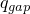

# 37.4.1 Pore fluid contact properties


**Product: **Abaqus/Standard  

##### **References**

- ["Contact interaction analysis: overview," Section 36.1.1](pt09ch36s01abo33.md)
- [*CONTACT PERMEABILITY](../key/key-link.md#usb-kws-mcontactpermeability)
- [*SURFACE](../key/key-link.md#usb-kws-msurface)
- [*SURFACE INTERACTION](../key/key-link.md#usb-kws-hsurfaceinteraction)
- [*CONTACT PAIR](../key/key-link.md#usb-kws-hcontactpair)

### Overview

The pore fluid contact property models:
- are often used in geotechnical applications, where pore pressure continuity between material on opposite sides of an interface must be maintained;
- govern pore fluid flow across a contact interface and into a gap region for nearby contact surfaces;
- are applicable when pore pressure degrees of freedom are present on both sides of a contact interface (if pore pressure degrees of freedom are present on only one side of a contact interface, the surfaces are treated as impermeable);
- affect the pore fluid flow normal to the contact surfaces;
- can apply to small- and finite-sliding contact formulations; and
- assume that there is no fluid flowing tangentially to the surface.

Contact in coupled pore fluid diffusion/stress analysis involves displacement constraints to resist penetrations and pore fluid contact properties that influence the fluid flow. See ["Coupled pore fluid diffusion and stress analysis," Section 6.8.1](pt03ch06s08at26.md), for details on coupled pore fluid diffusion/stress analyses. See ["Defining the constitutive response of fluid within the cohesive element gap," Section 32.5.7](pt06ch32s05alm46.md), for details on the use of pore pressure cohesive elements as an alternative to using contact models and pore fluid contact properties.

### Contact pressure in pore fluid interactions

The pore fluid contact properties discussed in this section apply when pore pressure degrees of freedom exist on both sides of a contact interface. In such cases the calculated contact pressure is effective; it does not include the pore fluid pressure contribution. 

If only one side of a contact interface includes pore pressure degrees of freedom, no fluid flow into or across the contact interface occurs. In this case the reported contact pressure represents the total pressure, including the effective structural and pore fluid pressure contributions; but only the effective contact pressure is used for the computation of friction.

### Including pore fluid properties in a contact property definition

Abaqus/Standard assumes that pore fluid flows in the normal direction at a contact interface and does not flow tangentially along the interface. Two contributions to the fluid flow into each surface at a contact interface are generally present, as shown in [Figure 37.4.1--1](pt09ch37s04aus176.md#aporefluid-flow). The fluid flow into the master and slave surface at corresponding points on the interface are  and , respectively. 
- One contribution () is associated with flow across the interface. A positive value of  corresponds to flow out from the master surface and into the slave surface.
- The other contribution ( for the slave surface and  for the master surface) is associated with removing or adding fluid from the region between the surfaces while the gap distance is changing. The sign convention is such that  and  are positive when these contributions flow into the respective surfaces (while the gap width decreases). The sum of  and  (which is the same as the sum of  and ) is equal to negative one times the rate of change of the gap width up to the threshold distance discussed in ["Controlling the distance within which pore fluid contact properties are active](pt09ch37s04aus176.md#usb-cni-aporefluidinteraction-cutoff)."

In steady-state analyses the rate of separation of the surfaces is zero, so the fluid flow contributions  and  are zero; all fluid flowing out of one surface flows into the other in steady-state analyses.

**Figure 37.4.1–1** Flow patterns in the interface contact element.


Pore fluid flow at a contact interface typically occurs even if contact permeability characteristics are not explicitly specified in the contact property definition. Alternatively, you can directly specify contact permeability characteristics for enhanced control over the flow of fluid across a contact interface.

| **Input File Usage: ** | ``` [*SURFACE INTERACTION](../key/key-link.md#usb-kws-hsurfaceinteraction), NAME=*interaction_name* [*CONTACT PERMEABILITY](../key/key-link.md#usb-kws-mcontactpermeability) ``` |
| --- | --- |

### Controlling the distance within which pore fluid contact properties are active

The models governing fluid flow across a contact interface are most appropriate for two surfaces in contact or separated by a relatively small gap distance. By default, Abaqus assumes no fluid flow occurs once the surfaces have separated by a distance larger than the characteristic element length of the underlying surfaces. Alternatively, you can directly specify a cutoff gap distance beyond which no fluid flow occurs. Separate controls are provided for the contribution of fluid flow across the interface () and the contribution of fluid flow into the interface ().

| **Input File Usage: ** | Use the following option to specify a cutoff distance () for the contribution of fluid flow across the contact interface (): |
| --- | --- |
|  | [*CONTACT PERMEABILITY](../key/key-link.md#usb-kws-mcontactpermeability), CUTOFF FLOW ACROSS= Use the following option to specify a cutoff distance () for the contribution of fluid flow into the contact interface (): [*CONTACT PERMEABILITY](../key/key-link.md#usb-kws-mcontactpermeability), CUTOFF GAP FILL= |

### Controlling contact permeability associated with fluid flow across a contact interface

If you do not specify contact permeability characteristics, the default model ensures continuity of the pore pressures on opposite sides of a contact interface while the contact separation is less than the threshold distance discussed in ["Controlling the distance within which pore fluid contact properties are active](pt09ch37s04aus176.md#usb-cni-aporefluidinteraction-cutoff)”: 


where  and  are pore pressures at points on opposite sides of the interface. This relationship implies that contact permeability across the interface is infinite.

Alternatively, you can specify a contact permeability, *k*, such that fluid flow across a contact interface (, discussed above in ["Including pore fluid properties in a contact property definition](pt09ch37s04aus176.md#usb-cni-aporefluidinteraction-including)”) is proportional to the difference in pore pressure magnitudes across the interface:


When defining *k* directly, define it as 


where


is the contact pressure transmitted across the interface between *A* and *B*,


is the average of the pore pressures at *A* and *B*,


is the average of the surface temperatures at *A* and *B*, and


is the average of any predefined field variables at *A* and *B*.

[Figure 37.4.1--2](pt09ch37s04aus176.md#aporefluid-flow-dependence) shows an example of *k* depending on the contact pressure. Use tabular data to specify the value of *k* at one or more contact pressures as *p* increases. The value of *k* remains constant for contact pressures outside of the interval defined by the data points. Once the surfaces have separated, *k* remains at a constant value until the separation between the surfaces exceeds the specified flow cutoff distance (see ["Controlling the distance within which pore fluid contact properties are active](pt09ch37s04aus176.md#usb-cni-aporefluidinteraction-cutoff)”), at which point *k* drops to zero.

**Figure 37.4.1–2** Contact-pressure-dependent contact permeability.


| **Input File Usage: ** | ``` [*CONTACT PERMEABILITY](../key/key-link.md#usb-kws-mcontactpermeability) , , ,  ``` |
| --- | --- |

#### Defining gap permeability to be a function of predefined field variables

In addition to the dependencies mentioned previously, the gap permeability can be dependent on any number of predefined field variables, . To make the gap permeability depend on field variables, at least two data points are required for each field variable value.

| **Input File Usage: ** | ``` [*CONTACT PERMEABILITY](../key/key-link.md#usb-kws-mcontactpermeability), DEPENDENCIES=*n* , , , ,  ``` |
| --- | --- |

### Coupled heat transfer--pore fluid contact properties

Heat transfer can be considered simultaneously with pore fluid flow, in which case heat flow across the contact interface can occur in conjunction with fluid flow. These various contact property aspects are defined with separate options as part of a single contact property definition that you assign to the contact interaction; see ["Thermal contact properties," Section 37.2.1](pt09ch37s02aus174.md), for details on defining heat transfer properties.

### Output

You can write the contact surface variables associated with the interaction of contact pairs to the Abaqus/Standard data (`.dat`), results (`.fil`), and output database (`.odb`) files. In addition to the surface variables associated with the mechanical contact analysis (shear stresses, contact pressures, etc.) several pore fluid-related variables (such as pore fluid volume flux per unit area) on the contact interface can be reported. A detailed discussion of these output requests can be found in ["Surface output from Abaqus/Standard" in "Output to the data and results files," Section 4.1.2](pt02ch04s01aus39.md#usb-out-oprintfile-surface), and ["Surface output in Abaqus/Standard and Abaqus/Explicit" in "Output to the output database," Section 4.1.3](pt02ch04s01aus40.md#usb-out-odboutput-surface). 

Abaqus/Standard provides the following output variables related to the pore fluid interaction of surfaces: 

| PFL | Pore volume flux per unit area leaving the slave surface. |
| --- | --- |

| PFLA | PFL multiplied by the area associated with the slave node. |
| --- | --- |

| PTL | Time integrated PFL. |
| --- | --- |

| PTLA | Time integrated PFLA. |
| --- | --- |

| TPFL | Total pore volume flux leaving the slave surface. |
| --- | --- |

| TPTL | Time integrated TPFL. |
| --- | --- |


