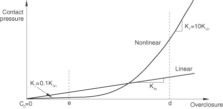
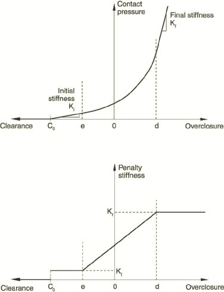
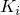
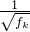
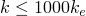
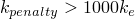
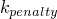

# 38.1.2 Contact constraint enforcement methods in Abaqus/Standard


**Products: **Abaqus/Standard  Abaqus/CAE  

##### **References**

- ["Defining general contact interactions in Abaqus/Standard," Section 36.2.1](pt09ch36s02aus139.md)
- ["Defining contact pairs in Abaqus/Standard," Section 36.3.1](pt09ch36s03aus145.md)
- ["Mechanical contact properties: overview," Section 37.1.1](pt09ch37s01aus165.md)
- ["Contact pressure-overclosure relationships," Section 37.1.2](pt09ch37s01aus166.md)
- [*SURFACE BEHAVIOR](../key/key-link.md#usb-kws-hsurfacebehavior)
- [*CONTACT CONTROLS](../key/key-link.md#usb-kws-hcontactcontrols)
- ["Defining general contact," Section 15.13.1 of the Abaqus/CAE User's Guide](../usi/usi-link.md#usi-itn-help-general)
- ["Defining surface-to-surface contact," Section 15.13.7 of the Abaqus/CAE User's Guide](../usi/usi-link.md#usi-itn-help-surftosurf)
- ["Defining a contact interaction property," Section 15.14.1 of the Abaqus/CAE User's Guide](../usi/usi-link.md#usi-itn-property-contact)

### Overview

Contact constraint enforcement methods in Abaqus/Standard:
- are specified as part of the surface interaction definition;
- determine how contact constraints imposed by a physical pressure-overclosure relationship (see ["Contact pressure-overclosure relationships," Section 37.1.2](pt09ch37s01aus166.md)) are resolved numerically in an analysis;
- can either strictly enforce or approximate the physical pressure-overclosure relationships;
- can be modified to resolve convergence difficulties due to overconstraints; and
- sometimes utilize Lagrange multiplier degrees of freedom.

The available constraint enforcement methods for normal contact in Abaqus/Standard are discussed in detail in this section. The frictional constraint enforcement methods in Abaqus/Standard are assigned independently of those for the normal contact constraints and are discussed in ["Frictional behavior," Section 37.1.5](pt09ch37s01aus169.md). The use of Lagrange multipliers in contact calculations is also covered in this section.

### Available constraint enforcement methods in Abaqus/Standard

There are three contact constraint enforcement methods available in Abaqus/Standard:
- The direct method attempts to strictly enforce a given pressure-overclosure behavior per constraint, without approximation or use of augmentation iterations.
- The penalty method is a stiff approximation of hard contact.
- The augmented Lagrange method uses the same kind of stiff approximation as the penalty method, but also uses augmentation iterations to improve the accuracy of the approximation.

The default constraint enforcement method depends on interaction characteristics, as follows: 
- The penalty method is used by default for finite-sliding, surface-to-surface contact (including general contact) if a "hard" pressure-overclosure relationship is in effect.
- The augmented Lagrange method is used by default for three-dimensional self-contact with node-to-surface discretization if a "hard" pressure-overclosure relationship is in effect.
- The direct method is the default in all other cases.

You should consider the following factors when choosing the contact enforcement method:
- The direct method must be used for contact pairs with a "softened" pressure-overclosure relationship (see ["Contact pressure-overclosure relationships," Section 37.1.2](pt09ch37s01aus166.md)).
- The direct method strictly enforces the specified pressure-overclosure behavior consistent with the constraint formulation
- The penalty or augmented Lagrange constraint enforcement methods sometimes provide more efficient solutions (generally due to reduced calculation costs per iteration and a lower number of overall iterations per analysis) at some (typically small) sacrifice in solution accuracy. See the discussions of the penalty and augmented Lagrange methods below.
- Overconstraints due to overlapping contact definitions or the combination of contact and other constraint types (see ["Overconstraint checks," Section 35.6.1](pt08ch35s06aus138.md)) should be avoided for directly enforced hard contact.

### Direct method

The direct method strictly enforces a given pressure-overclosure behavior for each constraint, without approximation or use of augmentation iterations.

| **Input File Usage: ** | Use both of the following options: |
| --- | --- |
|  | ``` [*SURFACE INTERACTION](../key/key-link.md#usb-kws-hsurfaceinteraction), NAME=*interaction_property_name* [*SURFACE BEHAVIOR](../key/key-link.md#usb-kws-hsurfacebehavior), DIRECT ``` |

| **Abaqus/CAE Usage: ** | Interaction module: contact property editor: ****Mechanical****Normal Behavior****: **Constraint enforcement method**: **Direct (Standard)** |
| --- | --- |

#### Direct method for hard pressure-overclosure behavior

The direct method can be used to strictly enforce a “hard” pressure-overclosure relationship. Lagrange multipliers are always used in this case.

#### Direct method for softened pressure-overclosure relationships

The direct method is the only method that can be used to enforce “softened” pressure-overclosure relationships. The direct method can be used to model softened contact behavior regardless of the type of contact formulation; however, modeling stiff interface behavior with a contact formulation that is prone to overconstraints can be difficult. Lagrange multipliers are used if the slope of the pressure-overclosure curve exceeds 1000 times the underlying element stiffness (as computed by Abaqus/Standard); otherwise, the constraints are enforced without Lagrange multipliers. The usage of Lagrange multipliers, thus, depends on the contact pressure. Softened pressure-overclosure relationships are discussed in more detail in ["Contact pressure-overclosure relationships," Section 37.1.2](pt09ch37s01aus166.md).

#### Limitations of the direct method

Because of its strict interpretation of contact constraints, hard contact simulations utilizing the direct enforcement method are susceptible to overconstraint issues. As a result, directly enforced hard contact is not available for contact pairs defined using three-dimensional self-contact with node-to-surface discretization. In this instance you can use an alternate enforcement method or the direct method with a softened pressure-overclosure relationship.

You may experience similar overconstraint problems with symmetric master-slave contact pairs (see ["Using symmetric master-slave contact pairs to improve contact modeling" in "Defining contact pairs in Abaqus/Standard," Section 36.3.1](pt09ch36s03aus145.md#usb-cni-acontactpair-symm)). Although directly enforced hard contact is the default for these contact pairs, it is recommended that you use an alternate enforcement method or a softened contact relationship.

Certain second-order element faces do not perform well in directly enforced hard contact relationships. See ["Three-dimensional surfaces with second-order faces and a node-to-surface formulation" in "Common difficulties associated with contact modeling in Abaqus/Standard," Section 39.1.2](pt09ch39s01aus184.md#usb-cni-acontacttrouble-3dsurf), for details on this issue.

### Penalty method

The penalty method approximates hard pressure-overclosure behavior. With this method the contact force is proportional to the penetration distance, so some degree of penetration will occur. Advantages of the penalty method include: 
- Numerical softening associated with the penalty method can mitigate overconstraint issues and reduce the number of iterations required in an analysis.
- The penalty method can be implemented such that no Lagrange multipliers are used, which allows for improved solver efficiency.

#### Choosing a penalty method

Abaqus/Standard offers linear and nonlinear variations of the penalty method. With the linear penalty method the so-called penalty stiffness is constant, so the pressure-overclosure relationship is linear. With the nonlinear penalty method the penalty stiffness increases linearly between regions of constant low initial stiffness and constant high final stiffness, resulting in a nonlinear pressure-overclosure relationship. The default penalty method is linear.

A comparison of the linear and nonlinear pressure-overclosure relationships with the default settings is shown in [Figure 38.1.2--1](pt09ch38s01aus178.md#exx-surface-behavior-nonlpen2).

**Figure 38.1.2–1** Comparison of linear and nonlinear pressure-overclosure relationships with default settings.



##### Linear penalty method

 When the linear penalty method is used, Abaqus/Standard will, by default, set the penalty stiffness to 10 times a representative underlying element stiffness. You can scale or reassign the penalty stiffness, as discussed in ["Modifying a linear penalty stiffness](pt09ch38s01aus178.md#usb-cni-acontactconstraints-mod-lin-stiff)” below. Contact penetrations resulting from the default penalty stiffness will not significantly affect the results in most cases; however, these penetrations can sometimes contribute to some degree of stress inaccuracy (for example, with displacement-controlled loading and a coarse mesh). The linear penalty method is used by default for the finite-sliding, surface-to-surface contact formulation.

| **Input File Usage: ** | Use both of the following options to specify the linear penalty method: |
| --- | --- |
|  | ``` [*SURFACE INTERACTION](../key/key-link.md#usb-kws-hsurfaceinteraction), NAME=*interaction_property_name* [*SURFACE BEHAVIOR](../key/key-link.md#usb-kws-hsurfacebehavior), PENALTY=LINEAR ``` |

| **Abaqus/CAE Usage: ** | Interaction module: contact property editor: ****Mechanical****Normal Behavior****: **Constraint enforcement method**: **Penalty (Standard)**, **Behavior**: **Linear** |
| --- | --- |

##### Nonlinear penalty method

With the nonlinear penalty method, the pressure-overclosure curve has four distinct regions shown in [Figure 38.1.2--2](pt09ch38s01aus178.md#exx-surface-behavior-nonlpen1).

**Figure 38.1.2–2** Nonlinear penalty pressure-overclosure relationship.



- Inactive contact regime: The contact pressure remains zero for clearances greater than . The default setting of  is zero.
- Constant initial penalty stiffness regime: The contact pressure varies linearly, with a slope equal to  for penetrations (overclosures) in the range  to . The default initial penalty stiffness, , is equal to the representative underlying element stiffness. The default value of  is 1% of a characteristic length computed by Abaqus/Standard to represent a typical facet size.
- Stiffening regime: The contact pressure varies quadratically for penetrations in the range  to , while the penalty stiffness increases linearly from  to . The default final penalty stiffness, , is equal to 100 times the representative underlying element stiffness. The default value of  is 3% of the same characteristic length used to compute  (discussed above).
- Constant final penalty stiffness regime: The contact pressure varies linearly, with a slope equal to  for penetrations greater than .

The low initial penalty stiffness typically results in better convergence of the Newton iterations and better robustness, while the higher final stiffness keeps the overclosure at an acceptable level as the contact pressure builds up.

| **Input File Usage: ** | Use both of the following options to specify the nonlinear penalty method: |
| --- | --- |
|  | ``` [*SURFACE INTERACTION](../key/key-link.md#usb-kws-hsurfaceinteraction), NAME=*interaction_property_name* [*SURFACE BEHAVIOR](../key/key-link.md#usb-kws-hsurfacebehavior), PENALTY=NONLINEAR ``` |

| **Abaqus/CAE Usage: ** | Interaction module: contact property editor: ****Mechanical****Normal Behavior****: **Constraint enforcement method**: **Penalty (Standard)**, **Behavior**: **Nonlinear** |
| --- | --- |

#### Modifying the penalty stiffness

If you are interested in investigating the effects of modifying the penalty stiffness, it is generally recommended that you consider order-of-magnitude changes. Increasing the penalty stiffness above the threshold value discussed above will, by default, introduce Lagrange multipliers. 

##### Modifying a linear penalty stiffness

As part of the surface behavior definition, you can specify the linear penalty stiffness, shift the pressure-overclosure relationship by specifying the clearance at which the contact pressure is zero, or scale the default or specified penalty stiffness by a factor.

| **Input File Usage: ** | To modify the linear penalty behavior in the surface behavior definition: |
| --- | --- |
|  | ``` [*SURFACE BEHAVIOR](../key/key-link.md#usb-kws-hsurfacebehavior), PENALTY=LINEAR *penalty stiffness*, *clearance at zero pressure*, *factor* ``` |

| **Abaqus/CAE Usage: ** | To modify the linear penalty behavior in the surface behavior definition: |
| --- | --- |
|  | Interaction module: contact property editor: ****Mechanical****Normal Behavior****: **Constraint enforcement method:** **Penalty (Standard)**, **Behavior:** **Linear**, **Stiffness value:** **Specify:** *penalty stiffness*, **Stiffness scale factor:** *factor*, **Clearance at which contact pressure is zero:** *clearance at zero pressure* |

##### Modifying a nonlinear penalty stiffness

As part of the surface behavior definition, you can specify the final nonlinear penalty stiffness, shift the pressure-overclosure relationship by specifying the clearance at which the contact pressure is zero, or scale the default or specified penalty stiffness by a factor. In addition, you can control directly the ratio of the initial to the final penalty stiffness, the scale factor, and the ratio that determines  and . 

| **Input File Usage: ** | To modify the nonlinear penalty behavior in the surface behavior definition: |
| --- | --- |
|  | ``` [*SURFACE BEHAVIOR](../key/key-link.md#usb-kws-hsurfacebehavior), PENALTY=NONLINEAR *final penalty stiffness*, *clearance at zero pressure*, *factor*, *upper quadratic limit scale factor*, *ratio of initial penalty stiffness over final penalty stiffness*, *lower quadratic limit ratio* ``` |

| **Abaqus/CAE Usage: ** | To modify the nonlinear penalty behavior in the surface behavior definition: |
| --- | --- |
|  | Interaction module: contact property editor: ****Mechanical****Normal Behavior****: **Constraint enforcement method:** **Penalty (Standard)**, **Behavior:** **Nonlinear**, **Maximum stiffness value:** **Specify:** *final penalty stiffness*, **Stiffness scale factor:** *factor*, **Initial/Final stiffness ratio:** *ratio of initial penalty stiffness over final penalty stiffness*, **Upper quadratic limit scale factor:** *upper quadratic limit scale factor*, **Lower quadratic limit ratio:** *lower quadratic limit ratio*, **Clearance at which contact pressure is zero:** *clearance at zero pressure* |

##### Scaling the penalty stiffness on a step-by-step basis

You can also scale the penalty stiffness on a step-by-step basis, which will act as an additional multiplier on any scale factor specified as part of the surface behavior definition.

| **Input File Usage: ** | To scale the penalty stiffness on a step-by-step basis: |
| --- | --- |
|  | ``` [*CONTACT CONTROLS](../key/key-link.md#usb-kws-hcontactcontrols), STIFFNESS SCALE FACTOR=*factor* ``` |

| **Abaqus/CAE Usage: ** | To scale the penalty stiffness on a step-by-step basis: |
| --- | --- |
|  | Interaction module: Abaqus/Standard contact controls editor: **Augmented Lagrange**: **Stiffness scale factor:** *factor* |

##### Adjusting the penalty stiffness across iterations of the first increment

It is common to have convergence difficulties in the first increment of an analysis if the contact status changes over a large portion of the contact area upon initial loading. An approach that tends to improve convergence behavior without sacrificing accuracy is to use a reduced penalty stiffness in the early iterations of the first increment and return to the default penalty stiffness for the final iterations of the first increment and all iterations of subsequent increments. Use of a reduced penalty stiffness in early iterations helps to robustly find an approximate contact status distribution, and the goal of later iterations is to then find an accurate solution, which is reported as the converged solution for the first increment.

| **Input File Usage: ** | To scale the penalty stiffness within the first increment: |
| --- | --- |
|  | ``` [*CONTACT CONTROLS](../key/key-link.md#usb-kws-hcontactcontrols), STIFFNESS SCALE FACTOR=USER ADAPTIVE ``` |

#### Limitations of the penalty method

The penalty method cannot be used for debonded surfaces.

If the penalty method is specified, Lagrange multipliers are always used during analysis steps with the following procedures:
- Design sensitivity analysis (see ["Design sensitivity analysis," Section 19.1.1](pt04ch19s01aus107.md))
- Direct steady-state dynamic analysis (see ["Direct-solution steady-state dynamic analysis," Section 6.3.4](pt03ch06s03at09.md))
- Quasi-Newton method (see ["Convergence criteria for nonlinear problems," Section 7.2.3](pt03ch07s02aus51.md))

If surface elements have been used to define a contact surface on the exterior of a substructure (see ["Contact modeling if substructures are present," Section 36.3.9](pt09ch36s03aus153.md)), Abaqus/Standard interprets the underlying element stiffness to be zero. This can lead to difficulty in determining the default penalty stiffness and may cause numerical problems during the analysis.

### Augmented Lagrange method

The linear penalty method can be used within an augmentation iteration scheme that drives down the penetration distance. This so-called augmented Lagrange method applies only to hard pressure-overclosure relationships. The following describes the sequence that occurs in each increment with this approach:

1. Abaqus/Standard finds a converged solution with the penalty method.
2. If a slave node penetrates the master surface by more than a specified penetration tolerance, the contact pressure is "augmented" and another series of iterations is executed until convergence is once again achieved.
3. Abaqus/Standard continues to augment the contact pressure and find the corresponding converged solution until the actual penetration is less than the penetration tolerance.

The augmented Lagrange method may require additional iterations in some cases; however, this approach can make the resolution of contact conditions easier and avoid problems with overconstraints, while keeping penetrations small. The augmented Lagrange method is used by default for three-dimensional self-contact using node-to-surface discretization.

The default penetration tolerance is one-tenth of a percent of the characteristic interface length except in the following cases:
- if you specify a penalty stiffness scaling factor,  , of less than 1.0 (using the interface discussed below), Abaqus/Standard will automatically scale the default penetration tolerance by a factor of  (which will be greater than or equal to 1.0);
- the default penetration tolerance for finite-sliding, surface-to-surface contact is five percent of the characteristic interface length, subject to the scaling discussed in the previous bullet point.

The default penalty stiffness for the augmented Lagrange method is 1000 times the representative underlying element stiffness. Lagrange multipliers are used for the augmented Lagrange method if the penalty stiffness exceeds 1000 times the representative underlying element stiffness computed by Abaqus/Standard; otherwise, no Lagrange multipliers are used. Therefore, Lagrange multipliers are not used for the augmented Lagrange method with the default penalty stiffness.

| **Input File Usage: ** | Use both of the following options: |
| --- | --- |
|  | ``` [*SURFACE INTERACTION](../key/key-link.md#usb-kws-hsurfaceinteraction), NAME=*interaction_property_name* [*SURFACE BEHAVIOR](../key/key-link.md#usb-kws-hsurfacebehavior), AUGMENTED LAGRANGE ``` |

| **Abaqus/CAE Usage: ** | Interaction module: contact property editor: ****Mechanical****Normal Behavior****: **Constraint enforcement method:** **Augmented Lagrange (Standard)** |
| --- | --- |

#### Modifying the penetration tolerance for the augmented Lagrange method

You can modify the penetration tolerance for the augmented Lagrange method on a step-by-step basis by specifying an absolute or relative penetration tolerance. The relative penetration tolerance is specified with respect to a characteristic length computed by Abaqus/Standard. The default penetration tolerance was discussed above. The default penetration tolerance is increased automatically if you set the penalty stiffness scale factor to a value less than 1.0 (also discussed above); however, Abaqus/Standard will not adjust any directly specified penetration tolerance. Choosing a very small penetration tolerance may result in an excessive number of augmentation iterations.

| **Input File Usage: ** | To specify an absolute penetration tolerance: |
| --- | --- |
|  | ``` [*CONTACT CONTROLS](../key/key-link.md#usb-kws-hcontactcontrols), ABSOLUTE PENETRATION TOLERANCE=*tolerance* ``` To specify a relative penetration tolerance: ``` [*CONTACT CONTROLS](../key/key-link.md#usb-kws-hcontactcontrols), RELATIVE PENETRATION TOLERANCE=*tolerance* ``` |

| **Abaqus/CAE Usage: ** | Interaction module: Abaqus/Standard contact controls editor: **Augmented Lagrange**: **Penetration tolerance: Absolute:** *tolerance* or **Relative:** *tolerance* |
| --- | --- |

#### Modifying the penalty stiffness for the augmented Lagrange method

As with the penalty method, you can specify the penalty stiffness, shift the pressure-overclosure relationship by specifying the clearance at which the contact pressure is zero, or scale the default or specified penalty stiffness by a factor as part of the surface behavior definition. You can also scale the penalty stiffness on a step-by-step basis, which will act as an additional multiplier on any scale factor specified as part of the surface behavior definition. Choosing a very low penalty stiffness may result in an excessive number of augmentation iterations.

| **Input File Usage: ** | To modify the penalty behavior in the surface behavior definition: |
| --- | --- |
|  | ``` [*SURFACE BEHAVIOR](../key/key-link.md#usb-kws-hsurfacebehavior), AUGMENTED LAGRANGE *penalty stiffness*, *clearance at zero pressure*, *factor* ``` To scale the penalty stiffness on a step-by-step basis: ``` [*CONTACT CONTROLS](../key/key-link.md#usb-kws-hcontactcontrols), STIFFNESS SCALE FACTOR=*factor* ``` |

| **Abaqus/CAE Usage: ** | To modify the penalty behavior in the surface behavior definition: |
| --- | --- |
|  | Interaction module: contact property editor: ****Mechanical****Normal Behavior****: **Constraint enforcement method:** **Augmented Lagrange (Standard)**, **Stiffness value:** **Specify:** *penalty stiffness*, **Stiffness scale factor:** *factor*, **Clearance at which contact pressure is zero:** *clearance at zero pressure* To scale the penalty stiffness on a step-by-step basis: Interaction module: Abaqus/Standard contact controls editor: **Augmented Lagrange**: **Stiffness scale factor:** *factor* |

#### Modifying the number of allowed augmentations for the augmented Lagrange method

You can define the number of allowed augmentations for the augmented Lagrange method.

| **Input File Usage: ** | ``` [*CONTROLS](../key/key-link.md#usb-kws-hcontrols), PARAMETERS=TIME INCREMENTATION , , , , , , , , , , , ,  ``` |
| --- | --- |

| **Abaqus/CAE Usage: ** | Defining the number of allowed augmentations for the augmented Lagrange method is not supported in Abaqus/CAE. |
| --- | --- |

#### Limitations of the augmented Lagrange method

The augmented Lagrange method cannot be used for debonded surfaces.

If the augmented Lagrange method is specified, Lagrange multipliers are always used during analysis steps with the following procedures:
- Design sensitivity analysis (see ["Design sensitivity analysis," Section 19.1.1](pt04ch19s01aus107.md))
- Direct steady-state dynamic analysis (see ["Direct-solution steady-state dynamic analysis," Section 6.3.4](pt03ch06s03at09.md))
- Quasi-Newton method (see ["Convergence criteria for nonlinear problems," Section 7.2.3](pt03ch07s02aus51.md))

If surface elements have been used to define a contact surface on the exterior of a substructure (see ["Contact modeling if substructures are present," Section 36.3.9](pt09ch36s03aus153.md)), Abaqus/Standard interprets the underlying element stiffness to be zero. This can lead to difficulty in determining the default penalty stiffness and may cause numerical problems during the analysis.

### Use of Lagrange multiplier degrees of freedom by the various methods

Using Lagrange multipliers to enforce contact constraints can add significantly to the solution cost, but they also protect against numerical errors related to ill-conditioning that can occur if a high contact stiffness is in effect. Abaqus/Standard automatically chooses whether the constraint method makes use of Lagrange multipliers, based on a comparison of the contact stiffness to the underlying element stiffness. [Table 38.1.2--1](pt09ch38s01aus178.md#table-lagrange-defaults) summarizes the use of Lagrange multipliers. Lagrange multipliers are not used for the default contact stiffnesses associated with the penalty and augmented Lagrange approximations of hard contact. Any Lagrange multipliers associated with contact are present only for active contact constraints, so the number of equations may change as the contact status changes. 

**Table 38.1.2–1** Use of Lagrange multipliers in constraint enforcement methods.
| Constraint Method | Use Lagrange Multipliers |
| --- | --- |
| Yes | No1 |
| Direct, hard contact | Always | Never |
| Direct, exponential softened contact | If  | If  |
| Direct, linear softened contact | If  | If  |
| Direct, tabular softened contact | If  | If  |
| Penalty, hard contact | If  | If  |
| Augmented Lagrange, hard contact | If  | If  |
|  = slope of pressure-overclosure relationship |
|  = penalty stiffness |
|  = underlying element stiffness |
| 1Lagrange multipliers are always used, regardless of the constraint enforcement method or stiffness, in the following cases: design sensitivity analyses, direct steady-state dynamics analyses, analyses using the quasi-Newton method. |


