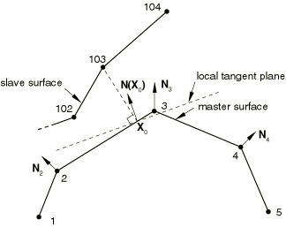
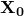
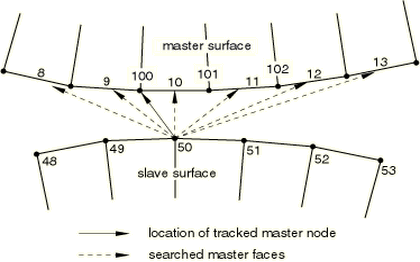
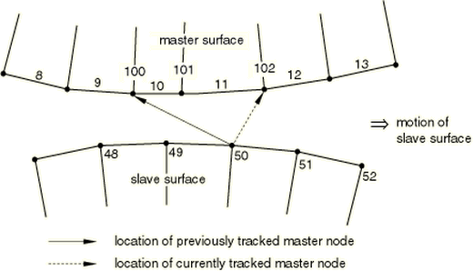

# 38.2.2 Contact formulations for contact pairs in Abaqus/Explicit


**Products: **Abaqus/Explicit  Abaqus/CAE  

##### **References**

- ["Surfaces: overview," Section 2.3.1](pt01ch02s03aus16.md)
- ["Defining contact pairs in Abaqus/Explicit," Section 36.5.1](pt09ch36s05aus160.md)
- [*CONTACT PAIR](../key/key-link.md#usb-kws-hcontactpair)
- ["Defining surface-to-surface contact," Section 15.13.7 of the Abaqus/CAE User's Guide](../usi/usi-link.md#usi-itn-help-surftosurf)

### Overview

The contact formulation for the contact pair algorithm in Abaqus/Explicit includes:
- the contact surface weighting (balanced or pure master-slave); and
- the sliding formulation (finite, small, or infinitesimal).

You can also specify the method that is used to enforce contact constraints in the contact pair; these methods are discussed in ["Contact constraint enforcement methods in Abaqus/Explicit," Section 38.2.3](pt09ch38s02aus182.md).

### Contact surface weighting

Both the pure master-slave and the balanced master-slave contact algorithms are available in Abaqus/Explicit. By default, Abaqus/Explicit will decide which algorithm to use for any given contact pair based on the nature of the two surfaces forming the contact pair and whether kinematic or penalty enforcement of contact constraints is used. You can override the defaults in some cases.

#### Default choices for the contact pair weighting

Abaqus/Explicit uses the pure master-slave, kinematic contact algorithm, by default, in the following situations (the first surface in each situation listed is designated the master surface):
- when a rigid surface contacts a deformable surface;
- when an element-based surface contacts a node-based surface; or
- when a surface based on continuum elements contacts a surface based on shell or membrane elements.

 By default, Abaqus/Explicit uses the balanced master-slave, kinematic contact algorithm in the following situations:- when a single surface contacts itself (referred to as self-contact or single-surface contact); or
- when two deformable surfaces that are meshed with similar elements (i.e., either both surfaces have shells or membranes or both have continuum elements) contact each other.

If the penalty contact algorithm is specified, Abaqus/Explicit uses pure master-slave weighting, by default, in the following situations (the first surface in each situation listed is designated the master surface):- when an analytical rigid surface contacts a deformable surface; or
- when an analytical rigid surface or an element-based surface contacts a node-based surface.

If the penalty contact algorithm is specified, Abaqus/Explicit chooses balanced master-slave weighting, by default, in the following situations:- when a single surface contacts itself (referred to as self-contact or single-surface contact); or
- when two element-based surfaces contact each other.

Balanced master-slave weighting means that the corrections produced by both sets of contact calculations are weighted equally.

##### Modifying the default choices for the contact pair weighting

When the kinematic contact method is chosen, you can override the default contact pair weighting only when two separate deformable element-based surfaces are contacting each other, which corresponds to the last situation in each list for kinematic contact given in the previous section.

The following aspects should be considered when deciding whether or not to override the default choice. First, the balanced master-slave contact algorithm requires more computational time, but it is typically more accurate. Second, when the densities differ by orders of magnitude, the less dense body should be a pure slave surface. Contact-induced noise can occur if a surface on a much denser body is at all weighted as a slave surface. Finally, to avoid significant penetration for hard contact, the surface with the finer mesh should not be the master surface in the pure master-slave contact pair.

When the penalty contact method is chosen, you can choose to specify a pure master-slave weighting to reduce computational time. When two originally flat surfaces contact one another, a more uniform penetration distance distribution (and consequently pressure distribution) may result with pure master-slave weighting as compared to balanced master-slave weighting. This can be particularly evident if the mesh densities of the contacting surfaces differ significantly—with balanced weighting the contact penetrations will be smaller near the nodes of the coarsely meshed surface. However, balanced master-slave weighting provides better enforcement of contact constraints in most cases.

You define a weighting factor, *f*, to specify the master-slave weighting. Set *f*=1.0 to designate the first surface in the contact pair as the master surface and the second surface as the slave surface. Set *f*=0.0 to designate the first surface in the contact pair as the slave surface and the second surface as the master surface. Specifying any value of *f* between 0 and 1.0 invokes the balanced master-slave contact algorithm. When *f*=0.5, which is the default for balanced master-slave contact pairs, Abaqus/Explicit weights each set of corrections equally. In contrast, Abaqus/Standard uses a pure master-slave contact algorithm; the slave surface must always be given first, as in the *f*=0.0 case above.

| **Input File Usage: ** | ``` [*CONTACT PAIR](../key/key-link.md#usb-kws-hcontactpair), WEIGHT=*f* ``` |
| --- | --- |

| **Abaqus/CAE Usage: ** | Interaction module: interaction editor: **Weighting factor Specify** *f* |
| --- | --- |

### Sliding formulation

In Abaqus/Explicit there are three approaches to account for the relative motion of the two surfaces forming a contact pair:
- finite sliding, which is the most general and allows any arbitrary motion of the surfaces;
- small sliding, which assumes that although two bodies may undergo large motions, there will be relatively little sliding of one surface along the other; or
- infinitesimal sliding and rotation, which assumes that both the relative motion of the surfaces and the absolute motion of the contacting bodies are small.

The small-sliding and infinitesimal-sliding formulations cannot be used for contact pairs using the penalty contact algorithm or involving self-contact or analytical rigid surfaces.

#### Using the finite-sliding formulation

The finite-sliding formulation allows for arbitrary separation, sliding, and rotation of the surfaces. Abaqus/Explicit uses this formulation by default. Only the finite-sliding approach is available for self-contact or contact involving analytical rigid surfaces.

| **Input File Usage: ** | ``` [*CONTACT PAIR](../key/key-link.md#usb-kws-hcontactpair) ``` |
| --- | --- |

| **Abaqus/CAE Usage: ** | Interaction module: interaction editor: **Sliding formulation: Finite sliding** |
| --- | --- |

##### Example

The following input defines finite-sliding contact between the surfaces `ASURF` and `BSURF`, shown in [Figure 38.2.2--1](pt09ch38s02aus181.md#aexpcontactingbodies), with `ASURF` acting as the slave surface:

```
[*SURFACE](../key/key-link.md#usb-kws-msurface),NAME=ASURF
ESETA,
[*SURFACE](../key/key-link.md#usb-kws-msurface),NAME=BSURF
ESETB,
[*CONTACT PAIR](../key/key-link.md#usb-kws-hcontactpair),INTERACTION=PAIR1, WEIGHT=0.0
ASURF, BSURF
[*SURFACE INTERACTION](../key/key-link.md#usb-kws-hsurfaceinteraction),NAME=PAIR1
```

**Figure 38.2.2–1** Contacting bodies.


In the example shown in [Figure 38.2.2--1](pt09ch38s02aus181.md#aexpcontactingbodies) slave node 101 may come into contact anywhere along the master surface `BSURF`. While in contact, it is constrained to slide along `BSURF`, irrespective of the orientation and deformation of this surface. This behavior is possible because Abaqus/Explicit tracks the position of node 101 relative to the master surface `BSURF` as the bodies deform. [Figure 38.2.2--2](pt09ch38s02aus181.md#aexptanginter-fin-sliding) shows the possible evolution of the contact between node 101 and its master surface `BSURF`. Node 101 is in contact with the element face with end nodes 201 and 202 at time . The load transfer at this time occurs between node 101 and nodes 201 and 202 only. Later on, at time , node 101 may find itself in contact with the element face with end nodes 501 and 502. Then the load transfer will occur between node 101 and nodes 501 and 502.

**Figure 38.2.2–2** Trajectory of node 101 in finite-sliding contact.


##### Finite sliding in a geometrically linear analysis

Finite-sliding simulations usually include nonlinear geometric effects because such simulations generally involve large deformations and large rotations. However, it is also possible to use the finite-sliding formulation in a geometrically linear analysis (see ["Geometric nonlinearity" in "General and linear perturbation procedures," Section 6.1.3](pt03ch06s01aus44.md#usb-anl-alinearnonlinear-nlgeom)). The load transfer paths between the surfaces and the contact direction are updated in finite-sliding, geometrically linear analysis. This capability is useful for analyzing finite sliding between two stiff bodies that do not undergo large rotations.

#### Using the small-sliding formulation

For a large class of contact problems the general tracking of the finite-sliding formulation is unnecessary, even though geometric nonlinearity must be considered. Abaqus/Explicit provides a *small-sliding* contact formulation for such problems. This formulation assumes that the surfaces may undergo arbitrarily large rotations but that a slave node will interact with the same local area of the master surface throughout the analysis. Contact pairs that use the small-sliding formulation must be defined in the first step of the simulation, although they may remain active after the first step.

A large-displacement formulation (the default) should be used for the step in which the small-sliding contact formulation should be used.

In a small-sliding analysis every slave node interacts with its own local tangent plane on the master surface (see [Figure 38.2.2--3](pt09ch38s02aus181.md#atanginter-anchor-xpl)). The slave node is constrained not to penetrate this local tangent plane. Each local tangent plane, which is a line in two dimensions, is defined by an anchor point, , on the master surface and an orientation vector at the anchor point (see [Figure 38.2.2--3](pt09ch38s02aus181.md#atanginter-anchor-xpl)).

**Figure 38.2.2–3** Definition of the anchor point and local tangent plane for node 103.



Having a local tangent plane for each slave node means that for the small-sliding formulation Abaqus/Explicit does not have to monitor slave nodes for possible contact along the entire master surface. Therefore, small-sliding contact is less expensive computationally than finite-sliding contact. The cost savings are most dramatic in three-dimensional contact problems.

When the balanced master-slave contact algorithm is invoked with the small-sliding formulation, anchor points and tangent planes will be computed for both surfaces.

| **Input File Usage: ** | Use both of the following options: |
| --- | --- |
|  | ``` [*STEP](../key/key-link.md#usb-kws-hstep), NLGEOM=YES … [*CONTACT PAIR](../key/key-link.md#usb-kws-hcontactpair), SMALL SLIDING ``` For example, the following options define small-sliding contact between the two bodies shown in [Figure 38.2.2--1](pt09ch38s02aus181.md#aexpcontactingbodies): ``` [*STEP](../key/key-link.md#usb-kws-hstep), NLGEOM=YES … [*SURFACE](../key/key-link.md#usb-kws-msurface), NAME=ASURF ESETA, [*SURFACE](../key/key-link.md#usb-kws-msurface), NAME=BSURF ESETB, [*CONTACT PAIR](../key/key-link.md#usb-kws-hcontactpair), SMALL SLIDING, WEIGHT=0.0 ASURF, BSURF ``` |

| **Abaqus/CAE Usage: ** | Interaction module: interaction editor: **Sliding formulation: Small sliding**Step module: step editor: **Nlgeom: On** |
| --- | --- |

##### Anchor point and tangent plane definition

The anchor point and the tangent plane orientation are chosen before the analysis starts using the initial configuration of the model. The anchor point and the tangent plane orientation remain fixed with respect to the master surface facet for all steps in which the contact pair is active. No contact constraints are enforced for slave nodes whose nearest point lies on the free perimeter of the master surface in the original configuration and that do not project onto any master surface facet. 

Abaqus/Explicit chooses the anchor point as the nearest point on the master surface. The orientation of the tangent plane is calculated by default from the normals at the master surface nodes, or you can specify it directly. 
- Master surface normals: The first step in defining the tangent plane orientation is to construct the unit normal vectors at each node of the master surface. Abaqus/Explicit forms these nodal normals by averaging the normals of the element faces making up the master surface; only the element faces in the surface definition will contribute to the nodal normals. The tangent plane orientation is then calculated from the master surface nodal normals and the element shape functions at the anchor point. [Figure 38.2.2--3](pt09ch38s02aus181.md#atanginter-anchor-xpl) shows the nodal unit normals for a master surface, the anchor point , and the local tangent plane associated with slave node 103. Abaqus/Explicit uses the closest point on the master surface as the anchor point.  is the contact direction for slave node 103 and defines the orientation of the local tangent plane. In this example, as in many cases, the local tangent plane is only an approximation of the actual mesh geometry.
- Master surface normals at symmetry planes: Sometimes the master surface normal and the local tangent plane that Abaqus/Explicit calculates are not suitable for the desired analysis. The most common situation where unsuitable surface normals are calculated occurs when a curved master surface ends at a symmetry plane and the boundary conditions have been specified in direct format rather than in symmetry "type" format (XSYMM, YSYMM, or ZSYMM---see ["Boundary conditions in Abaqus/Standard and Abaqus/Explicit," Section 34.3.1](pt07ch34s03aus118.md)). In this case the correct normals should be in the symmetry plane; however, because the surface facets that abut the symmetry plane usually form an angle with the plane, the normal will project away from the symmetry plane. The effect of this behavior can be that a slave node does not project onto any master surface facet (the slave node is said not to "intersect" the master surface). No contact constraints will be enforced for such slave nodes. However, if symmetry "type" format boundary conditions are specified, contact constraints will be enforced as described below. The finite-sliding formulations use no special treatment for master surfaces ending at a symmetry plane. [Figure 38.2.2--4](pt09ch38s02aus181.md#aexptanginter-concen-cyl) shows two concentric cylinders that contact each other; the inner cylinder is chosen as the master surface `CSURF`, and a half-symmetry model is used. Since Abaqus/Explicit calculates the nodal normals from the approximate, finite element model, the nodal normal  does not point along the symmetry plane, which means that slave node 100 has no anchor point within the perimeter of the master surface. Whether or not contact is enforced for node 100 depends on how the symmetry boundary condition is specified. If the individual components are specified rather than a symmetry "type" boundary condition, slave node 100 will be free to penetrate the master surface. If the symmetry "type" format is used, the master normal at the node on the symmetry plane will be corrected to lie along the symmetry plane and contact will be enforced on the tangent plane as shown in [Figure 38.2.2--5](pt09ch38s02aus181.md#aexptanginter-mod-normal). Defining a YSYMM "type" boundary condition at node 1 to specify the symmetry plane will allow slave node 100 to see the master surface `CSURF`. **Figure 38.2.2--4** Master surface normal at node 1 in a small-sliding model of concentric cylinders. With the default  slave node 100 will never contact `CSURF`.  **Figure 38.2.2--5** The modified master surface normal at node 1 of `CSURF` now allows slave node 100 to contact `CSURF`. 
- Modifying the local tangent plane orientation: In some cases the contact direction, , defined from the master surface averaged normals will not define the contact surface accurately. The most common example of this is a circular surface meshed with nonuniform length facets. [Figure 38.2.2--6](pt09ch38s02aus181.md#atanginter-aver-mast-normal) shows how the averaged master normals will not be oriented correctly in the radial direction. **Figure 38.2.2--6** Poorly oriented averaged master surface normals for an irregularly meshed circular surface.  In this case you should specify the contact direction directly for each slave node by defining spatially varying initial clearances (see ["Specifying initial clearance values precisely" in "Adjusting initial surface positions and specifying initial clearances for contact pairs in Abaqus/Explicit," Section 36.5.4](pt09ch36s05aus163.md#usb-cni-aexpadjustsurfaces-clearance)). The location of the anchor point is not affected by reorienting the tangent plane using an initial clearance definition.

##### Local tangent plane rotation

The local tangent plane is always orthogonal to the contact direction. The contact direction is taken as the interpolated normal of the master surface at the anchor point, , or as the direction specified with a spatially varying clearance definition (see ["Specifying initial clearance values precisely" in "Adjusting initial surface positions and specifying initial clearances for contact pairs in Abaqus/Explicit," Section 36.5.4](pt09ch36s05aus163.md#usb-cni-aexpadjustsurfaces-clearance)). Once the contact direction has been defined, the orientation of the local tangent plane with respect to the master surface facet remains fixed. Because the small-sliding formulation considers nonlinear geometric effects, Abaqus/Explicit continuously updates the orientation of the local tangent plane to account for the rotation of the master surface facet. The position of the anchor point relative to the surrounding nodes on the master surface facet does not change as the master surface deforms.

##### Load transfer

In a small-sliding analysis the slave node will transfer load to the nodes of the master surface facet containing the anchor point, with the magnitude of the load transferred to each node weighted by its proximity to the anchor point. For example, in [Figure 38.2.2--3](pt09ch38s02aus181.md#atanginter-anchor-xpl) node 103 transmits load to both nodes 2 and 3 on the master surface. Thus, if node 103 impacts the local tangent plane, a larger share of the force would be transmitted to node 3 because it is closer to the anchor point .

As a slave node slides along its local tangent plane, Abaqus/Explicit does not update the distribution of load transferred by a given slave node to its associated master surface nodes; the distribution is based solely on the position of the anchor point. This is unlike the small-sliding formulation in Abaqus/Standard, which does update the load distribution to the master surface nodes as sliding occurs, so that no net moment is associated with the contact forces acting on slave and master nodes per active contact constraint, regardless of the amount of sliding. Some net moment will be associated with the contact forces after sliding has occurred with the small-sliding formulation in Abaqus/Explicit. This net moment will not be significant if the sliding is truly small compared to element dimensions, but otherwise it can result in non-physical behavior and poor accounting of energy.

[Figure 38.2.2--7](pt09ch38s02aus181.md#aexptanginter-excess-sliding) shows the potential problem that arises if small sliding is used but the relative tangential motion of the surfaces is not “small.” 

**Figure 38.2.2–7** Excessive sliding in a small-sliding contact analysis.


It shows the possible evolution of contact between slave node 101 in [Figure 38.2.2--1](pt09ch38s02aus181.md#aexpcontactingbodies) and its master surface `BSURF`. Using the unit normal vectors  and , the anchor point  was found for slave node 101; for the purposes of this example, assume that it lies at the midpoint of the 201–202 face. With this location of  the local tangent plane for node 101 is parallel with the 201–202 face. The load transfer always occurs at the original anchor point between nodes 201 and 202, no matter how far node 101 has slid along the local tangent plane. Therefore, if node 101 moves as shown in [Figure 38.2.2--7](pt09ch38s02aus181.md#aexptanginter-excess-sliding), it will continue to transmit load equally to nodes 201 and 202 when, in fact, it really slid off the mesh forming the master surface `BSURF`.

##### What can be considered small sliding

A contact pair in a small-sliding contact simulation should not grossly violate any of the assumptions or limitations outlined above. Adhere to the following guidelines: 
- Slave nodes should slide less than an element length from their corresponding anchor point and still be contacting their local tangent plane. If the master surface is highly curved, the slave nodes should slide only a fraction of an element length.
- The local tangent planes formed by Abaqus/Explicit should be a good approximation of the mesh geometry; if necessary, use an initial clearance definition (["Specifying initial clearance values precisely" in "Adjusting initial surface positions and specifying initial clearances for contact pairs in Abaqus/Explicit," Section 36.5.4](pt09ch36s05aus163.md#usb-cni-aexpadjustsurfaces-clearance)) to improve the tangent plane orientation.
- The rotation and deformation of the master surface should not cause the local tangent planes to become a poor representation of the master surface during the course of the analysis.

##### Master surface refinement in small-sliding problems

The basic guidelines for pure master-slave contact given previously in this section should still be followed in a small-sliding simulation. However, in a small-sliding simulation more thought must be given to the degree of refinement for the master surface.

The smoothly varying master surface normal  and the local tangent planes that are formed with it are crucial to the success of a small-sliding analysis. As has been mentioned previously, there are several methods that can be used to modify ; however, they only control the initial configuration of the local tangent planes. The deformation and rotation of the master surface can reorient the local tangent planes such that they become a poor representation of the master surface. [Figure 38.2.2--8](pt09ch38s02aus181.md#aexptanginter-master-deform) shows an example where distortion of the master surface results in such a situation. 

**Figure 38.2.2–8** Master surface deformation in a small-sliding contact analysis can cause problems with the local tangent planes.


This problem can be minimized to some extent by using a more refined mesh on the master surface, thus providing more element faces to control the motion of the tangent planes. Excessive mesh refinement should not be necessary since only small sliding should occur.

#### Using the infinitesimal-sliding formulation

The difference between the infinitesimal-sliding and small-sliding formulations is that the infinitesimal-sliding formulation ignores nonlinear geometric effects. To specify the infinitesimal-sliding formulation, you choose the small-sliding contact formulation and a small-displacement formulation for the analysis step.

Infinitesimal sliding assumes that both the relative motions of the surfaces and the absolute motions of the model remain small. The orientations of the local tangent planes are not updated, and the load transfer paths and the weightings assigned to each master surface node remain constant during an infinitesimal-sliding simulation.

| **Input File Usage: ** | Use both of the following options: |
| --- | --- |
|  | ``` [*STEP](../key/key-link.md#usb-kws-hstep), NLGEOM=NO … [*CONTACT PAIR](../key/key-link.md#usb-kws-hcontactpair), SMALL SLIDING ``` |

| **Abaqus/CAE Usage: ** | Interaction module: interaction editor: **Sliding formulation: Small sliding**Step module: step editor: **Nlgeom: Off** |
| --- | --- |

### Contact tracking algorithms

A large portion of the computational cost associated with Abaqus/Explicit contact pairs derives from the algorithms used to track the relative motion between two contacting surfaces. There are two tracking approaches for the contact pair algorithm in Abaqus/Explicit, depending on the sliding formulation that is used: finite sliding and small/infinitesimal sliding.

#### Finite-sliding tracking

Abaqus/Explicit is designed to simulate highly nonlinear events or processes. Because it is possible for a node on one surface to contact any of the facets on the opposite surface, Abaqus/Explicit must use sophisticated search algorithms for tracking the motions of the surfaces.

The contact search algorithm is designed to be robust, yet computationally efficient. This algorithm assumes that the incremental relative tangential motion between surfaces does not significantly exceed the dimensions of the master surface facets, but there is no limit to the overall relative motion between surfaces. It is rare for the incremental motion to exceed the facet size because of the small time increment used in explicit dynamic analyses. In cases involving relative surface velocities that exceed material wave speeds, it may be necessary to reduce the time increment.

The contact search algorithm uses a global search at the beginning of each step, and a hierarchical global/local search algorithm is used for the other increments. The default contact search algorithm can handle the majority of typical contact situations. However, there are some situations that require special attention. We will consider a pure master-slave contact pair for discussion purposes. For a balanced master-slave contact pair, the contact search computations are performed twice for each contact pair.

##### Global contact searches

A global search determines the globally nearest master surface facet for each slave node in a given contact pair. A bucket sorting algorithm is used to minimize the computational expense of these searches. A two-dimensional example, without consideration of “buckets,” is shown in [Figure 38.2.2--9](pt09ch38s02aus181.md#acontact-2d-global). 

**Figure 38.2.2–9** Global search in two dimensions.



The global search computes the distance from node 50 to all of the master surface facets in the same bucket as node 50. It determines that the nearest facet on the master surface to node 50 is the facet of element 10. Node 100 is the node on this facet that is nearest to node 50, and it is designated the tracked master surface node. This search is conducted for each slave node, comparing each node against all of the facets on the master surface that are in the same bucket. 

By default, Abaqus/Explicit performs a global search every one hundred increments for two-surface contact pairs. The frequency of the global search can be manually adjusted, as discussed in ["Contact controls for contact pairs in Abaqus/Explicit," Section 36.5.5](pt09ch36s05aus164.md). Despite the bucket sorting algorithm, global searches are computationally expensive: performing a global contact search in every increment will more than double the run time of many Abaqus/Explicit contact analyses.

##### Local contact searches

Abaqus/Explicit uses a local contact search to track the motion of the surfaces during most increments of an analysis. In this approach a given slave node searches only the facets that are attached to the previously tracked master surface node. Abaqus/Explicit determines which adjacent facet is the nearest to the slave node. It then determines which node on that facet is the closest master surface node to the slave node and updates the tracked master surface node. If the closest master surface node is not the same as the previously tracked master surface node, Abaqus/Explicit performs another iteration of the local search.

In the example shown in [Figure 38.2.2--10](pt09ch38s02aus181.md#acontact-2d-local), node 50 moves as shown during an increment. In the first iteration of the search Abaqus/Explicit finds that the master surface facet on element 10 is still the closest facet of those attached to node 100 but that node 101 is now the tracked master surface node. Because the previously tracked node was node 100, Abaqus/Explicit performs another iteration. In this second iteration a new element, element 11, is found to be the closest facet and the closest master surface node is 102. Another iteration is performed because the identity of the tracked master surface node changed. In the third iteration the identity of the tracked node does not change, so Abaqus/Explicit designates node 102 as the tracked master surface node for slave node 50.

A local search is substantially less expensive computationally than a global search. A slightly more expensive local search algorithm can be employed in situations where contact is not being properly enforced; this alternate algorithm is discussed in ["Contact controls for contact pairs in Abaqus/Explicit," Section 36.5.5](pt09ch36s05aus164.md).

**Figure 38.2.2–10** Local search in two dimensions.



##### Tracking approach for self-contact pairs

Abaqus/Explicit uses similar contact searching methods for simulations with self-contact as for two-surface contact; however, more frequent global searches are often necessary for self-contact problems. By default, contact pairs with self-contact use a global contact search every four increments, compared to every 100 increments for two-surface contact pairs; the frequency of the global searches can be manually adjusted (see ["Contact controls for contact pairs in Abaqus/Explicit," Section 36.5.5](pt09ch36s05aus164.md)). If several facets that are unconnected to each other are found to be near a slave node during global tracking, global tracking automatically will be performed more frequently than the specified number of increments. Despite this precaution, the self-contact algorithm will be less robust if you specify a search frequency that is significantly lower than the default.

#### Small-sliding (or infinitesimal-sliding) tracking approach

When the small-sliding or infinitesimal-sliding contact approach is invoked (see ["Sliding formulation" in "Contact formulations for contact pairs in Abaqus/Explicit," Section 38.2.2](pt09ch38s02aus181.md#usb-cni-aexpcontactpairform-sliding)), Abaqus/Explicit performs a single global search at the beginning of the first step to determine the globally nearest master surface facet for each slave node in the given contact pair. Once the nearest facet has been determined, the nearest point on that facet defines the anchor point. Contact constraints will not be applied to slave nodes that do not project onto any master surface facet. No further tracking is performed during the step or for subsequent steps in which the contact pair remains active. This makes the small-sliding/infinitesimal-sliding contact approach less expensive computationally than the finite-sliding contact approach. The cost savings are most significant for three-dimensional contact problems.


