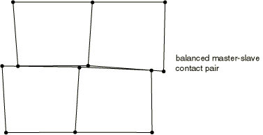

# 38.2.3 Contact constraint enforcement methods in Abaqus/Explicit


**Products: **Abaqus/Explicit  Abaqus/CAE  

##### **References**

- ["Defining general contact interactions in Abaqus/Explicit," Section 36.4.1](pt09ch36s04aus155.md)
- ["Defining contact pairs in Abaqus/Explicit," Section 36.5.1](pt09ch36s05aus160.md)
- [*CONTACT](../key/key-link.md#usb-kws-hcontact)
- [*CONTACT PAIR](../key/key-link.md#usb-kws-hcontactpair)
- ["Specifying master-slave assignments for general contact," Section 15.13.6 of the Abaqus/CAE User's Guide](../usi/usi-link.md#usi-itn-help-general-contform)

### Overview

Abaqus/Explicit uses two different methods to enforce contact constraints:
- The kinematic contact algorithm uses a kinematic predictor/corrector contact algorithm to strictly enforce contact constraints (for example, no penetrations are allowed).
- The penalty contact algorithm has a weaker enforcement of contact constraints but allows for treatment of more general types of contact.

Contact pairs in Abaqus/Explicit use kinematic enforcement by default, but penalty enforcement can be specified for individual contact pairs. General contact always uses penalty enforcement. Both methods conserve momentum between the contacting bodies.

### Kinematic contact algorithm

A summary of the default kinematic algorithm that Abaqus/Explicit uses to enforce contact with the contact pair algorithm is presented below. It is a predictor/corrector algorithm and, therefore, has no influence on the stable time increment. It is easier to describe the algorithm by first considering a pure master-slave contact pair.

#### Kinematic enforcement of contact conditions in a pure master-slave contact pair

In this case in each increment of the analysis Abaqus/Explicit first advances the kinematic state of the model into a predicted configuration without considering the contact conditions. Abaqus/Explicit then determines which slave nodes in the predicted configuration penetrate the master surfaces. The depth of each slave node's penetration, the mass associated with it, and the time increment are used to calculate the resisting force required to oppose penetration. For hard contact, this is the force which, had it been applied during the increment, would have caused the slave node to exactly contact the master surface. The next step depends on the type of master surface used.
- When the master surface is formed by element faces, the resisting forces of all the slave nodes are distributed to the nodes on the master surface. The mass of each contacting slave node is also distributed to the master surface nodes and added to their mass to determine the total inertial mass of the contacting interfaces. Abaqus/Explicit uses these distributed forces and masses to calculate an acceleration correction for the master surface nodes. Acceleration corrections for the slave nodes are then determined using the predicted penetration for each node, the time increment, and the acceleration corrections for the master surface nodes. Abaqus/Explicit uses these acceleration corrections to obtain a corrected configuration in which the contact constraints are enforced.
- In the case of an analytical rigid master surface, the resisting forces of all slave nodes are applied as generalized forces on the associated rigid body. The mass of each contacting slave node is added to the rigid body to determine the total inertial mass of the contacting interfaces. The generalized forces and added masses are used to calculate an acceleration correction for the analytical rigid master surface. Acceleration corrections for the slave nodes are then determined by the corrected motion of the master surface.

When using hard kinematic contact, it is still possible with the pure master-slave algorithm for the master surface to penetrate the slave surface in the corrected configuration (see [Figure 38.2.3--1](pt09ch38s02aus182.md#aexpcontactpair-mast-surf-pen)). 

**Figure 38.2.3–1** Master surface penetrations into the slave surface of a pure master-slave contact pair due to coarse discretization.


Using a sufficiently refined mesh on the slave surface will minimize such penetrations. Softened kinematic contact will allow penetrations since corrections are made to satisfy the pressure-overclosure relationship at the slave-nodes, not the condition of zero penetration.

#### Kinematic enforcement of contact conditions in a balanced master-slave contact pair

The kinematic contact algorithm for a balanced master-slave contact pair applies acceleration corrections that are linear combinations of pure master-slave corrections calculated in exactly the same manner as outlined above. One set of corrections is calculated considering one surface as the master surface, and the other corrections are calculated considering that same surface as the slave surface. Abaqus/Explicit then applies a weighted average of the two values. The exact weighting for each correction depends on the weighting factor specified for the contact pair (see ["Contact surface weighting" in "Contact formulations for contact pairs in Abaqus/Explicit," Section 38.2.2](pt09ch38s02aus181.md#usb-cni-acontactpair-exppair)). The default for balanced master-slave contact is to weight each correction equally.

Hard kinematic contact will minimize the penetration of the surfaces. However, after the initial weighted correction is applied, it is possible to still have some penetration of the surfaces. Therefore, Abaqus/Explicit uses a second contact correction to resolve any remaining overclosure in a balanced master-slave contact pair that uses hard kinematic contact. Both master-slave assignment combinations are again considered, but weighting factors are not used when combining the contributions to form the second applied acceleration correction. It is possible that small gaps between the contacting surfaces will be created during the second correction if there was some residual penetration after the first correction: the magnitude of the gaps after the second correction will generally be much smaller than the penetration after the first correction. The effect of the second correction is illustrated in [Figure 38.2.3--2](pt09ch38s02aus182.md#anormal-exp-2ndcor-initial) to [Figure 38.2.3--5](pt09ch38s02aus182.md#anormal-exp-pure).

The second contact correction described above is not conducted in the case when a softened kinematic contact formulation is used. This may lead to penetration values that may not be exactly synchronized with the pressure-overclosure curve. Moreover, the frictional shear forces (if any) may not reflect the specified coefficient of friction exactly when non-sticking sliding occurs. Use a pure master-slave kinematic formulation to avoid these inaccuracies.

**Figure 38.2.3–2** Effect of second contact corrections; initial configuration.


**Figure 38.2.3–3** Final configuration when the second contact correction is used.



**Figure 38.2.3–4** Final configuration if the second contact correction were to be omitted.


**Figure 38.2.3–5** Final configuration when a pure master-slave contact pair is used. The master surface is defined on the bottom elements.


#### Energy considerations for hard kinematic contact

The kinematic contact algorithm strictly enforces contact constraints and conserves momentum. To achieve these qualities with a discretized model, some energy is absorbed upon impact. For example, consider a linear elastic beam modeled with several elements that impacts a rigid wall as shown in [Figure 38.2.3--6](pt09ch38s02aus182.md#anormal-exp-beamimpact). The kinetic energy of the leading node is absorbed by the contact algorithm upon impact. A stress wave passes through the truss, and the truss eventually rebounds from the wall. The kinetic energy after the rebound is smaller than before the impact because of the contact node's energy loss upon impact. As the mesh is refined, this energy loss is reduced because the mass and kinetic energy of the leading node of the truss become less significant.

**Figure 38.2.3–6** Beam impacting a fixed rigid wall.


Contact forces can also exert negative external work upon impact since contact forces act over the entire increment in which impact occurs, including the fraction of the increment prior to impact. The opposing contact forces, which are equal in magnitude, act over different distances, thereby exerting a nonzero net work. The net external work of these forces is negative, and the absolute value of the net external work does not exceed the contact node's kinetic energy loss upon impact. These energies are insignificant in most models but can be significant in high-speed impacts, where high mesh refinement near the contact interface is recommended.

### Penalty contact algorithm

The penalty contact algorithm results in less stringent enforcement of contact constraints than the kinematic contact algorithm, but the penalty algorithm allows for treatment of more general types of contact (for example, contact between two rigid bodies). The penalty contact method is well suited for very general contact modeling, including the following situations:
- multiple contacts per node,
- contact between rigid bodies, and
- contact of surfaces also involved in other types of constraints (such as MPCs).

Since the penalty algorithm introduces additional stiffness behavior into a model, this stiffness can influence the stable time increment. Abaqus/Explicit automatically accounts for the effect of the penalty stiffnesses in the automatic time incrementation, although this effect is usually small, as discussed below.

The penalty enforcement method is always used by the general contact algorithm. For contact pairs, you can specify the penalty method as an alternative to the default kinematic enforcement method. When the penalty method is chosen for enforcing contact constraints in the normal direction, it is also used to enforce sticking friction (see ["Frictional behavior," Section 37.1.5](pt09ch37s01aus169.md)). 

| **Input File Usage: ** | Use the following option to select the penalty contact algorithm for a contact pair: |
| --- | --- |
|  | ``` [*CONTACT PAIR](../key/key-link.md#usb-kws-hcontactpair), MECHANICAL CONSTRAINT=PENALTY *surface_1*, *surface_2* ``` |

| **Abaqus/CAE Usage: ** | Interaction module: interaction editor: **Mechanical constraint formulation: Penalty contact method** |
| --- | --- |

#### Penalty enforcement of contact conditions for pure master-slave surface weighting

The penalty contact algorithm searches for slave node penetrations in the current configuration, including node-into-face, node-into-analytical rigid surface, and edge-into-edge penetrations. For node-to-face contact, forces that are a function of the penetration distance are applied to the slave nodes to oppose the penetration, while equal and opposite forces act on the master surface at the penetration point. The master surface contact forces are distributed to the nodes of the master faces being penetrated. For node-to-analytical rigid surface contact, forces that are a function of the penetration distance are applied to the slave nodes to oppose the penetration, while equal and opposite forces act on the analytical rigid surface at the penetration point. The contact forces acting at the penetration point of the analytical rigid surface result in equivalent forces and moments at the reference node of the rigid body corresponding to the analytical rigid surface. For edge-to-edge contact, the opposing contact forces are distributed to the nodes of the two contacting edges.

As with the pure master-slave kinematic contact algorithm, there is no resistance to master surface nodes penetrating slave surface faces with the pure master-slave penalty contact algorithm. Using a sufficiently refined mesh on the slave surface will help correct this problem.

#### Penalty enforcement of contact conditions for balanced master-slave surface weighting

The penalty contact algorithm for balanced master-slave contact surfaces computes contact forces that are linear combinations of pure master-slave forces calculated in the manner outlined above. One set of forces is calculated considering one surface as the master surface, and the other forces are calculated considering that same surface as the slave surface. Abaqus/Explicit then applies a weighted average of the two values. The weighting used with each set of forces depends on the weighting factor specified for the surfaces (see ["Contact formulation for general contact in Abaqus/Explicit," Section 38.2.1](pt09ch38s02aus180.md), and ["Contact formulations for contact pairs in Abaqus/Explicit," Section 38.2.2](pt09ch38s02aus181.md)). The default for balanced master-slave contact pairs and general contact is to weight each of the two sets of forces equally.

#### Scaling the penalty stiffness

The “spring” stiffness that relates the contact force to the penetration distance is chosen automatically by Abaqus/Explicit for hard penalty contact, such that the effect on the time increment is minimal yet the allowed penetration is not significant in most analyses. The default penalty stiffness is based on a representative stiffness of the underlying elements. A scale factor is applied to this representative stiffness to set the default penalty. Consequently, the penetration distance will typically be greater than the parent elements' elastic deformation normal to the contact interface. In purely elastic problems this penetration can affect the stress solution significantly, as demonstrated in ["The Hertz contact problem," Section 1.1.11 of the Abaqus Benchmarks Guide](../bmk/bmk-link.md#bmk-anl-hertzcontact). 

When element or node-based rigid bodies are involved in contact interactions, for numerical stability reasons Abaqus/Explicit will compute penalties at each contacting node on the rigid body by considering the overall inertia properties of the body. Consequently, the contact penalties will be different from the case when these elements were not converted to rigid and thus the penetrations in the two cases may be different.

You can specify a factor by which to scale the default penalty stiffnesses, as described in ["Contact controls for general contact in Abaqus/Explicit," Section 36.4.5](pt09ch36s04aus159.md), and ["Contact controls for contact pairs in Abaqus/Explicit," Section 36.5.5](pt09ch36s05aus164.md). This scaling may affect the automatic time incrementation. Use of a large scale factor is likely to increase the computational time required for an analysis because of the reduction in the time increment that is necessary to maintain numerical stability.

### Choosing between the kinematic and penalty contact algorithms

The penalty contact algorithm can model some types of contact that the kinematic contact algorithm cannot. Element-based rigid surfaces are not restricted to acting only as master surfaces within the penalty algorithm as they are within the kinematic algorithm. Thus, the penalty method allows modeling of contact between rigid surfaces, except when both surfaces are analytical rigid surfaces or when both surfaces are node-based.

The penalty contact algorithm must be used for all contact pairs involving a rigid body if a linear constraint equation, multi-point constraint, surface-based tie constraint, or connector element is defined for a node on the rigid body. For all other cases, Abaqus/Explicit enforces equations, multi-point constraints, tie constraints, embedded element constraints, and kinematic constraints (defined using connector elements) independently of contact constraints; therefore, if a degree of freedom participates in a linear constraint equation, multi-point constraint, tie constraint, embedded element constraint, or kinematic constraint in addition to a contact constraint, the contact constraint will usually override these constraints (see the discussion in ["Conflicts with multi-point constraints" in "Common difficulties associated with contact modeling using contact pairs in Abaqus/Explicit," Section 39.2.2](pt09ch39s02aus186.md#usb-cni-aexpcontacttrouble-mpc-conflicts)). Hence, the penalty contact algorithm is recommended if these constraints need to be strictly enforced.

Impact is plastic when the default hard, kinematic contact algorithm is used and the kinetic energy of the contacting nodes is lost. This loss in energy is insignificant for a refined mesh but can be significant with a coarse mesh. Penalty contact and softened kinematic contact introduce numerical softening to the contact enforcement analogous to adding elastic springs to the contact interface, which means that these algorithms do not dissipate energy upon impact (the energy stored in the springs is recoverable). This distinction between the algorithms is particularly apparent if a point mass with no force acting upon it impacts a fixed rigid wall: with penalty contact and softened kinematic contact the point mass will bounce away, but with hard kinematic contact the point mass will stick to the wall.

A further difference between kinematic and penalty contact is that the critical time increment is unaffected by kinematic contact but can be affected by penalty contact. For hard penalty contact, default penalty stiffnesses are chosen such that the stable time increments of the deformable parent elements of contact surface facets are effectively reduced by approximately 4% for increments in which contact forces are being transmitted; default penalty stiffnesses of node-based surface nodes require a 1% decrease in the element-by-element time increment to ensure numerical stability. Penalty stiffnesses between rigid bodies are chosen by default to have no effect on the stable time increment. If the default penalty stiffnesses are overridden by a penalty scale factor or softened contact behavior (see ["Contact pressure-overclosure relationships," Section 37.1.2](pt09ch37s01aus166.md)), the time increment is modified based on the maximum stiffness active in the contact interface. Increasing the penalty stiffnesses may decrease the stable time increment significantly (see [Table 38.2.3--1](pt09ch38s02aus182.md#table-scalefactors-cp)). If the overall stable time increment is not controlled by elements on the contact interface, the penalty contact algorithm usually will not affect the time increment.

Penalty contact and softened kinematic contact cannot be used with the breakable bond model; hard kinematic contact must be used for this model.

**Table 38.2.3–1** Effect of scale factor on time increment.
| Penalty scale factor | Lower bound to ratio of the time increment with contact divided by the time increment without contact |
| --- | --- |
| 1.0 | 0.96 |
| 10.0 | 0.34 |
| 100.0 | 0.13 |
| 1000.0 | 0.04 |
| 10000.0 | 0.013 |


