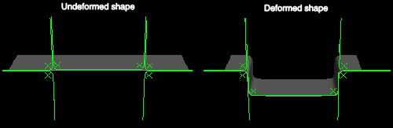
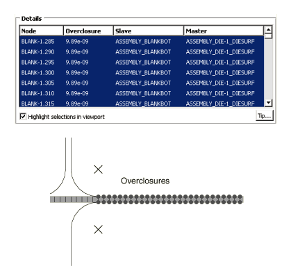
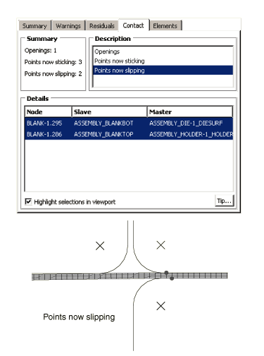
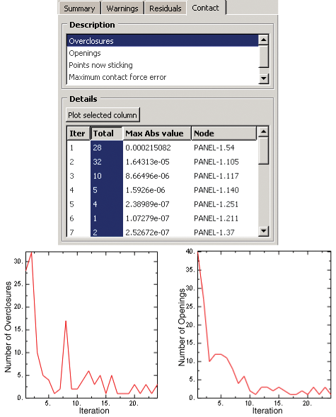
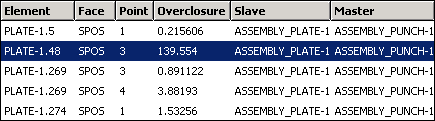
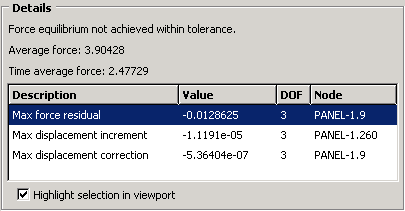
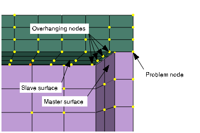

# 39.1.1 Contact diagnostics in an Abaqus/Standard analysis


**Products: **Abaqus/Standard  Abaqus/CAE  

##### **References**

- ["Output to the data and results files," Section 4.1.2](pt02ch04s01aus39.md)
- ["Defining general contact interactions in Abaqus/Standard," Section 36.2.1](pt09ch36s02aus139.md)
- ["Defining contact pairs in Abaqus/Standard," Section 36.3.1](pt09ch36s03aus145.md)
- ["Contact formulations in Abaqus/Standard," Section 38.1.1](pt09ch38s01aus177.md)
- [*CONTACT PRINT](../key/key-link.md#usb-kws-hcontactprint)
- [*PREPRINT](../key/key-link.md#usb-kws-mpreprint)
- [*PRINT](../key/key-link.md#usb-kws-hprint)
- [Chapter 41, "Viewing diagnostic output," of the Abaqus/CAE User's Guide](../usi/usi-link.md#usv-output)

### Overview

Diagnostics of an Abaqus/Standard analysis can be used to:
- check the initial contact conditions in a model; and
- track contact statuses over the course of the analysis.

Diagnostic information is available in several locations:- The output database
- The job diagnostics tool in the Visualization module of Abaqus/CAE
- The data (`.dat`) file
- The message (`.msg`) file

### Reviewing the adjustments of initially overclosed surfaces

Initial strain-free adjustments of nodal positions are performed by Abaqus/Standard under various circumstances to remove contact overclosures (see ["Controlling initial contact status in Abaqus/Standard," Section 36.2.4](pt09ch36s02aus142.md), and ["Adjusting initial surface positions and specifying initial clearances in Abaqus/Standard contact pairs," Section 36.3.5](pt09ch36s03aus149.md)) or to remove overclosures or gaps between surfaces of surface-based tie constraints (see ["Mesh tie constraints," Section 35.3.1](pt08ch35s03aus132.md)). The initial configuration of the model is determined after these strain-free adjustments are applied. There are two sources of information on the adjustments of overclosed surfaces: the data (`.dat`) file and the output database (`.odb`) file.

#### Output of information on strain-free adjustments to the data file

By default, information about a limited number of strain-free nodal adjustments is provided in the data (`.dat`) file. Requesting more detailed output concerning contact constraints provides information for all strain-free adjustments, regardless of the number of nodes adjusted.

| **Input File Usage: ** | ``` [*PREPRINT](../key/key-link.md#usb-kws-mpreprint), CONTACT=YES ``` |
| --- | --- |

| **Abaqus/CAE Usage: ** | Job module: job editor: **General**: **Preprocessor Printout**: **Print contact constraint data** |
| --- | --- |

#### Visualizing strain-free adjustments

Output variable STRAINFREE (see ["Abaqus/Standard output variable identifiers," Section 4.2.1](pt02ch04s02abv01.md)) contains nodal vectors representing initial strain-free adjustments. By default, this output variable is written to the output database (`.odb`) file for the original field output frame at zero time if any strain-free adjustments are made by Abaqus/Standard. A symbol plot of this variable in the Visualization module of Abaqus/CAE shows vectors that represent how individual nodes have been adjusted, and a contour plot of this variable shows the distribution of the adjustment magnitude (you must select the original output frame at zero time in the Visualization module of Abaqus/CAE before choosing the STRAINFREE output variable). Initial nodal positions written to the output database file by Abaqus/Standard include the effects of strain-free adjustments, so plots of the initial configuration show the adjusted nodal positions.

### Reviewing initial contact conditions

Before conducting an analysis, perform a data check on the model to review the initial contact conditions (see ["Abaqus/Standard, Abaqus/Explicit, and Abaqus/CFD execution," Section 3.2.2](pt01ch03s02abx02.md)). The data check creates an output database and calculates the variable COPEN (contact opening) on each slave surface based on the initial configuration of the model. You can create a contour plot of COPEN in the Visualization module of Abaqus/CAE to check for overclosed surfaces in the model assembly (an overclosure corresponds to a negative value of COPEN). 

In addition, you can instruct Abaqus to print detailed information about the initial contact conditions to the data file during the data check (this information is not printed by default). The data file lists the status (open or closed) and clearance distance for each constraint point on a slave surface, the internally generated contact element number associated with each slave node or facet, and a summary of contact interaction properties. Internally generated contact elements are not user-defined and do not appear in the input file, so they can be difficult to locate if an error or warning message refers to them. The information in the data file can be used to locate these contact elements in the model.

The data file also lists the key parameters for every contact interaction in the model. These parameters include:
- slave and master surface names;
- interaction property;
- value of  (see ["Controlling the increment size based on penetration distance in unconverged iterations" in "Common difficulties associated with contact modeling in Abaqus/Standard," Section 39.1.2](pt09ch39s01aus184.md#usb-cni-acontacttrouble-hcrit));
- degree of smoothing on the master surface (see ["Smoothing master surfaces for the finite-sliding, node-to-surface formulation" in "Contact formulations in Abaqus/Standard," Section 38.1.1](pt09ch38s01aus177.md#usb-cni-acontactpairform-smoothing));
- characteristic length used in penetration tolerance calculations (see ["Augmented Lagrange method" in "Contact constraint enforcement methods in Abaqus/Standard," Section 38.1.2](pt09ch38s01aus178.md#usb-cni-acontactconstraints-auglagrange));
- extension ratio applied to master surface edges (see ["Extending master surfaces and slide lines," Section 36.3.8](pt09ch36s03aus152.md)); and
- contact formulation.

Parameters are listed only for the interactions to which they are applicable. For example, , surface smoothing, and the extension ratio are not used for surface-to-surface contact calculations (including general contact), so Abaqus does not report values for these parameters in surface-to-surface interactions.

| **Input File Usage: ** | Use the following option to print information about initial contact conditions to the data file: |
| --- | --- |
|  | ``` [*PREPRINT](../key/key-link.md#usb-kws-mpreprint), CONTACT=YES ``` |

| **Abaqus/CAE Usage: ** | Job module: job editor: **General**: **Preprocessor Printout:** **Print contact constraint data** |
| --- | --- |

#### Output of master surface nodes associated with slave nodes for small-sliding contact

When you print initial contact conditions to the data file for contact pairs using the small-sliding tracking approach, Abaqus creates an output table showing the master nodes associated with each slave node. Each row of the table lists a slave node and the master nodes to which the slave node transfers load when in contact with the master surface. The number of nodes in the table indicates whether or not the anchor point for a slave node lies on an element face or at a node. For details on the small-sliding tracking approach and load transfer, see ["Using the small-sliding tracking approach" in "Contact formulations in Abaqus/Standard," Section 38.1.1](pt09ch38s01aus177.md#usb-cni-acontactpairform-smsliding).

In the output shown below for a two-dimensional model, slave node 2 has an anchor point at master surface node 101 because it interacts with three master surface nodes. Slave node 1 has an anchor point between nodes 100 and 101. This table also provides a list of slave nodes that did not find an intersection with the master surface. This is important because these nodes have no local tangent plane and, hence, can penetrate the master surface.

```
SMALL SLIDING  NON-RIGID  AX ELEMENT(S)
        INTERNALLY GENERATED FOR SLAVE BLANK AND MASTER SPHERE
         WITH SURFACE INTERACTION INF1

    ELEMENT  SLAVE   MASTER
    NUMBER   NODE(S) NODE(S)

       46       1     101     100
       47       2     102     101     100
       50       9          NO INTERSECTION
 ***WARNING: 1 SLAVE NODES FOUND NO INTERSECTION WITH A MASTER
SURFACE
```

### Tracking contact status during a simulation

Abaqus provides two methods for tracking the status of contact interactions over the course of an analysis: the diagnostics tool available in the Visualization module of Abaqus/CAE and contact output to the data (`.dat`) file. Tracking contact status helps you ensure contact surfaces are defined appropriately, troubleshoot a terminated contact analysis, and verify that contact interactions behave realistically.

The diagnostics tool in Abaqus/CAE provides a good overview of how contact conditions evolve throughout a simulation. It is useful for reviewing terminated analyses because it reports contact change calculations in every iteration. The data file offers a more detailed summary of the overall contact conditions and the forces driving these conditions. However, it only provides output for successfully completed increments.

#### Contact diagnostics in the Visualization module of Abaqus/CAE

The diagnostics tool in the Visualization module of Abaqus/CAE can be used with the following procedure types:
- static stress/displacement;
- coupled thermal/stress; and
- coupled pore fluid flow/stress.

The diagnostics tool tracks all changes in contact during an analysis. Each time a constraint point's contact status changes from closed to open, it is recorded as an “opening.” Each time the status changes from open to closed, it is recorded as an “overclosure.” If the contact interaction involves frictional effects, the diagnostics note when a constraint point begins sliding along the master surface (“slipping”) and when a constraint point in motion stops on the master surface (“sticking”). The diagnostics tool lists the constraint point involved in the status change and allows you to highlight the location of the constraint point in the model. The calculated clearance or overclosure distance is also shown, and the maximum penetration is reported when the penetration tolerance for augmented Lagrange contact is exceeded (see ["Augmented Lagrange method" in "Contact constraint enforcement methods in Abaqus/Standard," Section 38.1.2](pt09ch38s01aus178.md#usb-cni-acontactconstraints-auglagrange)).

For the default contact convergence criteria, the diagnostics tool shows the maximum penetration error and the maximum estimated contact force error; these determine whether the contact conditions have converged (for details, see ["Severe discontinuities in Abaqus/Standard" in "Defining an analysis," Section 6.1.2](pt03ch06s01abo05.md#usb-anl-aover-sdiconvert)). If you choose to use the traditional contact convergence criteria, these error measures are not reported. For analyses involving Lagrange friction, the diagnostics show the maximum slip error for points that should be sticking (see ["Shear stress versus elastic slip while sticking" in "Frictional behavior," Section 37.1.5](pt09ch37s01aus169.md#usb-cni-afriction-slip)).

For detailed instructions on using the diagnostics tool, see [Chapter 41, "Viewing diagnostic output," of the Abaqus/CAE User's Guide](../usi/usi-link.md#usv-output). The contact diagnostic information available in Abaqus/CAE can also be printed to the Abaqus message file. For details, see ["The Abaqus/Standard message file" in "Output," Section 4.1.1](pt02ch04s01aus38.md#usb-out-ooutput-message-std).

#### Contact output in the data file

When you request contact output to the data file (see ["Surface output from Abaqus/Standard" in "Output to the data and results files," Section 4.1.2](pt02ch04s01aus39.md#usb-out-oprintfile-surface)), Abaqus lists the contact status for every constraint point at each increment of the analysis. The values of CPRESS, CSHEAR, COPEN, and CSLIP at each constraint point are also reported by default.

#### Example: Forming a channel

Contact diagnostics are often helpful in confirming that the interactions in a model are behaving realistically and as intended. The diagnostics also provide a means of tracing the evolution of contact statuses on a node-by-node basis. In this example the diagnostics are based on a channel forming model. The channel is formed from a steel plate (or blank) with appreciable thickness. The blank is modeled with two-dimensional, plane strain elements; the forming tools (die, holder, and punch) are modeled as analytical rigid surfaces. The initial and final configurations of the model are displayed in [Figure 39.1.1--1](pt09ch39s01aus183.md#acontact-blank-original-example).

**Figure 39.1.1–1** Model for channel-forming example. (The blank has been extruded for visualization purposes.)



If you include a step or prescribed condition in your model intended to establish contact between two surfaces, the diagnostics tool in Abaqus/CAE can confirm the success of this modeling technique. In this example contact must be firmly established between the blank, the die, and the holder before the forming process begins. Small but consistent overclosures in the nodes along the surface of the blank indicate that the contact conditions are appropriate to begin forming the channel (see [Figure 39.1.1--2](pt09ch39s01aus183.md#acontact-blank-step1)).

**Figure 39.1.1–2** Diagnostics confirming contact conditions between the blank, die, and holder.



You can also use the contact conditions to review changes in contact status throughout the forming process. [Figure 39.1.1--3](pt09ch39s01aus183.md#acontact-blank-slipping) depicts the onset of slipping for two nodes on the blank. 

**Figure 39.1.1–3** Diagnostics for the onset of slipping.



This information might be used to confirm frictional or material effects. For example, you can draw the following conclusions about these diagnostics in the channel forming analysis: - If the slipping does not occur until well into the forming process, frictional forces were probably holding the blank in place between the die and holder.
- Since all the nodes on the blank do not slip simultaneously, there is most likely some mild stretching and nonuniform deformation occurring in the blank.

For more insight on the slipping nodes, refer to the data file. The following excerpt lists a portion of the blank-die interaction in the same increment depicted in [Figure 39.1.1--3](pt09ch39s01aus183.md#acontact-blank-slipping):

```
    NODE  FOOT-   CPRESS      CSHEAR1     COPEN       CSLIP1  
          NOTE 

      290  OP    0.000       0.000      4.1155E-07 -2.8783E-07
      295  SL   4.4632E+06 -4.4632E+05   0.000     -5.1137E-06
      300  ST   9.5643E+06 -9.3177E+05   0.000     -4.8711E-06
      305  ST   2.9421E+06 -2.7867E+05   0.000     -4.7359E-06
```
The contact status is indicated in the “footnote” column: open (OP), closed and sticking tangentially (ST), or closed and sliding tangentially (SL). In the absence of frictional properties the two contact statuses are open (OP) and closed (CL).

In the output above node 290 is open; consequently, the contact pressure variable CPRESS is zero. The COPEN variable reports that this node is 4.1155  107 length units away from the master surface. The SL footnote for node 295 indicates that it is in contact with the master surface (the die) and is “slipping.” The critical shear stress, , can be determined by the equation , where *p* is the value of contact pressure shown under CPRESS and  is the coefficient of friction for the contact interaction. In this model  = 0.1; the critical shear stress (4.4632  106  0.1 = 4.4632  105) is equal to the frictional shear stress CSHEAR1, so the node is slipping. In the case of node 300 the critical shear stress (9.5643  106  0.1 = 9.5643  105) is greater than the frictional shear stress, so the node is sticking. Likewise for node 305.

The CSLIP1 variable is the total accumulated (integrated) slip at the slave node. Accumulated slip and local tangent directions are discussed in more detail in ["Output of tangential results" in "Defining contact pairs in Abaqus/Standard," Section 36.3.1](pt09ch36s03aus145.md#usb-cni-acontactpair-tangent).

### Diagnosing a terminated contact analysis

Contact diagnostics provide invaluable information when trying to resolve errors in a terminated analysis. The diagnostics let you review trends in the model's contact status, visually identify regions of the model involved in contact difficulties, and numerically quantify the severity of an error.

For a more general discussion of common errors associated with using contact in Abaqus/Standard analyses, refer to ["Common difficulties associated with contact modeling in Abaqus/Standard," Section 39.1.2](pt09ch39s01aus184.md).

#### Excessive severe discontinuity iterations

Establishing contact conditions is a common source of difficulty in an implicit static contact analysis. If an analysis terminates because it exceeds the maximum number of severe discontinuity iterations (see ["Severe discontinuities in Abaqus/Standard" in "Defining an analysis," Section 6.1.2](pt03ch06s01abo05.md#usb-anl-aover-sdiconvert)), the contact diagnostics give insight into how to resolve the problem. You can plot the number of contact status changes over the course of an attempt, as shown in [Figure 39.1.1--4](pt09ch39s01aus183.md#usb-contact-plot). 

**Figure 39.1.1–4** Changes in contact status during an attempt.



If the changes are tending toward zero, increasing the allowed number of severe discontinuity iterations or adjusting the SDI conversion settings may allow Abaqus to resolve the contact conditions. If the changes are not tending toward zero, you will need to revise your model or investigate other options.

Using the visualization tools, you can see which areas of the model are involved in contact changes. If a particular contact pair or surface region is causing a majority of the status fluctuations, you may need to modify the characteristics of the associated interaction. For example, it is typically easier to resolve contact conditions for contact pairs using the small-sliding tracking approach (if it is applicable) than for those using the finite-sliding tracking approach.

#### Chattering

The contact diagnostics tool makes it very easy to detect chattering in a model. In this situation the same node or constraint appears in the diagnostics summary for every iteration, alternating as an overclosure or an opening. The classic chattering scenario produces diagnostics plots that tend toward zero but level off at a low number due to the oscillating contact status (see [Figure 39.1.1--4](pt09ch39s01aus183.md#usb-contact-plot), for example). Techniques for resolving contact chattering problems are discussed in ["Excessive iterations in contact simulations" in "Common difficulties associated with contact modeling in Abaqus/Standard," Section 39.1.2](pt09ch39s01aus184.md#usb-cni-acontacttrouble-iters).

#### Unrealistic and severe overclosures

When reviewing diagnostics, you may notice overclosures during unconverged iterations for nodes or constraint points that are located outside of the regions that are contacting in a converged state. The reported overclosure value for these nodes will be significantly greater than the overclosures for nodes within the contacting regions, as seen in the highlighted constraint point in [Figure 39.1.1--5](pt09ch39s01aus183.md#usb-contact-excessive-overclosure). 

**Figure 39.1.1–5** The overclosure at one constraint point is significantly higher than the overclosures at other constraint points.



This is an indication of physical or numerical instabilities in the model. You should take steps to more firmly establish contact before proceeding with the simulation or add some form of stabilization to the model (see ["Solving nonlinear problems," Section 7.1.1](pt03ch07s01aus49.md); ["Dashpots," Section 32.2.1](pt06ch32s02alm38.md); and ["Automatic stabilization of rigid body motions in contact problems" in "Adjusting contact controls in Abaqus/Standard," Section 36.3.6](pt09ch36s03aus150.md#usb-cni-acontacttrouble-stabilize)). Using smaller increments can sometimes enable a solution to be obtained in these cases.

#### Nonconverging force equations

Contact diagnostics do not always involve severe discontinuity iterations. Poorly defined contact can lead to nonconvergence of the force equations in an analysis (see [Figure 39.1.1--6](pt09ch39s01aus183.md#usb-contact-enclosure-residuals)). 

**Figure 39.1.1–6** The diagnostics tool reports equilibrium difficulties.



If the same node appears repeatedly as the location of maximum residuals and corrections, investigate the contact conditions around that node. Consider the example in [Figure 39.1.1--7](pt09ch39s01aus183.md#usb-contact-overhang). 

**Figure 39.1.1–7** Two surfaces in a region of nonconverging force equations.



The diagnostics highlight the “problem node” on the perimeter of the slave surface. A closer look in the vicinity of this node reveals that the slave surface mesh is too coarse. Slave nodes along the perimeter of the surface are touching the master surface, but the next row of nodes is “hanging over” the rim of the master surface. If this contact pair uses node-to-surface contact discretization, the master surface can penetrate the slave surface with little resistance between the nodes. Such penetrations can cause the nonconverging force equations seen in the diagnostics.

Any situation in which the master surface is free to penetrate the slave surface can prevent an analysis from converging. Potential solutions include:
- switching the master and slave assignments;
- using surface-to-surface discretization (however, using surface-to-surface discretization without refining a coarse slave mesh may lead to inaccurate stress results, even if the analysis does converge); or
- refining the mesh on the slave surface.


