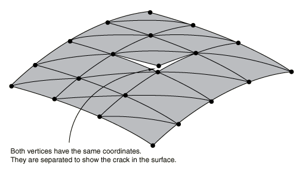
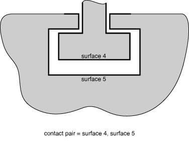
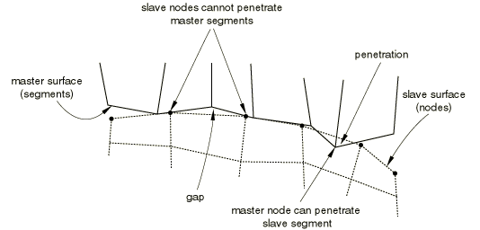
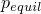
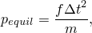
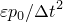
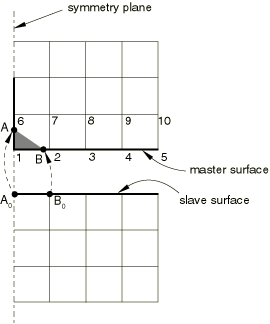
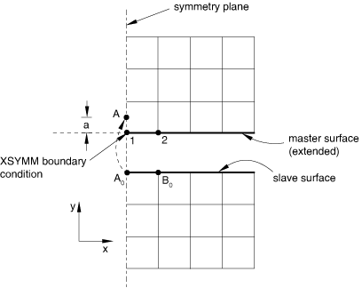
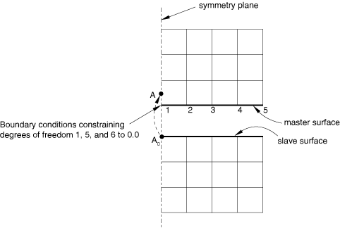

# 39.2.2 Common difficulties associated with contact modeling using contact pairs in Abaqus/Explicit

**Products: **Abaqus/Explicit  Abaqus/CAE  

##### **References**

- ["Defining contact pairs in Abaqus/Explicit," Section 36.5.1](pt09ch36s05aus160.md)
- [*CONSTRAINT CONTROLS](../key/key-link.md#usb-kws-hconstraintcontrols)
- [*CONTACT PAIR](../key/key-link.md#usb-kws-hcontactpair)

### Overview

This section highlights the difficulties that are most commonly encountered when modeling contact interactions with contact pairs in Abaqus/Explicit. Most of these issues are not relevant when the general contact algorithm is used; refer to ["Defining general contact interactions in Abaqus/Explicit," Section 36.4.1](pt09ch36s04aus155.md), for more information on the issues involved with general contact interactions. Recommendations on how to circumvent these problems are presented.

### Defining duplicate nodes on the master surface

When defining three-dimensional surfaces formed by element faces, avoid defining two surface nodes with the same coordinates. Such a definition can give rise to a seam, or crack, in the surface as shown in [Figure 39.2.2--1](pt09ch39s02aus186.md#aexpcontact-mesh-crack). 

**Figure 39.2.2–1** Example of doubly defined surface node.

If viewed with the default plotting options in Abaqus/CAE, this surface will appear to be a valid, continuous surface; however, a node sliding along this surface can fall through this crack and violate the contact conditions. If this were to happen, Abaqus/Explicit would enforce the contact conditions by applying a large acceleration to the node once overclosure is detected. The large resulting acceleration may create a noisy solution or cause the elements to distort badly.

Use the edge display options in the Visualization module of Abaqus/CAE to identify any unwanted cracks in the surfaces used in the model. The cracks will appear as extra perimeter lines in the interior of the surface. Duplicate nodes can be avoided easily by equivalencing nodes when creating the model in a preprocessor.

### Using an inadequate surface definition for the desired contact conditions

Occasionally, surface definitions may not be suitable for modeling the desired contact conditions in a problem. [Figure 39.2.2--2](pt09ch39s02aus186.md#acontact-exp-inad-surf) shows a two-dimensional model of a simple connection between two parts. 

**Figure 39.2.2–2** Surface definitions that are inadequate for the desired contact conditions.

The surfaces shown in the figure are inadequate for the desired contact conditions that are also shown. At the start of the simulation, Abaqus/Explicit will detect that some of the nodes on surface 3 are behind surfaces 1 and 2. When the contact conditions are enforced, the motions of the surfaces will likely cause badly distorted elements. One solution to this problem is shown in [Figure 39.2.2--3](pt09ch39s02aus186.md#acontact-exp-adeq-surf). 

**Figure 39.2.2–3** Surface definitions that are adequate for the desired contact conditions.

The surfaces shown in that figure are suitable for the desired contact definition. Other solutions, such as using a pure master-slave contact pair, exist for this problem and may be more suitable, depending on the details of the intended simulation.

### Using poorly discretized surfaces

Several problems are caused by surfaces created on very coarse meshes.

#### Penetrations with coarsely discretized surfaces when using hard surface behavior

When a coarsely discretized surface is used as the slave surface in a pure master-slave contact pair with hard surface behavior, an inaccurate solution may be produced as a result of the gross penetration of the master surface into the slave surface. This situation is shown in [Figure 39.2.2--4](pt09ch39s02aus186.md#aexpcontact-mast-surf-pen). This problem can be minimized if the contact pair can be switched to a balanced master-slave contact pair. However, some contact pairs in Abaqus/Explicit must always use a pure master-slave formulation. In these cases the only solution to gross penetration is to refine the slave surface.

**Figure 39.2.2–4** Master surface penetrations into the slave surface due to coarse discretization.

#### Problems with coarsely discretized rigid surfaces

For rigid surfaces formed by element faces, inaccurate results may be obtained if too few elements are used to represent a curved geometry. When a very coarse mesh is used on a curved geometry, it is possible for slave nodes to get “snagged” on the sharp vertices.

In general, using a reasonable number of element faces to represent a curved surface will not increase the computational time of the simulations. However, a large number of element faces can significantly increase the memory that Abaqus/Explicit will need for the simulation. When a specific curved surface geometry can be modeled, using an analytical rigid surface may provide a more accurate geometric description while minimizing computational expense; see ["Analytical rigid surface definition," Section 2.3.4](pt01ch02s03aus19.md).

#### Penalty contact behavior sensitivity in rigid-to-rigid interactions

The contact penalties are, in general, determined from stable time increment considerations and masses of the nodes involved in contact. To compute a reliable contact penalty when rigid bodies are contacting each other, Abaqus/Explicit accounts in a comprehensive fashion for the inertial properties of the rigid bodies by distributing the mass of the rigid bodies at all nodes that might be involved in contact. Hence, the final contact penalty will depend on the size of the actual rigid surfaces that are included in the contact definitions. Consequently, the contact response (forces, penetrations) will depend somewhat on your choice in defining the contacting surfaces on the rigid bodies. If large penetrations occur, specifying realistic inertial properties for the rigid bodies will help in general to resolve the issue. Alternatively, you can use a scaling factor for the penalties to enforce contact in a more accurate fashion.

### Conflicts with boundary conditions

If boundary constraints are applied to contact nodes on both surfaces of a contact pair in the direction that the contact constraints are active, the boundary constraints may override the contact constraints. For kinematic contact, contact force related quantities will be output as the force necessary to resolve the contact constraint in a single increment, causing misleading results for these output quantities if the boundary constraints violate the contact constraints. Contact force output for penalty contact does not show this behavior since the contact force is proportional only to the current penetration and does not depend on the time increment. Boundary constraints are not affected by contact constraints.

### Conflicts with multi-point constraints

Using a multi-point constraint (MPC) with a node on a surface that is part of an active kinematic contact pair can generate conflicting kinematic constraints in the model. Abaqus/Explicit will not prevent you from using multi-point constraints on the nodes forming a surface. If the contact constraints and the constraints formed by the MPC are orthogonal, there will be no problems with the simulations. If they are not orthogonal, the solution may be noisy as Abaqus/Explicit tries to satisfy the conflicting constraints. Since within each increment kinematic contact constraints are applied after MPCs are applied, the MPCs on kinematic contact surfaces may be slightly out of compliance.

In the case of an interaction between an MPC and penalty contact, the MPC is strictly enforced and any noncompliance in the contact pair will be resisted by penalty forces.

### Conflicting contact constraints on shell nodes with hard contact

When a shell or membrane is pinched between two master surfaces using two kinematic contact pairs with hard contact behavior, one of the contact constraints will not be enforced exactly. In a quasi-static analysis it may be observed that the pinched slave node will oscillate about an “equilibrium” penetration depth with a decay rate that depends on the time increment and the ratio of the mass of the pinched node and the mass of the master surfaces. Decreasing the time increment size will increase the decay rate (quasi-static equilibrium will be reached more quickly). Reducing the mass of the nodes on the master surfaces (or increasing the mass of the pinched nodes) will also increase the decay rate, although a high ratio of slave mass to master mass can also lead to numerical difficulties for kinematic contact, as discussed below in ["Large mass mismatch between contact surfaces](pt09ch39s02aus186.md#usb-cni-aexpcontacttrouble-largemassmismatch).” Applying the loads to the model gradually will reduce the amplitude of the oscillation. In most analyses it is not desirable to alter the time increment or nodal masses arbitrarily, so the decay rate of the oscillation will be fixed. Either the loading rate can be modified or a softened contact model with contact damping can be used to control this oscillatory behavior.

The quasi-static equilibrium penetration magnitude, , is approximately given by 

where *f* is the normal contact force,  is the increment size, and *m* is the mass of the pinched node. The quasi-static equilibrium penetration will be minimal if it is small compared to the shell or membrane thickness. A change in the time increment size or loading on the pinched surfaces during the analysis causes the quasi-static equilibrium penetration to change, which can be responsible for large accelerations of surface nodes and can contribute to solution noise (typically, this behavior manifests as a jump in contact results such as CPRESS). Similar noisy behavior for pinched surfaces can occur across a step boundary, even if the time increment size is uniform across the step boundary.

If one kinematic contact pair and one penalty contact pair are used to model the same type of pinching problem, the kinematic constraint is enforced exactly and the static value of the penetration in the penalty contact pair is somewhat larger than that which occurs when kinematic contact is used for both contact pairs (assuming that the penalty stiffness is set such that the analysis is numerically stable for the time increment being used).

### Multiple kinematic contact constraints on solid nodes

If a node that is not attached to shell or membrane elements acts as a slave node in two or more simultaneous, kinematic contact constraints, the resulting contact corrections may be erroneous, possibly causing the analysis to abort with excessive element distortion. By “not attached to shell or membrane elements” we are referring to nodes attached to solid elements or point masses, for example. The majority of solid nodes typically are not involved in simultaneous contacts, but there are common exceptions where three or more bodies meet at corners. This limitation can be avoided by using penalty contact. For example, if a solid surface acts as a slave in two contact pairs and there is a possibility of simultaneous contacts for individual slave nodes, penalty enforcement of contact should be specified for one or both of the contact pairs.

### Redundant and degenerate contact constraints

Redundant contact constraints are caused by overlapping or adjoining surfaces. For example, if contact is specified between a single surface and multiple overlapping surfaces, the contact constraints associated with the common nodes of the overlapping surfaces are redundant. Degenerate contact constraints occur if the slave surface and master surface of the same contact pair contain common nodes (a contact constraint cannot be formed between a node and itself).

If redundant kinematic contact constraints are specified, Abaqus/Explicit will consolidate the constraints if both contact pairs use pure master-slave contact, the slave surfaces do not share facets, and the surface interaction and contact pair set names are identical. If the contact pair definitions differ, the analysis will terminate with an error, and one of the redundant constraints must be removed from the model definition to continue the analysis.

Redundant penalty contact constraints may cause excessive initial overclosure adjustments, creating gaps in the place of initial overclosures. To correct this behavior, one of the constraints must be removed from the model definition.

Redundant contact constraints involving both a penalty contact pair and a kinematic contact pair cause inefficiencies in the analysis. The kinematic contact constraints will override the penalty contact constraints, but the penalty contact constraints will still be considered in the automatic time increment estimate.

If the surfaces in a two-surface contact pair contain common nodes, the contact constraint for each shared node cannot be generated. This is the equivalent of defining self-contact between the shared nodes and each surface. However, the two-surface contact logic (unlike the specialized self-contact logic) would erroneously detect contact between each shared node and itself. When this condition occurs, Abaqus/Explicit redefines the slave surfaces so that the shared nodes will not act as slave nodes in the contact pair. However, the shared nodes will still be used in the definition of a master surface in the contact pair.

### Large mass mismatch between contact surfaces

Often very little mass is assigned to rigid bodies in quasi-static simulations because the mass has little influence on the physical problem. However, specifying a small rigid body mass can adversely affect the kinematic contact enforcement method. A force applied to a rigid body with very little mass can cause a large predicted displacement of the rigid body within an increment prior to the enforcement of contact constraints, so significant penetration may be present in the “predicted” configuration for kinematic contact, as shown in [Figure 39.2.2--5](pt09ch39s02aus186.md#acontact-compress-arch). 

**Figure 39.2.2–5** Undesirable numerical behavior of contact algorithm resulting from small rigid body mass.

With hard kinematic contact each slave node that is penetrating its master surface in the predicted configuration will be brought to the position of its tracked point on the master surface in the corrected configuration, which, in this example, generates tensile contact forces at the outer slave nodes of the contact region. This undesirable effect can be avoided by increasing the mass of the rigid body, which will reduce the predicted displacement increment. A small rigid body mass can also adversely affect penalty enforcement of contact because small penalty stiffnesses will be assigned.

Similar undesirable numerical behavior can occur for deformable-to-deformable contact if the nodal masses of the master nodes are orders of magnitude less than those of the slave nodes. This problem can often be avoided in such cases by using the pure master-slave algorithm with the master surface containing the more massive nodes.

### Contact noise associated with limited computer precision for hard contact

Some contact noise may occur with hard contact models because of limited computer precision. This noise is rarely significant in an analysis, but it may be noticeable at the beginning of an analysis if initial displacements are used to make the mesh comply with contact constraints. For example, if an adjustment of  is made for an initial overclosure, a penetration of up to  may still exist in the first increment, where  is the “machine epsilon” of the computer. The machine epsilon of a given computer is defined as the smallest positive number that can be added to 1 with the computed result being greater than 1; on most systems  is approximately 6E8 for single precision and 1E16 for double precision. With the kinematic contact algorithm you can attribute initial accelerations of up to  to limited machine precision, where  is the time increment. For a single precision analysis in which =1E6 sec, initial accelerations of up to 6E4 sec2 can be attributed to limited machine precision. These accelerations are typically insignificant. They can be reduced by conducting the analysis with double precision or by specifying the nodal coordinates to be more compliant with contact constraints.

### Finite-sliding contact near a symmetry plane

When a pure master-slave contact constraint with finite sliding is defined near a symmetry plane in the master surface, the corner slave node (node *A* in [Figure 39.2.2--6](pt09ch39s02aus186.md#acontact-mast-symm)) can, under some circumstances, slide freely along the symmetry plane without experiencing contact. If the master surface wraps around the corner (node 1), the slave node *A* may “track” on the master segment (1–6) on the symmetry plane, rather than on master segment (1–2). The result may be an inaccurate representation of the contact constraint as shown by the shaded area.

**Figure 39.2.2–6** Contact near a symmetry plane. The master surface is wrapped around the corner.

If the master surface does not wrap around the corner (node 1 in [Figure 39.2.2--7](pt09ch39s02aus186.md#acontact-mast-symm-type)), the contact logic may give different results depending on how the symmetry boundary conditions have been defined for the master node 1 on the symmetry plane. If the symmetry boundary conditions on the master node are specified using boundary “type” format (i.e., XSYMM, YSYMM, or ZSYMM—see ["Boundary conditions in Abaqus/Standard and Abaqus/Explicit," Section 34.3.1](pt07ch34s03aus118.md)), the master surface is effectively extended beyond the symmetry plane ([Figure 39.2.2--7](pt09ch39s02aus186.md#acontact-mast-symm-type)); thus, the slave node *A* will be detected as a “penetrated” node (penetrated by distance *a*). Therefore, a correcting force would be applied on slave node *A* to push it below the master surface.

**Figure 39.2.2–7** The master surface is extended across the symmetry plane because the symmetry boundary condition at node 1 is specified using boundary type XSYMM.

If the symmetry boundary conditions on the master node 1 are specified using “direct” format (i.e., specifying the components of translations and rotations that are fixed), the master surface is not extended beyond the symmetry plane ([Figure 39.2.2--8](pt09ch39s02aus186.md#acontact-mast-symm-direct)) and it is possible that contact will not be enforced correctly.

**Figure 39.2.2–8** The master surface is not extended across the symmetry plane because the symmetry boundary conditions at node 1 are specified using direct format.

To ensure proper enforcement of finite-sliding contact near symmetry planes, use balanced master-slave contact or use pure master-slave contact without extending the surface onto the symmetry plane and use symmetry “type” boundary conditions on the perimeter of the master surface nodes as discussed above. Special consideration of small-sliding contact near a symmetry plane is discussed in ["Contact formulations for contact pairs in Abaqus/Explicit," Section 38.2.2](pt09ch38s02aus181.md).

### Specifying initial clearance values precisely

You can define initial clearances and contact directions precisely for the nodes on the slave surface (see ["Specifying initial clearance values precisely" in "Adjusting initial surface positions and specifying initial clearances for contact pairs in Abaqus/Explicit," Section 36.5.4](pt09ch36s05aus163.md#usb-cni-aexpadjustsurfaces-clearance)). The initial clearance or overclosure value calculated at every slave node based on the coordinates of the slave node and the master surface is overwritten by the value that you specify; the coordinates of the slave nodes are not altered. This technique permits exact specification of initial clearances (and, possibly, contact directions) when they would not be computed accurately enough from the nodal coordinates; for example, if the initial clearance is very small compared to the coordinate values. It can be used only in small-sliding contact analyses (["Contact formulations for contact pairs in Abaqus/Explicit," Section 38.2.2](pt09ch38s02aus181.md)).

When the balanced-master slave contact algorithm is invoked for the contact pair, the initial clearance values can be defined on one or both of the surfaces. Initial clearances defined on contact surfaces that act only as master surfaces will be ignored.

### Visualizing the precise initial clearances for small-sliding contact pairs

Abaqus/Explicit does not adjust the coordinates of the slave surface when precise initial clearances are specified for small-sliding contact pairs (see ["Adjusting initial surface positions and specifying initial clearances for contact pairs in Abaqus/Explicit," Section 36.5.4](pt09ch36s05aus163.md)). Therefore, the specified clearances cannot be seen in a postprocessor such as the Visualization module of Abaqus/CAE. Thus, depending on the initial geometry of the surfaces and the magnitude of the clearances or overclosures, the surfaces may appear open or closed in the postprocessor when they are actually just in contact.

