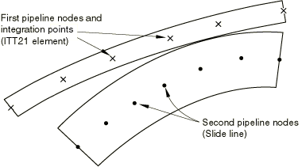
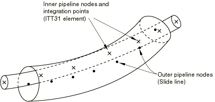

# 40.3.2 Tube-to-tube contact element library


**Product: **Abaqus/Standard  

##### **References**

- ["Tube-to-tube contact elements," Section 40.3.1](pt09ch40s03alm65.md)
- [*INTERFACE](../key/key-link.md#usb-kws-minterface)
- [*SLIDE LINE](../key/key-link.md#usb-kws-mslideline)

### Overview

This section provides a reference to the tube-to-tube contact elements available in Abaqus/Standard.

### Element types

| ITT21 | Tube-to-tube element for use with two-dimensional beam and pipe elements |
| --- | --- |
|  |

| ITT31 | Tube-to-tube element for use with three-dimensional beam and pipe elements |
| --- | --- |
|  |

##### Active degrees of freedom

ITT21: 1, 2

ITT31: 1, 2, 3

##### Additional solution variables

ITT21: Two additional variables relating to the contact forces.

ITT31: Three additional variables relating to the contact forces.

### Nodal coordinates required

ITT21: *X*, *Y*

ITT31: *X*, *Y*, *Z*

### Element property definition

| **Input File Usage: ** | Use the following option to identify the second (outer) pipe with which the specified ITT contact elements on the first (inner) pipe can interact: |
| --- | --- |
|  | ``` [*SLIDE LINE](../key/key-link.md#usb-kws-mslideline) ``` Use the following option to give the radial clearance between the pipes as a positive number when modeling a tube sliding within another tube: ``` [*INTERFACE](../key/key-link.md#usb-kws-minterface) ``` When the elements are modeling contact between the exterior surfaces of two pipes, the sum of the external radii of the pipes is given as a negative number. |

### Element-based loading

None.

### Element output

#### Stress components

| S11 | Normal component of the force between the two pipes. |
| --- | --- |

| S12 | Shear force between the two pipes, parallel to the axis of the second (outer) pipe. |
| --- | --- |

| S13 | Shear force between the two pipes, normal to the contact direction and to the axis of the second (outer) pipe (for ITT31 only). |
| --- | --- |

#### Strain components

| E11 | Overclosure of the surfaces in the direction normal to the tangent to the centerline of the second (outer) pipe. |
| --- | --- |

| E12 | Accumulated relative tangential motion between the two pipes, parallel to the axis of the second (outer) pipe. |
| --- | --- |

| E13 | Accumulated relative tangential motion between the two pipes, normal to the contact direction and to the axis of the second (outer) pipe (for ITT31 only). |
| --- | --- |

### Node ordering and integration point numbering

#### 2D internal tube contact


#### 2D external tube contact



#### 3D internal tube contact



#### 3D external tube contact


