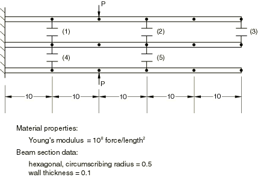

# 1.1.1 梁/间隙示例

**产品：** Abaqus/Standard

本示例的目的是验证间隙单元在简单案例中的性能。三根平行悬臂梁最初是分开的，但在五个位置存在可能的接触点，如图1.1.1-1所示。如图所示施加一对夹紧载荷。只需要考虑小位移，因此每根梁以纯弯曲方式响应。除了切换接触条件外，问题完全是线性的。

事件顺序很容易想象：

1. 施加夹紧力时，顶部和底部梁弯曲，当顶部梁的尖端击中中间梁的尖端时发生第一次接触（间隙3闭合）。在此之前，问题关于中间梁是对称的，但现在失去了这种对称性。
2. 在初次接触之后，顶部和中间梁向下弯曲，底部梁继续向上弯曲，直到在间隙5处发生接触。
3. 随着载荷继续增加，间隙2闭合。
4. 接下来，间隙3打开，因为间隙2提供给顶部梁的支撑导致顶部梁的外侧部分反转旋转方向。此时（当间隙3打开时），解再次关于中间梁对称。
5. 最后，随着夹紧载荷进一步增加，间隙1和4也闭合。从此刻起，无论施加多少载荷，接触条件都不会切换。

### 问题描述

每根悬臂使用五个B23型三次梁单元建模。最初所有间隙都是打开的，初始间隙 clearance为0.01。夹紧载荷从0单调增加到200。梁的长度、弹性模量和横截面如图1.1.1-1所示。（尺寸和力的单位是一致的，但不是物理单位。）

载荷分10个相等的增量施加，增量大小直接在静态分析中给出。

### 结果与讨论

解的结果总结在表1.1.1-1中。

### 输入文件

[beamgap.inp](../eif/beamgap.inp)

此问题的输入数据。

### 表格

**表1.1.1-1** 梁/间隙示例：解的结果汇总。
| 增量 | 夹紧 | 间隙中的力 |
| --- | --- | --- |
| 载荷P | 1 | 2 | 3 | 4 | 5 |
| 1 | 20 | 打开 | 6.5 | 0.732 | 打开 | 7.97 |
| 2 | 40 | 打开 | 18.3 | 打开 | 打开 | 18.3 |
| 3 | 60 | 打开 | 28.7 | 打开 | 打开 | 28.7 |
| 4 | 80 | 打开 | 39.1 | 打开 | 打开 | 39.1 |
| 5 | 100 | 打开 | 49.5 | 打开 | 打开 | 49.5 |
| 6 | 120 | 打开 | 59.8 | 打开 | 打开 | 59.8 |
| 7 | 140 | 10.7 | 68.6 | 打开 | 10.7 | 68.6 |
| 8 | 160 | 31.6 | 75.9 | 打开 | 31.6 | 75.9 |
| 9 | 180 | 52.5 | 83.2 | 打开 | 52.5 | 83.2 |
| 10 | 200 | 73.4 | 90.4 | 打开 | 73.4 | 90.4 |

### 图表

**图1.1.1-1** 梁/间隙示例。

