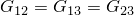
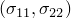
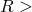
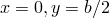
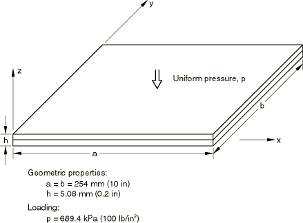
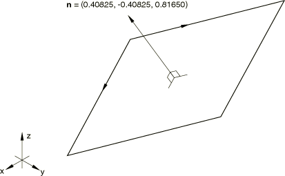
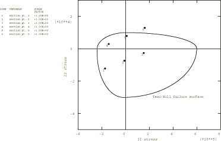

# 1.1.2 各向异性层合板分析

**产品：** Abaqus/Standard

本示例说明了在多层、层压、复合壳分析中使用用户定义坐标系的方法（["方向，" Abaqus分析用户指南第2.2.5节](../usb/usb-link.md#usb-int-corientation)）。所考虑的问题是对由两层构成且取向为45度的平板进行线性分析，承受均匀压力载荷。本示例验证了简单的层合复合板分析。Abaqus结果与Spilker等人（1976）给出的解析解进行了比较。横截面不平衡，因此响应包括膜-弯曲耦合。为平面应力正交各向异性材料定义了复合失效准则。

### 问题描述

该结构是一个双层、复合、正交各向异性的方形板，边缘简支。各层相对于板边缘取向为45度。图1.1.2-1（[图1.1.2-1](ch01s01ach02.md#sxmaniso-geom)）显示了载荷和板尺寸。每层具有以下材料属性：

|  | 276 GPa (40 106 lb/in2) |
| --- | --- |
|  | 6.9 GPa (106 lb/in2) |
|  | 3.4 GPa (0.5 106 lb/in2) |
|  | 0.25 |

这些属性定义了平面应力条件下层的线性弹性行为（["线性弹性行为，" Abaqus分析用户指南第22.2.1节](../usb/usb-link.md#usb-mat-clinearelastic)）。更一般的正交各向异性属性（对于实体连续单元）可以使用弹性刚度矩阵指定。

在本例中，板被认为是相对于全局轴系统处于任意角度，以说明局部坐标系的使用。板如图1.1.2-2（[图1.1.2-2](ch01s01ach02.md#sxmaniso-orient)）所示。

边界条件要求壳边缘的法向和横向位移被固定，但允许平行于边缘的运动。定义了一组方便的局部位移自由度，以便更容易地解释边界条件和节点变量的输出（["变换坐标系，" Abaqus分析用户指南第2.1.5节](../usb/usb-link.md#usb-int-ptransform)）。

使用局部坐标系来定义层的方向。在四个模型中，通过用户子程序[`ORIENT`](../sub/sub-link.md#sub-xsl-orient)定义了层材料轴相对于Abaqus用于壳中应力和应变分量的标准方向的旋转，同样为了说明目的，也在另外四个模型中定义。由于截面只有两层且取向不同，导致膜-弯曲耦合，因此截面不平衡。出于同样的原因，运动不呈现对称性，必须对整个壳进行建模。

定义层方向的另一种方法是使用局部坐标来定义截面的方向，然后直接在壳截面或一般壳截面定义的层数据中定义相对于截面方向的平面内旋转角度。在这种情况下，截面力和截面应变在截面方向（而不是默认的壳方向）中计算。

使用了三种类型的模型。一种是8×8网格的S9R5单元，它们是允许单元内沿线的横向剪切的壳单元。然而，Spilker等人的解析解使用的是薄壳理论，忽略了横向剪切效应。因此，在本模型中引入了人为的高横向剪切刚度。

第二种模型是16×16网格的三角形壳；提供了S3R和SC6R单元的模型。这些是通用壳单元，允许横向剪切变形。引入了人为的高横向剪切刚度。没有进行网格收敛性研究，但由于这些单元使用恒定弯曲应变近似，更细的网格应该会提高精度。

第三种模型由STRI65壳单元组成，它也基于离散Kirchhoff理论。使用8×8网格。

### 失效准则

为了演示复合失效准则的使用（["平面应力正交各向异性失效准则，" Abaqus分析用户指南第22.2.3节](../usb/usb-link.md#usb-mat-cfailuremeasures)），定义了极限应力。基于应力的失效准则定义如下：

|  (Psi) |  (Psi) |  (Psi) |  (Psi) | *S* (Psi) |  |
| --- | --- | --- | --- | --- | --- |
| 60.0 104 | 24.0 104 | 1.0 104 | 3.0 104 | 2.0 104 | 0.0 |

请求打印最大应力理论（MSTRS）和Tsai-Hill理论（TSAIH）的失效指数。所有失效准则都被写入结果文件（CFAILURE）。

### 结果与讨论

表1.1.2-1（[表1.1.2-1](ch01s01ach02.md#table-aniso-pressload)）通过将位移和弯矩值与解析解进行比较来总结结果。从表中所示的结果可以清楚地看出，所有模型都给出了良好的结果，二阶模型比一阶S3R模型提供更高的精度，正如预期的那样。

图1.1.2-3（[图1.1.2-3](ch01s01ach02.md#sxmaniso-tsaihillstress)）显示了Tsai-Hill理论的失效表面（即，对于给定的，屈服失效指数1.0的应力值），以及板中心每个截面点的应力状态。只有截面点6的应力状态在失效表面之外（1.0）。

### 输入文件

[anisoplate_s3r_orient.inp](../eif/anisoplate_s3r_orient.inp)

使用[*ORIENTATION](../key/key-link.md#usb-kws-morientation)定义材料方向的S3R单元模型。

[anisoplate_s3r_usr_orient.inp](../eif/anisoplate_s3r_usr_orient.inp)

使用用户子程序[`ORIENT`](../sub/sub-link.md#sub-xsl-orient)定义材料方向的S3R单元模型。

[anisoplate_s3r_usr_orient.f](../eif/anisoplate_s3r_usr_orient.f)

用于anisoplate_s3r_usr_orient.inp的用户子程序[`ORIENT`](../sub/sub-link.md#sub-xsl-orient)。

[anisoplate_sc6r_orient.inp](../eif/anisoplate_sc6r_orient.inp)

使用[*ORIENTATION](../key/key-link.md#usb-kws-morientation)定义材料方向的SC6R单元模型。

[anisoplate_sc6r_usr_orient.inp](../eif/anisoplate_sc6r_usr_orient.inp)

使用用户子程序[`ORIENT`](../sub/sub-link.md#sub-xsl-orient)定义材料方向的SC6R单元模型。

[anisoplate_sc6r_orient_gensect.inp](../eif/anisoplate_sc6r_orient_gensect.inp)

SC6R模型，壳截面的方向使用[*ORIENTATION](../key/key-link.md#usb-kws-morientation)定义，材料的方向使用[*SHELL GENERAL SECTION](../key/key-link.md#usb-kws-mshellgensect)的数据行上的角度定义。

[anisoplate_sc6r_usr_orient.f](../eif/anisoplate_sc6r_usr_orient.f)

用于anisoplate_sc6r_usr_orient.inp的用户子程序[`ORIENT`](../sub/sub-link.md#sub-xsl-orient)。

[anisoplate_s9r5_orient.inp](../eif/anisoplate_s9r5_orient.inp)

使用[*ORIENTATION](../key/key-link.md#usb-kws-morientation)定义材料方向的S9R5模型。

[anisoplate_s9r5_usr_orient.inp](../eif/anisoplate_s9r5_usr_orient.inp)

使用用户子程序[`ORIENT`](../sub/sub-link.md#sub-xsl-orient)定义材料方向的S9R5模型。

[anisoplate_s9r5_usr_orient.f](../eif/anisoplate_s9r5_usr_orient.f)

用于anisoplate_s9r5_usr_orient.inp的用户子程序[`ORIENT`](../sub/sub-link.md#sub-xsl-orient)。

[anisoplate_s9r5_orient_sect.inp](../eif/anisoplate_s9r5_orient_sect.inp)

S9R5模型，壳截面的方向使用[*ORIENTATION](../key/key-link.md#usb-kws-morientation)定义，材料的方向使用[*SHELL SECTION](../key/key-link.md#usb-kws-mshellsection)的数据行上的角度定义。

[anisoplate_s9r5_orient_gensect.inp](../eif/anisoplate_s9r5_orient_gensect.inp)

S9R5模型，壳截面的方向使用[*ORIENTATION](../key/key-link.md#usb-kws-morientation)定义，材料的方向使用[*SHELL GENERAL SECTION](../key/key-link.md#usb-kws-mshellgensect)的数据行上的角度定义。

[anisoplate_stri65_orient.inp](../eif/anisoplate_stri65_orient.inp)

使用[*ORIENTATION](../key/key-link.md#usb-kws-morientation)定义材料方向的STRI65单元模型。

[anisoplate_stri65_usr_orient.inp](../eif/anisoplate_stri65_usr_orient.inp)

使用用户子程序[`ORIENT`](../sub/sub-link.md#sub-xsl-orient)定义材料方向的STRI65单元模型。

[anisoplate_stri65_usr_orient.f](../eif/anisoplate_stri65_usr_orient.f)

用于anisoplate_stri65_usr_orient.inp的用户子程序[`ORIENT`](../sub/sub-link.md#sub-xsl-orient)。

### 参考

Spilker, R. L., S. Verbiese, O. Orringer, S. E. French, E. A. Witmer, and A. Harris, "Use of the Hybrid-Stress Finite-Element Model for the Static and Dynamic Analysis of Multilayer Composite Plates and Shells," Report for the Army Materials and Mechanics Research Center, Watertown, MA, 1976.

### 表格

**表1.1.2-1** 各向异性板压力载荷的结果。
| 单元 | 板中心的平面内位移 | 板中心的法向位移 | 弯矩，或 |
| --- | --- | --- | --- |
| 类型 |  | | 在板中心 |
|  | (mm) | (mm) | (N-mm) |
| 解析解 | 0.3762 | 23.25 | 42.05 |
| S3R | 0.3724 | 22.86 | 40.54 |
| SC6R | 0.3724 | 22.84 | 40.54 |
| STRI65 | 0.3760 | 23.24 | 42.28 |
| S9R5 | 0.3752 | 23.25 | 42.23 |

### 图表

**图1.1.2-1** 平板的几何形状和载荷。

**图1.1.2-2** 板在空间中的取向。

**图1.1.2-3** 板中心每个截面点的应力状态，与Tsai-Hill失效表面一起绘制。注意截面点6已失效。

