# 1.1.3 圆柱弯曲中的复合壳

**产品：** Abaqus/Standard  Abaqus/Explicit

本示例提供了Abaqus中多层复合壳横向剪切应力计算的验证，并展示了平面应力正交各向异性失效准则的使用。还包括了Abaqus/Standard中复合实体的横向剪切应力的讨论。问题包括承受正弦分布载荷的两层或三层板，如Pagano（1969）所述。板厚度方向的横向剪切和轴向应力与Pagano（1969）的两个现有解析解进行了比较。第一个解来自经典层合板理论（CPT），第二个是线性弹性理论的精确解。

### 问题描述

模型示意图如图1.1.3-1（[图1.1.3-1](ch01s01ach03.md#sxmcompshells-plategeom)）所示。该结构是由等厚度正交各向异性层组成的复合板。两端简支，沿边缘约束以在y方向施加平面应变条件。每一层建模为具有以下属性的纤维/基体复合：

| 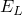 | 172.4 GPa (25 106 lb/in2) |
| --- | --- |
|  | 6.90 GPa (1.0 106 lb/in2) |
|  | 3.45 GPa (0.5 106 lb/in2) |
|  | 1.38 GPa (0.2 106 lb/in2) |
| 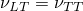 | 0.25 |

其中L表示平行于纤维的方向，T表示横向方向。在Abaqus/Standard中，两种方法用于指定常规壳单元模型的铺层定义。首先，定义复合壳截面以指定每层的厚度、积分点数、材料名称和取向。其次，定义复合通用壳截面以指定每层的厚度、材料名称以及相对于截面方向的取向角度（在本例中为默认的壳方向）。在Abaqus/Explicit中仅使用前一种方法。材料属性使用面内应力正交各向异性弹性定义指定。每层中纤维的取向由面内旋转角定义，相对于局部壳方向或相对于为通用壳截面给出的取向定义测量。

除了上述方法外，还使用第三种堆叠连续壳单元的方法来指定复合模型的铺层定义。这种方法可以有效地研究局部行为，因为连续壳单元可以很好地处理面内尺寸与厚度尺寸之间的高纵横比。

Abaqus/Standard中连续（实体）单元模型的铺层定义使用复合实体截面定义指定。为每一层指定厚度、材料名称和取向定义。

分布载荷在空间上呈正弦分布，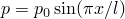，施加在复合板的顶部。在Abaqus/Standard中，载荷使用用户子程序[`DLOAD`](../sub/sub-link.md#sub-xsl-dload)在静态线性分析步中施加。此外，还包含了一个Abaqus/Standard输入文件，演示了使用DCOUP3D单元施加此分布载荷的方法。在Abaqus/Explicit中，载荷在时间0时瞬时施加。

在本例中分析了两个复合板。第一个是两층板，底层和顶层纤维分别平行和垂直于x轴。第二个板有三层等厚度，外层纤维平行于x轴，而中间层纤维垂直于x轴。在Abaqus/Standard分析中，板的跨厚比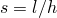从4变化到30；在Abaqus/Explicit中，此比率在整个分析中为4。

在Abaqus/Standard中使用1×10网格的二阶S8R壳单元对板进行建模。在Abaqus/Explicit中使用2×10网格的一阶S4R壳单元对板进行建模。S4R、S8R和S8RT壳单元非常适合建模厚复合壳，因为它们考虑了横向剪切柔性。对于使用壳截面的模型，每层厚度方向指定了五个积分点。这提供了足够的数据来描述每层厚度方向的应力分布。对于使用通用壳截面的模型，输出只有三个点可用。（由于分析是线弹性的，三个点足以确定厚度方向的所有场。）还使用1×10网格的二阶C3D20R复合实体单元对跨厚比最小的板进行了Abaqus/Standard分析。

为了说明连续壳单元的堆叠能力，为跨厚比为4的两层和三层板提供了几种网格。两层板使用2×10网格的SC8R单元建模，每个单元代表90/0复合板的一层。三层板的一种模型使用1×10网格的SC8R单元，通过复合截面定义使用单个单元通过厚度。另一种模型使用3×10网格的SC8R单元，每个单元代表0/90/0复合板的一层。还提供了通过厚度方向具有6、12和24个单元的三层板的额外模型。在这些模型中，每个复合层分别使用2、4和8个单元通过厚度。

还包括了使用SC8R单元的额外输入文件，以说明独立于单元节点连通性定义堆叠和厚度方向的方法。

### 失效准则

平面应力正交各向异性失效准则在["平面应力正交各向异性失效准则，" Abaqus分析用户指南第22.2.3节](../usb/usb-link.md#usb-mat-cfailuremeasures)中定义。为了演示它们的使用，令极限应力和极限应变如下：

| 应力值： |  | 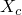 |  |  | *S* |
| --- | --- | --- | --- | --- | --- |
| (GPa) | 2.07 104 | 8.28 105 | 3.45 106 | 1.03 105 | 6.89 106 |
| (lb/in2) | 30.0 | 12.0 | 0.5 | 1.5 | 1.0 |
| 应变值： | 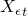 | 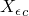 | 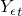 | 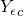 | 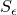 |
|  | 17. 102 | 7. 102 | 5. 102 | 1.3 102 | 11. 102 |

Tsai-Wu系数的缩放因子为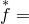0.0。选择这些值使得在给定载荷下两层情况下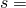4时发生基于应力的失效准则失效。

### 结果与讨论

以下各节讨论每个分析的结果。

#### Abaqus/Standard结果

图1.1.3-2（[图1.1.3-2](ch01s01ach03.md#sxmcompshells-maxdeflect)）以归一化形式显示了两层和三层板的最大z位移作为跨厚比的函数：

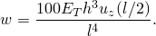

如图所示，对于广泛的*s*值，两层和三层板的有限元位移与弹性理论的预测非常吻合。CPT结果在低*s*值时较硬，因为忽略了剪切柔性。

对于4，图1.1.3-3（[图1.1.3-3](ch01s01ach03.md#sxmcompshells-trans2)）和图1.1.3-4（[图1.1.3-4](ch01s01ach03.md#sxmcompshells-axial2)）显示了归一化的两层板厚度方向的横向剪切应力（TSHR13）和轴向应力（S11）分布：

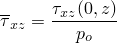

和

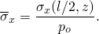

图1.1.3-5（[图1.1.3-5](ch01s01ach03.md#sxmcompshells-trans3)）和图1.1.3-6（[图1.1.3-6](ch01s01ach03.md#sxmcompshells-axial3)）显示了三层板的相应结果。可以看到，壳单元结果比弹性理论更接近CPT的预测，因为用于S8R和S4R等单元的一阶剪切柔性理论假设了厚度方向线性应力变化。

图1.1.3-7（[图1.1.3-7](ch01s01ach03.md#sxmcompshells-3layerssavg4)）将三层板横向剪切分布的弹性解与使用输出变量SSAVG4的近似解进行了比较。SSAVG4是局部1方向的平均横向剪切应力。由于SSAVG4在单元上为常数，通常需要网格细化（在本例中通过厚度24个连续壳单元）才能捕获板厚度方向剪切应力的变化。

输出变量CTSHR13和CTSHR23为估算堆叠连续壳中的剪切应力提供了比SSAVG4和SSAV5更经济的选择。图1.1.3-8（[图1.1.3-8](ch01s01ach03.md#sxmcompshells-3layerstack)）和图1.1.3-9（[图1.1.3-9](ch01s01ach03.md#sxmcompshells-2layerstack)）分别显示了三层和两层板的横向剪切分布的弹性解与使用3×10和2×10连续壳单元网格的输出变量CTSHR13的解之间非常好的一致性。使用CTSHR13计算的剪切应力在连续壳单元界面处是连续的。此外，虽然使用SSAVG4和CTSHR13（如图1.1.3-7和图1.1.3-8所示）估算的横向剪切分布都很好，但使用CTSHR13只需要通过厚度3个连续壳单元的网格，而SSAVG4需要24个单元。

图1.1.3-10（[图1.1.3-10](ch01s01ach03.md#sxmcompshells-shelvsol)）比较了实体单元模型与壳单元结果获得的横向剪切应力分布。图中显示，实体单元预测的横向剪切应力在结构自由表面处不为零。它还显示应力在层界面处不连续。原因是，在复合实体单元中，横向剪切应力直接从位移场获得，而壳单元中横向剪切应力从平衡计算获得。如果增加截面厚度方向离散中使用的实体单元数量，这些缺陷会减少。尽管横向剪切应力不准确，但位移场和层平面内的应力分量（此处未显示）与解析解的一致性要好得多。事实上，这些结果比使用S8R单元获得的结果更好。复合实体单元未用于分析较薄的板，因为在那种情况下实体单元相对于板单元没有任何优势。

对于10，图1.1.3-11（[图1.1.3-11](ch01s01ach03.md#sxmcompshells-trans310)）和图1.1.3-12（[图1.1.3-12](ch01s01ach03.md#sxmcompshells-axial310)）显示有限元结果的横向剪切和轴向应力分布以及CPT预测与弹性理论一致。随着跨厚比的增加（当板变得比跨度更薄时），应力分布变得更加准确。

在图1.1.3-13（[图1.1.3-13](ch01s01ach03.md#sxmcompshells-max2)）和图1.1.3-14（[图1.1.3-14](ch01s01ach03.md#sxmcompshells-max3)）中，最大应力理论和Tsai-Wu理论失效指数作为从 midsurface 归一化距离的函数绘制，分别用于两层和三层情况。指数在板中心为S8R单元计算，4。失效指数大于或等于1.0表示失效。失效指数在层边界处发生不连续跳跃，这是由于材料取向的结果。应变水平远低于失效所需的值，因此未绘制基于应变的失效指数。

#### Abaqus/Explicit结果

显式动态分析运行了足够长的时间以达到准静态状态，即板处于稳态振动。由于施加了步进载荷，静态应力解可以作为其振动振幅的一半获得。

图1.1.3-15（[图1.1.3-15](ch01s01ach03.md#exxcompshells-trans-2layer)）和图1.1.3-16（[图1.1.3-16](ch01s01ach03.md#exxcompshells-axial-2layer)）显示了两层S4R模型厚度方向的横向剪切应力（TSHR13）和轴向应力（S11）分布，归一化为：

和

与经典板理论（CPT）和线性弹性理论进行比较。

图1.1.3-17（[图1.1.3-17](ch01s01ach03.md#exxcompshells-trans-3layer)）和图1.1.3-18（[图1.1.3-18](ch01s01ach03.md#exxcompshells-axial-3layer)）显示了三层板的相应结果。在图1.1.3-19（[图1.1.3-19](ch01s01ach03.md#exxcompshells-fail-2layer)）和图1.1.3-20（[图1.1.3-20](ch01s01ach03.md#exxcompshells-fail-3layer)）中，最大应力理论和Tsai-Wu理论失效指数作为从 midsurface 归一化距离的函数绘制，分别用于两层和三层情况。指数在板中心计算。失效指数大于或等于1.0表示失效。失效指数在层边界处由于材料取向而发生不连续跳跃。应变水平远低于失效所需的值，因此未绘制基于应变的失效指数。

### 输入文件

##### **Abaqus/Standard输入文件**

[compositeshells_s8r.inp](../eif/compositeshells_s8r.inp)

使用S8R单元的三层板，4。

[compositeshells_s8r.f](../eif/compositeshells_s8r.f)

定义非均匀分布载荷的用户子程序，用于compositeshells_s8r.inp。

[compositeshells_s8r_gensect.inp](../eif/compositeshells_s8r_gensect.inp)

使用S8R单元和[*SHELL GENERAL SECTION](../key/key-link.md#usb-kws-mshellgensect)的三层板，4。

[compositeshells_s8r_gensect.f](../eif/compositeshells_s8r_gensect.f)

用于compositeshells_s8r_gensect.inp的用户子程序[`DLOAD`](../sub/sub-link.md#sub-xsl-dload)。

[compositeshells_s4.inp](../eif/compositeshells_s4.inp)

S4单元模型。

[compositeshells_s4.f](../eif/compositeshells_s4.f)

用于compositeshells_s4.inp的用户子程序[`DLOAD`](../sub/sub-link.md#sub-xsl-dload)。

[compositeshells_s4_gensect.inp](../eif/compositeshells_s4_gensect.inp)

带有[*SHELL GENERAL SECTION](../key/key-link.md#usb-kws-mshellgensect)的S4单元模型。

[compositeshells_s4_gensect.f](../eif/compositeshells_s4_gensect.f)

用于compositeshells_s4_gensect.inp的用户子程序[`DLOAD`](../sub/sub-link.md#sub-xsl-dload)。

[compositeshells_s4_dcoup3d.inp](../eif/compositeshells_s4_dcoup3d.inp)

使用DCOUP3D单元加载的S4单元模型。

[compositeshells_s4r.inp](../eif/compositeshells_s4r.inp)

S4R单元模型。

[compositeshells_s4r.f](../eif/compositeshells_s4r.f)

用于compositeshells_s4r.inp的用户子程序[`DLOAD`](../sub/sub-link.md#sub-xsl-dload)。

[compositeshells_s4r_gensect.inp](../eif/compositeshells_s4r_gensect.inp)

带有[*SHELL GENERAL SECTION](../key/key-link.md#usb-kws-mshellgensect)的S4R单元模型。

[compositeshells_s4r_gensect.f](../eif/compositeshells_s4r_gensect.f)

用于compositeshells_s4r_gensect.inp的用户子程序[`DLOAD`](../sub/sub-link.md#sub-xsl-dload)。

[compositeshells_c3d20r.inp](../eif/compositeshells_c3d20r.inp)

C3D20R复合实体单元模型。

[compositeshells_c3d20r.f](../eif/compositeshells_c3d20r.f)

用于compositeshells_c3d20r.inp的用户子程序[`DLOAD`](../sub/sub-link.md#sub-xsl-dload)。

[compositeshells_sc8r_stackdir_1.inp](../eif/compositeshells_sc8r_stackdir_1.inp)

使用STACK DIRECTION=1的SC8R模型。

[compositeshells_sc8r_stackdir_2.inp](../eif/compositeshells_sc8r_stackdir_2.inp)

使用STACK DIRECTION=2的SC8R模型。

[compositeshells_sc8r_stackdir_3.inp](../eif/compositeshells_sc8r_stackdir_3.inp)

使用STACK DIRECTION=3的SC8R模型。

[compositeshells_sc8r_gensect.inp](../eif/compositeshells_sc8r_gensect.inp)

使用[*SHELL GENERAL SECTION](../key/key-link.md#usb-kws-mshellgensect)的SC8R模型。

[compshell2_std_sc8r_stack_2.inp](../eif/compshell2_std_sc8r_stack_2.inp)

两层板，SC8R单元，通过厚度堆叠两个单元。

[compshell3_std_sc8r_stack_1.inp](../eif/compshell3_std_sc8r_stack_1.inp)

三层板，SC8R单元，单个单元通过厚度。

[compshell3_std_sc8r_stack_3.inp](../eif/compshell3_std_sc8r_stack_3.inp)

三层板，SC8R单元，三个单元通过厚度堆叠。

[compshell3gs_std_sc8r_stack_3.inp](../eif/compshell3gs_std_sc8r_stack_3.inp)

三层板，SC8R单元，使用通用壳截面定义通过厚度堆叠三个单元。

[compshell3_std_sc8r_stack_6.inp](../eif/compshell3_std_sc8r_stack_6.inp)

三层板，SC8R单元，六个单元通过厚度堆叠。

[compshell3_std_sc8r_stack_12.inp](../eif/compshell3_std_sc8r_stack_12.inp)

三层板，SC8R单元，12个单元通过厚度堆叠。

[compshell3_std_sc8r_stack_24.inp](../eif/compshell3_std_sc8r_stack_24.inp)

三层板，SC8R单元，24个单元通过厚度堆叠。

[compositeshells_sc8r.f](../eif/compositeshells_sc8r.f)

用于SC8R模型的用户子程序[`DLOAD`](../sub/sub-link.md#sub-xsl-dload)。

##### **Abaqus/Explicit输入文件**

[compshell3_1.inp](../eif/compshell3_1.inp)

使用S4R单元建模的三层板。

[compshell3_1_sc8r.inp](../eif/compshell3_1_sc8r.inp)

使用SC8R单元建模的三层板。

[compshell3_1_sc8r_stackdir_1.inp](../eif/compshell3_1_sc8r_stackdir_1.inp)

使用S4R单元和使用STACK DIRECTION=1的SC8R单元建模的三层板。

[compshell3_1_sc8r_stackdir_2.inp](../eif/compshell3_1_sc8r_stackdir_2.inp)

使用S4R单元和使用STACK DIRECTION=2的SC8R单元建模的三层板。

[compshell3_1_sc8r_stackdir_3.inp](../eif/compshell3_1_sc8r_stackdir_3.inp)

使用S4R单元和使用STACK DIRECTION=3的SC8R单元建模的三层板。

[compshell3_2.inp](../eif/compshell3_2.inp)

具有不同厚度并使用S4R单元建模的三层板。

[compshell2_1.inp](../eif/compshell2_1.inp)

使用S4R单元建模的两层板。

[compshell2_2.inp](../eif/compshell2_2.inp)

使用S4R单元建模的两层板。

[compshell2_1_sc8r.inp](../eif/compshell2_1_sc8r.inp)

使用SC8R单元建模的两层板。

### 参考

Pagano, N. J., "Exact Solutions for Composite Laminates in Cylindrical Bending," Journal of Composite Materials, vol. 3, pp. 398–411, 1969.

### 图表

**图1.1.3-1** 承受分布载荷的复合板。

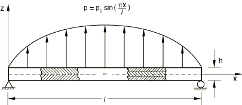

**图1.1.3-2** 两层和三层板在各种跨厚比下的最大挠度；Abaqus/Standard分析。

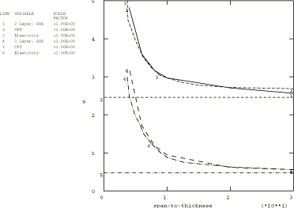

**图1.1.3-3** 两层板厚度方向的横向剪切应力分布（4）；Abaqus/Standard分析。

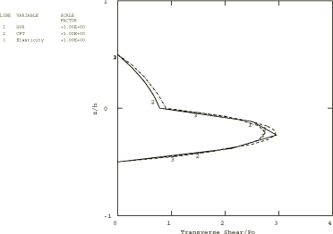

**图1.1.3-4** 两层板厚度方向的轴向应力分布（4）；Abaqus/Standard分析。

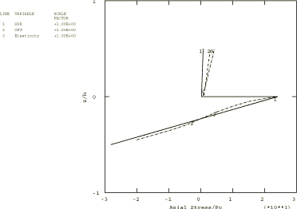

**图1.1.3-5** 三层板厚度方向的横向剪切应力分布（4）；Abaqus/Standard分析。

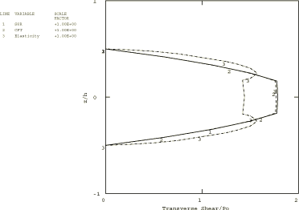

**图1.1.3-6** 三层板厚度方向的轴向应力分布（4）；Abaqus/Standard分析。

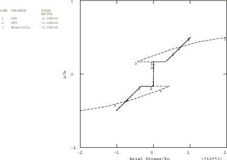

**图1.1.3-7** 三层板横向剪切应力分布的弹性解与使用24个SC8R单元通过厚度堆叠的输出变量SSAVG4的比较；Abaqus/Standard分析。

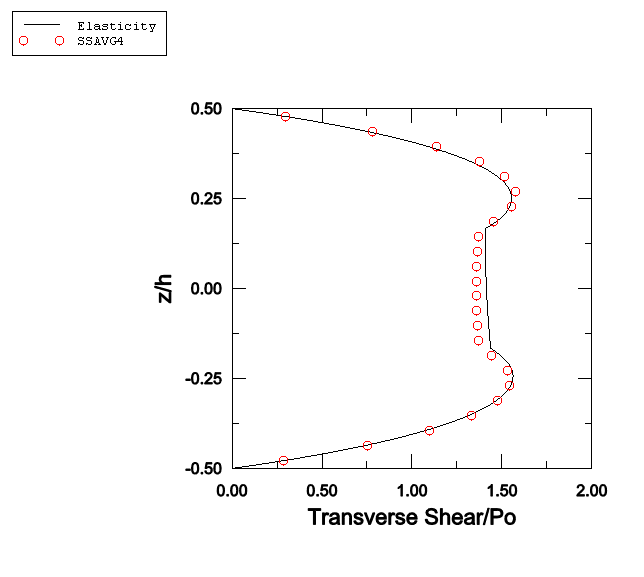

**图1.1.3-8** 三层板横向剪切应力分布的弹性解与使用3个SC8R单元通过厚度堆叠的输出变量CTSHR13的比较；Abaqus/Standard分析。

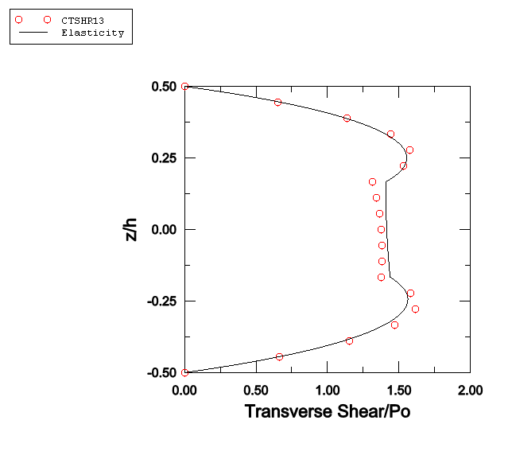

**图1.1.3-9** 两层板横向剪切应力分布的弹性解与使用2个SC8R单元通过厚度堆叠的输出变量CTSHR13的比较；Abaqus/Standard分析。

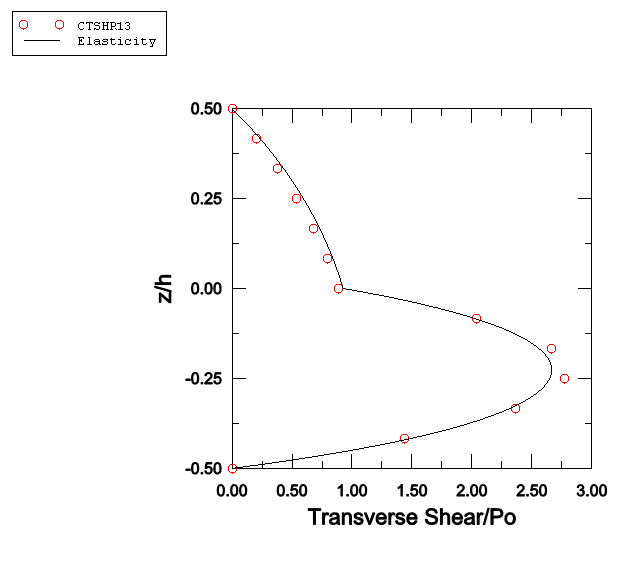

**图1.1.3-10** 三层板厚度方向的横向剪切应力分布（4）：壳与实体单元；Abaqus/Standard分析。

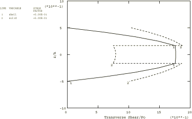

**图1.1.3-11** 三层板厚度方向的横向剪切应力分布（10）；Abaqus/Standard分析。

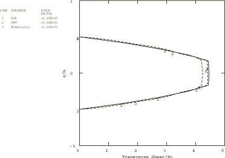

**图1.1.3-12** 三层板厚度方向的轴向应力分布（10）；Abaqus/Standard分析。

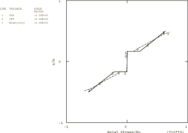

**图1.1.3-13** 最大应力理论和Tsai-Wu理论（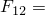0.0）失效指数作为从midsurface归一化距离的函数。两层板，4；Abaqus/Standard分析。

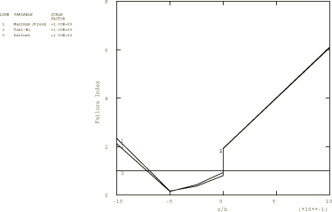

**图1.1.3-14** 最大应力理论和Tsai-Wu理论（0.0）失效指数作为从midsurface归一化距离的函数。三层板，4；Abaqus/Standard分析。

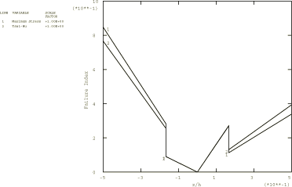

**图1.1.3-15** 两层板厚度方向的横向剪切应力分布；Abaqus/Explicit分析。

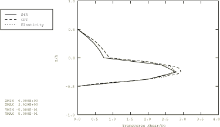

**图1.1.3-16** 两层板厚度方向的轴向应力分布；Abaqus/Explicit分析。

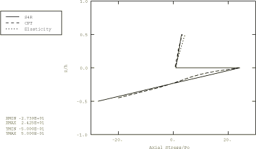

**图1.1.3-17** 三层板厚度方向的横向剪切应力分布；Abaqus/Explicit分析。

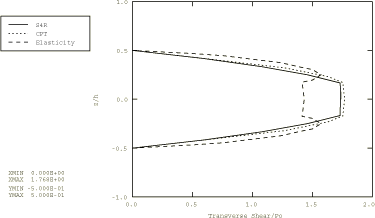

**图1.1.3-18** 三层板厚度方向的轴向应力分布；Abaqus/Explicit分析。

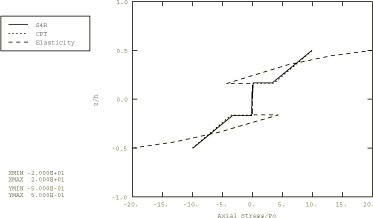

**图1.1.3-19** 最大应力理论和Tsai-Wu理论失效指数作为从midsurface归一化距离的函数。两层板；Abaqus/Explicit分析。

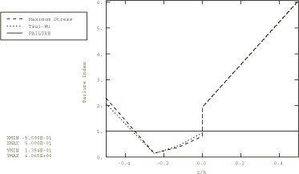

**图1.1.3-20** 最大应力理论和Tsai-Wu理论失效指数作为从midsurface归一化距离的函数。三层板；Abaqus/Explicit分析。

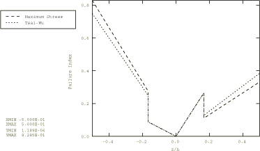

