# 1.1.4 承受内压的厚复合圆柱体

**产品：** Abaqus/Standard

本示例提供了Abaqus中复合实体（连续）单元的验证。问题包括承受内压的无限长复合圆柱体，在平面应变条件下。将解与Lekhnitskii（1968）的解析解以及每层通过厚度用一个单元离散的有限元模型进行比较。此问题的有限元分析也出现在Karan和Sorem（1990）中。

大多数复合材料用作结构部件。壳单元通常被推荐用于建模此类部件。复合壳单元弯曲的示例可在["各向异性层合板分析，" 第1.1.2节](ch01s01ach02.md)；["圆柱弯曲中的复合壳，" 第1.1.3节](ch01s01ach03.md)；和["螺栓管道法兰连接的轴对称分析，" Abaqus示例问题指南第1.1.1节](../exa/exa-link.md#exa-sta-boltpipeflange)中找到。然而，在某些情况下，分析人员无法避免使用连续单元来建模结构部件。在这些问题中，仔细选择单元类型对于获得准确解通常是必要的。连续单元用于弯曲问题分析的性能在["弯曲问题线性分析中连续单元和壳单元的性能，" 第2.3.5节](ch02s03ach151.md)中讨论。该讨论仅考虑均质材料组成的结构的行为，但相同的考虑也适用于使用连续单元建模复合结构。在其他情况下，复合物厚度方向的变形可能是非线性的——例如，当存在材料非线性时——可能需要通过厚度使用几个单元进行准确分析。这样的离散只能通过连续单元完成。其他可能首选连续单元的问题包括横向剪切效应占主导地位的厚复合物、不能忽略法向应变的情况，以及需要准确的层间应力时；即，在复杂载荷或几何形状的局部区域。在这些问题中，实体单元获得的解通常比壳单元获得的解更准确。例外是厚度方向横向剪切应力的分布。实体单元中的横向剪切应力通常不会在结构的自由表面处消失，并且在层界面处通常不连续。实体和壳单元的横向剪切应力计算的讨论可在["圆柱弯曲中的复合壳，" 第1.1.3节](ch01s01ach03.md)中找到。

在这个例子中，法向应变不能被忽略，因为由于内压导致的位移场在圆柱体厚度方向是非线性的。需要至少两个二次单元通过厚度才能获得准确的结果。因此，本示例演示了复合实体单元的使用，而壳单元分析是不够的。

### 问题描述

圆柱体配置和材料细节如图1.1.4-1（[图1.1.4-1](ch01s01ach04.md#sxmthickcyl-geom)）所示。内半径，，为60 mm，外半径，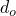，为140 mm。该结构由八层等厚度的正交各向异性层组成，堆叠序列为[0，90]4。薄片沿径向堆叠，材料纤维沿周向和轴向取向。换句话说，纤维围绕径向方向旋转0或90度，其中0度旋转意味着主纤维沿周向取向。为此，我们定义了一个局部坐标系，其中1、2和3方向分别指径向、周向和轴向。主纤维沿周向取向的纤维复合物在该坐标系中具有以下正交各向异性弹性属性：

| 10.0 GPa， | 250.0 GPa， | 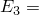10.0 GPa， |
| --- | --- | --- |
| 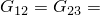5.0 GPa， |  | 2.0 GPa， |
| 0.01， |  | 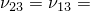0.25。 |

我们还定义了主纤维沿该局部坐标系轴向取向的复合物。认识到泊松比，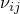，必须遵守关系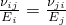对于具有工程常数的正交各向异性材料，旋转后的材料属性为

| 10.0 GPa， | 10.0 GPa， | 250.0 GPa， |
| --- | --- | --- |
| 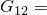2.0 GPa， |  | 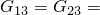5.0 GPa， |
| 0.25， |  | 0.01。 |

每组弹性材料属性通过给出工程常数来指定。每个材料的名称在复合实体截面定义中被引用。此材料定义确保不同层的输出分量在相同的坐标系中提供。

Abaqus中还有另一种方法可用于定义复合材料的层取向。在这种方法中，只使用一个材料属性定义，但为每一层给出单独的取向定义。此层取向与材料名称一起在实体截面定义中指定。取向可以通过引用局部坐标系或指定相对于截面取向定义的角度来指定。截面取向在实体截面定义中指定。由于在这种情况下每一层的材料属性在不同局部坐标系中指定，输出变量在不同坐标系中提供。提供了说明两种方法的输入文件。

除了每层的材料描述外，还定义了堆叠方向、每层的厚度以及通过层厚度所需的截面点数，以完成元素矩阵的数值积分，从而完成复合布置的描述。在每一层中指定了三个截面积分点。由于分析是线弹性的，这足以描述通过截面的应力分布。层可以沿三个等参元坐标方向中的任何一个堆叠，这反过来又由元素数据行上节点的给出顺序定义。在本例中，元素连通性被指定为第一个等参方向沿径向方向。

### 几何形状和模型

由于对称性，只需要分析物体的一个段。为了简化边界条件的应用，选择了一个四分之一段，在周向用四个单元和在轴向用一个单元进行离散。在径向方向使用一、二、四或八个单元。图1.1.4-2（[图1.1.4-2](ch01s01ach04.md#sxmthickcyl-felem)）显示了径向方向使用两个单元的有限元离散。使用非均匀网格，内侧单元有两个材料层，外侧单元有六个层，以捕获通过截面的径向位移变化。

该模型在轴向被约束以施加平面应变条件。

载荷是在线性扰动步骤中施加的恒定内压， 50 MPa。

### 结果与讨论

这里报告的所有位移和应力都使用以下方法相对于压力归一化：

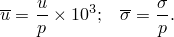

预测的圆柱体内外表面的位移和应力与解析结果在表1.1.4-1（[表1.1.4-1](ch01s01ach04.md#table-thickcyl-raddisp)）和表1.1.4-2（[表1.1.4-2](ch01s01ach04.md#table-thickcyl-circstrss)）中进行了比较。结果显示了不同单元类型和不同网格密度的情况。表显示，径向方向用一个实体单元（线性或二次）离散的模型不足以模拟位移场的非线性变化。通过厚度使用两个单元可获得实质性改进。表还显示，有限元结果收敛到解析解的速度随网格细化而变慢。通过厚度使用两个非均匀二次单元的网格可预测非常准确的结果，圆柱体外表面的周向应力除外。然而，外表面应力比内表面应力小两个数量级以上，因此不是解准确性的良好度量。

通过厚度的位移和应力场如图1.1.4-3（[图1.1.4-3](ch01s01ach04.md#sxmthickcyl-dispvr)）到图1.1.4-5（[图1.1.4-5](ch01s01ach04.md#sxmthickcyl-radstressvr)）所示。这些图将归一化径向位移、周向应力和径向应力与圆柱体在径向方向用两个C3D20R单元（不同尺寸）离散的情况下的解析解进行了比较。图显示径向位移和周向应力与解析解非常吻合。径向应力，特别是在圆柱体内附近，不那么准确。例如，内表面的解析解是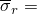1.0（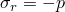）。该网格的有限元结果是 0.741（25.9%误差）。必须从网格细化的角度看待这个结果；在内表面处通过厚度使用四个单元不会改善径向应力，只有当使用八个单元通过厚度时才能改善到 0.926（7.4%误差）（四单元和八单元网格的结果未在图中显示）。从这些图中可以清楚地看出，为什么二次单元和细化网格对于准确分析是必需的。

### 输入文件

[thickcompcyl_2el_nonuniform.inp](../eif/thickcompcyl_2el_nonuniform.inp)

径向方向用两个非均匀单元离散的模型。

[thickcompcyl_1el_sectorient.inp](../eif/thickcompcyl_1el_sectorient.inp)

其中层取向相对于截面取向指定了旋转。该模型在径向方向用一个单元离散。

[thickcompcyl_4el_orient.inp](../eif/thickcompcyl_4el_orient.inp)

其中层取向使用取向参考指定。该模型在径向方向用四个单元离散。

[thickcompcyl_8el.inp](../eif/thickcompcyl_8el.inp)

其中每一层通过厚度用一个均质单元离散。

### 参考

Karan, S. S., and R. M. Sorem, "Curved Shell Elements Based on Hierarchical p-Approximation in the Thickness Direction for Linear Static Analysis of Laminated Composites," International Journal for Numerical Methods in Engineering, vol. 29, pp. 1391–1420, 1990.

Lekhnitskii, S. G., Anisotropic Plates, translated from second Russian edition by S. W. Tsai and T. Cheron, Gordon and Breach, New York, 1968.

### 表格

**表1.1.4-1** 圆柱体内外部的归一化径向位移。解析解：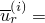 1.4410；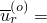 0.1476。
| 单元类型 | 径向方向的单元数 | 内部 | 外部 |
| --- | --- | --- | --- |
|  | % 误差 |  | % 误差 |
| C3D8 | 1 | 1.1825 | 17.9 | 0.2407 | 263.0 |
| C3DI | 1 | 1.2227 | 15.2 | 0.1004 | 32.0 |
| C3DI(1) | 2 | 1.4231 | 12.4 | 0.1876 | 27.1 |
| C3DI(2) | 2 | 1.5526 | 7.74 | 0.1828 | 23.8 |
| C3D20R | 1 | 1.2581 | 12.7 | 0.1646 | 11.5 |
| C3D20R(1) | 2 | 1.3609 | 5.56 | 0.1448 | 1.90 |
| C3D20R(2) | 2 | 1.3869 | 3.75 | 0.1481 | 0.34 |
| C3D20R | 4 | 1.3922 | 3.39 | 0.1447 | 1.95 |
| C3D20R | 8 | 1.4161 | 1.73 | 0.1496 | 1.35 |
| 1 - 均匀网格 |
| 2 - 非均匀网格 |

**表1.1.4-2** 圆柱体内外部的归一化周向应力。解析解：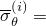 5.7060；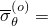 0.0103。
| 单元类型 | 径向方向的单元数 | 内部 | 外部 |
| --- | --- | --- | --- |
| 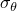 | % 误差 |  | % 误差 |
| C3D8 | 1 | 3.608 | 36.8 | 0.0307 | 397.0 |
| C3DI | 1 | 3.912 | 31.4 | 0.0362 | 251.1 |
| C3DI(1) | 2 | 4.686 | 17.9 | 0.004 | 60.8 |
| C3DI(2) | 2 | 4.838 | 15.2 | 0.0081 | 179.1 |
| C3D20R | 1 | 5.132 | 10.1 | 0.0414 | 300.0 |
| C3D20R(1) | 2 | 5.496 | 3.68 | 0.0134 | 30.0 |
| C3D20R(2) | 2 | 5.548 | 2.77 | 0.0192 | 85.6 |
| C3D20R | 4 | 5.574 | 2.31 | 0.0119 | 15.1 |
| C3D20R | 8 | 5.606 | 1.75 | 0.0107 | 3.90 |
| 1 - 均匀网格 |
| 2 - 非均匀网格 |

### 图表

**图1.1.4-1** 层合圆柱体的几何形状。

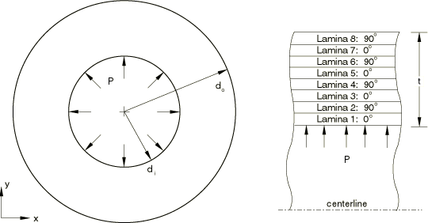

**图1.1.4-2** 径向方向用两个单元的有限元离散。

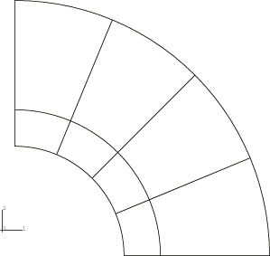

**图1.1.4-3** 径向位移与圆柱体半径的关系。

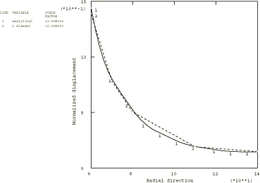

**图1.1.4-4** 周向应力与圆柱体半径的关系。

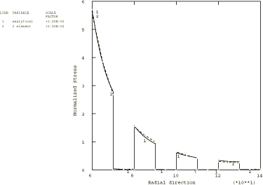

**图1.1.4-5** 径向应力与圆柱体半径的关系。

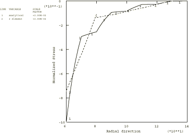

