# 1.1.5 直管段和弯管段的均匀坍塌

**产品：** Abaqus/Standard

管道段在纯弯曲条件下的失效是一个有趣的非线性结构响应问题。对于直的、薄壁的金属圆柱体，失效通常发生在圆柱体buckling成小菱形波模式，与圆柱体在轴向压缩下失效的方式相同（参见["圆柱形壳在均匀轴向压力下的屈曲，" 第1.2.3节](ch01s02ach16.md)）。使用峰值轴向应力作为屈曲准则，对任何轴向载荷和弯矩组合采用相同的临界值，是一种有用的设计方法——参见Timoshenko和Gere（1961）第11章。然而，对于较厚壁的情况，当材料模量较低时（如橡胶或在坍塌前表现出显著屈服的金属管），可以观察到圆柱体的均匀坍塌，即管道逐渐从圆形变为椭圆形，从而失去其弯曲刚度。最初直的管道中的一维变形模式最初由Brazier（1927）研究。最初弯曲的管道在弯矩下的坍塌是一个相当不同的情况，因为管道的响应将取决于弯矩是导致面内还是面外响应。在本例中，我们只考虑面内载荷。对于两种情况，所研究的变形模式是截面的均匀坍塌——即，假设所有横截面以相同方式变形。由于使用了壳理论，这实际上将问题简化为一个维度，从而使它们成为结构坍塌研究的吸引人的入门研究。应该强调的是，对于实际结构，菱形模式屈曲的可能性仍然存在，应该在将这些示例中获得的结果用于设计之前（通过使用适当详细的壳模型）进行调查——参见["圆柱形壳在均匀轴向压力下的屈曲，" 第1.2.3节](ch01s02ach16.md)。["面内弯曲和内压下薄壁弯头的弹塑性坍塌，" Abaqus示例问题指南第1.1.2节](../exa/exa-link.md#exa-sta-elbowcollapse)研究了相同材料和尺寸的弯曲和直管道段的坍塌，但组合成一个实际的90度管道弯头及相邻的直管道，从而描述了一个更现实的情况。

预期的一维横截面椭圆形模式允许采用非常简单的建模。ELBOW31B型单元是具有均匀变形横截面（使用傅里叶插值环绕管道）的管道，因此非常适合这些情况：单个单元就足够了。作为比较，这些问题也用单个轴向段的通用8节点壳单元（类型S8R5）建模。这种情况稍微复杂一些，因为所建模段的端部必须被约束以允许椭圆形但不允许翘曲。这种条件可以使用基于表面的运动学和分布耦合约束来实现，如本示例问题所示。

### 问题描述

本研究所选的管道是相对薄壁、大半径的管道，如图1.1.5-1（[图1.1.5-1](ch01s01ach05.md#sxmunicollapse-brazier)）和图1.1.5-2（[图1.1.5-2](ch01s01ach05.md#sxmunicollapse-curved)）所示。管道的尺寸来自更复杂的弯头坍塌研究。考虑了一单位长度的管道。材料相同，是Sobel和Newman（1979）报告的室温下304型不锈钢试件的测量响应。应力-应变曲线如图1.1.5-3（[图1.1.5-3](ch01s01ach05.md#sxmunicollapse-behav)）所示。还获得了仅弹性响应的结果，这是Brazier对最初直管道坍塌讨论的情况。

### 载荷

管道上的载荷有两个组成部分——"恒载"，由内压（具有闭合端条件）组成，以及"活载"，由纯弯曲组成。压力在初始步骤中施加到模型上，然后在弯矩增加时保持恒定。使用了四个不同的压力值，从无压力到5.17 MPa（750 lb/in2）。这个范围似乎涵盖了所有实际值；最高压力给出约为97 MPa（14000 lb/in2）的膜环向应力。对于壳模型，由闭合端条件引起的等效端力作为跟随力施加，因为它随端平面的运动而旋转。

### 模型

在所有涉及弹塑性响应的情况下，通过管道壁使用了七个积分点。这通常足以提供通过截面的屈服进展的准确建模，在这些情况下，预期基本上是单调应变。在涉及显著应变反转的问题中（如棘轮或低周疲劳研究），通常推荐九个或更多点。

#### 弯头单元

弯头单元模型由一个ELBOW31B型单元组成。一个节点在所有六个自由度上被约束；另一个是自由的，除了规定的旋转。规定的是旋转而不是弯矩，因为预期坍塌将是不稳定的。

为了比较，在单元中使用了两级傅里叶插值：四个模式，在管道周围有12个积分点；和六个模式，在管道周围有18个积分点。

本问题的典型弯头单元输入数据如图所示（[unifcollapspipe_str_elbelem.inp](../eif/unifcollapspipe_str_elbelem.inp)和[unifcollapspipe_curv_elbelem.inp](../eif/unifcollapspipe_curv_elbelem.inp)）。

#### 壳单元

壳单元模型在半管道周围有六个S8R5型单元。本例中未包含的网格收敛研究表明，这样的网格给出了这种情况下应变和位移的准确预测。

### 壳单元模型的约束和边界条件

对于壳模型，主要问题是规定适当的边界条件。平面 0是一个对称平面，因此对于该平面上的节点，我们必须满足

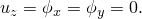

运动对于任何旋转的横截面平面也是对称的。为了消除关于z轴的刚体旋转模式，我们可以选择一个不旋转的横截面平面。这被假定为平面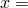 0。对于该平面上的所有节点，对称约束为

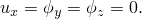

在我们建模的管道段的另一端，我们需要相同的条件，但关于旋转的坐标系，仅关于z轴旋转。为了施加这些条件，我们引入了一个"梁"节点，标记为b，来表示端平面的运动。该节点被定义为具有全局位移分量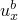、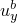和旋转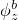作为其自由度。壳模型的纯弯曲通过为"梁"节点规定旋转

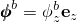

来建模。规定的是旋转而不是弯矩，因为预期管道的坍塌将是不稳定的。

应用基于表面的运动学和分布耦合来对管道段端部的节点施加必要的对称约束，并使用基于表面的分布耦合单元来消除管道的平移刚体模式。

可以施加运动学耦合来约束壳模型端平面上的节点，以施加对称约束，同时允许横截面的椭圆形。这些节点必须保持与端横截面平面共面，该端平面的方向由参考节点的旋转决定，该参考节点被称为"梁"节点。

这样的条件可以通过约束端平面节点在垂直于端平面的方向上跟随梁节点的运动来实现。由于约束方向在运动学耦合中与参考节点（在本例中为梁节点）的运动共同旋转，因此由约束方向确定的平面将随梁节点一起旋转。端平面的初始法线将在x方向，端平面节点可以在y和z方向自由平移。然而，这些方向随后将由旋转的坐标系确定，跟随梁节点的运动。

y方向的平移刚体模式可以通过约束旋转端平面上节点的平均y方向运动来消除。使用分布耦合来约束端节点的平均运动到其参考节点的运动。然后该参考节点在y方向被约束，这仅以平均意义约束端节点的运动。这可以表示为

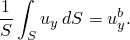

壳模型（S8R5）中的单元使用二次插值函数；因此，节点位移的加权因子对于角节点为1/6，对于中节点为4/6。然而，由于大多数角节点连接到两个单元，考虑到对两个相邻单元的贡献，此类节点的分布耦合使用的权重为2/6。由于分布耦合的唯一目的是防止刚体运动，因此权重因子的选择不是关键的。

### 结果与讨论

下面讨论两种模型的结果。

#### 最初直的管道

基于弹性材料假设的结果总结在图1.1.5-4（[图1.1.5-4](ch01s01ach05.md#sxmunicollapse-mc-e)）和图1.1.5-5（[图1.1.5-5](ch01s01ach05.md#sxmunicollapse-def-e)）中。这些图基于壳单元的分析。图1.1.5-4（[图1.1.5-4](ch01s01ach05.md#sxmunicollapse-mc-e)）显示了管道弯矩随曲率的变化。从该图中可以明显看出坍塌的不稳定行为，即弯矩达到峰值然后随曲率增加而减小。Brazier（1927）的解也显示在该图中。Brazier的分析只是对常规弯曲理论的一阶修正，没有考虑任何压力效应。它与当前零压力结果在峰值载荷之前非常吻合。内压P的硬化效应从该图中可以明显看出：最高压力（5.17 MPa，750 lb/in2）下的峰值弯矩比零压力下的峰值弯矩高约28%。变形的大小如图1.1.5-5（[图1.1.5-5](ch01s01ach05.md#sxmunicollapse-def-e)）所示，其中管道截面在x-y平面中的外部尺寸显示为曲率的函数。

弹塑性材料行为的结果相当不同，如图1.1.5-6（[图1.1.5-6](ch01s01ach05.md#sxmunicollapse-mc-ep)）和图1.1.5-7（[图1.1.5-7](ch01s01ach05.md#sxmunicollapse-def-ep)）所示。正如我们所预期的，弯矩要低得多。此外，内压大大降低了行为的严重不稳定性——如此之高以至于最高压力解始终表现出正刚度，即使在相当大的曲率下。在这种弹塑性情况下，横截面的椭圆形也要少得多：管道通过屈服失去弯曲刚度，从而减少了横截面的变形。

弯头和壳单元模型在图1.1.5-8（[图1.1.5-8](ch01s01ach05.md#sxmunicollapse-comp-e)）（弹性，无压力）和图1.1.5-9（[图1.1.5-9](ch01s01ach05.md#sxmunicollapse-comp-ep)）（弹塑性，无压力）中进行了比较。弯头单元模型与壳单元解非常吻合，在坍塌点之后仍使用四种或六种模式，这说明了弯头单元对于这种情况的相对效率。

#### 最初弯曲的管道

对于最初弯曲的管道，必须使用适当的取向来正确施加运动学耦合，因为端平面上的约束方向最初未与全局坐标系对齐。基于弹性材料假设的最初弯曲管道结果如图1.1.5-10（[图1.1.5-10](ch01s01ach05.md#sxmunicollapse-mc-e-c)）和图1.1.5-11（[图1.1.5-11](ch01s01ach05.md#sxmunicollapse-def-e-c)）所示。响应与直管道结果相当不同，开口和闭合弯矩给出明显不同的响应。对于开口弯矩，截面的椭圆形倾向于增加管道抵抗进一步弯曲的能力，从而给出硬化响应。在闭合弯矩下，管道在弯曲中变得越来越弱，从未达到直管道中可能的弯矩的20-25%以上。内压的影响现在比相应的直管道小得多，管道尺寸的变化（如图1.1.5-11（[图1.1.5-11](ch01s01ach05.md#sxmunicollapse-def-e-c)）所示）也不那么严重。

相同情况的弹塑性结果总结在图1.1.5-12（[图1.1.5-12](ch01s01ach05.md#sxmunicollapse-mc-ep-c)）和图1.1.5-13（[图1.1.5-13](ch01s01ach05.md#sxmunicollapse-def-ep-c)）中。与相应的直管道解（[图1.1.5-6](ch01s01ach05.md#sxmunicollapse-mc-ep)和[图1.1.5-7](ch01s01ach05.md#sxmunicollapse-def-ep)）相比，闭合弯矩解在所有测试的内压值下都显示坍塌（负刚度）。

内压的影响相当显著。较低压力的开口弯矩情况显示了一种有趣的行为：屈服引起的截面初期弱化在载荷后期被与大位移效应相关的硬化所抵消。

弯头和壳单元模型在图1.1.5-14（[图1.1.5-14](ch01s01ach05.md#sxmunicollapse-comp-e-c)）（弹性，无压力）和图1.1.5-15（[图1.1.5-15](ch01s01ach05.md#sxmunicollapse-comp-ep-c)）（弹塑性，无压力）中进行了比较。

### 输入文件

[unifcollapspipe_str_elbelem.inp](../eif/unifcollapspipe_str_elbelem.inp)

直管道，弹性分析（4傅里叶模式弯头单元模型）。

[unifcollapspipe_str_shellkcdc.inp](../eif/unifcollapspipe_str_shellkcdc.inp)

直管道，无加压，弹性分析（壳单元模型）。

[unifcollapspipe_curv_elbelem.inp](../eif/unifcollapspipe_curv_elbelem.inp)

最初弯曲的管道，开口模式，弹性分析（4傅里叶模式弯头单元模型）。

[unifcollapspipe_curv_shellkcdc.inp](../eif/unifcollapspipe_curv_shellkcdc.inp)

最初弯曲的管道，开口模式，无加压，弹性分析（壳单元模型）。

### 参考

Brazier, L. G., "On the Flexure of Thin Cylindrical Shells and Other 'Thin' Sections," Proceedings of the Royal Society, London, Series A, vol. 116, pp. 104–114, 1927.

Sobel, L. H., and S. Z. Newman, "Plastic In-Plane Bending and Buckling of an Elbow: Comparison of Experimental and Simplified Analysis Results," Westinghouse Advanced Reactors Division, Report WARD-HT-94000-2, 1979.

Timoshenko, S. P., and J. M. Gere, Theory of Elastic Stability, McGraw-Hill, New York, 1961.

### 图表

**图1.1.5-1** Brazier问题：最初直管道的纯弯曲坍塌。

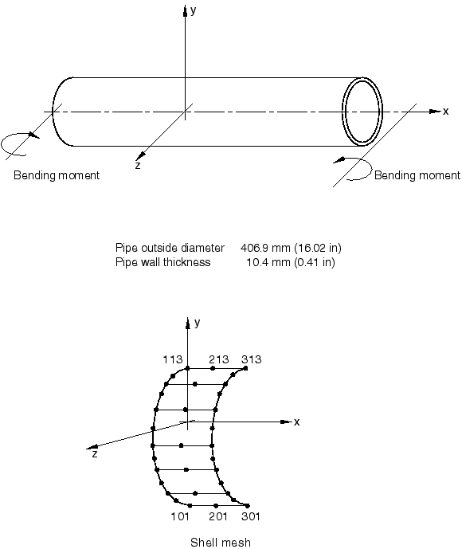

**图1.1.5-2** 弯曲管道弯曲问题。

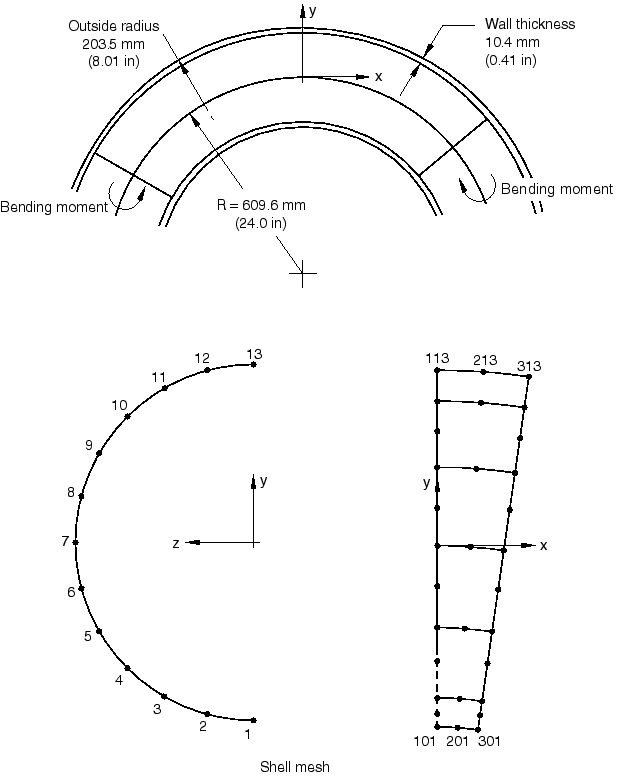

**图1.1.5-3** 管道材料的假定应力-应变行为。

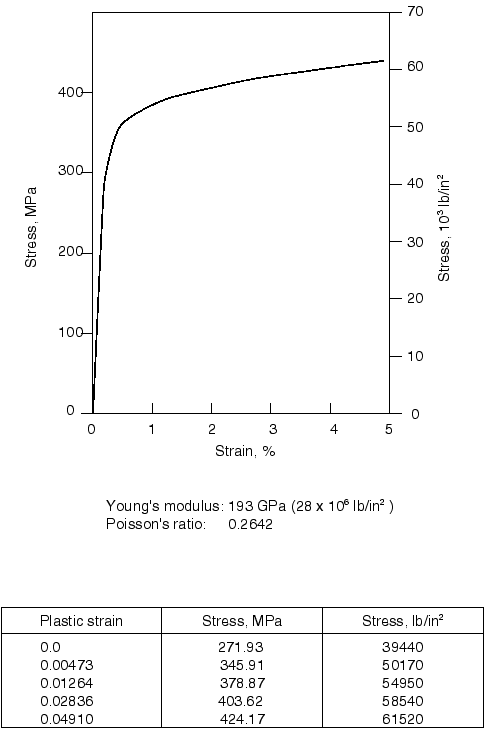

**图1.1.5-4** 弯矩-曲率——最初直的，弹性管道（壳模型）。

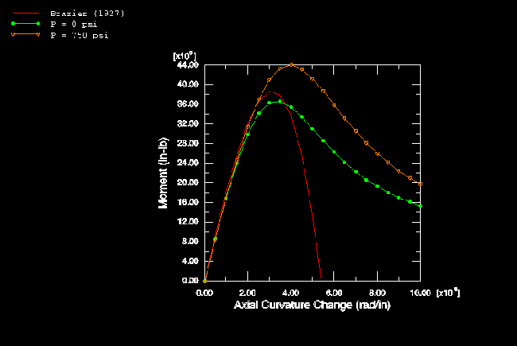

**图1.1.5-5** 截面变形——最初直的，弹性管道（壳模型）。

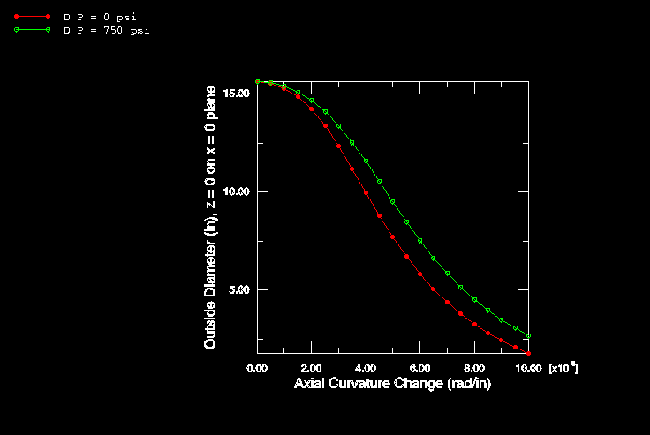

**图1.1.5-6** 弯矩-曲率——最初直的，弹塑性管道（壳模型）。

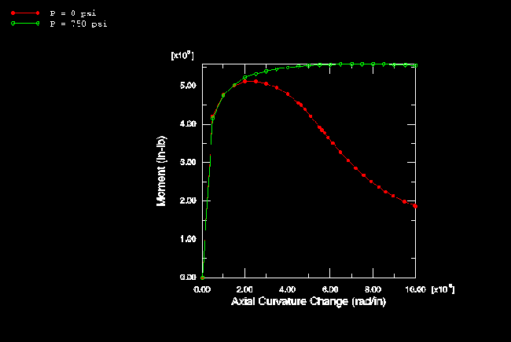

**图1.1.5-7** 截面变形——最初直的，弹塑性管道（壳模型）。

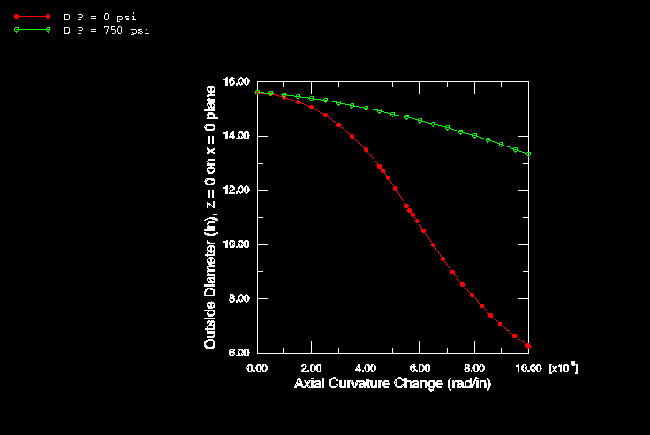

**图1.1.5-8** 弯矩-曲率——壳和弯头模型的比较，最初直的，弹性管道。

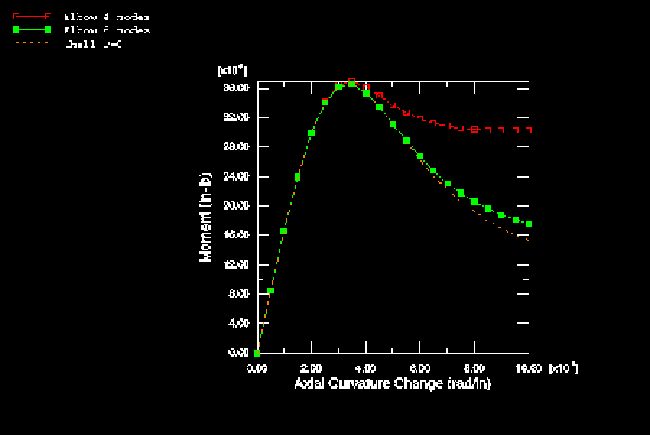

**图1.1.5-9** 弯矩-曲率——壳和弯头模型的比较，最初直的，弹塑性管道。

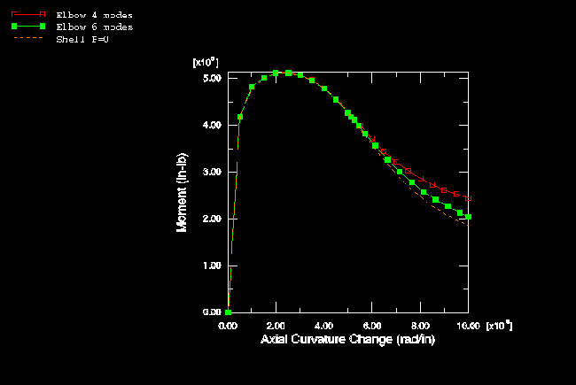

**图1.1.5-10** 弯矩-曲率——最初弯曲的，弹性管道（壳模型）。

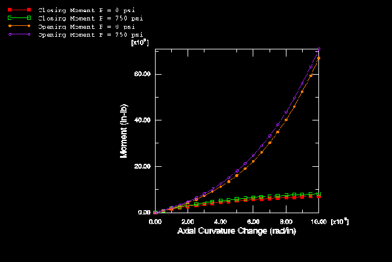

**图1.1.5-11** 截面变形——最初弯曲的，弹性管道（壳模型）。

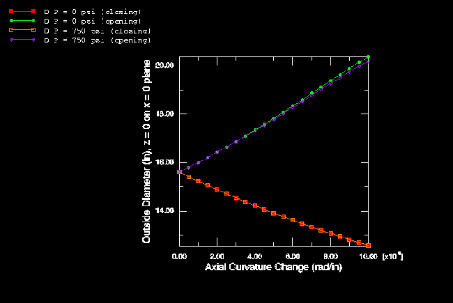

**图1.1.5-12** 弯矩-曲率——最初弯曲的，弹塑性管道（壳模型）。

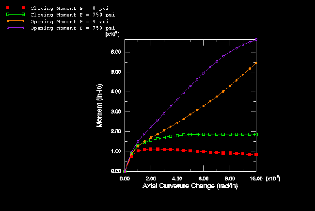

**图1.1.5-13** 截面变形——最初弯曲的，弹塑性管道（壳模型）。

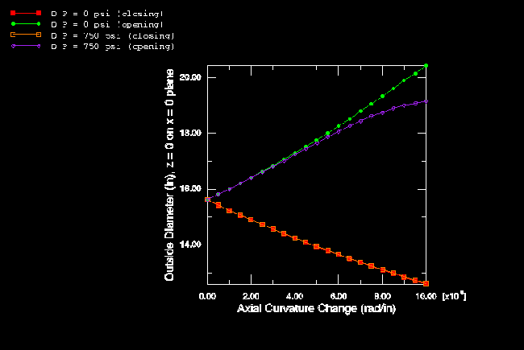

**图1.1.5-14** 弯矩-曲率——壳和弯头模型的比较，最初弯曲的，弹性管道。

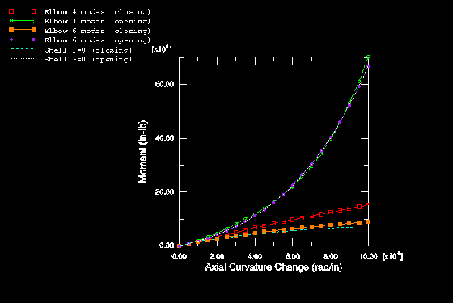

**图1.1.5-15** 弯矩-曲率——壳和弯头模型的比较，最初弯曲的，弹塑性管道。

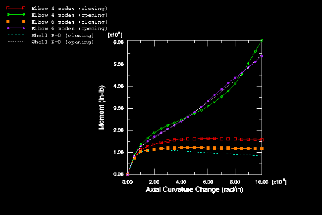

