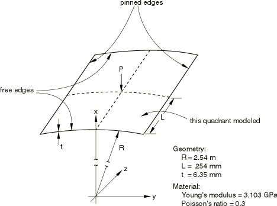
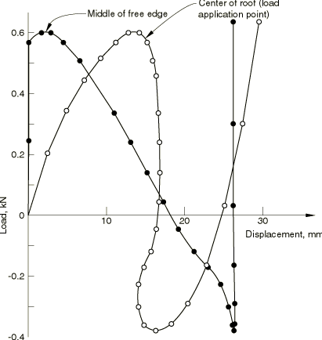
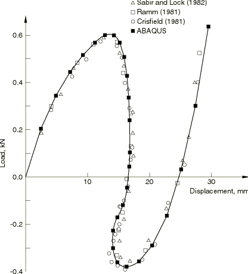
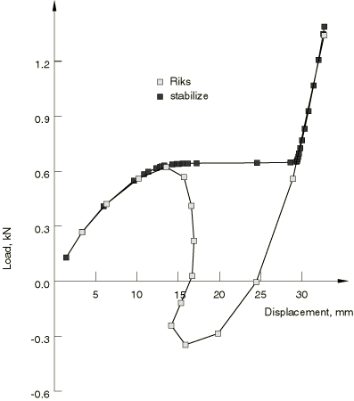

# 1.1.6 浅圆柱形穹顶在点载荷下的突弹跳变

**产品：** Abaqus/Standard

本示例说明了使用改进的Riks方法获得表现出突弹跳变行为的弹性壳结构的不稳定静态平衡响应。在这种情况下，壳是一个浅圆柱形穹顶，沿其直边铰支，并在其中点承受点载荷。由于该示例已被多位作者研究过，与已发表结果的比较为这类分析提供了验证。还展示了体积比例阻尼稳定化能力作为Riks方法的替代方案。

### 问题描述

穹顶的尺寸如图1.1.6-1（[图1.1.6-1](ch01s01ach06.md#sxmroof-geom)）所示。材料为线弹性，弹性模量为3.103 GPa，泊松比为0.3。

### 建模和求解控制

假设穹顶以对称方式变形，因此对一个象限进行离散，如图1.1.6-1（[图1.1.6-1](ch01s01ach06.md#sxmroof-geom)）所示。我们使用两个规则的6×6壳单元网格，一个是S4R5型（4节点单元，一个积分点），一个是S4R型（有限膜应变壳单元），以及一个8×8的S3R型三角壳单元网格。此外，还提供了两个规则的6×6连续壳网格，一个是SC6R型（有限膜应变，面内连续壳楔形），一个是SC8R型（有限膜应变，六面体连续壳）。没有进行网格收敛性研究，但这些网格给出的结果与已发表数值解的比较表明，至少在载荷-挠度行为方面，这些网格给出了相当准确的结果。

当使用改进的Riks方法时，载荷大小和建议的初始增量大小应为第一次载荷增量的大小和方向提供合理估计。已知这种情况的临界载荷不会超过750 N。初始时间步长为0.025，周期为1.0，我们给出3000 N的载荷。这意味着整个穹顶的初始载荷增量约为75 N。此外，我们对超过临界载荷大小的后屈曲行为不太感兴趣，因此当载荷比例因子达到0.06时终止分析。这对应于整个穹顶上的总载荷为720 N。在这个问题中，当穹顶经历不稳定的突弹时，静态平衡载荷实际上会反向。改进的Riks算法能够追踪这种载荷反转。壳截面使用高斯积分。

当使用体积比例阻尼能力时，施加的总载荷为1332 N，大致等于Riks方法分析停止时的载荷。初始载荷增量是总载荷的10%。该算法不能捕获载荷反转；当会发生这种反转时，结构加速，增加的速度产生足够的粘 lực来平衡外部施加的载荷。结果，外部载荷在变形的不稳定部分期间保持几乎恒定。

### 结果与讨论

图1.1.6-2（[图1.1.6-2](ch01s01ach06.md#sxmroof-loadvdisp)）显示了载荷下点的向下垂直位移（穹顶的中点）和壳自由边中点的位移作为整个穹顶上施加载荷的函数。穹顶在约600 N的载荷下不稳定坍塌，当突弹发生时，平衡载荷迅速下降到约380 N。在突弹的后期，穹顶的中点略微向上移动（弹回），从约16.8 mm的位移到突弹结束前的14.1 mm。突弹后，壳随着载荷增加而迅速硬化，正如预期的那样。在原始未加载配置中，穹顶的中心线高于铰支边缘约12.7 mm。从图1.1.6-2（[图1.1.6-2](ch01s01ach06.md#sxmroof-loadvdisp)）可以看出，当被加载的点向下位移约14.4 mm时（刚好在铰支直边定义的水平面以下）发生不稳定。然而，在这一点的不稳定时，自由边中点仅向下位移了约3 mm。在突弹结束时，载荷下的点已位移约16.3 mm，而自由边的中点已位移约26.3 mm。因此，在突弹期间，载荷下的点仅移动了约2 mm的总距离，而自由边的中点移动了23.3 mm。

多位作者研究了相同的问题（参见本示例末尾的参考），获得了与此处获得的结果非常一致的结果。图1.1.6-3（[图1.1.6-3](ch01s01ach06.md#sxmroof-solcomp)）显示了这些不同解与载荷下点位移的载荷变化的比较。

图1.1.6-4（[图1.1.6-4](ch01s01ach06.md#sxmroof-stabilvsriks)）显示了Riks方法和自动稳定方法（体积比例阻尼）在载荷下点向下垂直位移作为施加载荷的函数方面的比较。当变形稳定时（即，在初始加载期间）以及突弹发生后，两条曲线非常相似，这意味着阻尼引入的耗散可以忽略不计。然而，在突弹期间，结构想要从一个稳定配置缓解到下一个的应变能通过阻尼而不是通过减小载荷来消耗。这种方法的缺点是它产生几乎恒定的载荷，而没有给出距离静态平衡状态多远的信息（即，突弹有多严重）。另一方面，当不稳定是局部的时候，这种方法仍然有效，在这种情况下Riks方法可能会失败。

### 输入文件

[roofsnapthrough_s3r.inp](../eif/roofsnapthrough_s3r.inp)

S3R单元模型。

[roofsnapthrough_s4.inp](../eif/roofsnapthrough_s4.inp)

S4单元模型。

[roofsnapthrough_s4r.inp](../eif/roofsnapthrough_s4r.inp)

S4R单元模型。

[roofsnapthrough_s4r5.inp](../eif/roofsnapthrough_s4r5.inp)

S4R5单元模型。

[roofsnapthrough_stri65.inp](../eif/roofsnapthrough_stri65.inp)

STRI65单元模型。

[roofsnapthrough_sc6r.inp](../eif/roofsnapthrough_sc6r.inp)

SC6R单元模型。

[roofsnapthrough_sc8r.inp](../eif/roofsnapthrough_sc8r.inp)

SC8R单元模型。

[roofsnapthrough_stabilize.inp](../eif/roofsnapthrough_stabilize.inp)

使用自动稳定（体积比例阻尼）而不是Riks方法的相同模型，默认阻尼。

[roofsnapthrough_stabilizefactor.inp](../eif/roofsnapthrough_stabilizefactor.inp)

使用自动稳定（体积比例阻尼）而不是Riks方法的相同模型，用户定义阻尼。

[roofsnapthrough_stabilize_adap.inp](../eif/roofsnapthrough_stabilize_adap.inp)

使用自适应自动稳定（体积比例阻尼）而不是Riks方法的相同模型，默认阻尼。

[roofsnapthrough_postoutput.inp](../eif/roofsnapthrough_postoutput.inp)

测试roofsnapthrough_stabilize.inp中模型的[*POST OUTPUT](../key/key-link.md#usb-kws-hpostoutput)能力。

### 参考

Crisfield, M. A., "A Fast Incremental/Iterative Solution Procedure that Handles 'Snap-Through'," Computers and Structures, vol. 13, pp. 55–62, 1981.

Ramm, E., "Strategies for Tracing the Nonlinear Response near Limit Points," in Nonlinear Finite Element Analysis in Structural Mechanics, edited by W. Wunderlich, E. Stein, and K. J. Bathe, Springer-Verlag, Berlin, 1981.

Sabir, A. B., and A. C. Lock, "The Application of Finite Elements to the Large Deflection, Geometrically Nonlinear Behavior of Cylindrical Shells," in Variational Methods in Engineering, edited by C. A. Brebbia and H. Tottenbam, Southampton U. Press, 1982.

### 图表

**图1.1.6-1** 点载荷下的浅圆柱形穹顶。

**图1.1.6-2** 浅圆柱壳的载荷-位移响应。

**图1.1.6-3** 浅圆柱形穹顶解的比较。

**图1.1.6-4** 浅圆柱形穹顶的Riks和稳定解的比较。

