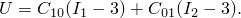
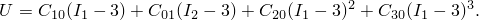
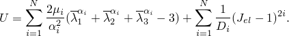
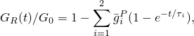
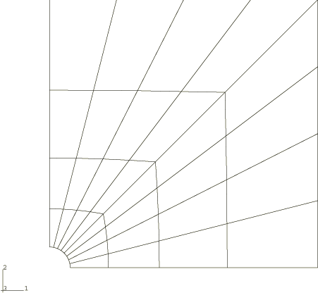
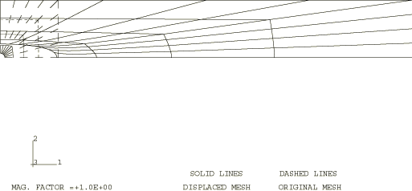
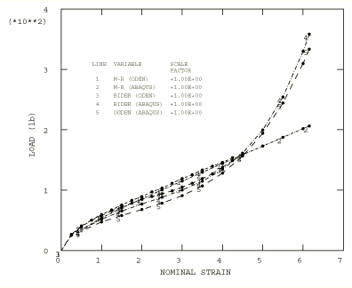
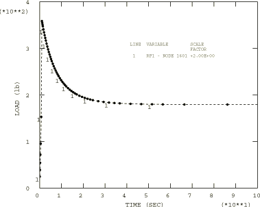

# 1.1.8 带圆孔的弹性板单轴拉伸

**产品：** Abaqus/Standard

本示例考虑了包含中心圆孔的薄方形板在均匀大拉伸下的行为。假设平面应力条件，并将结果与Oden（1972）使用Treloar（1944）的实验结果针对四种不同应变能函数形式给出的结果进行比较。本示例演示并验证了超弹性和粘弹性材料在平面应力中的结果。

### 问题描述

四分之一板的几何形状和网格如图1.1.8-1所示。未变形方形板厚2 mm（0.079 in），每边长165 mm（6.5 in）。它有一个半径为6.35 mm（0.25 in）的中心内孔。该物体用32个二阶平面应力减缩积分单元（单元类型CPS8R）建模。材料的不可压缩性要求对平面应变、轴对称或三维情况使用"混合"单元；但在平面应力中，厚度变化可用作自由变量来强制执行恒定体积（不可压缩性）的约束，因此标准位移公式单元（CPS8R）是合适的。没有进行网格收敛性研究，但与Oden（1972）给出的结果的良好一致性表明所选模型具有与Oden使用的模型相当的准确性。

使用了四种不同的材料模型。将Treloar（1944）的由单轴、双轴和平面拉伸数据组成的实验数据应用于这些模型。四种模型中的两种是Abaqus中标准多项式超弹性模型的形式。一种是经典的Mooney-Rivlin应变能函数：

另一种是Biderman的：

在这两种情况下，材料都被假定为不可压缩。Oden（1972）使用的常数为= 0.1863 MPa（27.02 psi）；= 0.00979 MPa（1.42 psi）；对于Biderman模型，= 0.00186 MPa（0.27 psi），和= 0.0000451 MPa（0.00654 psi），所有其他= 0。对于Mooney-Rivlin材料，在超弹性材料定义（["橡胶类材料的超弹性行为，" Abaqus分析用户指南第22.5.1节]）中指定，仅给出和。对于Biderman材料，必须给出和九个常数。由于材料是不可压缩的，常数被设置为零。

第三种材料模型是Abaqus中的Ogden超弹性模型：

Ogden超弹性参数是使用超弹性材料定义中的测试数据获得的，以拟合Treloar的实验数据。为推导了三对参数和。

第四种材料模型是Abaqus中的Marlow超弹性模型。在这个模型中，响应的偏斜部分从一组测试数据（单轴、双轴或平面）导出，使得材料的行为在被提供测试数据的变形模式中被精确表示。提供了三个示例，其中模型分别基于单轴、双轴或平面测试数据。

此外，Biderman模型和Marlow模型与粘弹性材料模型结合使用。剪切松弛由时间相关模量定义，用两项Prony级数展开：

其中= 0.25，= 5.0 sec和= 0.25，= 10 sec。体积行为假定保持不可压缩。

### 载荷和控制

板在x方向被拉伸到1181 mm（46.5 in）的宽度——是其初始宽度的七倍以上——而平行于x轴的边缘被限制在y方向不能拉伸。y方向约束直接用边界条件施加。x方向的拉伸通过在网格右边缘施加均匀法向位移来规定。使用方程约束将该边缘上所有节点约束为具有相同的x位移。然后规定保留节点（节点1601）的位移来拉伸板。这种技术允许总拉伸力直接作为该节点上的反力获得。和处的对称条件也用边界条件施加。

建议使用最终位移的5%作为初始增量。随后增量的大小由自动增量方案选择。

在粘弹性情况下，添加了由准静态过程驱动的第二步。变形保持不变，应力松弛。时间周期为100秒，远大于材料的时间常数。因此，应获得材料的长期行为。在时间相关模量表达式中设置提供了和。由于变形在松弛步骤期间几乎完全被约束，我们期望应力在这个过程中减半。使用0.1的值指定蠕变应变增量在时间增量上的最大差异，这使得自动增量成为可能。这个值通过限制由前向Euler和后向Euler积分定义的应变增量之间的差异来控制粘弹性模型积分的误差。此处使用的每增量10%的应变误差值非常大，表明没有尝试限制这个误差源：相反，我们允许自动时间增量尽快达到长期（稳态）解。

### 结果与讨论

Biderman材料模型情况的最终位移配置如图1.1.8-2所示；载荷响应如图1.1.8-3所示，其中载荷作为板在x方向的整体名义应变的函数绘制。可以看到，前三种超弹性模型的结果与Oden的结果非常吻合。Marlow超弹性模型的结果也与Oden的结果很好地吻合，尽管它们未显示在图1.1.8-3中。Mooney-Rivlin应变能函数（其中和是唯一的非零项）无法预测在更高应变下由Biderman和Ogden应变能函数预测的响应"锁定"。图1.1.8-4显示了包括粘弹性松弛步骤情况的载荷-时间响应。

### 输入文件

#### CPS8R单元：

[elasticsheet_cps8r_biderman.inp](../eif/elasticsheet_cps8r_biderman.inp)

Biderman材料模型。通过修改[*HYPERELASTIC](../key/key-link.md#usb-kws-mhyperelast)选项给出并仅在数据行上提供前两个常数来获得Mooney-Rivlin模型。

[elasticsheet_cps8r_ogdendata.inp](../eif/elasticsheet_cps8r_ogdendata.inp)

具有TEST DATA INPUT选项的Ogden超弹性公式。

[elasticsheet_cps8r_bidervisco.inp](../eif/elasticsheet_cps8r_bidervisco.inp)

包括松弛步骤的粘弹性Biderman材料模型。

[elasticsheet_bidervisco_stabil.inp](../eif/elasticsheet_bidervisco_stabil.inp)

包括松弛步骤和自动稳定的粘弹性Biderman材料模型。

[elasticsheet_bidervisco_stabil_adap.inp](../eif/elasticsheet_bidervisco_stabil_adap.inp)

包括松弛步骤和自适应自动稳定的粘弹性Biderman材料模型。

[elasticsheet_postoutput.inp](../eif/elasticsheet_postoutput.inp)

用于后处理来自elasticsheet_cps8r_biderman.inp的结果文件的数据。

[elasticsheet_cps8r_marlowu.inp](../eif/elasticsheet_cps8r_marlowu.inp)

使用单轴测试数据的Marlow材料模型。

[elasticsheet_cps8r_marlowb.inp](../eif/elasticsheet_cps8r_marlowb.inp)

使用双轴测试数据的Marlow材料模型。

[elasticsheet_cps8r_marlowp.inp](../eif/elasticsheet_cps8r_marlowp.inp)

使用平面测试数据的Marlow材料模型。

[elasticsheet_cps8r_marlowuvisco.inp](../eif/elasticsheet_cps8r_marlowuvisco.inp)

使用单轴测试数据并包括松弛步骤的粘弹性Marlow材料模型。

[elasticsheet_cps8r_marlowbvisco.inp](../eif/elasticsheet_cps8r_marlowbvisco.inp)

使用双轴测试数据并包括松弛步骤的粘弹性Marlow材料模型。

[elasticsheet_cps8r_marlowpvisco.inp](../eif/elasticsheet_cps8r_marlowpvisco.inp)

使用平面测试数据并包括松弛步骤的粘弹性Marlow材料模型。

#### CPS4单元：

[elasticsheet_cps4_biderman.inp](../eif/elasticsheet_cps4_biderman.inp)

Biderman材料模型。

[elasticsheet_cps4_ogdendata.inp](../eif/elasticsheet_cps4_ogdendata.inp)

具有TEST DATA INPUT选项的Ogden超弹性公式。

[elasticsheet_cps4_bidervisco.inp](../eif/elasticsheet_cps4_bidervisco.inp)

包括松弛步骤的粘弹性Biderman材料模型。

[elasticsheet_cps4_marlowu.inp](../eif/elasticsheet_cps4_marlowu.inp)

使用单轴测试数据的Marlow材料模型。

[elasticsheet_cps4_marlowuvisco.inp](../eif/elasticsheet_cps4_marlowuvisco.inp)

使用单轴测试数据并包括松弛步骤的粘弹性Marlow材料模型。

### 参考

Oden, J. T., Finite Elements of Nonlinear Continua, McGraw-Hill, New York, 1972.

Treloar, L. R. G., "Stress-Strain Data for Vulcanised Rubber Under Various Types of Deformation," Trans. Faraday Soc., 40, pp. 59–70, 1944.

### 图表

**图1.1.8-1** 橡胶板和网格。

**图1.1.8-2** 最终位移配置，Biderman模型。

**图1.1.8-3** 施加力与整体名义应变的关系。

**图1.1.8-4** 载荷与时间的关系，Biderman模型，松弛周期为100秒。

