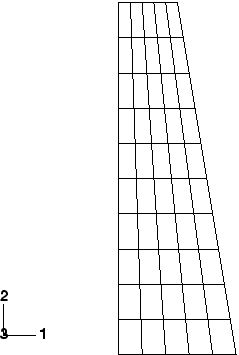
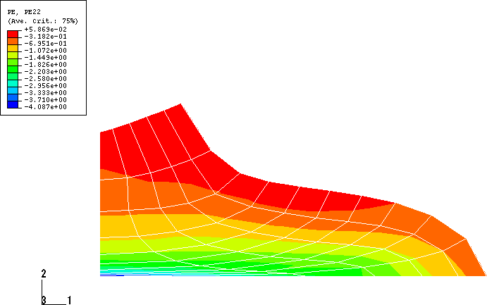
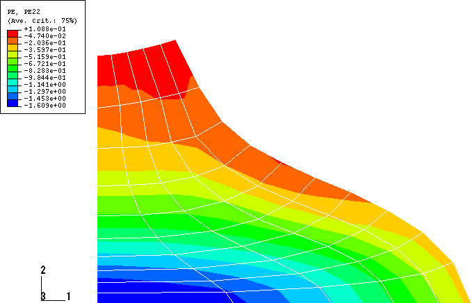
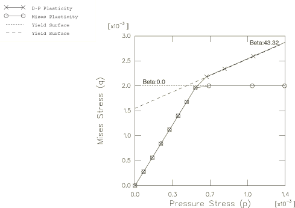
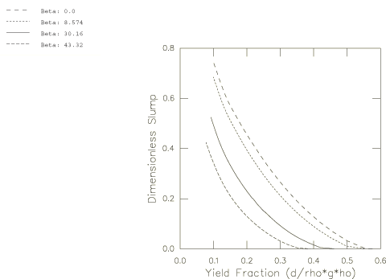
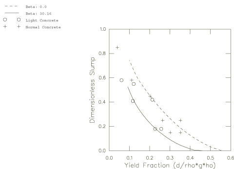

# 1.1.10 混凝土坍落度测试

**产品：** Abaqus/Standard  Abaqus/Explicit

本示例说明了在Abaqus中使用扩展Drucker-Prager塑性模型处理有限变形问题。Abaqus提供了三种不同类型的Drucker-Prager屈服准则。在所有三种中，屈服函数都依赖于材料中的围压和偏应力。最简单的是在子午面（p–q）平面中的一条直线。其他屈服准则是子午面中的双曲线表面和一般指数表面。[Abaqus分析用户指南第23.3.1节]详细描述了这些屈服准则。

在这个示例中，通过模拟混凝土坍落度测试来检查线性Drucker-Prager模型不同材料参数的影响。其他两种Drucker-Prager屈服准则通过使用将它们简化为等效线性形式的参数来验证。

坍落度测试是对新鲜湿润混凝土进行以确定其一致性和流动能力的标准化程序。测试包括将混凝土填充到指定高度的锥形模具中。然后移除模具，允许混凝土在其自身重量下变形。混凝土锥体高度的降低称为"坍落度"，是一致性和强度的指示。本示例是此类测试的模拟。此问题的有限元分析已由Famiglietti和Prevost（1994）发表。

### 问题描述

本示例中尺寸、材料参数或载荷没有使用特定的单位制。假定单位一致。在混凝土上进行坍落度测试时使用标准锥形模具。锥体高度为0.3个单位。锥体底部半径为0.1，顶部半径为0.05。使用轴对称模型分析混凝土的响应。示例中使用的网格如图1.1.10-1所示。对于Abaqus/Standard模型使用一阶CAX4单元，对于Abaqus/Explicit模型使用一阶CAX4R单元。我们还在Abaqus/Standard中包含了一个三维模型，使用两个跨越180度段的圆柱单元。没有进行网格收敛性研究。

### 材料参数

本示例使用了Famiglietti和Prevost报告的材料属性。

弹性模量为2.25，泊松比为0.125定义了混凝土的弹性响应。使用的密度为0.1。

假定非弹性行为由内聚力或剪切强度以及材料的摩擦角控制。使用的内聚力为0.0011547，并比较了四种不同摩擦角（0、5、20和35度）下的响应。假定完全塑性。由于这些参数是为Mohr-Coulomb塑性模型提供的，必须将它们转换为线性Drucker-Prager参数。[Abaqus分析用户指南第23.3.1节]描述了将Mohr-Coulomb参数转换为等效线性Drucker-Prager参数的方法。平面应变变形和相关联的塑性流动准则，其中膨胀角等于材料摩擦角，在本转换中被假定。相应的线性Drucker-Prager参数和d给在表1.1.10-1中。值是使用Abaqus分析用户指南中给出的表达式获得的。

将双曲线屈服函数简化为线性形式需要将指数屈服函数简化为线性形式需要1.0和。指数和双曲线屈服准则的材料参数在表1.1.10-1中给出创建等效线性模型的参数。双曲线和指数屈服准则都不能简化为= 0的线性模型（Mises屈服表面）。

双曲线和指数屈服准则都在子午应力平面中使用双曲线流动势。这个流动势是连续且光滑的，确保流动方向是良好定义的。该函数在高围压应力下渐近地接近直线Drucker-Prager流动势，但在90度处与静水压力轴相交。因此，与在静水压力轴上具有顶点的直线势相比，该函数更被优选作为Drucker-Prager模型的流动势。

为了尽可能接近地将双曲线流动势与直线Drucker-Prager流动势匹配，必须将参数设置为一个小的值。本示例中假定指数模型的默认值0.1。这个值确保使用此模型获得的结果不会与等效直线流动势显著偏离，除了三轴扩展点附近子午平面中的一个小区城外。随着减小，这个区域的大小减小。对于需要线性流动势来建模非弹性变形的问题，这个参数很少需要修改。将减小到更小的值可能导致收敛问题。

非弹性材料属性使用具有硬化的扩展Drucker-Prager塑性模型指定。

### 载荷

载荷是施加到整个模型的重力载荷0.666。在Abaqus/Standard中，载荷从步长开始时的零线性增加到步长结束时的最大值。在Abaqus/Explicit中，使用平滑步长幅值定义来斜坡加载。这个幅值定义提供了一个平滑的加载速率，这在准静态或稳态模拟中是需要的。

混凝土锥体的底部在垂直（2）方向被固定，但可以在径向（1）方向自由移动。因此，本示例中不考虑混凝土与支撑之间的摩擦。

此步骤考虑了有限应变和大位移。

### Abaqus/Standard中的求解控制

具有双曲线和指数屈服准则的模型使用求解控制的默认值。然而，对于线性Drucker-Prager模型，使用场方程容差来覆盖平均力的自动计算，以减少分析所需的计算时间。收敛准则设置为1%，平均力设置为5.0×105。在增量期间最大允许位移校正的收敛检查也被禁用。此外，自动为该模型设置时间增量参数，以避免自动时间增量方案的过早削减。这样做是因为与此模型一起使用的线性流动势在材料点到达静水压力轴上屈服表面顶点时会在解中产生不连续性。由这些放宽的容差在解中引入的误差不大，但会导致计算时间的实质性减少。

在模型中限制最大时间增量，使得在任何给定增量中施加的总载荷不超过2.0%。这样做是为了在分析过程中准确捕获初始屈服点和非弹性响应的形状（见图1.1.10-4和图1.1.10-5）。

对于指数和双曲线屈服模型激活了不对称求解器。这是需要的，因为与线性屈服准则一起使用的双曲线流动势导致非相关非弹性流动，从而产生不对称方程组。

### 结果与讨论

图1.1.10-2显示了= 0的线性Drucker-Prager模型的垂直方向塑性应变PE22的变形形状和等值线。图1.1.10-3显示了= 30.16的线性Drucker-Prager模型的类似图。这些图中看到的非弹性响应差异可归因于两个效应。首先，结构的自重在大部分试件中引起静水压力应力，除了锥体外表面的薄层（那里有静水拉伸应力）。发生非弹性变形的等效Mises应力q（弹性范围）随摩擦角和压力应力的增加而增加。这个机制在图1.1.10-4中针对本示例考虑的两种极限情况（= 0和= 43.32）进行了说明。该图显示了位于锥体底部附近的材料点在子午应力平面（等效压力应力与等效剪切应力）中的应力历史。其次，假定相关流动，因此剪切伴随着膨胀。由于几何的受限性质，体积应变的增加伴随着压力应力的增加，进一步增加了材料的强度。第二个机制可以通过执行非膨胀，= 0测试来轻松验证，这将显示更大的坍落度。

图1.1.10-5还说明了不同摩擦角下的响应。无量纲坍落度参数是混凝土顶面中心的位移除以初始高度。屈服分数是Drucker-Prager内聚力参数d与施加载荷部分的比值。Christensen（1991）报告的实际混凝土的典型无量纲坍落度范围为0.2到0.8。图1.1.10-6比较了两种不同混凝土混合物（普通和轻质）的坍落度测试结果与摩擦角为0和30.16的计算结果。实验数据通常在这两个计算模型限定的范围内。

使用指数和双曲线屈服准则的线性版本获得的结果与使用线性Drucker-Prager准则获得的结果相同。在Abaqus/Standard中，与线性准则的分析相比，指数和双曲线准则的分析通常需要更少的迭代来获得收敛解。这归因于与指数和双曲线屈服准则一起使用的平滑、连续双曲线流动势。

前面段落讨论的结果对应于使用CAX4单元的Abaqus/Standard分析。使用CAX4R单元的Abaqus/Explicit模拟获得的结果非常一致。类似地，使用圆柱单元获得的三维解也与相应的轴对称解非常吻合。这些模拟的结果在此未报告。

### 输入文件

##### **Abaqus/Standard输入文件**

[concreteslump_castiron.inp](../eif/concreteslump_castiron.inp)

铸铁塑性模型。

以下数据文件之间的差异仅在于Drucker-Prager参数：

[concreteslump_beta30.inp](../eif/concreteslump_beta30.inp)

= 30.16的线性Drucker-Prager模型。

[concreteslump_beta0.inp](../eif/concreteslump_beta0.inp)

= 0的模型。注意使用Mises塑性而非Drucker-Prager塑性。

[concreteslump_beta8.inp](../eif/concreteslump_beta8.inp)

= 8.574的指数Drucker-Prager模型。

[concreteslump_beta43.inp](../eif/concreteslump_beta43.inp)

= 43.32的双曲线Drucker-Prager模型。

[concreteslump_3dcyl.inp](../eif/concreteslump_3dcyl.inp)

= 0的圆柱单元模型。

以下数据文件之间的差异仅在于Mohr-Coulomb参数：

[concreteslump_phi0.inp](../eif/concreteslump_phi0.inp)

= 0的Mohr-Coulomb模型。

[concreteslump_phi5.inp](../eif/concreteslump_phi5.inp)

= 5的Mohr-Coulomb模型。

[concreteslump_phi20.inp](../eif/concreteslump_phi20.inp)

= 20的Mohr-Coulomb模型。

[concreteslump_phi35.inp](../eif/concreteslump_phi35.inp)

= 35的Mohr-Coulomb模型。

##### **Abaqus/Explicit输入文件**

[concreteslump_castiron_xpl.inp](../eif/concreteslump_castiron_xpl.inp)

铸铁塑性模型。

以下数据文件之间的差异仅在于Drucker-Prager参数：

[concreteslump_beta30_xpl.inp](../eif/concreteslump_beta30_xpl.inp)

= 30.16的线性Drucker-Prager模型。

[concreteslump_beta0_xpl.inp](../eif/concreteslump_beta0_xpl.inp)

= 0的模型。注意使用Mises塑性而非Drucker-Prager塑性。

[concreteslump_beta8_xpl.inp](../eif/concreteslump_beta8_xpl.inp)

= 8.574的指数Drucker-Prager模型。

[concreteslump_beta43_xpl.inp](../eif/concreteslump_beta43_xpl.inp)

= 43.32的双曲线Drucker-Prager模型。

以下数据文件之间的差异仅在于Mohr-Coulomb参数：

[concreteslump_phi0_xpl.inp](../eif/concreteslump_phi0_xpl.inp)

= 0的Mohr-Coulomb模型。

[concreteslump_phi5_xpl.inp](../eif/concreteslump_phi5_xpl.inp)

= 5的Mohr-Coulomb模型。

[concreteslump_phi20_xpl.inp](../eif/concreteslump_phi20_xpl.inp)

= 20的Mohr-Coulomb模型。

[concreteslump_phi35_xpl.inp](../eif/concreteslump_phi35_xpl.inp)

= 35的Mohr-Coulomb模型。

### 参考

Christensen, G., Modeling the Flow of Fresh Concrete: The Slump Test, Ph.D. dissertation, Princeton University, 1991.

Famiglietti, C. M., and J. H. Prevost, "Solution of the Slump Test Using a Finite Deformation Elasto-Plastic Drucker-Prager Model," International Journal for Numerical Methods in Engineering, vol. 37, pp. 3869–3903, 1994.

### 表格

**表1.1.10-1** Drucker-Prager材料参数。对于所有模型，假定。
| Mohr-Coulomb | 线性 | 指数 | 双曲线 |
| --- | --- | --- | --- |
| c | | | d | a | b | |
| 1.1547×103 | 0 | 0.000 | 2.00×103 | N/A | N/A | N/A |
| 1.1547×103 | 5 | 8.574 | 1.989×103 | 6.632 | 1.0 | 1.319×102 |
| 1.1547×103 | 20 | 30.164 | 1.844×103 | 1.721 | 1.0 | 3.173×103 |
| 1.1547×103 | 35 | 43.322 | 1.555×103 | 1.060 | 1.0 | 1.649×103 |

### 图表

**图1.1.10-1** 未变形网格（CAX4单元）。

**图1.1.10-2** = 0模型的PE22等值线。

**图1.1.10-3** = 30.16模型的PE22等值线。

**图1.1.10-4** = 0和= 43.32时子午应力平面中的材料点轨迹。

**图1.1.10-5** 无量纲坍落度与屈服分数的关系。

**图1.1.10-6** 实验坍落度测试结果（来自Christensen）与计算结果的比较。

