# 1.1.11 Hertz接触问题

**产品：** Abaqus/Standard  Abaqus/Explicit

Hertz接触问题（见Timoshenko和Goodier，1951）提供了一个验证Abaqus接触能力的经典示例。它也是Abaqus/Standard中用于局部非线性情况（局部表面接触）的子结构技术使用的优秀说明。此外，该问题在Abaqus/Standard中在动态条件下进行分析，以说明接触表面在这种情况下的使用。

研究的Hertz接触问题包括两个相同的、无限长的圆柱体相互压入。最感兴趣的解量是接触面上的压力分布、接触区域的大小以及接触区域附近的应力。材料行为假定为线弹性，忽略几何非线性。因此，问题中唯一的非线性是接触约束。

### 问题描述

本例中的圆柱体半径为254 mm（10 in），为弹性体，弹性模量为206 GPa（30×10^6 lb/in2），泊松比为0.3。假定为光滑接触（无摩擦）。

接触区域与圆柱体半径相比仍然很小，因此平行于接触面的圆柱体直径弦上的垂直位移几乎是均匀的。结合问题的对称性，只需要对一个圆柱体的四分之一进行建模。在平行于刚性面的直径切割上规定位移来加载问题。对于本例，直径切割上的节点在垂直方向向下位移10.16 mm（0.4 in）。每单位圆柱体长度的总载荷可以通过汇总圆柱体上相应的反作用力获得，或者等效地作为刚体参考节点上的反作用力获得。

为了说明，该问题在二维和三维中都有建模。

在二维Abaqus/Standard情况下，四分之一圆柱体用20个8节点平面应变单元建模（见图1.1.11-1（[图1.1.11-1](ch01s01ach11.md#sxmhertz-mesh)））。在二维Abaqus/Explicit情况下，四分之一圆柱体用171个4节点平面应变（CPE4R）单元（见图1.1.11-5（[图1.1.11-5](ch01s01ach11.md#exxhertz-mesh)））或130个6节点平面应变（CPE6M）单元（见图1.1.11-6（[图1.1.11-6](ch01s01ach11.md#exxhertz-mesh-cpe6m)））建模。在三维情况下，建模了单位厚度的圆柱体，模型的两个外表面上的面外位移被固定以施加平面应变条件。圆柱体的主体在Abaqus/Standard中用16个20节点砖单元建模；剩余四个与可能发生接触的表面相邻的单元用单元类型C3D27建模，这是一种允许可变节点数的砖单元。此单元特别适用于三维接触分析。单元类型C3D27始终至少有21个节点：角节点、边中节点和单元重心处的一个节点。用户可以自行决定省略面中节点。在这种情况下，保留可能发生接触的表面上的面中节点。其他面中节点（在圆柱体内部的单元表面上）被省略，使这些表面与模型其余部分使用的20节点砖单元兼容。强烈建议在使用二阶单元的三维接触问题中使用27节点砖单元：在可能发生元素表面部分接触的情况下几乎必不可少，就像本例中一样。原因是，没有面中节点的二次单元表面的插值仅基于四个角节点和四个边中节点，因此相当不完整（它不是Lagrange插值的乘积）。因此，如果在从属表面定义中指定了二次单元，并且在接触面上没有面中节点，Abaqus/Standard将自动生成面中节点并适当修改单元定义。在Abaqus/Explicit网格中使用C3D8R单元或C3D10M单元。

显然，有必要细化预期接触区域附近的网格部分，以准确预测接触压力和接触面积。在Abaqus/Standard中，这种细化通过使用为此目的提供的默认多点约束之一来实现（["广义多点约束，" Abaqus分析用户指南第35.2.2节](../usb/usb-link.md#usb-cni-pmpc)）。在Abaqus/Explicit中使用了具有网格渐变的更细化网格。

为与Hertz解保持一致，对所有Abaqus/Explicit情况忽略几何非线性。

### 接触建模

由于对称性，接触问题可以建模为变形圆柱体被压向平坦的刚性表面。因此，需要两个接触表面：一个在变形圆柱体上（在Abaqus/Standard中为从属表面），另一个在刚体上（在Abaqus/Standard中为主属表面）。

为了说明目的，使用了几种不同的技术来定义接触表面对。从属表面通过以下方式定义：（1）将元素集合中包含的所有可能进入接触区域的元素的自由面分组（Abaqus自动定义面），（2）指定接触区域中元素的（或元素集合的）面，或（3）识别可能接触的变形体上接触区域中的节点。主属表面通过以下方式定义：（1）指定用于定义刚体的刚性元素的（或元素集合的）面，或（2）使用表面定义和刚体约束定义刚性表面。这些技术的任何组合都可以一起使用。

默认情况下，Abaqus使用有限滑动接触公式来建模接触对之间的相互作用。接触表面之间的滑动可以忽略不计，这使得本问题成为小滑动接触公式的候选者。关于小滑动与有限滑动接触的讨论，请参见["Abaqus/Standard中的接触公式，" Abaqus分析用户指南第38.1.1节](../usb/usb-link.md#usb-cni-acontactpairform)，或["Abaqus/Explicit中接触对的接触公式，" 第38.2.2节](../usb/usb-link.md#usb-cni-aexpcontactpairform)。

Abaqus/Standard中的表面接触公式由于所选择的积分方案，对表面之间的接触面积和压力分布给出准确的解。Irons和Ahmad（1980）建议使用高斯积分规则来计算表面边界条件问题的自洽面积，这对于二阶单元可能导致表面压力分布的振荡结果。Oden和Kikuchi解释了这种行为发生的原因（1980），并提出了使用Simpson积分规则代替的补救方法。Abaqus/Standard使用了这种技术，在压力分布中没有发现振荡。

Abaqus/Standard中法向默认接触对公式是硬接触，它给出接触约束的严格执行。一些标准分析使用硬接触和增广Lagrange接触进行，以证明代码选择的默认罚刚度不会显著影响应力结果。硬接触和增广Lagrange接触算法在["Abaqus/Standard中的接触约束执行方法，" 第38.1.2节](../usb/usb-link.md#usb-cni-acontactconstraints)中描述。

Abaqus/Explicit中默认的接触对公式是运动接触，它给出接触约束的严格执行。（注意：前面提到的小滑动接触选项仅在运动接触中可用。）使用运动接触和罚接触进行问题的显式动态分析，以证明罚方法的穿透特性可能在位移控制加载和纯弹性响应的问题中显著影响应力结果。运动接触和罚接触算法在["Abaqus/Explicit中的接触约束执行方法，" 第38.2.3节](../usb/usb-link.md#usb-cni-aexpcontactconstraints)中描述。

### 子结构Abaqus/Standard模型

这种接触问题非常适合使用Abaqus/Standard中的子结构技术进行分析，因为问题中唯一的非线性是相当局部的接触条件。圆柱体可以定义为子结构，从而简化为可能发生接触或边界条件可能改变的表面上的少量保留自由度。在接触的迭代求解过程中，只有子结构上的这些外部自由度出现在方程中，从而显著降低每次迭代的成本。一旦局部非线性被求解，圆柱体中的解就被恢复为对这些保留自由度上已知位移的纯线性响应。这种技术在这种情况下特别有效，因为刚性表面是平坦的，表面没有摩擦；因此，在非线性迭代中只需要保留垂直于表面的位移分量。

所有与子结构生成相关的信息必须在子结构生成步骤中给出，包括将被保留的自由度。子结构的创建和使用不能包含在同一个输入文件中。每个输入文件只能生成一个子结构。通过使用子结构载荷情况，可以为子结构定义任意数量的单位载荷情况。虽然此功能在本例中不是必需的，但其中一个输入文件将其用于验证目的。

子结构使用单元引入分析模型，其中为每个子结构的每次使用定义单元编号和节点。子结构内部和在使用级别的节点和单元编号是独立的——相同的节点和单元编号可以在不同的子结构和使用级别重复使用。如果结构具有相同的部分，也可以多次引用子结构。因此，一旦创建了子结构，它就像标准单元类型一样使用。

### 结果与讨论

以下段落讨论Abaqus/Standard和Abaqus/Explicit分析的结果。

#### Abaqus/Standard结果

尽管网格相当粗糙，图1.1.11-2（[图1.1.11-2](ch01s01ach11.md#sxmhertz-pressurevsposition)）显示，二维Abaqus/Standard模型预测的圆柱体之间的接触压力与分析分布非常吻合。数值解在接触区域边界处不太准确，那里接触压力具有强烈的梯度。接触压力误差指示器也捕获了这个方面。改善数值解的唯一现实方法是使用更详细的离散化。三维Abaqus/Standard模型获得了几乎相同的结果。

图1.1.11-3（[图1.1.11-3](ch01s01ach11.md#sxmhertz-mises)）显示了Mises等效应力的等值线。此图验证了最高应力强度（材料首先屈服的部位）发生在物体内部而不是表面。图1.1.11-4（[图1.1.11-4](ch01s01ach11.md#sxmhertz-dispconfig)）显示了变形构型。在该图中，圆柱体的接触表面看起来向下弯曲，这是因为使用了放大位移的放大因子来更清楚地显示结果。

在本例中，子结构大大减少了作业所需的计算机时间，因为它允许在少量活动自由度中求解非线性接触问题。子结构由于所需复尔的数据管理而涉及相当大的计算"开销"。耦合子结构上保留自由度的缩减刚度矩阵是一个满矩阵。因此，该方法并不总是像本例建议的那样有利。在纯线性分析中使用子结构通常会增加分析时间，除非子结构可以多次使用。在这种情况下，该方法的优势在于它允许将大型分析分成几个较小的分析作业，在每个作业中创建子结构或使用子结构来构建下一级分析模型。

#### Abaqus/Explicit结果

直径切割上的规定位移在相对较长的时间（0.01 s）内斜坡增加，以最小化惯性效应。然后将位移固定较短时间（0.001 s）以验证显式动态结果确实是准静态的。在整个分析过程中，总动能小于总内能的0.1%。此外，直径切割上垂直反作用力的总和与接触刚体的节点的总和紧密匹配。这些结果表明，分析可以被接受为准静态。

图1.1.11-7（[图1.1.11-7](ch01s01ach11.md#exxhertz-pressure)）和图1.1.11-8（[图1.1.11-8](ch01s01ach11.md#exxhertz-press-pnlty)）分别显示了使用运动接触和罚接触的二维模型的圆柱体之间的接触压力。接触压力分布显示经典的椭圆分布。最大压力发生在对称面上，对于运动接触分析，在经典解的1%以内。然而，由于接触穿透，使用罚接触时接触压力明显较低。三维Abaqus/Explicit模型获得了几乎相同的结果。

图1.1.11-9（[图1.1.11-9](ch01s01ach11.md#exxhertz-mises)）和图1.1.11-10（[图1.1.11-10](ch01s01ach11.md#exxhertz-mises-pnlty)）分别显示了运动接触和罚接触的Mises等效应力等值线。同样，罚接触的应力明显低于运动接触。这些图验证了最高应力强度（材料首先屈服的部位）发生在物体内部而不是表面。图1.1.11-11（[图1.1.11-11](ch01s01ach11.md#exxhertz-displaced)）和图1.1.11-12（[图1.1.11-12](ch01s01ach11.md#exxhertz-displ-pnlty)）显示了两种接触约束执行方法的变形构型；注意图1.1.11-12（[图1.1.11-12](ch01s01ach11.md#exxhertz-displ-pnlty)）中的接触穿透。

在大多数情况下，运动接触和罚接触会产生非常相似的结果。然而，也有例外，就像本问题所证明的那样。用户应该了解两种接触约束方法的特性，这些在["Abaqus/Explicit中的接触约束执行方法，" 第38.2.3节](../usb/usb-link.md#usb-cni-aexpcontactconstraints)中讨论。运动接触方法更适合此分析，因为与罚方法相关的穿透显著影响解。在这些穿透显著的情况并不常见。增加接触穿透显著性的因素包括：1）位移控制加载，2）高度受限区域，3）粗网格，以及4）纯弹性响应。可以通过增加罚刚度来减少穿透。然而，增加罚刚度会倾向于减小稳定时间增量，从而增加分析成本。

图1.1.11-13（[图1.1.11-13](ch01s01ach11.md#exxhertz-pressure-cpe6m)）显示了使用运动接触执行并用CPE6M单元网格化的模型的圆柱体之间的接触压力。图1.1.11-14（[图1.1.11-14](ch01s01ach11.md#exxhertz-mises-cpe6m)）和图1.1.11-15（[图1.1.11-15](ch01s01ach11.md#exxhertz-displaced-cpe6m)）分别显示了此分析的Mises等效应力等值线和变形构型。最大接触压力再次在经典解的1%以内，Mises等效应力的分布与使用CPE4R单元和运动接触执行获得的结果非常相似。使用C3D10M单元获得了类似的结果。

### Abaqus/Standard中的动态分析

在Abaqus/Standard中，通过给予圆柱体均匀初速度且所有接触条件都打开来创建一个简单的动态示例。这代表了将圆柱体在重力场中落到刚性平坦地面上的实验。

Abaqus/Standard中用于动态接触的冲击算法基于以下假设：当任何接触发生时，物体的总动量保持不变，而接触的点将瞬时获得相同的速度。在本例中，圆柱体接触刚性表面，这意味着每个接触点将突然具有零垂直速度。这意味着压缩应力波将从接触点发出并传播回圆柱体。一段时间后，这将导致圆柱体反弹。

重要的是要理解，Abaqus/Standard动态接触算法是一种"局部完全塑性冲击"算法（如上所述），当正确使用时会产生优异的结果。然而，很容易看出，如果将圆柱体建模为集中质量，具有一个垂直自由度，该算法将意味着圆柱体在碰到刚性表面时立即停止。实际上，圆柱体和它撞击的表面都不是刚性的：应力波在两者中开始。必须对足够的细节进行建模才能使结果有意义。在本例中，圆柱体本身被相当详细地建模，以至少捕获整体动态行为。如果开发本例的物理问题是两个具有相等且相反速度的圆柱体，此解可能有用。如果物理问题是单个圆柱体撞击平坦表面，可能需要包含一些单元来建模表面以下的材料（以及能量向该区域的传播），除非该材料非常密集以至于可以忽略这种传播。

### 输入文件

##### **Abaqus/Standard输入文件**

[hertzcontact_2d_relem.inp](../eif/hertzcontact_2d_relem.inp)

带刚性单元的二维模型。

[hertzcontact_2d_relem_auglagr.inp](../eif/hertzcontact_2d_relem_auglagr.inp)

带刚性单元和增广Lagrange接触的二维模型。

[hertzcontact_2d_rsurf.inp](../eif/hertzcontact_2d_rsurf.inp)

带刚性表面的二维模型。

[hertzcontact_2d_substr.inp](../eif/hertzcontact_2d_substr.inp)

使用子结构的分析。

[hertzcontact_2d_gen1.inp](../eif/hertzcontact_2d_gen1.inp)

子结构生成，被分析hertzcontact_2d_substr.inp引用。

[hertzcontact_3d.inp](../eif/hertzcontact_3d.inp)

三维问题。

[hertzcontact_3d_surf.inp](../eif/hertzcontact_3d_surf.inp)

三维问题，表面到表面方法。

[hertzcontact_3d_auglagr.inp](../eif/hertzcontact_3d_auglagr.inp)

带增广Lagrange接触的三维问题。

[hertzcontact_3d_auglagr_surf.inp](../eif/hertzcontact_3d_auglagr_surf.inp)

带增广Lagrange接触的三维问题，表面到表面方法。

[hertzcontact_2d_dynamic.inp](../eif/hertzcontact_2d_dynamic.inp)

动态分析。

[hertzcontact_2d_5inc.inp](../eif/hertzcontact_2d_5inc.inp)

将步骤分为五个增量并保存重启文件的二维分析。

[hertzcontact_2d_res.inp](../eif/hertzcontact_2d_res.inp)

从上一个作业的增量2开始的Restart分析。这些文件包括用于验证接触的重启能力。

提供以下文件作为子结构和矩阵输出选项的额外说明和测试用例：

[hertzcontact_2d_substr_xnode.inp](../eif/hertzcontact_2d_substr_xnode.inp)

通过将[*EQUATION](../key/key-link.md#usb-kws-mequation)定义移到全局级别的子结构分析。

[hertzcontact_2d_xnodes_gen1.inp](../eif/hertzcontact_2d_xnodes_gen1.inp)

子结构生成，被分析hertzcontact_2d_substr_xnode.inp引用。

[hertzcontact_2d_substr_sload.inp](../eif/hertzcontact_2d_substr_sload.inp)

使用[*SLOAD](../key/key-link.md#usb-kws-hsload)选项施加位移载荷的子结构分析。

[hertzcontact_2d_sload_gen1.inp](../eif/hertzcontact_2d_sload_gen1.inp)

子结构生成，被分析hertzcontact_2d_substr_sload.inp引用。

[hertzcontact_3d_substr.inp](../eif/hertzcontact_3d_substr.inp)

使用子结构的三维分析。

[hertzcontact_3d_gen1.inp](../eif/hertzcontact_3d_gen1.inp)

子结构生成，被分析hertzcontact_3d_substr.inp引用。

[hertzcontact_3d_sub_only.inp](../eif/hertzcontact_3d_sub_only.inp)

仅生成子结构；在子结构生成期间计算的矩阵（子结构矩阵）输出到结果文件。

[hertzcontact_3d_sub_library.inp](../eif/hertzcontact_3d_sub_library.inp)

使用前一个输入文件生成的子结构作为子结构库文件；在将其作为元素从子结构文件读入后，将子结构矩阵打印到结果文件。在这种情况下，[*ELEMENT MATRIX OUTPUT](../key/key-link.md#usb-kws-helemmatout)选项用于输出矩阵。

[hertzcontact_3d_res.inp](../eif/hertzcontact_3d_res.inp)

问题hertzcontact_3d_sub_library.inp的Restart作业。对于此作业，必须同时提供Restart文件和子结构库文件。

[hertzcontact_3d_uel.inp](../eif/hertzcontact_3d_uel.inp)

使用[*USER ELEMENT](../key/key-link.md#usb-kws-muserelement)选项在生成期间读入子结构矩阵输出。然后使用此矩阵完成分析。

[hertzcontact_3d_uel2.inp](../eif/hertzcontact_3d_uel2.inp)

再次使用[*USER ELEMENT](../key/key-link.md#usb-kws-muserelement)选项读入子结构矩阵。使用相同的分析再次完成，但在其使用期间输出矩阵，而不是生成期间。

[hertzcontact_2d_rsurf_unsym.inp](../eif/hertzcontact_2d_rsurf_unsym.inp)

带刚性单元的二维模型。此模型使用非对称求解器。

[hertzcontact_2d_rsurf_unsym_gen1.inp](../eif/hertzcontact_2d_rsurf_unsym_gen1.inp)

子结构生成，被分析hertzcontact_2d_rsurf_unsym.inp引用。

[hertzcontact_2d_symsub_unsym.inp](../eif/hertzcontact_2d_symsub_unsym.inp)

在使用非对称求解器的模型中使用先前创建的对称子结构。

[hertzcontact_2d_unsorted.inp](../eif/hertzcontact_2d_unsorted.inp)

具有未排序节点集和未排序保留自由度的子结构模型。

[hertzcontact_2d_unsorted_gen1.inp](../eif/hertzcontact_2d_unsorted_gen1.inp)

子结构生成，被分析hertzcontact_2d_unsorted.inp引用。

[hertzcontact_cpe6m.inp](../eif/hertzcontact_cpe6m.inp)

带刚性单元和CPE6M单元的二维问题。

[hertzcontact_cpe6m_auglagr.inp](../eif/hertzcontact_cpe6m_auglagr.inp)

带刚性单元和CPE6M单元的二维问题，增广Lagrange接触。

[hertzcontact_cpe6m_substr.inp](../eif/hertzcontact_cpe6m_substr.inp)

使用子结构的CPE6M单元二维问题。

[hertzcontact_cpe6m_gen1.inp](../eif/hertzcontact_cpe6m_gen1.inp)

子结构生成，被分析hertzcontact_cpe6m_substr.inp引用。

[hertzcontact_cpe6m_dyn.inp](../eif/hertzcontact_cpe6m_dyn.inp)

使用CPE6M单元的二维动态分析。

[hertzcontact_cpeg8.inp](../eif/hertzcontact_cpeg8.inp)

带刚性单元和CPEG8单元的二维问题。

[hertzcontact_2d_substr_cpeg8.inp](../eif/hertzcontact_2d_substr_cpeg8.inp)

使用子结构的CPEG8单元二维问题。

[hertzcontact_2d_gen1_cpeg8.inp](../eif/hertzcontact_2d_gen1_cpeg8.inp)

子结构生成，被分析hertzcontact_2d_substr_cpeg8.inp引用。

[hertzcontact_cpeg8_dyn.inp](../eif/hertzcontact_cpeg8_dyn.inp)

使用CPEG8单元的二维动态分析。

[hertzcontact_cpeg8_dyn_auglagr.inp](../eif/hertzcontact_cpeg8_dyn_auglagr.inp)

使用CPEG8单元和增广Lagrange接触的二维动态分析。

[hertzcontact_c3d10m.inp](../eif/hertzcontact_c3d10m.inp)

使用C3D10M单元的三维问题。

[hertzcontact_c3d10m_auglagr.inp](../eif/hertzcontact_c3d10m_auglagr.inp)

使用C3D10M单元和增广Lagrange接触的三维问题。

[hertzcontact_c3d10m_auglagr_res.inp](../eif/hertzcontact_c3d10m_auglagr_res.inp)

从分析hertzcontact_c3d10m_auglagr.inp的增量2开始的Restart分析。

[hertzcontact_c3d10m_substr.inp](../eif/hertzcontact_c3d10m_substr.inp)

使用子结构的C3D10M单元三维问题。

[hertzcontact_c3d10m_gen1.inp](../eif/hertzcontact_c3d10m_gen1.inp)

子结构生成，被分析hertzcontact_c3d10m_substr.inp引用。

[hertzcontact_c3d10m_dyn.inp](../eif/hertzcontact_c3d10m_dyn.inp)

使用C3D10M单元的三维动态分析。

[hertzcontact_substr45.inp](../eif/hertzcontact_substr45.inp)

子结构旋转45度的子结构模型。在子结构定义期间使用[*EQUATION](../key/key-link.md#usb-kws-mequation)选项，在使用级别使用[*TRANSFORM](../key/key-link.md#usb-kws-mtransform)选项。

[hertzcontact_substr45_gen1.inp](../eif/hertzcontact_substr45_gen1.inp)

子结构生成，被分析hertzcontact_substr45.inp引用。

[hertzcontact_2d_cload.inp](../eif/hertzcontact_2d_cload.inp)

一个二维模型，其中两个圆柱体最初分开，变形由点载荷而不是位移边界条件产生。使用带STABILIZE参数的[*CONTACT CONTROLS](../key/key-link.md#usb-kws-hcontactcontrols)选项来防止在建立接触之前刚体运动。

[hertzcontact_2d_cload_auglagr.inp](../eif/hertzcontact_2d_cload_auglagr.inp)

分析hertzcontact_2d_cload.inp的增广Lagrange接触模型。

[hertzcontact_2d_kincoup.inp](../eif/hertzcontact_2d_kincoup.inp)

通过[*KINEMATIC COUPLING](../key/key-link.md#usb-kws-mkinematiccoupling)参考节点施加位移的二维问题。

[hertzcontact_2d_substr_kincoup.inp](../eif/hertzcontact_2d_substr_kincoup.inp)

使用子结构并通过[*KINEMATIC COUPLING](../key/key-link.md#usb-kws-mkinematiccoupling)选项将位移施加到顶面的二维问题。耦合参考节点是保留的子结构节点之一，提供了用于移动模型的"手柄"。

[hertzcontact_2d_kincoup_gen1.inp](../eif/hertzcontact_2d_kincoup_gen1.inp)

子结构生成，被分析hertzcontact_2d_substr_kincoup.inp引用。

[hertzcontact_2d_coupk.inp](../eif/hertzcontact_2d_coupk.inp)

将位移施加到顶面的二维问题。顶面的位移通过使用[*COUPLING](../key/key-link.md#usb-kws-mcoupling)和[*KINEMATIC](../key/key-link.md#usb-kws-mkinematic)选项由参考节点控制。

[hertzcontact_2d_coupk_substr.inp](../eif/hertzcontact_2d_coupk_substr.inp)

使用子结构的二维问题。位移通过使用[*COUPLING](../key/key-link.md#usb-kws-mcoupling)和[*KINEMATIC](../key/key-link.md#usb-kws-mkinematic)选项施加到顶面。耦合参考节点是保留的子结构节点之一，提供了用于移动模型的"手柄"。

[hertzcontact_2d_coupk_substrgen.inp](../eif/hertzcontact_2d_coupk_substrgen.inp)

子结构生成，被分析hertzcontact_2d_coupk_substr.inp引用。

[hertzcontact_2d_coupd_substr.inp](../eif/hertzcontact_2d_coupd_substr.inp)

使用子结构的二维问题。位移通过使用[*COUPLING](../key/key-link.md#usb-kws-mcoupling)和[*DISTRIBUTING](../key/key-link.md#usb-kws-mdistributing)选项施加到顶面。耦合参考节点是保留的子结构节点之一，提供了用于移动模型的"手柄"。分布权重因子通过流域面积自动计算。

[hertzcontact_2d_coupd_substrgen.inp](../eif/hertzcontact_2d_coupd_substrgen.inp)

子结构生成，被分析hertzcontact_2d_coupd_substr.inp引用。

注意，在[hertzcontact_3d_uel.inp](../eif/hertzcontact_3d_uel.inp)和[hertzcontact_3d_uel2.inp](../eif/hertzcontact_3d_uel2.inp)中，要使用的结果文件使用[*USER ELEMENT](../key/key-link.md#usb-kws-muserelement)选项上的FILE参数指定。

##### **Abaqus/Explicit输入文件**

[hertz2d.inp](../eif/hertz2d.inp)

二维运动接触模型。

[hertz3d.inp](../eif/hertz3d.inp)

三维运动接触模型。

[hertz2d_pnlty.inp](../eif/hertz2d_pnlty.inp)

带默认罚刚度的二维罚接触模型。

[hertz3d_pnlty.inp](../eif/hertz3d_pnlty.inp)

带默认罚刚度的三维罚接触模型。

[hertz3d_gcont.inp](../eif/hertz3d_gcont.inp)

带默认罚刚度的三维广义接触模型。

[hertz2d_pnlty_sc10.inp](../eif/hertz2d_pnlty_sc10.inp)

罚刚度等于默认值的10倍的二维罚接触模型。

[hertz3d_pnlty_sc10.inp](../eif/hertz3d_pnlty_sc10.inp)

罚刚度等于默认值的10倍的三维罚接触模型。

[hertz3d_sc10_gcont.inp](../eif/hertz3d_sc10_gcont.inp)

罚刚度等于默认值的10倍的三维广义接触模型。

[hertz_c3d10m.inp](../eif/hertz_c3d10m.inp)

使用10节点二次修正四面体单元的三维运动接触模型。

[hertz_c3d10m_gcont.inp](../eif/hertz_c3d10m_gcont.inp)

使用10节点二次修正四面体单元的三维广义接触模型。

[hertz_c3d10m_gcont_subcyc.inp](../eif/hertz_c3d10m_gcont_subcyc.inp)

使用10节点二次修正四面体单元的三维广义接触模型，仅用于测试子循环的性能。

[hertz_cpe6m.inp](../eif/hertz_cpe6m.inp)

使用6节点二次修正三角形单元的二维运动接触模型。

### 参考

Irons, B., and S. Ahmad, Techniques of Finite Elements, Ellis Horwood Ltd., Chichester England, 1980.

Oden, J. T., and N. Kikuchi, Fifth Invitational Symposium of the Unification of Finite Elements, Finite Differences, Calculus of Variations, H. Kardestuncer, Editor, University of Connecticut at Storrs, 1980.

Timoshenko, S., and J. N. Goodier, Theory of Elasticity, Second edition, McGraw-Hill, New York, 1951.

### 图表

**图1.1.11-1** Hertz接触示例的网格，Abaqus/Standard。

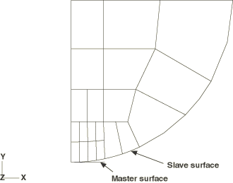

**图1.1.11-2** Hertz接触（无摩擦）示例的接触压力和接触压力误差指示器随位置的变化，Abaqus/Standard。

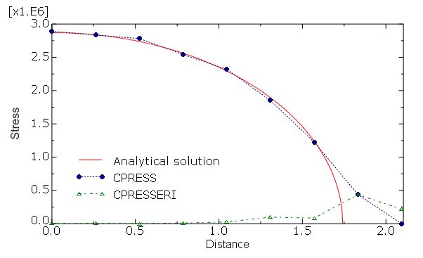

**图1.1.11-3** Hertz接触问题的Mises应力分布，Abaqus/Standard。

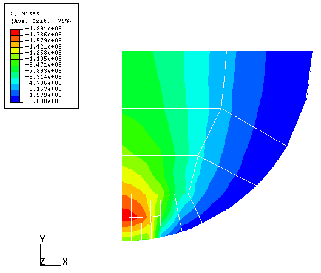

**图1.1.11-4** Hertz接触问题的位移构型，Abaqus/Standard。

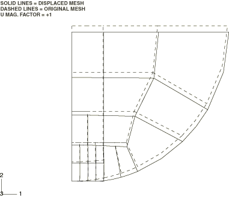

**图1.1.11-5** 使用CPE4R单元的Hertz接触示例的网格，Abaqus/Explicit。

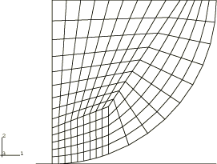

**图1.1.11-6** 使用CPE6M单元的Hertz接触示例的网格，Abaqus/Explicit。

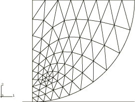

**图1.1.11-7** 使用CPE4R单元和运动接触的Hertz接触问题的接触压力等值线，Abaqus/Explicit。

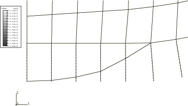

**图1.1.11-8** 使用CPE4R单元和罚接触的Hertz接触问题的接触压力等值线，Abaqus/Explicit。

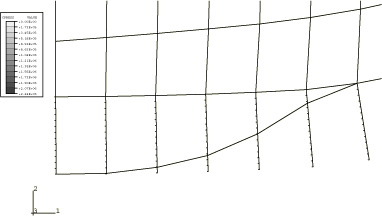

**图1.1.11-9** 使用CPE4R单元和运动接触的Hertz接触问题的Mises应力分布，Abaqus/Explicit。

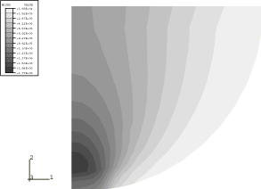

**图1.1.11-10** 使用CPE4R单元和罚接触的Hertz接触问题的Mises应力分布，Abaqus/Explicit。

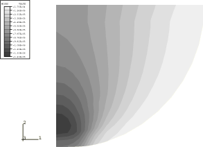

**图1.1.11-11** 使用CPE4R单元和运动接触的Hertz接触问题的位移构型，Abaqus/Explicit。

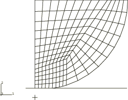

**图1.1.11-12** 使用CPE4R单元和罚接触的Hertz接触问题的位移构型，Abaqus/Explicit。

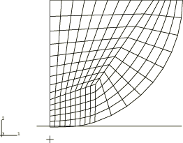

**图1.1.11-13** 使用CPE6M单元和运动接触的Hertz接触问题的接触压力等值线，Abaqus/Explicit。

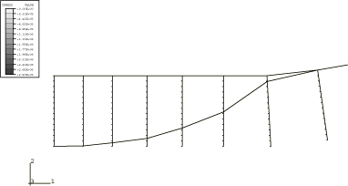

**图1.1.11-14** 使用CPE6M单元和运动接触的Hertz接触问题的Mises应力分布，Abaqus/Explicit。

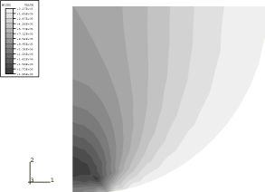

**图1.1.11-15** 使用CPE6M单元和运动接触的Hertz接触问题的位移构型，Abaqus/Explicit。

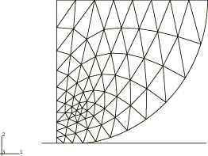

