# 1.2.1 梁的屈曲分析

**产品：** Abaqus/Standard

本示例说明了Abaqus在梁屈曲分析中的应用。这种屈曲研究通常需要两种类型的分析。

特征值分析用于获得屈曲载荷和模态的估计。特征值屈曲预测的概念是研究结构刚度矩阵线性扰动中的奇异性。如果线性扰动是结构屈曲前响应的真实反映，则所得估计值在设计中是有价值的。为了满足这种情况，结构响应应该是线弹性的。换句话说，特征值屈曲适用于"刚"结构（屈曲前只表现出小弹性变形的结构）。这种分析使用特征值屈曲过程执行（["特征值屈曲预测，" Abaqus分析用户指南第6.2.3节](../usb/usb-link.md#usb-anl-aeigenbuckling)），"活"载荷在步骤内施加。屈曲分析提供了活载荷必须乘以的因子以达到屈曲载荷。任何预载荷必须加上特征值屈曲步骤中的载荷以计算总崩溃载荷。

通常还需要考虑后屈曲响应是稳定的还是不稳定的，以及结构是否对缺陷敏感。在许多情况下，后屈曲刚度可能不是正的。崩溃载荷将强烈依赖于原始几何中的缺陷（"缺陷敏感性"）。这是通过在特征值预测之后进行结构的载荷-位移分析来解决的。通常这样做是在原始几何中假设一个以屈曲模态形式的缺陷，并研究该缺陷大小对响应的影响。材料非线性通常包含在这种崩溃研究中。本示例通过一些简单的经典梁问题说明了这些分析。

### 问题描述

本示例的目标包括研究轴向和横向载荷作用下的屈曲。这类研究通常分类如下：

1. 轴向压缩梁在弯曲模态中的弯曲屈曲（Euler屈曲）。
2. 在具有较高弯曲刚度的平面内横向加载的梁的侧向屈曲。这对于没有侧向支撑的梁的设计很重要，其中梁在加载平面内的弯曲刚度与侧向弯曲刚度相比很大。如果载荷超过临界值，梁的平面构型将变得不稳定。
3. 承受均匀轴向压缩的梁的扭转屈曲，在扭转模态中，同时其纵向轴线保持笔直。一般来说，扭转屈曲对于具有宽翼缘和短长度的薄壁柱很重要。

柱可能以任何这些模态屈曲。只有最低值在设计计算中具有实际意义。在一般情况下，屈曲失效可能通过扭转和弯曲的组合发生，这最好通过载荷-位移研究来解决。

我们考虑细长、弹性直梁，沿x轴定向，均具有如图1.2.1-1所示的I形截面（[图1.2.1-1](ch01s02ach14.md#sxmbeambuckling-xsection)）。截面尺寸适用于弯曲、侧向和扭转失稳问题的研究。梁假定由各向同性材料制成，弹性模量为211 GPa，泊松比为0.3125。网格由20个B31OS或10个B32OS梁单元组成，跨过12 m长的梁。这种离散化应该为前几个屈曲模态提供良好的准确性。此处未报告网格收敛性研究。

对于Euler屈曲问题，考虑悬臂梁。梁的夹持端所有自由度都被约束。输入数据见[beambuckle_b31os_isec_flex.inp](../eif/beambuckle_b31os_isec_flex.inp)。这个屈曲问题的一个有趣扩展是研究柱在进入后屈曲范围很远时的响应。这是最简单的经典"弹性曲线"问题，弹性曲线是由某种载荷弯曲的弹性曲线（见Timoshenko和Gere，1961）。对于这项研究，引入了一个以最低屈曲模态形式存在的初始缺陷，峰值大小为梁厚度的10%。使用Riks技术。施加一个大小等于临界载荷的轴向力，当轴向力变为施加载荷的六倍时停止分析。

对于侧向/扭转屈曲问题，在一个支撑节点处约束所有位移分量和关于x轴的旋转。在另一个支撑节点处约束y和z方向的位移，以及关于x轴的旋转。使用I形截面和任意截面类型测试梁截面。使用I形截面、任意截面和一般截面类型测试一般梁截面。（具有线性响应的一般梁截面与开口截面梁单元的组合需要指定翘曲常数。）

[beambuckle_b31os_isec_lat.inp](../eif/beambuckle_b31os_isec_lat.inp)显示了用于特征值屈曲分析的输入数据。分布载荷作为载荷类型PZ施加，大小为1 N/m。然后执行载荷-位移分析，崩溃定义为在非常小的载荷增量下发生的大运动。使用的模型必须提供切换到屈曲模态的方式。为此使用轻微的初始缺陷。特征值屈曲分析的第一模态被缩放以使最大旋转等于翼缘宽度的1%。平移位移被等比例缩放并添加到节点坐标以定义扰动或有缺陷的几何数据。每个节点处的法线基于特征值分析的缩放旋转定义。由于预期会发生失稳，使用Riks方法。当中间节点的侧向位移（）大于梁的翼缘宽度时，分析终止。此载荷-位移分析的输入见[beambuckle_b31os_arbsec_lat.inp](../eif/beambuckle_b31os_arbsec_lat.inp)。

用于特征值扭转屈曲分析的模型与用于侧向屈曲分析的模型相同。在这里，10 N的集中轴向载荷施加到梁的一端。[beambuckle_b31os_tors_gsec.inp](../eif/beambuckle_b31os_tors_gsec.inp)显示了这个分析的输入。

### 结果与讨论

Timoshenko和Gere（1961）给出的模态n的临界弯曲屈曲载荷为：

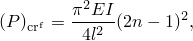

其中E是弹性模量，I是惯性矩，l是梁的长度。

Abaqus提供的屈曲载荷估计值如表1.2.1-1所示（[表1.2.1-1](ch01s02ach14.md#table-beambuckling-flex-ests)）。实际上只有最低模态是重要的，比此处使用的更粗的网格将准确地给出该模态。

对于弹性曲线问题，柱尖端的x和y位置显示为载荷的函数，如图1.2.1-2（[图1.2.1-2](ch01s02ach14.md#sxmbeambuckling-elastica)）所示。柱的变形形状如图1.2.1-3（[图1.2.1-3](ch01s02ach14.md#sxmbeambuckling-deformed)）所示。

Timoshenko和Gere（1961）给出的临界侧向屈曲载荷为：

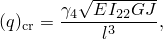

其中E是弹性模量，G是剪切模量，l是梁的长度，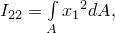和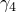是一个依赖于载荷和比率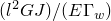的无量纲因子，其中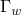是翘曲常数：

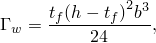

J是扭转常数：

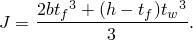

这里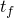是翼缘厚度，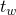是腹板厚度，h是截面高度，b是翼缘宽度。对于我们的模型，这给出临界载荷为62.5 N/mm。使用20个线性开口截面梁单元的特征值屈曲分析预测临界载荷为62.47 N/mm。载荷-位移分析显示在非常接近预期临界值的载荷下严重丧失刚度，如图1.2.1-4（[图1.2.1-4](ch01s02ach14.md#sxmbeambuckling-loadvdefl)）所示。

Timoshenko和Gere（1961）给出的模态n的临界扭转屈曲载荷为：

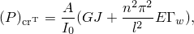

其中A是截面积，是关于剪切中心的截面极惯性矩。Abaqus提供的扭转屈曲载荷估计值如表1.2.1-2所示（[表1.2.1-2](ch01s02ach14.md#table-beambuckling-andtors-ests)）。

### 输入文件

[beambuckle_b31os_isec_flex.inp](../eif/beambuckle_b31os_isec_flex.inp)

用于弯曲特征值屈曲预测的带[*BEAM SECTION](../key/key-link.md#usb-kws-mbeamsection)，SECTION=I的B31OS单元。

[beambuckle_b31os_isec_lat.inp](../eif/beambuckle_b31os_isec_lat.inp)

用于侧向特征值屈曲分析的带[*BEAM SECTION](../key/key-link.md#usb-kws-mbeamsection)，SECTION=I的B31OS单元。

##### **使用Lanczos求解器**

[beambuckle_b31os_lanczos.inp](../eif/beambuckle_b31os_lanczos.inp)

与beambuckle_b31os_isec_flex.inp相同，只是使用[*FREQUENCY](../key/key-link.md#usb-kws-hfrequency)，EIGENSOLVER=LANCZOS进行给定范围内的特征值屈曲分析。

##### **侧向屈曲载荷-位移分析**

[beambuckle_b31os_load_isec.inp](../eif/beambuckle_b31os_load_isec.inp)

带[*BEAM SECTION](../key/key-link.md#usb-kws-mbeamsection)，SECTION=I的B31OS单元。

[beambuckle_b31os_dload_isec.inp](../eif/beambuckle_b31os_dload_isec.inp)

带[*BEAM SECTION](../key/key-link.md#usb-kws-mbeamsection)，SECTION=I和压力载荷的B31OS单元。

[beambuckle_b31os_arbsec_lat.inp](../eif/beambuckle_b31os_arbsec_lat.inp)

带[*BEAM SECTION](../key/key-link.md#usb-kws-mbeamsection)，SECTION=ARBITRARY的B31OS单元。

[beambuckle_b31os_load_gseci.inp](../eif/beambuckle_b31os_load_gseci.inp)

带[*BEAM GENERAL SECTION](../key/key-link.md#usb-kws-mbeamgensect)，SECTION=I的B31OS单元。

[beambuckle_b31os_load_arbsec.inp](../eif/beambuckle_b31os_load_arbsec.inp)

带[*BEAM GENERAL SECTION](../key/key-link.md#usb-kws-mbeamgensect)，SECTION=ARBITRARY的B31OS单元。

[beambuckle_b31os_load_gsecg.inp](../eif/beambuckle_b31os_load_gsecg.inp)

带[*BEAM GENERAL SECTION](../key/key-link.md#usb-kws-mbeamgensect)，SECTION=GENERAL的B31OS单元。

[beambuckle_b32os_load_isec.inp](../eif/beambuckle_b32os_load_isec.inp)

带[*BEAM SECTION](../key/key-link.md#usb-kws-mbeamsection)，SECTION=I的B32OS单元。

[beambuckle_b32os_load_arbsec.inp](../eif/beambuckle_b32os_load_arbsec.inp)

带[*BEAM SECTION](../key/key-link.md#usb-kws-mbeamsection)，SECTION=ARBITRARY的B32OS单元。

[beambuckle_b32os_load_gseci.inp](../eif/beambuckle_b32os_load_gseci.inp)

带[*BEAM GENERAL SECTION](../key/key-link.md#usb-kws-mbeamgensect)，SECTION=I的B32OS单元。

[beambuckle_b32os_load_garbsec.inp](../eif/beambuckle_b32os_load_garbsec.inp)

带[*BEAM GENERAL SECTION](../key/key-link.md#usb-kws-mbeamgensect)，SECTION=ARBITRARY的B32OS单元。

[beambuckle_b32os_load_gsecg.inp](../eif/beambuckle_b32os_load_gsecg.inp)

带[*BEAM GENERAL SECTION](../key/key-link.md#usb-kws-mbeamgensect)，SECTION=GENERAL的B32OS单元。

##### **扭转特征值屈曲分析**

[beambuckle_b31os_tors_isec.inp](../eif/beambuckle_b31os_tors_isec.inp)

带[*BEAM SECTION](../key/key-link.md#usb-kws-mbeamsection)，SECTION=I的B31OS单元。

[beambuckle_b31os_tors_gsec.inp](../eif/beambuckle_b31os_tors_gsec.inp)

带[*BEAM GENERAL SECTION](../key/key-link.md#usb-kws-mbeamgensect)的B31OS单元。

[beambuckle_b31os_tors_gseci.inp](../eif/beambuckle_b31os_tors_gseci.inp)

带[*BEAM GENERAL SECTION](../key/key-link.md#usb-kws-mbeamgensect)，SECTION=I的B31OS单元。

[beambuckle_b32os_tors_isec.inp](../eif/beambuckle_b32os_tors_isec.inp)

带[*BEAM SECTION](../key/key-link.md#usb-kws-mbeamsection)，SECTION=I的B32OS单元。

##### **弹性曲线研究**

[beambuckle_b21_elastica.inp](../eif/beambuckle_b21_elastica.inp)

带[*BEAM GENERAL SECTION](../key/key-link.md#usb-kws-mbeamgensect)，SECTION=GENERAL的B21单元。

[beambuckle_b21h_elastica.inp](../eif/beambuckle_b21h_elastica.inp)

带[*BEAM GENERAL SECTION](../key/key-link.md#usb-kws-mbeamgensect)，SECTION=GENERAL的B21H单元。

[beambuckle_b22_elastica.inp](../eif/beambuckle_b22_elastica.inp)

带[*BEAM GENERAL SECTION](../key/key-link.md#usb-kws-mbeamgensect)，SECTION=GENERAL的B22单元。

[beambuckle_b22h_elastica.inp](../eif/beambuckle_b22h_elastica.inp)

带[*BEAM GENERAL SECTION](../key/key-link.md#usb-kws-mbeamgensect)，SECTION=GENERAL的B22H单元。

[beambuckle_b23_elastica.inp](../eif/beambuckle_b23_elastica.inp)

带[*BEAM GENERAL SECTION](../key/key-link.md#usb-kws-mbeamgensect)，SECTION=GENERAL的B23单元。

[beambuckle_b23h_elastica.inp](../eif/beambuckle_b23h_elastica.inp)

带[*BEAM GENERAL SECTION](../key/key-link.md#usb-kws-mbeamgensect)，SECTION=GENERAL的B23H单元。

[beambuckle_b31_elastica.inp](../eif/beambuckle_b31_elastica.inp)

带[*BEAM SECTION](../key/key-link.md#usb-kws-mbeamsection)，SECTION=I的B31单元。

[beambuckle_b31h_elastica.inp](../eif/beambuckle_b31h_elastica.inp)

带[*BEAM SECTION](../key/key-link.md#usb-kws-mbeamsection)，SECTION=I的B31H单元。

[beambuckle_b31os_elastica.inp](../eif/beambuckle_b31os_elastica.inp)

带[*BEAM SECTION](../key/key-link.md#usb-kws-mbeamsection)，SECTION=I的B31OS单元。

[beambuckle_b31osh_elastica.inp](../eif/beambuckle_b31osh_elastica.inp)

带[*BEAM SECTION](../key/key-link.md#usb-kws-mbeamsection)，SECTION=I的B31OSH单元。

[beambuckle_b32_elastica.inp](../eif/beambuckle_b32_elastica.inp)

带[*BEAM SECTION](../key/key-link.md#usb-kws-mbeamsection)，SECTION=I的B32单元。

[beambuckle_b32h_elastica.inp](../eif/beambuckle_b32h_elastica.inp)

带[*BEAM SECTION](../key/key-link.md#usb-kws-mbeamsection)，SECTION=I的B32H单元。

[beambuckle_b32os_elastica.inp](../eif/beambuckle_b32os_elastica.inp)

带[*BEAM SECTION](../key/key-link.md#usb-kws-mbeamsection)，SECTION=I的B32OS单元。

[beambuckle_b32osh_elastica.inp](../eif/beambuckle_b32osh_elastica.inp)

带[*BEAM SECTION](../key/key-link.md#usb-kws-mbeamsection)，SECTION=I的B32OSH单元。

[beambuckle_b33_elastica.inp](../eif/beambuckle_b33_elastica.inp)

带[*BEAM SECTION](../key/key-link.md#usb-kws-mbeamsection)，SECTION=I的B33单元。

[beambuckle_b33h_elastica.inp](../eif/beambuckle_b33h_elastica.inp)

带[*BEAM SECTION](../key/key-link.md#usb-kws-mbeamsection)，SECTION=I的B33H单元。

[beambuckle_pipe21_elastica.inp](../eif/beambuckle_pipe21_elastica.inp)

带[*BEAM SECTION](../key/key-link.md#usb-kws-mbeamsection)，SECTION=PIPE的PIPE21单元。

[beambuckle_pipe21h_elastica.inp](../eif/beambuckle_pipe21h_elastica.inp)

带[*BEAM SECTION](../key/key-link.md#usb-kws-mbeamsection)，SECTION=PIPE的PIPE21H单元。

[beambuckle_pipe22_elastica.inp](../eif/beambuckle_pipe22_elastica.inp)

带[*BEAM SECTION](../key/key-link.md#usb-kws-mbeamsection)，SECTION=PIPE的PIPE22单元。

[beambuckle_pipe22h_elastica.inp](../eif/beambuckle_pipe22h_elastica.inp)

带[*BEAM SECTION](../key/key-link.md#usb-kws-mbeamsection)，SECTION=PIPE的PIPE22H单元。

[beambuckle_pipe31_elastica.inp](../eif/beambuckle_pipe31_elastica.inp)

带[*BEAM SECTION](../key/key-link.md#usb-kws-mbeamsection)，SECTION=PIPE的PIPE31单元。

[beambuckle_pipe31h_elastica.inp](../eif/beambuckle_pipe31h_elastica.inp)

带[*BEAM SECTION](../key/key-link.md#usb-kws-mbeamsection)，SECTION=PIPE的PIPE31H单元。

[beambuckle_pipe32_elastica.inp](../eif/beambuckle_pipe32_elastica.inp)

带[*BEAM SECTION](../key/key-link.md#usb-kws-mbeamsection)，SECTION=PIPE的PIPE32单元。

[beambuckle_pipe32h_elastica.inp](../eif/beambuckle_pipe32h_elastica.inp)

带[*BEAM SECTION](../key/key-link.md#usb-kws-mbeamsection)，SECTION=PIPE的PIPE32H单元。

### 参考

Timoshenko, S. P., and J. M. Gere, Theory of Elastic Stability, 2nd Edition, McGraw-Hill, New York, 1961.

### 表格

**表1.2.1-1** 弯曲屈曲载荷估计值（单位为MN）。

| 特征向量 | 估计 | 理论 | 方向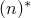 |
| --- | --- | --- | --- |
|  | 屈曲载荷 | 屈曲载荷 |  |
| 1 | 0.4371 | 0.4398 | *y* (1) |
| 2 | 3.9267 | 3.9587 | *y* (2) |
| 3 | 7.4575 | 7.5182 | *z* (1) |
| 4 | 10.8670 | 10.9965 | *y* (3) |
| 5 | 21.1796 | 21.5530 | *y* (4) |
| 6 | 34.7394 | 35.6285 | *y* (5) |
| 7 | 51.3717 | 53.2228 | *y* (6) |
| 8 | 63.0448 | 67.6640 | *z* (2) |
| 9 | 70.8435 | 74.3360 | *y* (7) |
| 10 | 92.8553 | 98.9680 | *y* (8) |
| 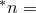 半正弦波的数量 |

**表1.2.1-2** 弯曲和扭转屈曲载荷估计值（单位为MN）。

| 特征向量 | 估计 | 理论 | 模态 (*n*) |
| --- | --- | --- | --- |
|  | 屈曲载荷 | 屈曲载荷 |  |
| 1 | 1.7544 | 1.7704 | 弯曲 - *y* (1) |
| 2 | 6.4235 | 6.4134 | 扭转 (1) |
| 3 | 7.0577 | 7.0814 | 弯曲 - *y* (2) |
| 4 | 13.1363 | 13.0300 | 扭转 (2) |
| 5 | 16.0307 | 15.9330 | 弯曲 - *y* (3) |
| 6 | 24.5735 | 24.0590 | 扭转 (3) |
| 7 | 28.8769 | 28.3260 | 弯曲 - *y* (4) |
| 8 | 29.7522 | 30.1110 | 弯曲 - *z* (1) |
| 9 | 41.1234 | 39.4980 | 扭转 (4) |
| 10 | 45.8840 | 44.2590 | 弯曲 - *y* (5) |

### 图表

**图1.2.1-1** 梁截面细节。

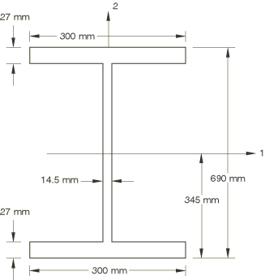

**图1.2.1-2** 弹性曲线结果。

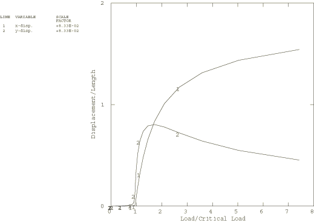

**图1.2.1-3** 弹性曲线的渐进变形构型。

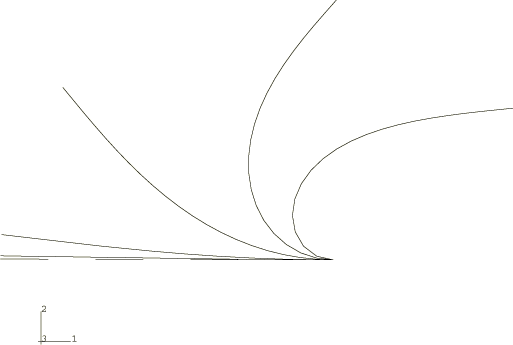

**图1.2.1-4** 侧向屈曲问题的载荷与挠度曲线。

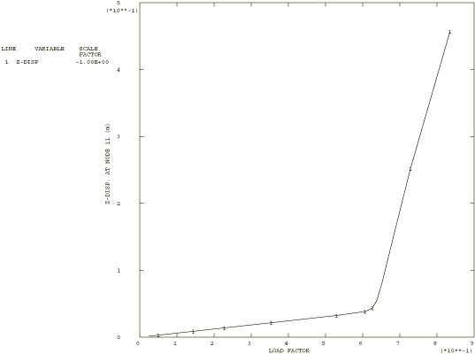

