# 1.3.5 单自由度系统的大转动

**产品：** Abaqus/Standard

这个问题是一个柔性结构大转动问题的基本示例。由于它只涉及一个自由度，因此可以非常简单地以闭式求解。因此，它方便地说明了几何非线性分析的一些方面。

### 问题描述

问题如图 1.3.5-1 所示（[图 1.3.5-1](ch01s03ach24.md#sxmlargerotat-geom)）。一根均匀杆，一端铰接，另一端可沿一个方向自由滑动，承受初始压缩载荷。我们假设杆的响应完全是线性弹性的，因此唯一的非线性来自旋转。我们还假设杆移动端相对于水平位置的高度 *h* 与支撑件之间的水平距离 *d* 相比很小，因此只要 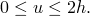，杆中的应变就很小。

解显然涉及不稳定性，因为需要非零力才能开始将杆的端点向下位移，但当杆变为水平时力必须降回零：这个水平位置是一个不稳定平衡位置。由于问题只涉及一个位移变量，不可能出现分叉，因此与可能涉及不稳定性的多自由度系统相比，行为相当简单。此外，位移变量是给定的，因此实际上这个问题中没有未知量。为了在规则位移间隔获得解，自动时间增量被关闭。

结构在整个变形过程中表现出非线性响应，不像典型的"刚性"壳型结构通常在屈曲之前几乎以线性方式行为。因此，这类问题无法通过特征值屈曲程序有效分析。然而，由于可以容易地得出该问题的精确解（见下文），该示例是一个简单几何非线性分析的有用说明。

使用 Abaqus 可以建立两个简单模型——一个使用单个 T2D2 型桁架单元，另一个使用 SPRING 单元。这两个模型之间有两个区别。一是应变测量方式。由于桁架单元通常与 Abaqus 中的标准本构模型一起使用，它使用对数应变。对于弹簧，"应变"是根据其两端之间的距离变化计算的。第二个区别是桁架中的力计算为应力乘以面积，面积随桁架变形而更新，使用桁架不可压缩因此体积恒定的假设。在弹簧中，力由输入数据中给出的弹簧刚度乘以"应变"直接定义。因此，这两个模型的精确解不相同，但它们只显示微小差异，因为选择了尺寸使得整个变形过程中应变很小。如果涉及大应变，差异将很显著。

### 精确解：桁架模型

假设桁架中的应变是均匀的，因此对数应变定义给出

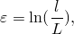

其中 *l* 是桁架的当前长度，*L* 是其原始长度。从 [图 1.3.5-1](ch01s03ach24.md#sxmlargerotat-geom) 的几何关系，我们得到结果

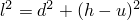

和

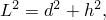

因此应变用位移表示为

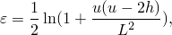

其第一变分为

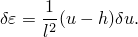

我们假设桁架材料以线性弹性方式响应，因此应力为

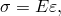

其中 *E* 是杨氏模量。假设初始横截面积为 *A* 且材料不可压缩，虚功方程为

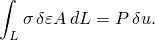

由于应力和应变是均匀的，对桁架体积的积分为

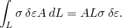

将上述 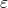、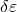 和  的结果代入，此方程给出

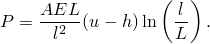

此方程是系统的静力平衡方程，如图 1.3.5-2（[图 1.3.5-2](ch01s03ach24.md#sxmlargerotat-loadvdisp)）所示。[largerotation1dof_truss.inp](../eif/largerotation1dof_truss.inp) 显示了此问题，通过在整个步骤中规定位移 *u* 来加载。这给出了上述的精确解。

### 精确解：弹簧模型

弹簧中的力定义为

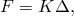

其中 *K* 是输入数据中给出的弹簧刚度， 是弹簧长度的变化。根据上面的讨论，我们有

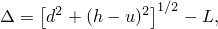

因此长度的变化的变分为

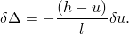

虚功原理给出

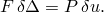

在表达式中使用力-相对位移关系和 –*u* 关系给出平衡方程

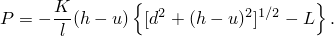

[largerotation1dof_spring.inp](../eif/largerotation1dof_spring.inp) 显示了此版本的问题，也是通过规定位移来加载。这给出了上述的精确响应。

### 结果与讨论

平衡响应的形式很有趣，因为在某些方面它代表了某些重要实际案例的响应。初始响应是稳定的且非线性不强。随着位移增加，系统失去刚度直到达到载荷的极限值 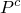。发生这种情况的位移约为 *h* 的 42%。超过该值后响应变得不稳定（系统具有负刚度），直到位移约为 *h* 的 158% 时再次变得稳定。（临界位移值和相应的载荷值可以从 [图 1.3.5-2](ch01s03ach24.md#sxmlargerotat-loadvdisp) 的图中估计，也可以从上面给出的平衡方程精确计算。）因此，对于范围 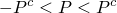 内的任何载荷，系统具有三个静力平衡构型，其中两个稳定，一个不稳定。在该载荷范围之外，系统只有一个稳定的静力平衡构型。因此，我们观察到，即使在只有一個自由度的简单弹性系统中，当引入几何非线性时，解的唯一性和稳定性也会丧失。在这个简单的情况下，通过规定系统的唯一活动自由度，可以容易地获得不稳定响应阶段的平衡解。在更实际的情况下，必须使用"Riks"算法——这种用法在本章的其他几个示例中有所说明。

### 输入文件

[largerotation1dof_truss.inp](../eif/largerotation1dof_truss.inp)

用于使用桁架单元获得 [图 1.3.5-2](ch01s03ach24.md#sxmlargerotat-loadvdisp) 的规定位移结果。

[largerotation1dof_spring.inp](../eif/largerotation1dof_spring.inp)

用于使用弹簧单元获得规定位移结果。

### 图表

**图 1.3.5-1** 弹性大转动桁架示例。

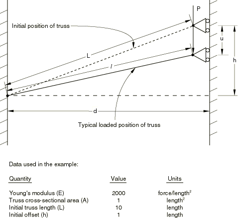

**图 1.3.5-2** 桁架示例的载荷-位移响应。

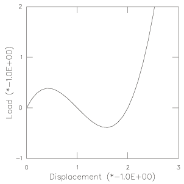
