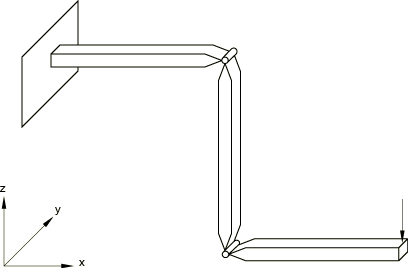
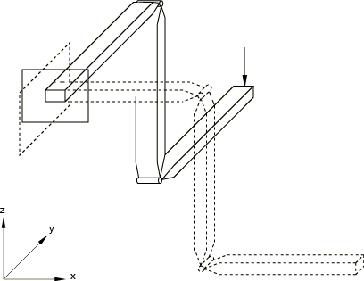

# 1.3.8 旋转 MPC 验证：曲柄转动

**产品：** Abaqus/Standard

本示例旨在说明和验证在简单运动学系统中使用旋转关节（REVOLUTE MPC）。

### 问题描述

[图 1.3.8-1](ch01s03ach27.md#sxmcrank-initial) 显示了旋转关节被旋转以形成曲柄后的模型。曲柄由三段组成，每段 400 mm 长。最初它们都沿全局 *x* 轴放置。各段具有相同的方形横截面 20.3 mm×20.3 mm，由杨氏模量为 200 GPa、泊松比为 0.0 的材料制成。各段通过旋转关节连接，关节轴最初平行于全局 *y* 轴。

曲柄段用单元类型 B31H 建模。选择这种"混合"梁单元公式，因为它在相对刚性构件经历大角运动的情况下提供非线性解的快速收敛。旋转关节用 REVOLUTE MPC 建模（《Abaqus 分析用户指南》第 35.2.2 节"通用多点约束"，../usb/usb-link.md#usb-cni-pmpc）。这需要为关节两侧提供单独的节点，以及第三个节点用于定义旋转轴。第三方由度 6 表示关节中的相对旋转。第二和第三个节点之间的线定义关节轴的初始方向。

### 载荷

曲柄一端固定。旋转关节最初被锁定，498.2 N 的载荷施加在曲柄自由端的 *z* 方向。然后旋转关节承受大小为 /2 的相反内旋转，从而产生如图 1.3.8-1 所示的曲柄状几何形状。最后，整个曲柄绕全局 *z* 轴旋转角度 /2。

### 结果与讨论

分析包括一个初始线性扰动步骤，其中直曲柄加载时不考虑几何非线性。引入此步骤主要用于模型的验证。简单梁理论显示第一步结束时尖端挠度应为 107.95 mm。分析给出值为 106.8 mm。考虑几何非线性的相同载荷给出尖端位移为 105.9 mm——稍小一些，因为这种情况下梁的弯曲增强了其响应。

在下一步中，在关节中施加相对旋转以使梁成为曲柄，而载荷保持在尖端。90° 旋转通过规定相对旋转节点（节点 12 和 14）上自由度 6 的值分四个增量施加。作为比较，我们用刚性关节分析由 B31H 单元制成的曲柄。此分析获得的尖端位移 40.64 mm 与使用旋转关节的分析完全一致，考虑到由旋转关节旋转引起的 400 mm 位移。

最后一步将整个曲柄绕全局 *z* 轴旋转 90°。这分四个增量完成。最终构型如图 1.3.8-2（[图 1.3.8-2](ch01s03ach27.md#sxmcrank-final)）所示。

### 输入文件

[revolutempc_joints.inp](../eif/revolutempc_joints.inp)

带旋转关节的曲柄。

[revolutempc.inp](../eif/revolutempc.inp)

不带旋转关节的曲柄。

### 图表

**图 1.3.8-1** 曲柄：初始构型。

**图 1.3.8-2** 曲柄：最终（加载）构型。

