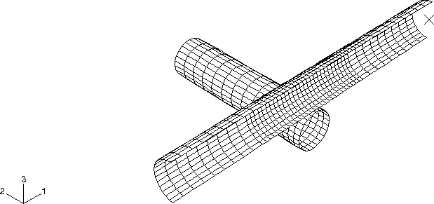
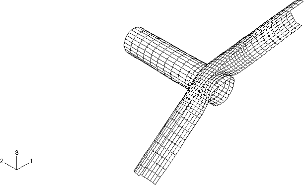
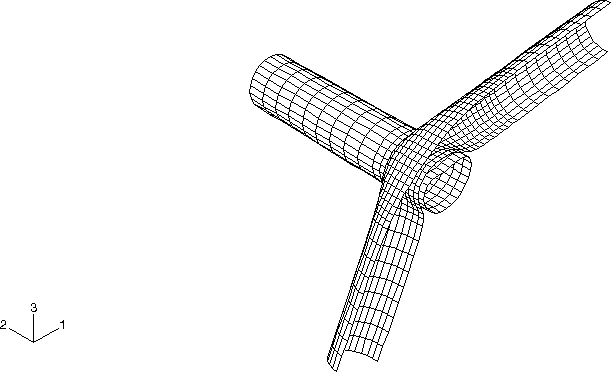
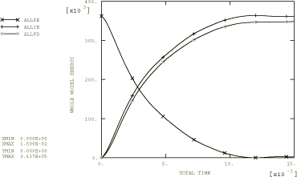

# 1.3.9 管道甩击模拟

**产品：** Abaqus/Standard  Abaqus/Explicit

本示例模拟由于电厂高压管线的破裂而导致的管道对管道撞击。假定流体的突然释放可能导致一个管道段绕其支撑旋转并撞击相邻管道。

### 问题描述

管道外径为 168.275 mm（6.625 in），壁厚为 10.97 mm（0.432 in），支撑间距为 1270 mm（50 in）。被撞击管道假定两端完全约束，而撞击管道允许绕固定枢轴旋转，初始角速度为 75 radian/sec。我们利用对称边界条件来减少问题规模，仅对中心对称平面一侧的几何进行网格划分。

两根管道均由钢制成，弹性模量为 207 GPa（30 × 10^6 psi），泊松比为 0.3，密度为 7827 kg/m³（7.324 × 10^-4 lb·s²/in⁴）。采用 von Mises 弹性理想塑性材料模型，屈服应力为 310 MPa（45 × 10^3 psi）。

使用 S4R 壳单元对管道进行网格划分。在管道中部附近使用更高水平的网格细化，这是撞击发生的位置。网格如[图 1.3.9-1](ch01s03ach28.md#exxpipewhip-undefmesh)所示。接触表面沿每根管道的整个长度定义，然后分组为单个接触对。主输入文件使用运动接触 enforcement，但同时也提供了使用罚接触对和一般接触的模型。进行了具有增强沙漏控制的额外分析。

### 结果和讨论

分析不同阶段的变形形状（如图 1.3.9-2](ch01s03ach28.md#exxpipewhip-deform-5)至[图 1.3.9-4](ch01s03ach28.md#exxpipewhip-deform-15)所示）与 Ferencz（1989）报告的结果非常一致。具有增强沙漏控制的分析与默认沙漏控制获得的结果非常一致。

分析持续时间内总动能、内能和塑性耗散的时间历史如[图 1.3.9-5](ch01s03ach28.md#exxpipewhip-timehists)所示。在模拟接近结束时，撞击管道开始反弹，通过在压碎区域中的非弹性变形耗散了大部分动能。

基于罚接触的分析提供的结果大致相同。由于罚方法的时间增量略小，使用替代接触方法的分析成本增加了 2.5%。

### 输入文件

##### **Abaqus/Standard 输入文件**

[pipewhip_std.inp](../eif/pipewhip_std.inp)

使用 S4R 单元的接触对分析。

##### **Abaqus/Explicit 输入文件**

[pipewhip.inp](../eif/pipewhip.inp)

使用 S4R 单元的接触对分析。

[pipewhip_gcont.inp](../eif/pipewhip_gcont.inp)

使用 S4R 单元的一般接触分析。

[pipewhip_enh.inp](../eif/pipewhip_enh.inp)

使用 S4R 单元和增强沙漏控制的接触对分析。

[pipewhip_enh_gcont.inp](../eif/pipewhip_enh_gcont.inp)

使用 S4R 单元和增强沙漏控制的一般接触分析。

[pipewhip_s4rs.inp](../eif/pipewhip_s4rs.inp)

使用小应变壳单元 S4RS 的接触对分析。

[pipewhip_s4rs_gcont.inp](../eif/pipewhip_s4rs_gcont.inp)

使用小应变壳单元 S4RS 的一般接触分析。

[pipewhip_s4rs_gcont_subcyc.inp](../eif/pipewhip_s4rs_gcont_subcyc.inp)

使用小应变壳单元 S4RS 和子循环的一般接触分析。

[pipewhip_s4rsw.inp](../eif/pipewhip_s4rsw.inp)

使用小应变壳单元 S4RSW 的接触对分析。

[pipewhip_s4rsw_gcont.inp](../eif/pipewhip_s4rsw_gcont.inp)

使用小应变壳单元 S4RSW 的一般接触分析。

[pipewhip_pnlty.inp](../eif/pipewhip_pnlty.inp)

使用罚接触的接触对分析。

四个附加模型随 Abaqus 版本一起提供，仅用于测试代码性能（文件名：[pipewhip_medium.inp](../eif/pipewhip_medium.inp)、[pipewhip_medium_gcont.inp](../eif/pipewhip_medium_gcont.inp)、[pipewhip_fine.inp](../eif/pipewhip_fine.inp) 和 [pipewhip_fine_gcont.inp](../eif/pipewhip_fine_gcont.inp)）。

### 参考文献

Ferencz, R. M., "Element-by-Element Preconditioning Techniques for Large-Scale, Vectorized Finite Element Analysis in Nonlinear Solid and Structural Mechanics," Ph. D. Dissertation, Stanford University, Stanford, CA, 1989.

### 图形

**图 1.3.9-1** 未变形网格。

**图 1.3.9-2** 5 毫秒时的变形形状。

**图 1.3.9-3** 10 毫秒时的变形形状。

**图 1.3.9-4** 15 毫秒时的变形形状。

**图 1.3.9-5** 总动能、内能和塑性耗散的时间历史。

