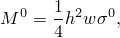
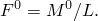
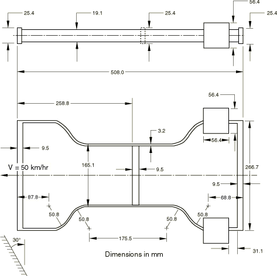
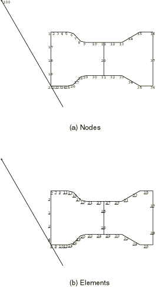
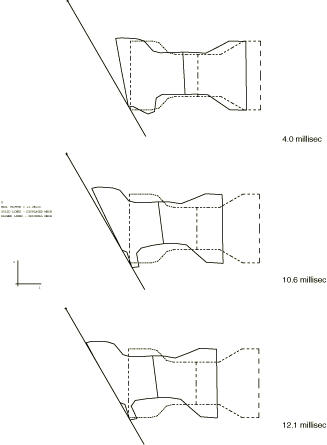
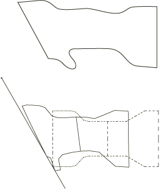
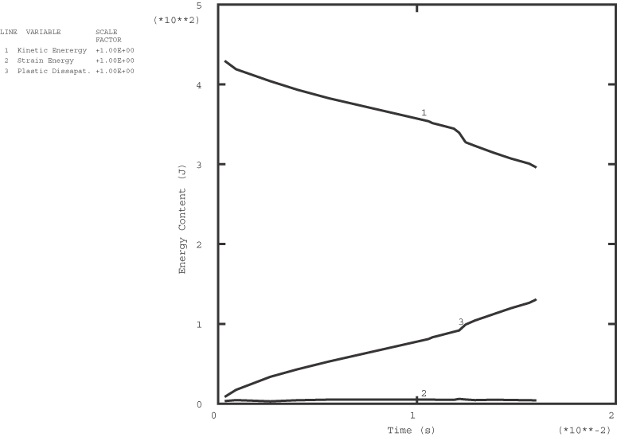

# 1.3.14 机动车碰撞模拟

**产品：** Abaqus/Standard

本示例是机动车碰撞模拟的基本说明。这是有实验结果可用的情况（Mouldenhauer，1980），因此可提供数值结果的验证。

[图 1.3.14-1](ch01s03ach33.md#sxmautocrash-geom) 显示了结构，它是由钢制成的典型机动车车架的比例模型。车架以 13.89 m/s（50 km/h——约 31 英里/小时）的速度向前移动，当它与相对于其运动方向成 30° 的斜刚性墙碰撞时。分析的目的是预测碰撞过程中车架变形的历史。

### 问题描述

物理结构的尺寸如图 1.3.14-1（[图 1.3.14-1](ch01s03ach33.md#sxmautocrash-geom)）所示。有限元理想化如图 1.3.14-2（[图 1.3.14-2](ch01s03ach33.md#sxmautocrash-model)）所示。使用一阶梁单元（单元类型 B21）对车架进行建模。

车架与平面刚性墙之间的接触用接触对建模。可能与墙接触的车架的各个节点被分配给基于节点的表面。或者，车架的外表面可以使用基于单元的表面定义。刚性墙建模为解析刚性表面，结合刚性体约束和表面定义。基于节点的表面与刚性表面之间的机械相互作用假定为无摩擦。

尚未进行网格收敛研究，但此分析结果与实验观察到的变形之间的合理比较表明网格是足够的，因为行为的主要方面被相当准确地预测。

车架沿 *x* 轴定向，面向左侧的刚性表面。13.89 m/s 的初始速度为车架每个节点在负 *x* 方向规定。

### 控制和容差

此分析明显涉及大变形，因此必须在步骤定义中包含几何非线性。

隐式动态积分的自动时间步长算法要求设置半增量残差容差。在这样的示例中，我们的目标是获得中等精度和低计算成本的解。此外，此问题涉及非常大的能量耗散（由塑性变形引起），因此高频响应将迅速阻尼。因此，比实际典型力大一到两个数量级的半增量残差容差应该会给出可接受的结果。

可以通过考虑在合理悬臂长度基础上在构件中产生完全塑性铰所需的力来估计典型力大小。矩形截面中完全塑性铰处的弯矩为

其中  是屈服应力，*h* 是其弯曲平面中的截面厚度，*w* 是另一个方向的截面宽度。在长度 *L* 的悬臂中产生此弯矩所需的力为

使用侧轨之一的前段计算本问题的  给出值 135 N。基于此计算，我们将半增量残差容差设置为 10000 N。

### 材料

材料的弹性模量为 213 GPa，质量密度 7850 kg/m³。初始屈服应力为 221.2 MPa，具有各向同性强化到塑性应变 5.5×10⁻⁴ 时应力 250 MPa，超出该应变值后为完全塑性。

假定刚性表面无摩擦。

### 结果与讨论

隐式分析需要约 420 个增量才能达到车架整个前端与刚性表面接触且车架基本坍塌的阶段。在分析早期，时间增量非常小，因为初始撞击引发应力波效应，这些波在整个模型中传播并携带能量：在此期间需要小增量来准确建模动力学。随后，高频响应被塑性屈服阻尼出去，时间增量可以增加而不会损失准确性。

[图 1.3.14-3](ch01s03ach33.md#sxmautocrash-defconfigs) 显示了不同时刻变形构型的预测，并提供了事件历史的说明。[图 1.3.14-4](ch01s03ach33.md#sxmautocrash-compare) 比较了 10 ms 时预测构型与实验研究的结果。分析与实验结果之间的相关性非常令人鼓舞，特别是考虑到相对粗糙的网格。[图 1.3.14-5](ch01s03ach33.md#sxmautocrash-energy) 显示了车架相对于时间的总动能、应变能和塑性耗散的变化。约 12.5 ms 后，初始动能的约五分之一已被耗散为塑性功。

### 输入文件

[autocrashsimulation.inp](../eif/autocrashsimulation.inp)

隐式分析。

### 参考

Moldenhauer, H., "Oblique Impact of a Motor Vehicle (Crash simulation with Abaqus)," Control Data Corporation, Frankfurt, W. Germany, July 1980.

### 图表

**图 1.3.14-1** 机动车车架碰撞研究。

**图 1.3.14-2** 机动车车架碰撞研究：有限元模型。

**图 1.3.14-3** 变形构型。

**图 1.3.14-4** 10 ms 时测量和预测构型的比较。

**图 1.3.14-5** 整个求解过程中的总能量含量。

