# 1.3.15 桁架撞击刚性墙

**产品：** Abaqus/Standard  Abaqus/Explicit

### 问题描述

此验证问题展示了 Abaqus/Explicit 中的运动接触和罚接触以及 Abaqus/Standard 中动力接触的特性。该问题研究了桁架撞击刚性墙的动力响应。分析使用粗网格和细化网格完成，分别如图 1.3.15-1](ch01s03ach34.md#exxtrussimpact-coarsmesh)和[图 1.3.15-2](ch01s03ach34.md#exxtrussimpact-finemesh)所示。

桁架长度 *L*=2 m，横截面积 *A*=0.2 m²。边界条件作用于桁架节点，仅允许水平运动，将问题简化为一维。对于粗网格，桁架使用五个 T2D2 单元进行网格划分；细化网格分析使用 10 个单元。桁架由钢制成，弹性模量 *E*=200 GPa，泊松比 =0.3，密度 =7800 kg/m³。材料保持线弹性。桁架的初始速度为 =1.5 m/s，朝向刚性墙。刚性墙使用一个 R2D2 单元建模。墙保持在固定位置。考虑桁架与墙之间 0.001 m 的初始间隙（参见[图 1.3.15-3](ch01s03ach34.md#exxtrussimpact-gap)）；撞击应发生在 6.67 × 10^-4 s。

解析解预测桁架的动能将在撞击期间桁架被压缩时完全转换为应变能；该应变能随后将在桁架反弹时完全转换回动能，因此桁架将以 1.5 m/s 的均匀速度离开墙。初始接触建立后，应力波将沿桁架以 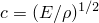=5064 m/s 的速率传播。撞击持续时间的解析解为 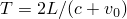=7.9 × 10^-4 s，在此期间接触力保持恒定值 F = 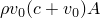=11.8 × 10^6 N。桁架的动量变化对应于接触力乘以撞击持续时间：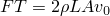=9.36 kg·m/s。

使用两种方法来模拟领先桁架节点与刚性墙之间的接触。第一种方法使用 Abaqus/Explicit 中的默认运动接触公式定义接触。第二种方法使用罚接触公式。使用默认罚刚度。这两种接触公式的差异在《Abaqus 分析用户指南》第 38.2.3 节 ["Abaqus/Explicit 中的接触约束 enforcement 方法"](../usb/usb-link.md#usb-cni-aexpcontactconstraints) 中有更详细的讨论，并在下面的结果部分中讨论。

### 结果和讨论

此问题的验证通过将重要问题变量的值与解析解进行比较来提供。数值解基于默认时间增量，但另有说明除外。

动能图如图 1.3.15-4](ch01s03ach34.md#exxtrussimpact-kinener)所示。解决方案的四个阶段（撞击前、桁架压缩、桁架再膨胀和撞击后）在此图中可见。当使用罚接触时，后面的阶段被延迟，这些阶段之间过渡处的斜率变化被平滑。使用运动接触时，桁架压缩的开始时间提前了一个增量。在每个数值解中，动能在反弹时并未完全恢复，因为存在能量数值耗散和有限离散。对于罚接触解，能量耗散主要由少量体积粘度（Abaqus/Explicit 单元公式中默认包含）和粘性接触阻尼（罚接触默认包含）引起。对于运动接触解，体积粘度和接触算法本身都对能量损失有重大贡献。运动接触算法在撞击时耗散接触节点的动能，而罚接触算法将接触节点的动能转换为存储在拉伸罚弹簧中的能量。这些能量传递考虑将在以下段落中进一步讨论。

领先桁架节点（接触节点）的速度历史如图 1.3.15-5](ch01s03ach34.md#exxtrussimpact-velocity)所示。速度的运动接触解在撞击前和撞击期间与解析解非常吻合。在罚接触的速度图中，撞击阶段不太明显，因为发生了一些渗透。所有数值解的撞击后速度都显示一些不属于解析解的振荡。这些振荡与能量耗散和有限离散有关。在运动接触解中，应力波在撞击后阶段继续通过桁架，这会周期性地降低节点速度的幅值。随着网格细化，此波变得更窄。对于罚接触，撞击后应力波持续存在，这导致撞击后节点速度在约 1.5 m/s 附近振荡，其中负速度表示沿负 *x* 方向运动。在所有数值解中，由于体积粘性阻尼，这些速度振荡随时间变得更加扩散。

接触力历史解如图 1.3.15-6](ch01s03ach34.md#exxtrussimpact-conforce)所示。对于运动接触测试，Abaqus/Explicit 给出了非常好的峰值接触力估计，并相当好地捕捉到了接触力历史中的阶梯。然而，，稍后将展示运动接触的接触力历史取决于分析中使用的时间增量大小。罚接触力解对峰值接触力产生合理的估计，但由于罚方法的固有数值软化，需要极端网格细化才能观察到接触力中的突然跳跃。

[图 1.3.15-7](ch01s03ach34.md#exxtrussimpact-totener)包含外功图。在解析解中，外功保持为零。在数值解中可以观察到与接触力相关的一些外功，这些接触力在 Abaqus/Explicit 中被视为外力。对于罚接触，外功 accounted for 接触穿透期间存储在罚弹簧中的能量和粘性接触阻尼耗散的能量。反弹后，外功返回到恒定负值，因为罚弹簧能量被恢复；负值对应于粘性接触阻尼导致的耗散量。对于运动接触，接触力首先在实际撞击之前的增量中发生，当时仍存在间隙；因此，在下一个增量中不会发生渗透。因此，运动接触力在接触首次建立时做了一些功。此功对应于接触节点的动能，此能量被接触算法耗散，并且在反弹时不会被恢复。

体积粘性引起的能量耗散如图 1.3.15-8](ch01s03ach34.md#exxtrussimpact-vdener)所示。对于运动接触，此耗散大于罚接触，因为运动接触公式中的撞击未被软化。对单元的冲击更大，单元阻尼增加。能量在反弹后继续耗散，这是由于反弹后残留在桁架中的应力波的阻尼。

应变能图如图 1.3.15-9](ch01s03ach34.md#exxtrussimpact-strener)所示。存储在罚弹簧中的能量不包括在 Abaqus/Explicit 报告的应变能中，因为接触力被视为外力。相反，存储在罚弹簧中的能量表现为负外功，如前所述。在数值解中，一些应变能在反弹后保留，这与反弹后残留在桁架中的应力波有关。

运动接触算法的一个不期望的特性是，对于给定网格在接触区域上预测的初始撞击力取决于时间增量的大小。[图 1.3.15-10](ch01s03ach34.md#exxtrussimpact-rfscaled)中显示的接触力结果基于时间增量按 0.25 缩放的分析。此缩放模拟了模型中一个小单元的存在，该单元控制时间增量大小。如果时间增量显著低于接触区域附近单元的稳定时间增量，运动接触算法将高估撞击力。减小时间增量会导致接触力增加，因为必须在一个更短的时间间隔内解决领先节点的接近速度以避免撞击时渗透。[图 1.3.15-10](ch01s03ach34.md#exxtrussimpact-rfscaled)还表明，如果使用罚接触公式，时间增量大小对接触力解的影响可以忽略不计。对于两种类型的接触约束方法，本示例中讨论的其他解决方案变量对时间增量大小几乎没有依赖性。

为了更好地理解这些结果，考虑一个从属节点撞击固定刚性墙。[图 1.3.15-11](ch01s03ach34.md#exxtrussimpact-kinschematic)和[图 1.3.15-12](ch01s03ach34.md#exxtrussimpact-pnlschematic)在增量  中将这样一个接触从属节点显示为一个圆。摩擦将不予考虑。

在运动接触公式中，Abaqus/Explicit 计算预测渗透 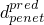（参见[图 1.3.15-11](ch01s03ach34.md#exxtrussimpact-kinschematic)）。此预测渗透等于如果不强制执行接触条件则节点的移动。然后，Abaqus/Explicit 根据以下公式计算法线方向的接触力 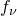：

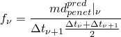

并在当前增量中施加此力。接触力在实际接触建立之前就被施加了。在下一个增量 +1 中，节点接触对面体表面而没有渗透（参见[图 1.3.15-11](ch01s03ach34.md#exxtrussimpact-kinschematic)），并且动能损失发生。虽然未在[图 1.3.15-11](ch01s03ach34.md#exxtrussimpact-kinschematic)中显示，但在运动接触的情况下，在增量 +1 中也会发生接触力，以消除表面法线方向速度分量的剩余部分。

[图 1.3.15-12](ch01s03ach34.md#exxtrussimpact-pnlschematic)显示了罚接触公式的示意图。接触力首先在增量 +1 中施加，节点渗透到对面表面一些。接触力 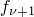根据以下公式计算：

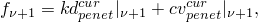

其中 *k* 是 Abaqus/Explicit 计算的罚刚度，*c* 是根据默认接触阻尼设置计算的粘性阻尼系数，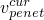 是渗透速度。罚刚度项可以物理地想象为连接渗透节点和被渗透表面的弹簧。能量存储在这个弹簧中，并在节点渗透反转并减小到零时释放（参见[图 1.3.15-7](ch01s03ach34.md#exxtrussimpact-totener)）。损失的少量动能（参见[图 1.3.15-4](ch01s03ach34.md#exxtrussimpact-kinener)）是单元的粘性效应、粘性接触阻尼以及分离后残留在桁架中的应变能的结果（参见[图 1.3.15-9](ch01s03ach34.md#exxtrussimpact-strener)）。随着网格细化，两种公式都趋向于解析解。

### 输入文件

##### **Abaqus/Standard 输入文件**

[imp_ref_std.inp](../eif/imp_ref_std.inp)

细化模型的分析。

##### **Abaqus/Explicit 输入文件**

[imp_pnl_ref.inp](../eif/imp_pnl_ref.inp)

使用罚接触公式的细化模型分析。

[imp_kin_ref.inp](../eif/imp_kin_ref.inp)

使用运动接触公式的细化模型分析。

[impact_kin.inp](../eif/impact_kin.inp)

使用运动接触公式的粗网格模型分析。

[impact_pnl.inp](../eif/impact_pnl.inp)

使用罚接触公式的粗网格模型分析。

[imp_pnl_ref_sc.inp](../eif/imp_pnl_ref_sc.inp)

使用罚接触公式和缩放时间增量的细化模型分析。

[imp_kin_ref_sc.inp](../eif/imp_kin_ref_sc.inp)

使用运动接触公式和缩放时间增量的细化模型分析。

[impact_kin_sc.inp](../eif/impact_kin_sc.inp)

使用运动接触公式和缩放时间增量的粗网格模型分析。

[impact_pnl_sc.inp](../eif/impact_pnl_sc.inp)

使用罚接触公式和缩放时间增量的粗网格模型分析。

### 图形

**图 1.3.15-1** 粗网格模型。

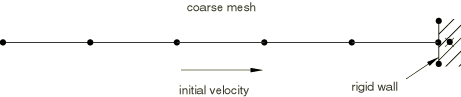

**图 1.3.15-2** 细化网格模型。

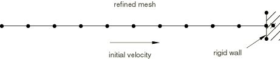

**图 1.3.15-3** 初始间隙。

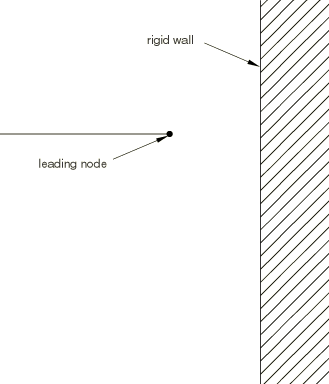

**图 1.3.15-4** 动能。

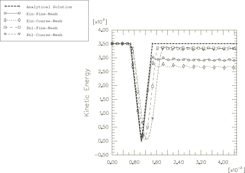

**图 1.3.15-5** 领先节点的速度。

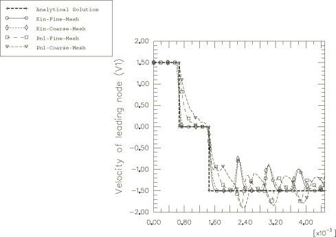

**图 1.3.15-6** 接触力。

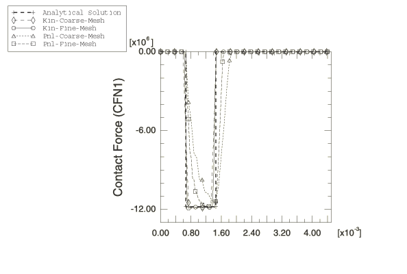

**图 1.3.15-7** 外功。

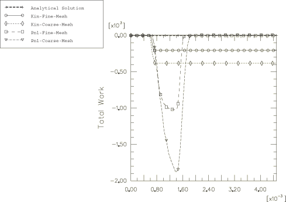

**图 1.3.15-8** 粘性阻尼能量。

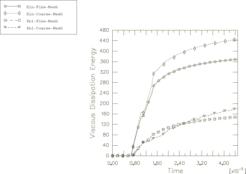

**图 1.3.15-9** 应变能。

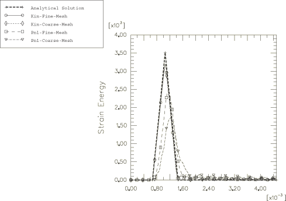

**图 1.3.15-10** 缩放时间增量的接触力。

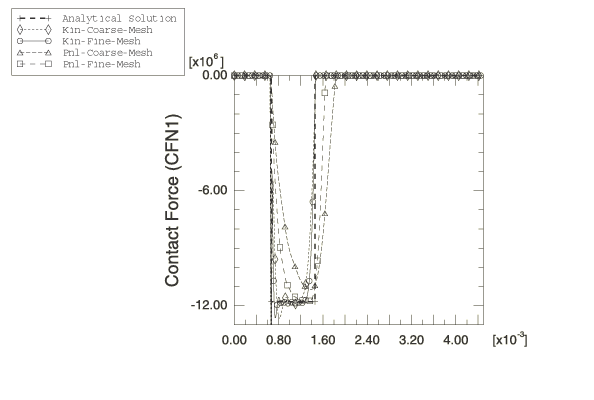

**图 1.3.15-11** 运动接触公式示意图。

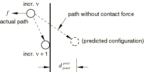

**图 1.3.15-12** 罚接触公式示意图。

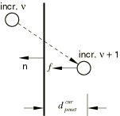
