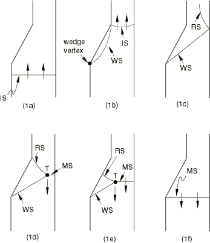
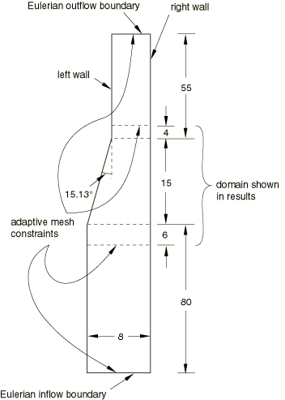
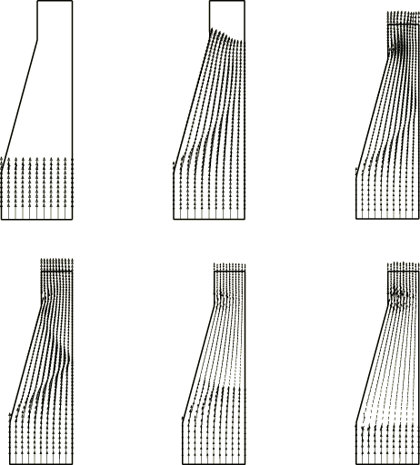
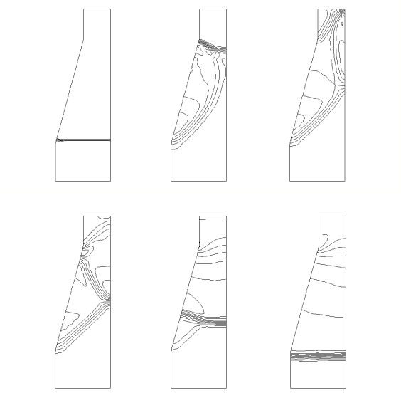

# 1.3.17 斜激波反射

**产品：** Abaqus/Explicit

本示例说明在建模涉及规则反射和马赫反射过程的激波相互作用问题时，使用理想气体状态方程模型和自适应网格。

### 问题描述

具有可忽略粘性和热传导的气体中的平面激波以恒定速度穿过二维通道，并在左壁遇到楔形障碍物（Amsden 和 Ruppel，1981）。发生一系列反射，定性描述如图 1.3.17-1（a）至图 1.3.17-1（e）（[图 1.3.17-1](ch01s03ach36.md#exxshockreflection-seq)）所示。该事件受规则激波反射理论控制（Harlow 和 Amdsen，1971）。图 1.3.17-1（a）（[图 1.3.17-1](ch01s03ach36.md#exxshockreflection-seq)）显示入射激波（IS）穿过通道向楔块移动。激波（WS）从楔块反射，如图 1.3.17-1（b）（[图 1.3.17-1](ch01s03ach36.md#exxshockreflection-seq)）所示。流动马赫数和楔角使得激波保持在楔块顶点处附着。波构型发展直到反射激波撞击通道的右壁并反射回通道，如图 1.3.17-1（c）（[图 1.3.17-1](ch01s03ach36.md#exxshockreflection-seq)）（RS）所示。由于入射激波（IS）的强度和角度处于马赫反射状态，形成第三条称为马赫杆的激波（MS 在图 1.3.17-1（d）（[图 1.3.17-1](ch01s03ach36.md#exxshockreflection-seq)）中）。三条激波的交点称为三相点（T）。该构型不能保持稳定，马赫杆沿上游逆流动方向移动（图 1.3.17-1（e）（[图 1.3.17-1](ch01s03ach36.md#exxshockreflection-seq)）），最终将其吞没，如图 1.3.17-1（f）（[图 1.3.17-1](ch01s03ach36.md#exxshockreflection-seq)）所示。

在本例中楔块半角取为 15.13°。模型示意图如图 1.3.17-2（[图 1.3.17-2](ch01s03ach36.md#exxshockreflection-model)）所示；该模型由隔膜分开的两个隔室组成。两个隔室充满相同的气体，但具有不同的初始状态和速度。隔室使用 CPE4R 单元网格划分。通道的左壁建模为固定解析刚性表面，而右壁通过规定对称边界条件来模拟。使用气体常数为 0.2 和定容比热为 0.5 的 Abaqus/Explicit 理想气体状态方程模型。这些常数并非旨在代表任何真实气体。A 隔室中的气体最初处于单位密度、非常小的压力和零速度。在 B 隔室中入射激波的背后，高能气体具有 6 的初始密度和 1.2 的初始压力，以 1.0 的初始速度向 A 隔室流动。分隔隔室的隔膜被瞬时移除，导致激波传播到 B 隔室。

### 自适应网格

使用细长欧拉自适应网格域。楔形障碍物位于发生激波反射的域中间部分。欧拉流入和流出边界位于障碍物上游和下游足够远的地方，以防止不良反射。域中间部分的网格通过在此子域的入口和出口平面施加自适应网格约束来保持原位以显示结果。这些约束是欧拉边界处使用的空间自适应网格约束的补充。由于气体流动很大，必须增加自适应网格的强度以提供准确的解决方案。MESH SWEEPS 参数的值从默认值 1 增加到 5。

### 结果与讨论

分析在 150 的时间内进行。域中间部分速度合力的向量图如图 1.3.17-3（[图 1.3.17-3](ch01s03ach36.md#exxshockreflection-vel)）所示。从左到右，时间分别为 *t*=0、12、17、30、90 和 120。相应的压力应力等值线图如图 1.3.17-4（[图 1.3.17-4](ch01s03ach36.md#exxshockreflection-press)）所示。压力应力的最大值从初始值 1.2 增加到分析结束时的约 7.0。规则反射理论预测楔块激波 MS 的半角应为 48.5°。图 1.3.17-4（[图 1.3.17-4](ch01s03ach36.md#exxshockreflection-press)）中间时刻压力等值线测量的结果与此值良好一致。

### 输入文件

[ale_wedge_shock.inp](../eif/ale_wedge_shock.inp)

使用自适应网格的分析。

### 参考

Amsden, A. A., and H. M. Ruppel, "SALE-3D: A Simplified ALE Computer Program for Calculating Three-Dimensional Fluid Flow," Los Alamos Scientific Laboratory, 1981.

Harlow, F. H., and A. A. Amsden, "Fluid Dynamics – A LASL Monograph," Los Alamos Scientific Laboratory report LA-4700, 1971.

### 图表

**图 1.3.17-1** 平面激波在二维通道中遇到楔形障碍物时发生的一系列激波反射。

**图 1.3.17-2** 模型示意图（CPE4R 单元）。

**图 1.3.17-3** 域中间部分不同中间时刻的速度合力向量图。

**图 1.3.17-4** 与图 1.3.17-3（[图 1.3.17-3](ch01s03ach36.md#exxshockreflection-vel)）所示速度合力对应的压力等值线。

