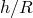
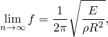
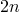
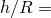
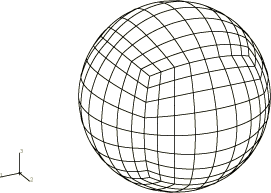
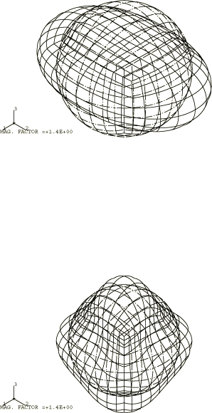

# 1.4.1 球壳的自由振动

**产品：** Abaqus/Standard

关于薄弹性球壳振动的首批论文早于经典壳体弯曲理论的通用公式。"完整"球壳自由振动的问题最早由 Lamb（1882）研究。Baker（1961）和 Silbiger（1962）给出了更详细的处理。该问题具有许多有趣的特性，非常适合作为 Abaqus 中壳单元的良好测试案例。

### 问题描述

考虑厚度与半径比（）为 1/100 和 1/20 的情况。虽然在这两种情况下壳体都是"薄"的，但较厚的壳体说明了弯曲效应的重要性。

使用了 Abaqus 中所有适用的壳单元。对于使用 SAX1 或 SAX2 单元的轴对称情况，以及使用 SAXA11、SAXA12、SAXA13、SAXA14、SAXA21、SAXA22、SAXA23 或 SAXA24 单元的非轴对称-轴对称情况，使用了精细网格，沿着圆周以相等间隔放置 80 个节点。

使用通用壳单元的完整球壳网格在一阶和二阶公式中使用相同数量的单元。未进行网格收敛研究。对于三角形壳单元，每个四边形被分割成两个三角形，未考虑保持网格对称性。二阶单元使用的网格如图 1.4.1-1（[图 1.4.1-1](ch01s04ach37.md#sxmfreesphershell-model)）所示。

### 解析解

基于壳体的薄膜理论，已知空心薄弹性球的固有频谱由两组无限模式组成，并且一组无限数量的模式在有限频率间隔内排列。壳体的振型用 *n* 阶勒让德多项式表示。对于每个 *n* 值，有两个不同的频率。两个频率中较小的一个形成"下分支"。第二个或"上分支"模式主要是伸长的。前 10 个频率如表 1.4.1-1（[表 1.4.1-1](ch01s04ach37.md#table-sphershell-natfreqs-mem)）所示。

 = 0 模式由纯径向振动组成。其频率远高于与下分支模式相关的所有频率。从表中可以看到，上分支的频率随着 *n* 的增加而无限增加，但下分支的频率趋近于极限：

其中 *f* 是振动频率，*E* 是弹性模量， 是质量密度，*R* 是球的半径。这种极限情况是所采用的薄膜理论的结果（Kalnins，1964）。薄膜理论仅对于非常薄的壳体和低阶模态是准确的。Abaqus 壳单元考虑了膜和弯曲效应，因此我们只能期望在膜型模式中获得良好的一致性。

如果仅考虑轴对称模式，每个频率值都有不同的振型。然而，基于通用壳单元的模型允许非轴对称模式。有趣的是，对于球壳，非轴对称模式对应的频率与轴对称模式的频率相同。这是壳体球对称的结果。对于每个 *n* 值，有  + 1 个线性独立模式。为了验证这一点，我们选择对整个球进行建模，尽管可以通过使用对称和反对称边界条件对部分球进行建模来更经济地分析该问题。此外，由于具有相同频率的多个模式，该问题作为特征值-特征向量算法的良好测试。

### 结果与讨论

表 1.4.1-2（[表 1.4.1-2](ch01s04ach37.md#table-sphershell-natfreqs-axi)）总结了使用轴对称壳单元 SAX1 和 SAX2 对前 10 个模式获得的结果。对于低阶模式和较薄壳体的情况，结果与薄膜理论良好一致。对于  = 0.05，第九模式的固有频率与薄膜理论的预测显著不同，与 Kalnins（1964）一致。薄膜理论对于小的  值和低阶模式显然是准确的。模式  = 1 对应于刚体平移，未显示在表中。在轴对称情况下，每个频率都有不同的振型，特征值迭代快速收敛。

表 1.4.1-3（[表 1.4.1-3](ch01s04ach37.md#table-sphershell-natfreqs-as-1)）和表 1.4.1-4（[表 1.4.1-4](ch01s04ach37.md#table-sphershell-natfreqs-as-2)）总结了使用非轴对称-轴对称壳单元 SAXA1*N* 和 SAXA2*N*（*N*=1、2、3 或 4）获得的结果。在这种情况下，对于每个 *n* 值，有 *n*+1 个模式而不是解析预测的 +1。这是因为在非轴对称-轴对称单元公式中，假设相对于 *r*–*z* 平面在  = 0 处对称。然而，对于每个 *n*，计算的模态数量受 *N*+1 限制，其中 *N* 是使用的傅里叶插值项数。

回想一下，在使用通用壳单元的完整模型中，对于每个 *n* 值有 +1 个模式。为了提高特征值迭代的收敛性，我们因此指定使用更多数量的试验向量。我们计算 18 个特征值以获得直到  = 3 的模式。对于更高阶的模式如  = 9，需要计算至少 100 个或更多特征值。为了将此验证测试保持在合理的计算时间内，我们将特征值数量限制为 20。这意味着弯曲效应不会像轴对称情况那样明显。因此，此处仅报告薄壳情况（ = 0.01）的通用壳模型结果。

表 1.4.1-5（[表 1.4.1-5](ch01s04ach37.md#table-sphershell-natfreqs-gen)）给出了二阶壳单元的结果；表 1.4.1-6（[表 1.4.1-6](ch01s04ach37.md#table-sphershell-natfreqs-gen2)）给出了一阶壳单元的结果。在这些表中，我们列出了前 20 个特征值，不包括前六个刚体模式。

当使用二阶壳单元时，前五个值（7 到 11）与  = 2 情况的薄膜解几乎相同。一阶网格使用与二阶网格相同数量的单元。然而，除了 S3R 单元外，结果相当准确：前五个特征值的误差小于 2%。对于 S3R 单元，最大误差约为 5%，因为这些单元使用常弯曲应变近似。可以通过进一步细化网格来提高准确性。特征值 12 到 18 对应于模式  = 3。观察到恢复了 +1 个模式，正如解析解所预测的。

我们还注意到，一阶三角形单元在与给定 *n* 值对应的特征值中比四边形表现出更大的差异。这是三角形单元方向效应的结果。可以通过设计球对称的网格来提高准确性。

图 1.4.1-2（[图 1.4.1-2](ch01s04ach37.md#sxmfreesphershell-modes)）展示了使用任何壳模型获得的模式  = 2 和  = 3。

### 输入文件

[freevibsphere_s3r.inp](../eif/freevibsphere_s3r.inp)

S3R 单元模型。

[freevibsphere_s4.inp](../eif/freevibsphere_s4.inp)

S4 单元模型。

[freevibsphere_s4_thick.inp](../eif/freevibsphere_s4_thick.inp)

S4 单元模型（ = 0.05）。

[freevibsphere_s4r.inp](../eif/freevibsphere_s4r.inp)

S4R 单元模型。

[freevibsphere_s4r_thick.inp](../eif/freevibsphere_s4r_thick.inp)

S4R 单元模型（ = 0.05）。

[freevibsphere_s4r5.inp](../eif/freevibsphere_s4r5.inp)

S4R5 单元模型。

[freevibsphere_s8r.inp](../eif/freevibsphere_s8r.inp)

S8R 单元模型。

[freevibsphere_s8r_thick.inp](../eif/freevibsphere_s8r_thick.inp)

S8R 单元模型（ = 0.05）。

[freevibsphere_s8r5.inp](../eif/freevibsphere_s8r5.inp)

S8R5 单元模型。

[freevibsphere_s9r5.inp](../eif/freevibsphere_s9r5.inp)

S9R5 单元模型。

[freevibsphere_stri3.inp](../eif/freevibsphere_stri3.inp)

STRI3 单元模型。

[freevibsphere_stri65.inp](../eif/freevibsphere_stri65.inp)

STRI65 单元模型。

[freevibsphere_sax1.inp](../eif/freevibsphere_sax1.inp)

SAX1 单元模型。

[freevibsphere_sax1_thick.inp](../eif/freevibsphere_sax1_thick.inp)

SAX1 单元模型（ = 0.05）。

[freevibsphere_sax2.inp](../eif/freevibsphere_sax2.inp)

SAX2 单元模型。

[freevibsphere_sax2_thick.inp](../eif/freevibsphere_sax2_thick.inp)

SAX2 单元模型（ = 0.05）。

[freevibsphere_saxa11_thin.inp](../eif/freevibsphere_saxa11_thin.inp)

SAXA11 单元模型（ = 0.01）。

[freevibsphere_saxa12_thin.inp](../eif/freevibsphere_saxa12_thin.inp)

SAXA12 单元模型（ = 0.01）。

[freevibsphere_saxa13_thin.inp](../eif/freevibsphere_saxa13_thin.inp)

SAXA13 单元模型（ = 0.01）。

[freevibsphere_sax14_thin.inp](../eif/freevibsphere_sax14_thin.inp)

SAXA14 单元模型（ = 0.01）。

[freevibsphere_saxa21_thin.inp](../eif/freevibsphere_saxa21_thin.inp)

SAXA21 单元模型（ = 0.01）。

[freevibsphere_saxa22_thin.inp](../eif/freevibsphere_saxa22_thin.inp)

SAXA22 单元模型（ = 0.01）。

[freevibsphere_saxa23_thin.inp](../eif/freevibsphere_saxa23_thin.inp)

SAXA23 单元模型（ = 0.01）。

[freevibsphere_saxa24_thin.inp](../eif/freevibsphere_saxa24_thin.inp)

SAXA24 单元模型（ = 0.01）。

### 参考

Baker, W. E., "Axisymmetric Modes of Vibration of Thin Spherical Shells," Journal of Acoustic Society of America, vol. 33, pp. 1749–1758, 1961.

Kalnins, A., "Effect of Bending on Vibration of Spherical Shells," Journal of Acoustic Society of America, vol. 36, pp. 74–81, 1964.

Lamb, H., "On the Vibrations of a Spherical Shell," Procedures of the London Mathematical Society, vol. 14, pp. 50–56, 1882.

Silbiger, A., "Nonaxisymmetric Modes of Vibration of Thin Spherical Shells," Journal of Acoustic Society of America, vol. 34 862, 1962.

### 表格

**表 1.4.1-1** 基于薄膜理论的固有频率（周/秒）。（ = 180.0×10⁹， = 1/3， = 7670.0。）
| 模式 | 下频谱 | 上频谱 |
| --- | --- | --- |
| 0 | -- | 445.0 |
| 1 | 0.0 | 545.18 |
| 2 | 187.34 | 748.02 |
| 3 | 222.57 | 995.37 |
| 4 | 236.56 | 1256.58 |
| 5 | 239.56 | 1522.62 |
| 6 | 247.37 | 1791.24 |
| 7 | 249.80 | 2060.92 |
| 8 | 251.41 | 2331.42 |
| 9 | 252.54 | 2602.36 |
| 10 | 253.35 | 2873.62 |

**表 1.4.1-2** 使用轴对称壳单元的固有频率。
| 模式(*n*) | 薄膜理论 | =0.01 | =0.05 |
| --- | --- | --- | --- |
| SAX1 | SAX2 | SAX1 | SAX2 |
| 2 | 187.34 | 187.26 | 187.36 | 187.72 | 187.82 |
| 3 | 222.57 | 222.30 | 222.69 | 225.19 | 225.57 |
| 4 | 236.56 | 236.15 | 236.95 | 245.35 | 246.09 |
| 5 | 239.56 | 243.12 | 244.41 | 264.61 | 265.76 |
| 6 | 247.37 | 247.43 | 249.30 | 289.13 | 290.66 |
| 7 | 249.80 | 250.76 | 253.29 | 321.84 | 323.68 |
| 8 | 251.41 | 253.99 | 257.25 | 364.00 | 366.02 |
| 9 | 252.54 | 257.66 | 261.69 | 415.81 | 417.88 |
| 10 | 253.35 | 262.18 | 267.00 | 445.14 | 445.14 |

**表 1.4.1-3** 使用一阶非轴对称-轴对称壳单元的固有频率。
| 特征值编号 | SAXA11 | SAXA12 | SAXA13 | SAXA14 |
| --- | --- | --- | --- | --- |
| 4 | 187.26 | 187.26 | 187.26 | 187.26 |
| 5 | 187.35 | 187.35 | 187.35 | 187.35 |
| 6 | 222.30 | 187.41 | 187.41 | 187.41 |
| 7 | 222.53 | 222.30 | 222.30 | 222.30 |
| 8 | 236.15 | 222.53 | 222.53 | 222.53 |
| 9 | 236.51 | 222.73 | 222.73 | 222.73 |
| 10 | 243.12 | 236.15 | 222.76 | 222.76 |
| 11 | 243.59 | 236.51 | 236.15 | 236.15 |
| 12 | 247.43 | 236.84 | 236.51 | 236.51 |
| 13 | 248.01 | 243.12 | 236.83 | 236.83 |
| 14 | 250.76 | 243.59 | 237.03 | 237.03 |
| 15 | 251.45 | 244.03 | 243.12 | 237.04 |

**表 1.4.1-4** 使用二阶非轴对称-轴对称壳单元的固有频率。
| 特征值编号 | SAXA21 | SAXA22 | SAXA23 | SAXA24 |
| --- | --- | --- | --- | --- |
| 4 | 187.36 | 187.36 | 187.36 | 187.36 |
| 5 | 187.36 | 187.36 | 187.36 | 187.36 |
| 6 | 222.69 | 187.36 | 187.36 | 187.36 |
| 7 | 222.69 | 222.69 | 222.69 | 222.69 |
| 8 | 236.94 | 222.69 | 222.69 | 222.69 |
| 9 | 236.95 | 222.69 | 222.69 | 222.69 |
| 10 | 244.41 | 236.94 | 222.69 | 222.69 |
| 11 | 244.41 | 236.95 | 236.95 | 236.95 |
| 12 | 249.29 | 236.95 | 236.95 | 236.95 |
| 13 | 249.30 | 244.41 | 236.95 | 236.95 |
| 14 | 253.29 | 244.41 | 236.95 | 236.95 |
| 15 | 253.30 | 244.41 | 244.41 | 236.95 |

**表 1.4.1-5** 使用二阶通用壳单元 S8R、S8R5、S9R5 和 STRI65 的固有频率。
| 特征值编号 | S8R | S8R5 | S9R5 | STRI65 |
| --- | --- | --- | --- | --- |
| 7 | 187.37 | 187.36 | 187.36 | 187.38 |
| 8 | 187.37 | 187.36 | 187.36 | 187.38 |
| 9 | 187.38 | 187.36 | 187.36 | 187.38 |
| 10 | 187.38 | 187.37 | 187.37 | 187.38 |
| 11 | 187.38 | 187.37 | 187.37 | 187.38 |
| 12 | 222.66 | 222.63 | 222.63 | 222.74 |
| 13 | 222.66 | 222.63 | 222.63 | 222.75 |
| 14 | 222.66 | 222.63 | 222.63 | 222.75 |
| 15 | 222.74 | 222.70 | 222.70 | 222.76 |
| 16 | 222.74 | 222.70 | 222.70 | 222.81 |
| 17 | 222.74 | 222.70 | 222.70 | 222.81 |
| 18 | 222.81 | 222.77 | 222.77 | 222.84 |
| 19 | 236.81 | 236.66 | 236.68 | 237.14 |
| 20 | 236.93 | 236.80 | 236.80 | 237.24 |

**表 1.4.1-6** 使用一阶通用壳单元 S4R、S4R5、S4、STRI3 和 S3R 的固有频率。
| 特征值编号 | S4R | S4R5 | S4 | STRI3 | S3R |
| --- | --- | --- | --- | --- | --- |
| 7 | 189.97 | 189.97 | 189.86 | 187.32 | 190.19 |
| 8 | 189.97 | 189.97 | 189.86 | 188.76 | 190.66 |
| 9 | 190.05 | 190.05 | 190.04 | 188.76 | 190.66 |
| 10 | 190.05 | 190.05 | 190.06 | 189.97 | 192.25 |
| 11 | 190.05 | 190.05 | 190.06 | 189.97 | 192.25 |
| 12 | 223.71 | 223.70 | 225.66 | 223.85 | 229.55 |
| 13 | 223.71 | 223.70 | 225.74 | 224.16 | 230.82 |
| 14 | 223.71 | 223.70 | 225.74 | 224.16 | 230.82 |
| 15 | 227.90 | 227.89 | 228.59 | 227.51 | 233.47 |
| 16 | 227.90 | 227.89 | 228.59 | 228.71 | 234.32 |
| 17 | 227.90 | 227.89 | 228.61 | 228.71 | 234.82 |
| 18 | 231.43 | 231.37 | 233.57 | 229.06 | 234.82 |
| 19 | 233.48 | 233.45 | 237.24 | 239.45 | 252.14 |
| 20 | 233.59 | 233.45 | 242.00 | 239.50 | 252.14 |

### 图表

**图 1.4.1-1** 球壳模型，使用二阶四边形单元。

**图 1.4.1-2** 球壳的模式  = 2,3。

