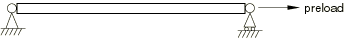
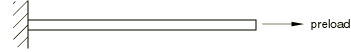
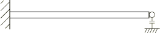
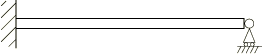
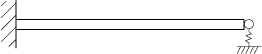

# 1.4.2 不同端部约束和载荷下梁的特征值分析

**产品：** Abaqus/Standard

本示例的目的是使用各种其他选项来测试 Abaqus 中的特征值能力。本示例使用两个简单梁结构：悬臂梁（尖端有各种支撑）和两端简支梁。在某些情况下，梁在初始静力步骤中预加载（参见《Abaqus 分析用户手册》第 6.2.2 节"静应力分析" ），然后获得预加载结构的特征值（另请参见["张力下电缆的振动"第 1.4.3 节](ch01s04ach39.md)，其中研究了预应力电缆振动问题）。预加载结构分析需要在步骤中包含几何非线性，以便 Abaqus 形成初始应力矩阵。

对于悬臂梁，使用了各种端部条件：自由端、简单支撑和刚性垂直弹簧支撑。此外，还分析了端部开口和闭合间隙条件。在一种情况下，梁由单独的段组成，通过方程约束连接（《Abaqus 分析用户手册》第 35.2.1 节"线性约束方程" ）。

### 问题描述

梁长 127 mm（5 in），实心圆形横截面，半径 2.54 mm（0.1 in）。杨氏模量 187 GPa（27×10⁶ lb/in²），密度 8015.19 kg/m³（7.5×10⁴ lb·s²/in⁴）。有限元模型由 10 个等大小的 B23 型三次插值梁单元组成。

### 边界条件和载荷

分析了以下情况：

1. 两端简支梁（参见[图 1.4.2-1](ch01s04ach38.md#sxmeigenbeam-simple)）：
   1. 无应力结构。
   2. 由轴向力预应力的结构。预张力为 4448 N（1000 lb）。

2. 悬臂梁（参见[图 1.4.2-2](ch01s04ach38.md#sxmeigenbeam-cant)至[图 1.4.2-5](ch01s04ach38.md#sxmeigenbeam-cantstiff)）：
   1. 简单悬臂。
   2. 预张力悬臂。预张力为 44482 N（10000 lb）。
   3. 自由端间隙条件——间隙打开。此情况与以下 B1 相同。
   4. 自由端间隙条件——间隙闭合。此情况与以下 B5 相同。
   5. 端部有简单支撑的悬臂。
   6. 端部有弹簧支撑的悬臂。使用刚性弹簧（刚度 1.75×10³ MN/mm（10⁷ lb/in）），因此此情况也与上述 B5 相同。
   7. 端部有简单支撑的悬臂梁。此情况与 B5 相同，但现在梁在几何上被定义为几个单独的段，通过方程约束运动学连接。

### 结果与讨论

所有情况下前三个最低模式的结果如表 1.4.2-1（[表 1.4.2-1](ch01s04ach38.md#table-eigenbeam-vibfreqs)）所示。在大多数情况下，它们与 Timoshenko（1937）的精确解进行比较。正如所预期的，使用具有三次插值的 10 单元网格，最低三个模式与精确解密切一致。预张力情况显示与无预张力的相同情况相比频率预期增加。

### 输入文件

[eigenbeam_simple.inp](../eif/eigenbeam_simple.inp)

基本简支情况。

[eigenbeam_pretension_simple.inp](../eif/eigenbeam_pretension_simple.inp)

预张力简支情况。

[eigenbeam_cant.inp](../eif/eigenbeam_cant.inp)

基本悬臂情况。

[eigenbeam_pretension_cant.inp](../eif/eigenbeam_pretension_cant.inp)

预张力悬臂情况。

[eigenbeam_closedgap.inp](../eif/eigenbeam_closedgap.inp)

带闭合间隙的悬臂。

[eigenbeam_cant_opengap.inp](../eif/eigenbeam_cant_opengap.inp)

端部带开口间隙的悬臂。

[eigenbeam_roller.inp](../eif/eigenbeam_roller.inp)

带滚柱支撑的悬臂。

[eigenbeam_cant_springsup.inp](../eif/eigenbeam_cant_springsup.inp)

自由端带弹簧支撑的悬臂。

[eigenbeam_cant_equation.inp](../eif/eigenbeam_cant_equation.inp)

由两个段组成并使用 [*EQUATION*](../key/key-link.md#usb-kws-mequation) 选项连接的悬臂。

### 参考

Timoshenko, S., *Vibration Problems in Engineering, *D. Van Nostrand Company, Inc., New York, 2nd, 1937.

### 表格

**表 1.4.2-1** 梁的前三个最低振动频率。
| 情况 | 频率 (Hz) |
| --- | --- |
| 模式 1 | 模式 2 | 模式 3 |
| A1. | Abaqus | 596.1 | 2384.6 | 5367.6 |
| Timoshenko | 596.1 | 2384.3 | 5364.7 |
| A2. | Abaqus | 882.7 | 2716.9 | 5711.9 |
| Timoshenko | 883.0 | 2717.1 | 5709.6 |
| B1. | Abaqus | 212.4 | 1330.8 | 3727.2 |
| Timoshenko | 212.3 | 1330.7 | 3726.4 |
| B2. | Abaqus | 1137.9 | 3624.4 | 6694.1 |
| B3. | Abaqus | 212.4 | 1330.8 | 3727.2 |
| （与情况 B1 相同） |  |  |  |
| B4. | Abaqus | 931.2 | 3018.2 | 6300.7 |
| （与情况 B5 相同） |  |  |  |
| B5. | Abaqus | 931.2 | 3018.2 | 6300.7 |
| Timoshenko | 931.4 | 3018.0 | 6295.8 |
| B6. | Abaqus | 931.2 | 3017.9 | 6299.6 |
| （与情况 B5 相同） |  |  |  |
| B7. | Abaqus | 931.2 | 3018.2 | 6300.7 |
| （与情况 B5 相同） |  |  |  |

### 图表

**图 1.4.2-1** 两端简支梁。对于情况 A1，预载荷为零；对于情况 A2，预载荷为 4448 N。

**图 1.4.2-2** 悬臂梁。对于情况 B1，预载荷为零；对于情况 B2，预载荷为 44482 N。

**图 1.4.2-3** 带间隙条件的悬臂梁。对于情况 B3，间隙打开；对于情况 B4，间隙闭合。

**图 1.4.2-4** 端部简支的悬臂梁。对于情况 B5，梁是一组单元；对于情况 B7，梁被定义为几个单独的段，通过方程约束连接。

**图 1.4.2-5** 带刚性弹簧支撑的悬臂梁，情况 B6。

