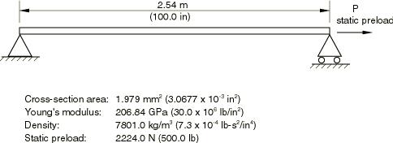

# 1.4.3 张力下电缆的振动

**产品：** Abaqus/Standard

这个"小提琴弦"问题是一个简单的例子，其中结构的频率取决于振动发生时存在的预应力状态。在这种情况下，分析通过在一个或几个静力步骤中对结构进行预加载，然后请求特征值提取来完成。在某些情况下，静力预载荷可能涉及相当大的非线性，尽管在这个简单问题中并非如此。基本概念是获得关于预应力、预变形构型的小振动频率。

### 问题描述

桁架模型如图 1.4.3-1（[图 1.4.3-1](ch01s04ach39.md#sxmcable-examplegeom)）所示。电缆使用 13 个 T2D2 型桁架单元（二维、二节点、线性插值）建模。首先在静力步骤中向电缆施加 2224 N（500 lb）的拉力。在该步骤的第一个增量中，模型在每个节点处有一个奇异自由度，因为无应力电缆没有与横向位移相关的刚度。一旦电缆有一些张力，它通过初始应力项向横向运动提供刚度。因此，用户必须注意最初约束这些奇异自由度，并在产生拉力后移除约束。或者，可以使用非常弱的弹簧。实际上，本示例的设置使得不需要这些临时约束，因为电缆恰好与一个全局轴方向平行。因此，在另一个全局轴方向上，刚度最初完全为零。Abaqus 将识别这一点，并在初始增量中自动消除这些自由度。在本分析的两个步骤（预加载和特征值提取）中，通过考虑几何非线性来获得初始应力效应。

请求前四个特征值。数据还指定仅提取高达 1000 Hz 的频率。因此，当计算了四个频率或当一个频率高于 1000 Hz 的模式收敛时，特征值提取将终止，以先达到的条件为准。

[vibrationcable_b21.inp](../eif/vibrationcable_b21.inp) 是使用 13 个 B21 单元的模型。该问题的载荷和边界条件与桁架模型相同。请求四个特征值。

### 结果与讨论

获得四个不同的频率。频率如表 1.4.3-1（[表 1.4.3-1](ch01s04ach39.md#table-cable-natfreqs)）所示，其中与 Thomson（1965）的精确解进行了比较。正如所预期的，最低频率预测非常准确，误差随更高模式增加。更细的网格将在更高模式中提供更高的准确性。梁模型结果与桁架模型结果非常接近。

### 输入文件

[vibrationcable_t2d2.inp](../eif/vibrationcable_t2d2.inp)

T2D2 单元。

[vibrationcable_b21.inp](../eif/vibrationcable_b21.inp)

B21 单元。

[vibrationcable_elmatrix.inp](../eif/vibrationcable_elmatrix.inp)

梁示例中的单元矩阵输出。

### 参考

Thomson, W. T., *Vibration Theory and Applications, *Prentice-Hall, New Jersey, 1965.

### 表格

**表 1.4.3-1** 预加载电缆的固有频率，Hz。
| 模式 | 精确值 | Abaqus | 误差 | Abaqus | 误差 |
| --- | --- | --- | --- | --- | --- |
| (Thomson, 1965) | T2D2 | T2D2 | B21 | B21 |
| 1 | 74.7 | 74.3 | 0.5% | 74.3 | 0.5% |
| 2 | 149. | 148. | 1.2% | 148. | 1.2% |
| 3 | 224. | 219. | 2.4% | 219. | 2.4% |
| 4 | 299. | 287. | 4.1% | 287. | 4.1% |

### 图表

**图 1.4.3-1** 预加载电缆振动示例。

