# 1.4.5 直接积分和模态叠加 Rayleigh 阻尼选项的验证

**产品：** Abaqus/Standard

Abaqus 为直接积分和模态叠加过程都提供了 Rayleigh 阻尼选项。本示例旨在通过将 Abaqus 结果与简单问题的精确解进行比较来验证这些 Rayleigh 阻尼选项。

对于直接积分，Rayleigh 阻尼在材料定义中为那些需要质量和刚度比例阻尼的单元定义。在基于 SIM 的模态动态分析中，Rayleigh 阻尼可以在材料定义中引入（与直接积分相同）和在步骤定义中作为模态阻尼引入。如果未使用 SIM 架构，则在模态动态分析中只能使用模态阻尼。在本示例中，仅表示后一种形式的阻尼。对于直接积分分析，Rayleigh 阻尼可以引入任何基于应力的单元，但不适用于弹簧单元；应将粘壶单元与弹簧单元并联使用此目的（参见["带阻尼的自由振动和受迫振动"，第 1.4.4 节](ch01s04ach40.md)）。通过取阻尼系数的体积平均值来处理具有非均匀材料阻尼特性的单元。《Abaqus 分析用户手册》第 26.1.1 节"材料阻尼"  中讨论了非线性分析中与刚度成比例的阻尼。

该示例是最简单的动态系统：一个无质量桁架连接点质量到地面。通过赋予桁架中材料密度来获得质量，使得桁架的集中质量在桁架自由端给出正确的点质量。桁架最初被拉伸然后释放，使其进行小振幅振动。这是一个线性问题；因此，可以使用直接积分或模态动态过程来预测响应。这些解相互之间以及与运动方程的精确解进行比较。

### 问题描述

[图 1.4.5-1](ch01s04ach41.md#sxmrayleigh-system) 显示了几何形状。该模型由一个 T3D2 型单个桁架单元组成，一端节点被约束，另一端节点仅可在 *x* 方向自由移动。桁架的质量矩阵被集中，使得系统等同于一个弹簧和一个集中质量。桁架的横截面积为 645 mm²（1 in²），长度为 254 mm（10 in）。它由线弹性材料制成，杨氏模量 69 GPa（10⁷ lb/in²）。桁架的密度在无约束端提供 2.777×10⁻⁵ kg（1585 lb·s²/in）的集中质量。

在每种情况下，质量在初始静力步骤中被位移 25.4 mm（1 in）。然后在动态（或模态动态）步骤中释放，并将位移响应历史保存在文件中进行后处理。绘制时间历史曲线；从峰值响应的对数减量  进行图形计算并与理论值进行比较。

### 结果与讨论

系统的运动方程为

其中 *m* 是质量，*c* 是阻尼，*k* 是刚度，*u* 是位移。

Rayleigh 阻尼将阻尼定义为 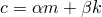，其中  是质量阻尼因子， 是刚度阻尼因子。

假设形式为 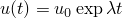 的解，我们有

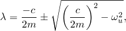

其中 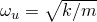 是无阻尼振动频率（本示例参数为 25.118 rad/sec）。当 *c* 的值使该方程的判别式为零时，发生临界阻尼，因此

我们定义阻尼比  为阻尼与临界阻尼的比值：

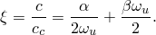

该方程中的关系通常被用作选择  和  的基础。

定义  的方程可以重写为

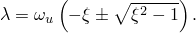

我们选择该情况中的阻尼小于临界值，因此 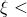 < 1，系统可以振动。初始条件为 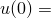 = 1 和 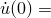 = 0，因此运动的动态部分为

其中 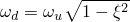 是系统的阻尼频率。

该振荡方程在一个振动周期前后的振幅 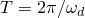 具有比值

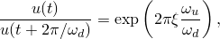

因此，响应 *n* 个周期的对数减量为

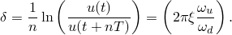

[表 1.4.5-1](ch01s04ach41.md#table-rayleigh-logdecs) 显示了从 Abaqus 计算的各种测试案例的  值及其对应的精确解。计算对数减量的样本时间历史如图 1.4.5-2（[图 1.4.5-2](ch01s04ach41.md#sxmrayleigh-timehist)）所示。所有 Abaqus 运行使用 0.01 秒的固定时间增量。模态方法中使用的积分器是精确的，因此该分析的结果是精确的。直接积分方法中使用的积分器不是精确的；然而，由于系统周期为 0.25 秒，选择的时间增量每个周期给出 25 个增量，因此这些结果也相当准确。

### 输入文件

[rayleighdamping_direct_alpha.inp](../eif/rayleighdamping_direct_alpha.inp)

直接积分分析， = 1.00472， = 0.0。

[rayleighdamping_modal_alpha.inp](../eif/rayleighdamping_modal_alpha.inp)

模态叠加分析， = 1.00472， = 0.0。

[rayleighdamping_direct_beta.inp](../eif/rayleighdamping_direct_beta.inp)

直接积分分析， = 0.0， = 1.59248×10⁻³。

[rayleighdamping_modal_beta.inp](../eif/rayleighdamping_modal_beta.inp)

模态叠加分析， = 0.0， = 1.59248×10⁻³。

[rayleighdamping_direct.inp](../eif/rayleighdamping_direct.inp)

直接积分分析， = 1.00472， = 1.59248×10⁻³。

[rayleighdamping_modal.inp](../eif/rayleighdamping_modal.inp)

模态叠加分析， = 1.00472， = 1.59248×10⁻³。

[rayleighdamping_beam_alpha.inp](../eif/rayleighdamping_beam_alpha.inp)

使用 [*BEAM GENERAL SECTION*](../key/key-link.md#usb-kws-mbeamgensect) 的直接积分分析， = 1.00472， = 0.0。

[rayleighdamping_beam_beta.inp](../eif/rayleighdamping_beam_beta.inp)

使用 [*BEAM GENERAL SECTION*](../key/key-link.md#usb-kws-mbeamgensect) 的直接积分分析， = 0.0， = 1.59248×10⁻³。

[rayleighdamping_beam.inp](../eif/rayleighdamping_beam.inp)

使用 [*BEAM GENERAL SECTION*](../key/key-link.md#usb-kws-mbeamgensect) 的直接积分分析， = 1.00472， = 1.59248×10⁻³。

[rayleighdamping_shell_alpha.inp](../eif/rayleighdamping_shell_alpha.inp)

使用 [*SHELL GENERAL SECTION*](../key/key-link.md#usb-kws-mshellgensect) 的直接积分分析， = 1.00472， = 0.0。

[rayleighdamping_shell_beta.inp](../eif/rayleighdamping_shell_beta.inp)

使用 [*SHELL GENERAL SECTION*](../key/key-link.md#usb-kws-mshellgensect) 的直接积分分析， = 0.0， = 1.59248×10⁻³。

[rayleighdamping_shell_.inp](../eif/rayleighdamping_shell_.inp)

使用 [*SHELL GENERAL SECTION*](../key/key-link.md#usb-kws-mshellgensect) 的直接积分分析， = 1.00472， = 1.59248×10⁻³。

[rayleighdamping_substr_alpha.inp](../eif/rayleighdamping_substr_alpha.inp)

使用子结构的直接积分分析， = 1.00472， = 0.0。

[rayleighdamping_substr_alpha_gen1.inp](../eif/rayleighdamping_substr_alpha_gen1.inp)

在 analysesrayleighdamping_substr_alpha.inp 和 rayleighdamping_overide.inp 中引用的子结构生成。

[rayleighdamping_substr_beta.inp](../eif/rayleighdamping_substr_beta.inp)

使用子结构的直接积分分析， = 0.0， = 1.59248×10⁻³。

[rayleighdamping_substr_beta_gen1.inp](../eif/rayleighdamping_substr_beta_gen1.inp)

在 analysis rayleighdamping_substr_beta.inp 中引用的子结构生成。

[rayleighdamping_substr.inp](../eif/rayleighdamping_substr.inp)

使用子结构的直接积分分析， = 1.00472， = 1.59248×10⁻³。

[rayleighdamping_substr_gen1.inp](../eif/rayleighdamping_substr_gen1.inp)

在 analysis rayleighdamping_substr.inp 中引用的子结构生成。

[rayleighdamping_override.inp](../eif/rayleighdamping_override.inp)

测试在 [*SUBSTRUCTURE PROPERTY*](../key/key-link.md#usb-kws-msubprop) 选项上阻尼特性的覆盖。

[rayleighdamping_usr_element.inp](../eif/rayleighdamping_usr_element.inp)

在直接积分动力学（[*DYNAMIC*](../key/key-link.md#usb-kws-hdynamic)）中与用户单元一起使用 Rayleigh 阻尼。

### 表格

**表 1.4.5-1** 精确值与图形对数减量的比较。
| 阻尼参数 | 阻尼比  | 对数减量 |
| --- | --- | --- |
| 质量 | 刚度 | 精确值 | 直接积分 | 模态叠加 |
|  |  |
| 1.00472 | 0.0 | 0.02 | 0.1257 | 0.1253 | 0.1257 |
| 0.0 | 1.59248×10⁻³ | 0.02 | 0.1257 | 0.1253 | 0.1257 |
| 1.00472 | 1.59248×10⁻³ | 0.04 | 0.2514 | 0.2499 | 0.2514 |

### 图表

**图 1.4.5-1** 桁架-质量振动系统。

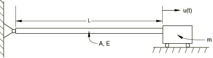

**图 1.4.5-2** 样本时间历史。

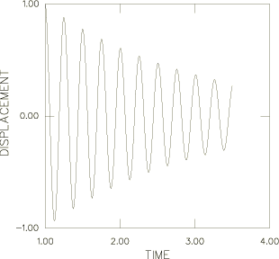
