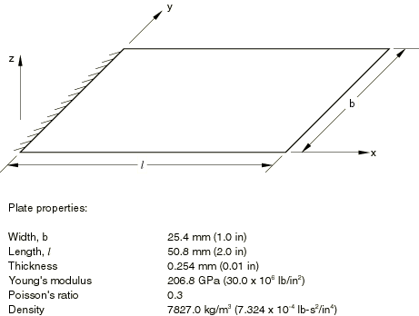
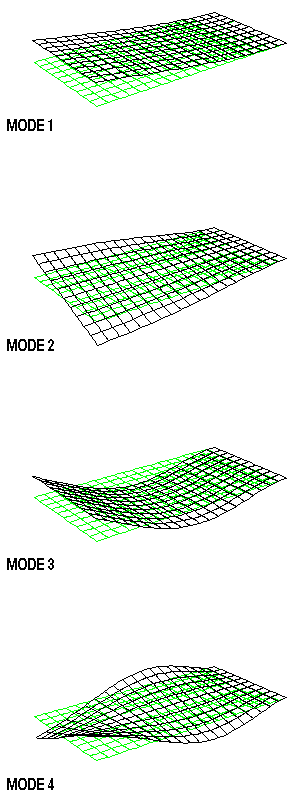

# 1.4.6 悬臂板特征值分析

**产品：** Abaqus/Standard

本示例使用简单的板问题，提供了壳单元线性振动能力的验证。结构为悬臂板，宽度是长度的一半，宽厚比为 100:1。使用三种不同网格进行分析；较细的网格对相对较大的模型进行特征值例程测试。

### 问题描述

板的特性如图 1.4.6-1（[图 1.4.6-1](ch01s04ach42.md#sxmeigenplate-geom)）所示。分析涉及三种不同网格：2×4、5×10 和 10×20，其中较小的单元数用于板的宽度方向。每种网格使用以下壳单元：S3R、S4R5、S8R5、S9R5、STRI65、STRI3、S4R、S4 和 S8R。三角形单元使用的网格基于将每个矩形分割成两个三角形。

### 结果与讨论

Barton（1951）开发的级数解被 Zienkiewicz（1971）用于与本示例类似的研究。这里使用的板比 Zienkiewicz（1971）描述的板更薄，因为理论解是薄板解，我们希望确保单元类型 STRI65、S9R5、S8R5、S4R5、S8R、S4R 和 S4（包括以惩罚形式包含的横向剪切应变能）提供可比较的结果。如果使用较厚的板，这些单元中的剪切柔度将导致其预测与薄板解不同。

二阶壳单元（S9R5、STRI65、S8R5 和 S8R）即使使用 2×4 网格也能给出前四个频率的基本收敛值。（这里我们指的是相对于所用单元数量的收敛，并基于观察到频率值随网格细化没有显著变化而得出此结论。）S8R 在网格细化时第四模式的频率有一些降低：这可能是由横向剪切柔度影响结果引起的。对于一阶单元（S4R5、S4R、S4、S3R 和 STRI3），除了 S3R 单元外，所有网格都给出相当好的频率值。由于常弯曲应变近似，S3R 单元需要更细的网格才能获得良好的准确性，这从结果中可以明显看出。对于相同的自由度数量，二阶单元对更高模式比一阶单元给出更好的结果。振型如图 1.4.6-2（[图 1.4.6-2](ch01s04ach42.md#sxmeigenplate-modeshapes)）所示。

### 输入文件

[eigenvalueplate_s3r_coarse.inp](../eif/eigenvalueplate_s3r_coarse.inp)

S3R 单元类型，2×4 网格。

[eigenvalueplate_s3r_fine.inp](../eif/eigenvalueplate_s3r_fine.inp)

S3R 单元类型，5×10 网格。

[eigenvalueplate_s3r_finer.inp](../eif/eigenvalueplate_s3r_finer.inp)

S3R 单元类型，10×20 网格。

[eigenvalueplate_s4_coarse.inp](../eif/eigenvalueplate_s4_coarse.inp)

S4 单元类型，2×4 网格。

[eigenvalueplate_s4_fine.inp](../eif/eigenvalueplate_s4_fine.inp)

S4 单元类型，5×10 网格。

[eigenvalueplate_s4_finer.inp](../eif/eigenvalueplate_s4_finer.inp)

S4 单元类型，10×20 网格。

[eigenvalueplate_s4r_coarse.inp](../eif/eigenvalueplate_s4r_coarse.inp)

S4R 单元类型，2×4 网格。

[eigenvalueplate_s4r_fine.inp](../eif/eigenvalueplate_s4r_fine.inp)

S4R 单元类型，5×10 网格。

[eigenvalueplate_s4r_finer.inp](../eif/eigenvalueplate_s4r_finer.inp)

S4R 单元类型，10×20 网格。

[eigenvalueplate_s4r5_coarse.inp](../eif/eigenvalueplate_s4r5_coarse.inp)

S4R5 单元类型，2×4 网格。

[eigenvalueplate_s4r5_fine.inp](../eif/eigenvalueplate_s4r5_fine.inp)

S4R5 单元类型，5×10 网格。

[eigenvalueplate_s4r5_finer.inp](../eif/eigenvalueplate_s4r5_finer.inp)

S4R5 单元类型，10×20 网格。

[eigenvalueplate_s8r_coarse.inp](../eif/eigenvalueplate_s8r_coarse.inp)

S8R 单元类型，2×4 网格。

[eigenvalueplate_s8r_fine.inp](../eif/eigenvalueplate_s8r_fine.inp)

S8R 单元类型，5×10 网格。

[eigenvalueplate_s8r_finer.inp](../eif/eigenvalueplate_s8r_finer.inp)

S8R 单元类型，10×20 网格。

[eigenvalueplate_s8r5_coarse.inp](../eif/eigenvalueplate_s8r5_coarse.inp)

S8R5 单元类型，2×4 网格。

[eigenvalueplate_s8r5_fine.inp](../eif/eigenvalueplate_s8r5_fine.inp)

S8R5 单元类型，5×10 网格。

[eigenvalueplate_s8r5_finer.inp](../eif/eigenvalueplate_s8r5_finer.inp)

S8R5 单元类型，10×20 网格。

[eigenvalueplate_s9r5_coarse.inp](../eif/eigenvalueplate_s9r5_coarse.inp)

S9R5 单元类型，2×4 网格。

[eigenvalueplate_s9r5_fine.inp](../eif/eigenvalueplate_s9r5_fine.inp)

S9R5 单元类型，5×10 网格。

[eigenvalueplate_s9r5_finer.inp](../eif/eigenvalueplate_s9r5_finer.inp)

S9R5 单元类型，10×20 网格。

[eigenvalueplate_stri3_coarse.inp](../eif/eigenvalueplate_stri3_coarse.inp)

STRI3 单元类型，2×4 网格。

[eigenvalueplate_stri3_fine.inp](../eif/eigenvalueplate_stri3_fine.inp)

STRI3 单元类型，5×10 网格。

[eigenvalueplate_stri3_finer.inp](../eif/eigenvalueplate_stri3_finer.inp)

STRI3 单元类型，10×20 网格。

[eigenvalueplate_stri65_coarse.inp](../eif/eigenvalueplate_stri65_coarse.inp)

STRI65 单元类型，2×4 网格。

[eigenvalueplate_stri65_fine.inp](../eif/eigenvalueplate_stri65_fine.inp)

STRI65 单元类型，5×10 网格。

[eigenvalueplate_stri65_finer.inp](../eif/eigenvalueplate_stri65_finer.inp)

STRI65 单元类型，10×20 网格。

### 参考

Barton, M. V., "Vibrations of Rectangular and Shear Plates," Journal of Applied Mechanics, vol. 18, pp. 129–134, 1951.

Zienkiewicz, O. C., *The Finite Element Method in Engineering Science, *McGraw-Hill, London, 1971.

### 表格

**表 1.4.6-1** 前四个模式的频率，单位为 Hz。
| 模式 | 1 | 2 | 3 | 4 |
| --- | --- | --- | --- | --- |
| 级数解 | 84.6 | 363.8 | 526.6 | 1187.0 |
| S3R |  |  |  |  |
| 2×4 (90) | 91.5 | 539.9 | 653.7 | 1811.8 |
| 5×10 (396) | 86.8 | 401.1 | 549.8 | 1374.9 |
| 10×20 (1386) | 85.1 | 367.8 | 532.1 | 1210.0 |
| S4 |  |  |  |  |
| 2×4 (90) | 84.7 | 367.5 | 610.6 | 1324.1 |
| 5×10 (396) | 84.0 | 361.9 | 535.7 | 1198.9 |
| 10×20 (1386) | 83.9 | 360.8 | 525.6 | 1179.5 |
| S4R |  |  |  |  |
| 2×4 (90) | 84.2 | 357.2 | 609.5 | 1257.5 |
| 5×10 (396) | 83.9 | 360.4 | 535.3 | 1189.7 |
| 10×20 (1386) | 83.8 | 360.4 | 525.4 | 1177.2 |
| S4R5 |  |  |  |  |
| 2×4 (90) | 84.2 | 356.3 | 609.3 | 1251.6 |
| 5×10 (396) | 83.9 | 360.4 | 535.3 | 1189.6 |
| 10×20 (1386) | 83.8 | 360.5 | 525.4 | 1177.5 |
| S8R |  |  |  |  |
| 2×4 (222) | 83.8 | 361.2 | 525.5 | 1183.8 |
| 5×10 (1086) | 83.9 | 360.4 | 522.5 | 1172.9 |
| 10×20 (3966) | 83.8 | 359.7 | 522.2 | 1170.9 |
| S8R5 |  |  |  |  |
| 2×4 (270) | 83.8 | 360.6 | 523.8 | 1176.6 |
| 5×10 (1386) | 83.8 | 360.6 | 522.4 | 1173.7 |
| 10×20 (5166) | 83.8 | 360.5 | 522.2 | 1173.2 |
| S9R5 |  |  |  |  |
| 2×4 (270) | 83.8 | 360.6 | 523.8 | 1176.6 |
| 5×10 (1386) | 83.8 | 360.6 | 522.4 | 1173.7 |
| 10×20 (5166) | 83.8 | 360.5 | 522.2 | 1173.2 |
| STRI3 |  |  |  |  |
| 2×4 (90) | 81.6 | 298.9 | 473.7 | 928.2 |
| 5×10 (396) | 83.5 | 348.2 | 514.1 | 1130.0 |
| 10×20 (1386) | 83.7 | 357.4 | 520.3 | 1163.0 |
| STRI65 |  |  |  |  |
| 2×4 (270) | 84.1 | 368.1 | 524.0 | 1229.1 |
| 5×10 (1386) | 83.9 | 360.9 | 521.8 | 1175.4 |
| 10×20 (5166) | 83.8 | 360.5 | 522.2 | 1172.9 |
| 网格尺寸规格后面是模型中的自由度数量。 |

### 图表

**图 1.4.6-1** 悬臂板。

**图 1.4.6-2** 振动悬臂板的振型。

