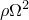
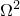
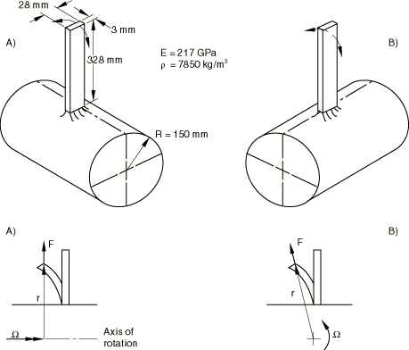

# 1.4.7 旋转悬臂板的振动

**产品：** Abaqus/Standard

本示例旨在提供当结构在旋转坐标系中进行小振动时，振动问题中存在的离心载荷刚度效应的基本验证。这种应用最常见的例子是旋转机器部件（如涡轮和压气机上的叶片）振动的研究。在这些情况下，在固定坐标系中的振动问题中不存在的两种效应变得重要：由离心载荷引起的结构初始应力，以及如果振动引起垂直于旋转轴平面内的运动，则离心载荷作用线发生变化引起的"载荷刚度"效应。在大多数传统旋转机器设计中，初始应力效应是刚化效应，载荷刚度效应是软化效应。在涡轮或压气机叶片振动中，载荷刚度效应仅在小型轮子上的长叶片（如现代高涵道比航空发动机上的风扇叶片）中显著：见 Hibbitt（1979）。本示例的目的是说明这种效应并验证 Abaqus 中此类振动研究的能力。

### 问题描述

模型是一个单 flat 板，长 328 mm，宽 28 mm，厚 3 mm，嵌入半径为 150 mm 的刚性轮子中，绕其轴旋转。研究了该问题的两个版本。在"情况 A"中，板的安装方式使其第一振型位于包含轮轴的平面内。因此，离心载荷的作用线不会随着叶片进行小振动而改变；因此，载荷刚度效应不参与此振型。在"情况 B"中，板的安装方式使其第一振型位于与轮子旋转轴成直角的平面内。因此，载荷刚度效应在此振型中很重要。由于板与轮子半径相比相对较长，载荷刚度效应显著：情况 B 的第一模式频率比情况 A 低得多。

使用了多种不同的单元类型（梁、壳、三维实体单元）。在每种情况下选择"合理"的网格——通常沿板使用六个单元。由于我们仅比较最低模式频率，因此相当粗的网格应该足够。

板由钢制成，杨氏模量 217 GPa，密度 7850 kg/m³。

### 分析

分析分一系列步骤完成。步骤 1 使用频率过程提取静止系统（轮子不旋转）的最低模式。在本示例中仅需要最低频率：在实际情况下可能需要几个频率。

步骤 2 是静力过程，其中使用分布载荷施加对应于系统 25 转/秒旋转速度的离心载荷。此离心载荷使用 CENT 和 CENTRIF 载荷类型施加。分布载荷大小必须给出：对于 CENT 载荷类型为 ，对于 CENTRIF 载荷类型为 。CENTRIF 载荷类型在负载计算中使用元素的实际质量矩阵来计算密度，这意味着对一阶单元使用集中质量矩阵，对二阶单元使用一致质量矩阵。CENT 载荷类型始终使用一致质量矩阵。在步骤中考虑几何非线性，这导致 Abaqus 包含初始应力和载荷刚度效应，并意味着非线性分析。

步骤 3 使用频率过程获得此旋转速度下的最低频率。步骤 4 是将离心载荷增加到 50 转/秒旋转速度的静力步骤，步骤 5 获得此速度下的最低特征模式，步骤 6 将速度增加到 75 转/秒，步骤 7 获得此速度下的最低特征模式。

### 子结构分析

本示例适合演示 Abaqus 中的子结构预加载能力。使用此选项，可以创建有限元网格，使用非线性过程加载它，并使用加载后的当前刚度创建子结构。如果必须对带有所有旋转叶片的整个轮子进行建模，可以使用此选项简化模型。叶片将被建模为子结构，施加离心力，并形成包括"载荷刚度"的刚度。然后可以旋转子结构并将其用于连接到轮子的所有叶片。

预加载通过在子结构生成步骤之前的一个或几个分析步骤来获得。子结构刚度从先前通用分析步骤的最终加载条件形成。为每个分析生成四个子结构。第一个是在没有任何预加载的情况下生成的。其余三个子结构在施加离心载荷后生成，因此每个都包含与不同旋转速度相关的载荷刚度。此外，当使用子结构时，载荷刚度包含在子结构刚度矩阵中，因此无论在频率步骤中是否考虑几何非线性，都会包含在频率提取中。

### 结果与讨论

每种情况下每个几何模型和速度获得的频率如表 1.4.7-1（[表 1.4.7-1](ch01s04ach43.md#table-vibplate-spinfreqs)）所示，其中这些数值结果与 Rayleigh 商解（Lindberg，1986）进行比较。数值结果与 Rayleigh 商解非常接近。使用载荷类型 CENT 和载荷类型 CENTRIF 获得的结果之间的差异可以忽略不计。

### 输入文件

#### 情况 A：

[vibrotplate_b21_cent_a.inp](../eif/vibrotplate_b21_cent_a.inp)

具有 CENT 载荷选项的 B21 单元类型。

[vibrotplate_b21_centrif_a.inp](../eif/vibrotplate_b21_centrif_a.inp)

具有 CENTRIF 载荷选项的 B21 单元类型。

[vibrotplate_b23_cent_a.inp](../eif/vibrotplate_b23_cent_a.inp)

具有 CENT 载荷选项的 B23 单元类型。

[vibrotplate_b23_centrif_a.inp](../eif/vibrotplate_b23_centrif_a.inp)

具有 CENTRIF 载荷选项的 B23 单元类型。

[vibrotplate_b31_cent_a.inp](../eif/vibrotplate_b31_cent_a.inp)

具有 CENT 载荷选项的 B31 单元类型。

[vibrotplate_b31_centrif_a.inp](../eif/vibrotplate_b31_centrif_a.inp)

具有 CENTRIF 载荷选项的 B31 单元类型。

[vibrotplate_b33_cent_a.inp](../eif/vibrotplate_b33_cent_a.inp)

具有 CENT 载荷选项的 B33 单元类型。

[vibrotplate_b33_centrif_a.inp](../eif/vibrotplate_b33_centrif_a.inp)

具有 CENTRIF 载荷选项的 B33 单元类型。

[vibrotplate_c3d8i_cent_a.inp](../eif/vibrotplate_c3d8i_cent_a.inp)

具有 CENT 载荷选项的 C3D8I 单元类型。

[vibrotplate_c3d8i_centrif_a.inp](../eif/vibrotplate_c3d8i_centrif_a.inp)

具有 CENTRIF 载荷选项的 C3D8I 单元类型。

[vibrotplate_c3d10_cent_a.inp](../eif/vibrotplate_c3d10_cent_a.inp)

具有 CENT 载荷选项的 C3D10 单元类型。

[vibrotplate_c3d10_centrif_a.inp](../eif/vibrotplate_c3d10_centrif_a.inp)

具有 CENTRIF 载荷选项的 C3D10 单元类型。

[vibrotplate_c3d10i_cent_a.inp](../eif/vibrotplate_c3d10i_cent_a.inp)

具有 CENT 载荷选项的 C3D10I 单元类型。

[vibrotplate_c3d10i_centrif_a.inp](../eif/vibrotplate_c3d10i_centrif_a.inp)

具有 CENTRIF 载荷选项的 C3D10I 单元类型。

[vibrotplate_c3d10m_cent_a.inp](../eif/vibrotplate_c3d10m_cent_a.inp)

具有 CENT 载荷选项的 C3D10M 单元类型。

[vibrotplate_c3d10m_centrif_a.inp](../eif/vibrotplate_c3d10m_centrif_a.inp)

具有 CENTRIF 载荷选项的 C3D10M 单元类型。

[vibrotplate_c3d20_cent_a.inp](../eif/vibrotplate_c3d20_cent_a.inp)

具有 CENT 载荷选项的 C3D20 单元类型。

[vibrotplate_c3d20_centrif_a.inp](../eif/vibrotplate_c3d20_centrif_a.inp)

具有 CENTRIF 载荷选项的 C3D20 单元类型。

[vibrotplate_c3d20r_cent_a.inp](../eif/vibrotplate_c3d20r_cent_a.inp)

具有 CENT 载荷选项的 C3D20R 单元类型。

[vibrotplate_c3d20r_centrif_a.inp](../eif/vibrotplate_c3d20r_centrif_a.inp)

具有 CENTRIF 载荷选项的 C3D20R 单元类型。

[vibrotplate_s8r_cent_a.inp](../eif/vibrotplate_s8r_cent_a.inp)

具有 CENT 载荷选项的 S8R 单元类型。

[vibrotplate_s8r_centrif_a.inp](../eif/vibrotplate_s8r_centrif_a.inp)

具有 CENTRIF 载荷选项的 S8R 单元类型。

[vibrotplate_s8r5.inp](../eif/vibrotplate_s8r5.inp)

具有 CENT 载荷选项的 S8R5 单元类型。

[vibrotplate_s8r5_centrif_a.inp](../eif/vibrotplate_s8r5_centrif_a.inp)

具有 CENTRIF 载荷选项的 S8R5 单元类型。

[vibrotplate_s8r5_substr.inp](../eif/vibrotplate_s8r5_substr.inp)

当叶片被建模为具有 CENT 载荷选项的子结构时的 S8R5 单元类型。

[vibrotplate_s8r5_substr_gen1.inp](../eif/vibrotplate_s8r5_substr_gen1.inp)

在分析 vibrotplate_s8r5_substr.inp 中引用的子结构生成。

[vibrotplate_s8r5_substr_centrif_a.inp](../eif/vibrotplate_s8r5_substr_centrif_a.inp)

当叶片被建模为具有 CENTRIF 载荷选项的子结构时的 S8R5 单元类型。

[vibrotplate_s8r5_substr_centrif_a_gen1.inp](../eif/vibrotplate_s8r5_substr_centrif_a_gen1.inp)

在分析 vibrotplate_s8r5_substr_centrif_a.inp 中引用的子结构生成。

#### 情况 B：

[vibrotplate_b21_cent_b.inp](../eif/vibrotplate_b21_cent_b.inp)

具有 CENT 载荷选项的 B21 单元类型。

[vibrotplate_b21_centrif_b.inp](../eif/vibrotplate_b21_centrif_b.inp)

具有 CENTRIF 载荷选项的 B21 单元类型。

[vibrotplate_b23_cent_b.inp](../eif/vibrotplate_b23_cent_b.inp)

具有 CENT 载荷选项的 B23 单元类型。

[vibrotplate_b23_centrif_b.inp](../eif/vibrotplate_b23_centrif_b.inp)

具有 CENTRIF 载荷选项的 B23 单元类型。

[vibrotplate_b31_cent_b.inp](../eif/vibrotplate_b31_cent_b.inp)

具有 CENT 载荷选项的 B31 单元类型。

[vibrotplate_b31_centrif_b.inp](../eif/vibrotplate_b31_centrif_b.inp)

具有 CENTRIF 载荷选项的 B31 单元类型。

[vibrotplate_b33_cent_b.inp](../eif/vibrotplate_b33_cent_b.inp)

具有 CENT 载荷选项的 B33 单元类型。

[vibrotplate_b33_centrif_b.inp](../eif/vibrotplate_b33_centrif_b.inp)

具有 CENTRIF 载荷选项的 B33 单元类型。

[vibrotplate_c3d8i_cent_b.inp](../eif/vibrotplate_c3d8i_cent_b.inp)

具有 CENT 载荷选项的 C3D8I 单元类型。

[vibrotplate_c3d8i_centrif_b.inp](../eif/vibrotplate_c3d8i_centrif_b.inp)

具有 CENTRIF 载荷选项的 C3D8I 单元类型。

[vibrotplate_c3d10_cent_b.inp](../eif/vibrotplate_c3d10_cent_b.inp)

具有 CENT 载荷选项的 C3D10 单元类型。

[vibrotplate_c3d10_centrif_b.inp](../eif/vibrotplate_c3d10_centrif_b.inp)

具有 CENTRIF 载荷选项的 C3D10 单元类型。

[vibrotplate_c3d10i_cent_b.inp](../eif/vibrotplate_c3d10i_cent_b.inp)

具有 CENT 载荷选项的 C3D10I 单元类型。

[vibrotplate_c3d10i_centrif_b.inp](../eif/vibrotplate_c3d10i_centrif_b.inp)

具有 CENTRIF 载荷选项的 C3D10I 单元类型。

[vibrotplate_c3d10m_cent_b.inp](../eif/vibrotplate_c3d10m_cent_b.inp)

具有 CENT 载荷选项的 C3D10M 单元类型。

[vibrotplate_c3d10m_centrif_b.inp](../eif/vibrotplate_c3d10m_centrif_b.inp)

具有 CENTRIF 载荷选项的 C3D10M 单元类型。

[vibrotplate_c3d20_cent_b.inp](../eif/vibrotplate_c3d20_cent_b.inp)

具有 CENT 载荷选项的 C3D20 单元类型。

[vibrotplate_c3d20_centrif_b.inp](../eif/vibrotplate_c3d20_centrif_b.inp)

具有 CENTRIF 载荷选项的 C3D20 单元类型。

[vibrotplate_c3d20r_cent_b.inp](../eif/vibrotplate_c3d20r_cent_b.inp)

具有 CENT 载荷选项的 C3D20R 单元类型。

[vibrotplate_c3d20r_centrif_b.inp](../eif/vibrotplate_c3d20r_centrif_b.inp)

具有 CENTRIF 载荷选项的 C3D20R 单元类型。

[vibrotplate_s8r_cent_b.inp](../eif/vibrotplate_s8r_cent_b.inp)

具有 CENT 载荷选项的 S8R 单元类型。

[vibrotplate_s8r_centrif_b.inp](../eif/vibrotplate_s8r_centrif_b.inp)

具有 CENTRIF 载荷选项的 S8R 单元类型。

[vibrotplate_s8r5_cent_b.inp](../eif/vibrotplate_s8r5_cent_b.inp)

具有 CENT 载荷选项的 S8R5 单元类型。

[vibrotplate_s8r5_centrif_b.inp](../eif/vibrotplate_s8r5_centrif_b.inp)

具有 CENTRIF 载荷选项的 S8R5 单元类型。

[vibrotplate_s8r5_substr_cent_b.inp](../eif/vibrotplate_s8r5_substr_cent_b.inp)

当叶片被建模为具有 CENT 载荷选项的子结构时的 S8R5 单元类型。

[vibrotplate_s8r5_substr_cent_b_gen1.inp](../eif/vibrotplate_s8r5_substr_cent_b_gen1.inp)

在分析 vibrotplate_s8r5_substr_cent_b.inp 中引用的子结构生成。

[vibrotplate_s8r5_substr_centrif_b.inp](../eif/vibrotplate_s8r5_substr_centrif_b.inp)

当叶片被建模为具有 CENTRIF 载荷选项的子结构时的 S8R5 单元类型。

[vibrotplate_s8r5_substr_centrif_b_gen1.inp](../eif/vibrotplate_s8r5_substr_centrif_b_gen1.inp)

在分析 vibrotplate_s8r5_substr_centrif_b.inp 中引用的子结构生成。

### 参考

Hibbitt, H. D., "Some Follower Forces and Load Stiffness," International Journal for Numerical Methods in Engineering, vol. 14, pp. 937–941, 1979.

Lindberg, B., "Berechnung der ersten Eigenfrequenz eines Balkens in Fliehkraftfeld mit Rayleigh Quotient," Internal report HTGE-ST-0051, Brown Boveri & Cie., Baden, Switzerland, 1986.

### 表格

**表 1.4.7-1** 旋转梁频率（Hz）。
|  | 在旋转轴平面内的振动 | 垂直于旋转轴的振动 |
| --- | --- | --- |
|  | （情况 A） | （情况 B） |
| 旋转速度（周/秒） | 0 | 25 | 50 | 75 | 25 | 50 | 75 |
| Rayleigh 商 | 23.68 | 41.74 | 72.10 | 104.27 | 33.42 | 51.95 | 72.44 |
| B21 | 23.44 | 41.20 | 71.00 | 102.29 | 32.94 | 50.86 | 70.24 |
| B23 | 23.68 | 41.72 | 71.94 | 103.73 | 33.40 | 51.73 | 71.66 |
| B31 | 23.44 | 41.20 | 71.00 | 102.29 | 32.94 | 50.86 | 70.24 |
| B33 | 23.68 | 41.83 | 72.14 | 103.98 | 33.54 | 52.00 | 72.02 |
| S8R | 23.89 | 41.90 | 72.13 | 103.91 | 33.63 | 51.99 | 71.91 |
| S8R5 | 23.81 | 41.82 | 72.05 | 103.82 | 33.53 | 51.87 | 71.79 |
| 子结构 | 23.82 | 41.88 | 72.33 | 104.58 | 33.56 | 51.98 | 72.04 |
| C3D8I | 24.23 | 41.90 | 71.93 | 103.66 | 33.82 | 52.15 | 72.25 |
| C3D10 | 25.14 | 42.70 | 72.88 | 104.91 | 34.62 | 53.03 | 73.34 |
| C3D10I | 25.14 | 42.71 | 72.89 | 104.92 | 34.63 | 53.04 | 73.37 |
| C3D10M | 24.82 | 42.40 | 72.51 | 104.45 | 34.32 | 52.70 | 72.96 |
| C3D20 | 24.53 | 42.45 | 72.87 | 105.02 | 34.30 | 53.01 | 73.51 |
| C3D20R | 24.28 | 42.25 | 72.54 | 104.38 | 34.06 | 52.55 | 72.60 |

### 图表

**图 1.4.7-1** 板和轮子几何形状。

