# 1.4.9 动态载荷下杆的线性分析

**产品：** Abaqus/Standard

本示例的目的是通过将解决方案与具有三个自由度简单系统的精确解进行比较来验证 Abaqus 中的线性动态过程。Abaqus 为基于系统特征模式提取的线性问题提供了四种动态分析过程：模态动态分析，提供时间历史响应；响应谱分析，计算给定响应谱的峰值响应值；稳态动态分析，当系统被正弦载荷持续激励时给出响应幅值和相位；以及随机响应分析，提供结构对非确定性载荷响应的统计测量。这些线性动态分析选项在《Abaqus 理论手册》第 2.5 节"模态动力学"中讨论 。

### 问题描述

模型由沿 *x* 轴放置的三个 T3D2 型桁架单元组成，*y*- 和 *z*-位移分量被约束，因此问题是一维的。节点 1 处的 *x* 位移也被约束，留下三个活动自由度。结构总长度 30，横截面积 2，密度 1/90，杨氏模量 5。（所有值均以一致单位给出。）

### 特征值计算

所有线性动力学过程的第一步是计算系统的特征值和特征向量。单元类型 T3D2 的质量矩阵是集中的；因此，这个三桁架系统的质量矩阵为

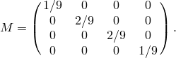

系统的刚度矩阵为

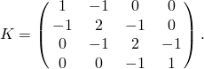

使用默认归一化方法的三个特征值和相应的特征向量如下表所示：

| 模式 | 特征值 | 频率 | 节点处特征向量幅值 |
| --- | --- | --- | --- |
| (Hz) | 1 | 2 | 3 | 4 |
| 1 | 1.2058 | 0.1748 | 0 | 0.5 | 0.866 | 1.0 |
| 2 | 9.0 | 0.4775 | 0 | 1.0 | 0 | 1.0 |
| 3 | 16.794 | 0.6522 | 0 | 0.5 | 0.866 | 1.0 |

Abaqus 还计算模态参与因子 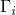，广义质量 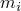，以及每个特征向量的有效质量（见《Abaqus 理论手册》第 2.5.2 节"与模型固有模式相关的变量" ，了解定义）。这种情况下的值为：

| 模式 | 参与因子 | 广义质量 | 有效质量 |
| --- | --- | --- | --- |
| 1 | 1.244 | 0.333 | 0.5158 |
| 2 | 0.333 | 0.333 | 0.0370 |
| 3 | 0.0893 | 0.333 | 0.00266 |

#### 替代归一化

Abaqus 允许以两种方式之一对特征向量进行归一化：使每个特征向量中的最大位移条目为单位（默认），或使每个特征向量的广义质量为单位。特征向量的归一化在《Abaqus 分析用户手册》第 6.3.5 节"固有频率提取"中讨论 。一般来说，如果请求默认归一化，则使用不同特征值提取方法或不同平台获得的特征向量符号是一致的，因为每个特征向量中的最大位移条目被缩放为正单位。对于这种归一化类型，特征向量条目的符号仅在特征向量中最大和最小位移条目大小相等但符号相反的情况下才可能因不同方法和不同平台而异。另一方面，如果请求质量归一化，则使用不同方法或不同平台获得的特征向量符号可能不同，因为在这种情况下，特征向量由正值缩放。模态参与因子的值和符号取决于归一化类型和相应特征向量的符号。

模态动态、响应谱、稳态和随机响应分析的广义坐标因特征向量归一化的不同而不同。因此，对于质量归一化，广义坐标的符号将根据特征向量的符号而变化。然而，使用模态值求和计算的实际值与特征向量归一化无关。

对于本示例，使用质量归一化的相应值如下表所示：

| 模式 | 特征值 | 频率 | 节点处特征向量幅值 |
| --- | --- | --- | --- |
| (Hz) | 1 | 2 | 3 | 4 |
| 1 | 1.2058 | 0.1748 | 0 | 0.866 | 1.5 | 1.732 |
| 2 | 9.0 | 0.4775 | 0 | 1.732 | 0 | 1.732 |
| 3 | 16.794 | 0.6522 | 0 | 0.866 | 1.5 | 1.732 |

| 模式 | 参与因子 | 广义质量 | 有效质量 |
| --- | --- | --- | --- |
| 1 | 0.718 | 1.0 | 0.5158 |
| 2 | 0.192 | 1.0 | 0.0370 |
| 3 | 0.0516 | 1.0 | 0.00266 |

### 模态动态分析

对本分析对三种类型的系统进行描述。

#### 端部载荷——阻尼系统

当载荷 10 突然施加并固定在节点 4 时，获得系统的时间历史响应。每种模式使用 10% 临界阻尼的阻尼。有了这个激励，（第 *i* 个特征模式的振幅）的解为

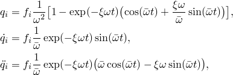

其中  是振动频率， 是临界阻尼比，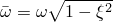，*t* 是时间， 是力在第 *i* 个特征模式上的投影。 由下式给出

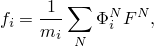

其中  是自由度 *N* 处的力（这种情况下 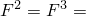 = 0，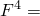 = 10），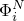 是第 *i* 个特征向量在自由度 *N* 处的分量， 是第 *i* 模式的广义质量。

#### 基座加速度——阻尼系统

接下来，结构受到固定节点（节点 1）处 1.0 恒定加速度的激励，使用基座运动定义。可以证明，当我们将力定义为

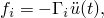

时，上面给出的力激励方程可用于这种情况，其中  是模态参与因子（定义于《Abaqus 理论手册》第 2.5.2 节"与模型固有模式相关的变量" ）。

#### 静力预加载——无阻尼系统（仅一种模式）

模态动态步骤是线性扰动过程，默认情况下将从未变形构型开始。然而，也可以使用静力线性扰动过程创建变形构型来从此构型开始分析。此步骤之后是模态动态步骤，指定起始位置是前一步骤的线性扰动解（《Abaqus 分析用户手册》第 6.1.3 节"通用和线性扰动过程" ）。此解被投影到特征值上以给出初始模态振幅：

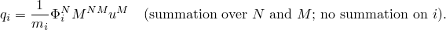

一般来说，只有当系统所有模式都包含在模态动态解中时，此投影才会保留所有预变形：如果在模态动态分析中仅使用系统的一小部分模式——如在实际应用中出现的那样——此投影仅是近似的：与分析中包含的模式正交的那部分预变形将丢失。

在本分析中，使用静力线性扰动过程中该节点处的边界条件，给节点 4 一个 1.0 的初始位移。然后在移除节点 4 处约束的情况下执行频率步骤，使得该节点在后续模态动态步骤中可自由振动。（至关重要的是，在求解系统固有模式的特征值问题之前移除边界条件。否则，将获得错误的模式——边界条件仍然存在。）仅使用一种模式，因此在投影到该模式时丢失了部分静力响应。

在携带初始条件的模态动态步骤开始时，Abaqus 使用上述方程计算模态振幅的初始值，对于位移归一化为 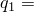 = 0.8293，对于质量归一化为  = 0.4779。由于无阻尼，响应将为

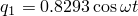

对于位移归一化，以及

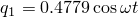

对于质量归一化。

### 响应谱分析

[图 1.4.9-1](ch01s04ach45.md#sxmlinearrod-dispspectra) 中所示的位移响应谱用于下一个分析。图中为无阻尼和每种模式 10% 临界阻尼定义了谱。在本示例中使用 2% 临界阻尼，使得对数插值为每种模式的最大位移给出 1.7411 的幅值。分析针对两种情况进行：每种模式贡献的绝对求和以及平方和的平方根（SRSS）求和。由于这种情况下频率分离良好，使用 10% 求和法将给出与 SRSS 方法相同的结果，完全二次组合响应将与 SRSS 仅有很小差异（由于模式之间非常小的互相关因子），海军研究实验室求和法将计算出非常接近绝对求和的结果。有关所有五种求和规则的比较，见《Abaqus 例题手册》第 2.2.3 节"三维框架建筑响应谱" 。绝对求和意味着峰值位移响应估计为

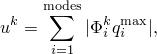

其中 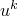 是自由度 *k* 处的位移，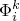 是自由度 *k* 处的第 *i* 个特征模式，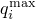 是第 *i* 模式中振幅的最大值， 从输入中给出的适当谱定义 *S* 找到。在这种情况下 *S* 由位移谱  表示，应用于全局 *x* 方向。SRSS 求和估计峰值位移响应为

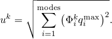

### 稳态分析

通过在一定频率范围内激励模型来验证稳态分析过程。形式为

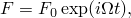

的载荷（其中  是激励频率，）沿 *x* 方向施加到节点 4。

此类分析有两种阻尼可用。一种是模态阻尼，定义模式的阻尼项为

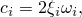

其中  是临界阻尼比。另一种是结构阻尼，其阻尼力定义为

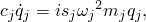

其中 ，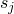 是结构阻尼因子。

Abaqus 提供第 *i* 模式的响应幅值 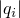 和相位角 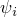 作为输出。对于本示例，仅施加实载荷，精确解——同时存在模态阻尼和结构阻尼——为

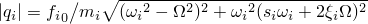

和

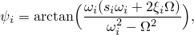

其中 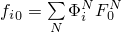 是投影到第 *i* 模式的激励函数的振幅 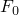。

输入文件 [rodlindynamic_ssdynamics.inp](../eif/rodlindynamic_ssdynamics.inp) 请求对 0.01 到 10 周/时间激励频率范围的稳态动态分析。所有三种模式形状都使用频率步骤提取，并在整个稳态分析中使用，如模态阻尼定义所示，其中阻尼值定义为每种模式临界阻尼的 10%。

### 随机响应分析

具有结构阻尼的相同杆模型现在暴露于非确定性载荷。我们考虑的情况是施加到所有节点的不相关白噪声。模态振幅（广义坐标）作为频率函数的互谱密度矩阵的精确解 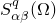，对于连续分布的白噪声为

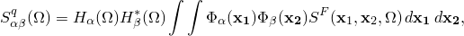

其中

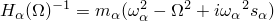

是模式  的复频率响应函数， 是该模式的广义质量， 是该模式的频率， 是与该模式一起使用的结构阻尼；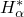 是 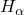 的复共轭；且 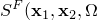 是外部载荷的互谱密度矩阵。Abaqus 假定互谱密度矩阵到特征模式的集成投影可以表达为投影到特征模式上的加载节点自由度之间的矩阵，因此

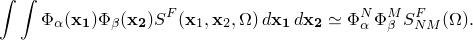

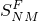 通过施加节点载荷 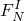（其中 *N* 指模型中的自由度，*I* 指载荷情况编号）并给出缩放因子矩阵 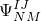 以及每个载荷情况的相应频率函数 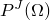 来定义。这里 *J* 指缩放因子矩阵 ，用于在载荷情况 *I* 中缩放 。然后  定义为

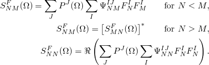

在这种情况下我们只需要一个载荷情况 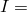 = 1，以及一个频率函数和相关的缩放因子矩阵  = 1。（见["对喷气噪声激励的随机响应"，第 1.4.10 节](ch01s04ach46.md)，其中需要几个频率函数和缩放因子矩阵来定义载荷的互谱密度矩阵。）由于假设白噪声不相关，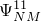 定义为对角矩阵：对于 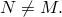，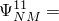 = 0。不相关载荷使用相关定义指定，其中定义了 。我们为缩放因子选择单位幅值，使得  成为单位矩阵。由于互谱密度矩阵的对角项是载荷的功率谱密度函数，互谱密度矩阵将是一个实对角矩阵。因此，这里不需要考虑虚频率函数和缩放因子。因此，功率谱定义是参考功率谱密度函数（而不是一般频率函数）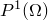，它通过载荷幅值的乘积 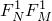 缩放（以及通过 ，但  是单位矩阵）。我们将幅值为 10 的载荷 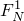 施加到节点 2 和 3，将幅值为 5 的载荷施加到节点 4，对应于沿杆连续分布的单位载荷。

在 0.1 周/时间的频率下，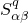 因此为

节点的位移、速度和加速度的互谱密度矩阵可以直接从  计算。例如，位移的互谱密度矩阵为

### 结果与讨论

本示例各种计算的结果在下面文本中的表格中给出。在所有情况下 Abaqus 结果都与精确解一致。

#### 模态动态分析：端部载荷——阻尼系统

对于位移归一化，在时间 0.1、0.2 和 0.3 时该模型中三个广义坐标的结果为：

| 时间 | 模式 |  |  |  |
| --- | --- | --- | --- | --- |
| 0.1 | 1 | 0.149 | 2.96 | 29.2 |
|  | 2 | 0.146 | 2.87 | 27.0 |
|  | 3 | 0.144 | 2.80 | 25.3 |
| 0.2 | 1 | 0.589 | 5.82 | 28.0 |
|  | 2 | 0.560 | 5.32 | 21.8 |
|  | 3 | 0.538 | 4.94 | 16.9 |
| 0.3 | 1 | 1.31 | 8.55 | 26.5 |
|  | 2 | 1.19 | 7.17 | 15.0 |
|  | 3 | 1.10 | 6.12 | 6.53 |

质量归一化的结果为：

| 时间 | 模式 |  |  |  |
| --- | --- | --- | --- | --- |
| 0.1 | 1 | 0.0859 | 1.71 | 16.8 |
|  | 2 | 0.0843 | 1.66 | 15.6 |
|  | 3 | 0.0831 | 1.62 | 14.6 |
| 0.2 | 1 | 0.340 | 3.36 | 16.2 |
|  | 2 | 0.323 | 3.07 | 12.6 |
|  | 3 | 0.311 | 2.85 | 9.77 |
| 0.3 | 1 | 0.756 | 4.94 | 15.3 |
|  | 2 | 0.687 | 4.14 | 8.65 |
|  | 3 | 0.635 | 3.53 | 3.77 |

广义坐标的符号可能根据相应特征向量的符号而变化。

通过在每个时刻求和模态值获得实际值：

其中 *a* 是实际量， 是为模式 *i* 计算的该量的值。

对于该结构中单元的应力和应变，这给出以下结果：

| 时间 | 单元 | 应力 | 应变 |
| --- | --- | --- | --- |
| 0.1 | 1 | 0.000206 | 0.000041 |
|  | 2 | 0.001870 | 0.000374 |
|  | 3 | 0.2173 | 0.043452 |
| 0.2 | 1 | 0.001797 | 0.000359 |
|  | 2 | 0.020377 | 0.004076 |
|  | 3 | 0.8210 | 0.1642 |
| 0.3 | 1 | 0.007051 | 0.001410 |
|  | 2 | 0.083857 | 0.016771 |
|  | 3 | 1.708 | 0.3416 |

节点变量的值使用相同的求和方法计算，因此位移、速度、加速度和反力为：

| 时间 | 节点 | 位移 | 速度 | 加速度 | 反力 |
| --- | --- | --- | --- | --- | --- |
| 0.1 | 1 | 0.0 | 0.0 | 0.0 | 0.000412 |
|  | 2 | 0.00041 | 0.0126 | 0.2632 |  |
|  | 3 | 0.00415 | 0.1394 | 3.363 |  |
|  | 4 | 0.4387 | 8.630 | 81.42 |  |
| 0.2 | 1 | 0.0 | 0.0 | 0.0 | 0.003595 |
|  | 2 | 0.00359 | 0.0583 | 0.6979 |  |
|  | 3 | 0.0444 | 0.7689 | 9.602 |  |
|  | 4 | 1.686 | 16.08 | 66.71 |  |
| 0.3 | 1 | 0.0 | 0.0 | 0.0 | 0.014102 |
|  | 2 | 0.01410 | 0.1660 | 1.547 |  |
|  | 3 | 0.1818 | 2.110 | 17.33 |  |
|  | 4 | 3.598 | 21.84 | 48.06 |  |

#### 模态动态分析：端部载荷——无阻尼系统

也为无阻尼系统获得时间历史响应。对于位移归一化，广义坐标的结果为：

| 时间 | 模式 |  |  |  |
| --- | --- | --- | --- | --- |
| 0.1 | 1 | 0.150 | 2.99 | 29.8 |
|  | 2 | 0.149 | 2.96 | 28.7 |
|  | 3 | 0.148 | 2.92 | 27.5 |
| 0.2 | 1 | 0.598 | 5.95 | 29.3 |
|  | 2 | 0.582 | 5.65 | 24.8 |
|  | 3 | 0.567 | 5.35 | 20.5 |
| 0.3 | 1 | 1.34 | 8.84 | 28.4 |
|  | 2 | 1.26 | 7.83 | 18.6 |
|  | 3 | 1.19 | 6.90 | 10.0 |

质量归一化的结果为：

| 时间 | 模式 |  |  |  |
| --- | --- | --- | --- | --- |
| 0.1 | 1 | 0.0865 | 1.73 | 17.2 |
|  | 2 | 0.0860 | 1.71 | 16.6 |
|  | 3 | 0.0854 | 1.68 | 15.9 |
| 0.2 | 1 | 0.345 | 3.44 | 16.9 |
|  | 2 | 0.336 | 3.26 | 14.3 |
|  | 3 | 0.327 | 3.09 | 11.8 |
| 0.3 | 1 | 0.772 | 5.10 | 16.4 |
|  | 2 | 0.728 | 4.52 | 10.8 |
|  | 3 | 0.686 | 3.98 | 5.80 |

#### 模态动态分析：基座加速度——阻尼系统

对于所有三种模式将模态阻尼设置为临界阻尼的 10%，对于位移归一化，该基座加速度三个广义坐标的响应为：

| 时间 | 模式 |  |  |  |
| --- | --- | --- | --- | --- |
| 0.1 | 1 | 0.00617 | 0.123 | 1.21 |
|  | 2 | 0.00162 | 0.0319 | 0.30 |
|  | 3 | 0.00043 | 0.00834 | 0.0753 |
| 0.2 | 1 | 0.02442 | 0.241 | 1.16 |
|  | 2 | 0.00622 | 0.05912 | 0.242 |
|  | 3 | 0.00160 | 0.01469 | 0.0504 |
| 0.3 | 1 | 0.05428 | 0.355 | 1.10 |
|  | 2 | 0.01322 | 0.07966 | 0.167 |
|  | 3 | 0.003272 | 0.01821 | 0.01944 |

质量归一化的结果为：

| 时间 | 模式 |  |  |  |
| --- | --- | --- | --- | --- |
| 0.1 | 1 | 0.00356 | 0.0709 | 0.698 |
|  | 2 | 0.000936 | 0.0184 | 0.173 |
|  | 3 | 0.000247 | 0.00481 | 0.0435 |
| 0.2 | 1 | 0.0140 | 0.139 | 0.671 |
|  | 2 | 0.00359 | 0.0341 | 0.140 |
|  | 3 | 0.000924 | 0.00848 | 0.0291 |
| 0.3 | 1 | 0.0313 | 0.205 | 0.636 |
|  | 2 | 0.00763 | 0.0460 | 0.0962 |
|  | 3 | 0.00189 | 0.0105 | 0.0112 |

这些响应给出节点变量的以下结果。（在此表中，如同在 Abaqus 输出中一样，位移、速度和加速度值通常相对于基座运动给出：也给出总位移值。）

| 时间 | 节点 | 位移 | 速度 | 加速度 | 总位移 |
| --- | --- | --- | --- | --- | --- |
| 0.1 | 1 | 0.0 | 0.0 | 0.0 | 0.0050000 |
|  | 2 | 0.00492 | 0.0974 | 0.9421 | 0.0000797 |
|  | 3 | 0.00497 | 0.0991 | 0.9824 | 0.0000290 |
|  | 4 | 0.00498 | 0.0993 | 0.9853 | 0.0000244 |
| 0.2 | 1 | 0.0 | 0.0 | 0.0 | 0.0200000 |
|  | 2 | 0.01923 | 0.1872 | 0.8478 | 0.0007692 |
|  | 3 | 0.01976 | 0.1964 | 0.9623 | 0.0002365 |
|  | 4 | 0.01980 | 0.1970 | 0.9700 | 0.0001965 |
| 0.3 | 1 | 0.0 | 0.0 | 0.0 | 0.0450000 |
|  | 2 | 0.04200 | 0.2661 | 0.7266 | 0.0030027 |
|  | 3 | 0.04417 | 0.2914 | 0.9364 | 0.0008259 |
|  | 4 | 0.04433 | 0.2932 | 0.9536 | 0.0006692 |

#### 模态动态分析：静力预加载——无阻尼系统（仅一种模式）

对于位移归一化，模态振幅的结果为：

| 时间 |  |
| --- | --- |
| 0.06 | 0.828 |
| 1.43 | 0.0004 |
| 2.86 | 0.829 |
| 5.32 | 0.750 |
| 5.72 | 0.829 |

质量归一化的结果为：

| 时间 |  |
| --- | --- |
| 0.06 | 0.478 |
| 1.43 | 0.0003 |
| 2.86 | 0.479 |
| 5.32 | 0.433 |
| 5.72 | 0.479 |

#### 响应谱分析

响应谱分析给出节点位移的以下结果：

| 节点 | 位移 | 位移 |
| --- | --- | --- |
| （绝对求和） | （SRSS） |
| 1 | 0.0 | 0.0 |
| 2 | 1.741 | 1.231 |
| 3 | 2.010 | 1.881 |
| 4 | 2.902 | 2.248 |

#### 稳态分析

对于位移归一化，广义位移（模态振幅，）的振幅和相位角的结果见下表：

| 激励频率 | 模式 | 振幅， | 相位， |
| --- | --- | --- | --- |
|  |  |
| 0.01 | 1 | 12.48 | 0.66 |
|  | 2 | 1.667 | 179.8 |
|  | 3 | 0.8934 | 0.1757 |
| 0.175 | 1 | 62.2 | 90.0 |
|  | 2 | 1.918 | 175.2 |
|  | 3 | 0.9607 | 3.304 |
| 0.477 | 1 | 1.918 | 175.2 |
|  | 2 | 8.333 | 90.0 |
|  | 3 | 1.835 | 17.51 |

质量归一化的结果见下表：

| 激励频率 | 模式 | 振幅， | 相位， |
| --- | --- | --- | --- |
|  |  |
| 0.01 | 1 | 7.705 | 0.66 |
|  | 2 | 0.9627 | 179.8 |
|  | 3 | 0.5158 | 0.1757 |
| 0.175 | 1 | 35.91 | 90.0 |
|  | 2 | 1.107 | 175.2 |
|  | 3 | 0.5546 | 3.304 |
| 0.477 | 1 | 1.107 | 175.2 |
|  | 2 | 4.811 | 90.0 |
|  | 3 | 1.060 | 17.51 |

单元 1 的应力和应变振幅以及节点 1 处的反力振幅为：

| 激励频率 | 应力 | 应变 | 反力， |
| --- | --- | --- | --- |
| 节点 1 |
| 0.01 | 2.51 | 0.5019 | 5.019 |
| 0.175 | 15.50 | 3.10 | 31.00 |
| 0.477 | 3.988 | 0.7977 | 7.977 |

可以为任何变量请求相位角输出。例如，单元 1 在 0.477 周/时间激励频率下的应力相对于激励函数的振幅为 3.988，相位角为 90.58。

包括第三步，其中使用 10% 结构阻尼计算稳态解。在低频（ ≈ 0.01）时，此步骤的结果与使用模态阻尼的结果差异不大，但在结构固有频率范围内的激励频率出现显著差异。

#### 随机响应分析

Abaqus 提供互谱密度矩阵的对角项；即功率谱密度。位移、速度和加速度在 0.1 周/时间的功率谱密度为：

| 节点 | 位移 | 速度 | 加速度 |
| --- | --- | --- | --- |
| 2 | 469.1 | 185.2 | 73.12 |
| 3 | 1311. | 517.6 | 204.3 |
| 4 | 1628. | 642.7 | 253.7 |

均方根值计算为方差的平方根，即功率谱密度到感兴趣频率的积分。节点变量在 1 Hz 时的均方根值为：

| 节点 | 均方根值 | 均方根值 | 均方根值 |
| --- | --- | --- | --- |
| 位移 | 速度 | 加速度 |
| 2 | 81.51 | 134.0 | 353.7 |
| 3 | 129.3 | 158.0 | 334.2 |
| 4 | 152.9 | 207.4 | 485.6 |

整个模型中的应力和应变的功率谱密度和均方根值同样从  以及应力和应变的模式向量计算。

### 输入文件

[rodlindynamic_modal_subeigen.inp](../eif/rodlindynamic_modal_subeigen.inp)

阻尼值为 0.1 且结构由施加在节点 4 的点载荷激励的 [*MODAL DYNAMIC*](../key/key-link.md#usb-kws-hmodaldyn) 分析。

[rodlindynamic_respspec_subeigen.inp](../eif/rodlindynamic_respspec_subeigen.inp)

[*RESPONSE SPECTRUM*](../key/key-link.md#usb-kws-hresponspec) 分析。

[rodlindynamic_ssdyn_subeigen.inp](../eif/rodlindynamic_ssdyn_subeigen.inp)

对于给定激励频率范围具有模态和结构阻尼的 [*STEADY STATE DYNAMICS*](../key/key-link.md#usb-kws-hsteadystdyn) 分析。

[rodlindynamic_random_subeigen.inp](../eif/rodlindynamic_random_subeigen.inp)

具有结构阻尼的 [*RANDOM RESPONSE*](../key/key-link.md#usb-kws-hrandomresp) 分析。

[rodlindynamic_correlationdata.inp](../eif/rodlindynamic_correlationdata.inp)

包含用于 rodlindynamic_random.inp 的相关定义。

[rodlindynamic_composite.inp](../eif/rodlindynamic_composite.inp)

具有复合模态阻尼的 [*MODAL DYNAMIC*](../key/key-link.md#usb-kws-hmodaldyn) 分析。

[rodlindynamic_modal_nodamp.inp](../eif/rodlindynamic_modal_nodamp.inp)

阻尼设置为 0 的 [*MODAL DYNAMIC*](../key/key-link.md#usb-kws-hmodaldyn) 分析。

[rodlindynamic_modal_base.inp](../eif/rodlindynamic_modal_base.inp)

具有 [*BASE MOTION*](../key/key-link.md#usb-kws-hbasemotion) 的 [*MODAL DYNAMIC*](../key/key-link.md#usb-kws-hmodaldyn) 分析。

[rodlindynamic_modal_preload.inp](../eif/rodlindynamic_modal_preload.inp)

激励由结构静力预加载引起，随后突然移除载荷以引起动态事件的 [*MODAL DYNAMIC*](../key/key-link.md#usb-kws-hmodaldyn) 分析。

[rodlindynamic_modal_base2.inp](../eif/rodlindynamic_modal_base2.inp)

使用辅助基座运动和复合模态阻尼的 [*MODAL DYNAMIC*](../key/key-link.md#usb-kws-hmodaldyn) 分析。

[rodlindynamic_modal.inp](../eif/rodlindynamic_modal.inp)

除了使用 Lanczos 求解器且特征向量相对于广义质量归一化外，与 rodlindynamic_modal_subeigen.inp 相同。

[rodlindynamic_respspect.inp](../eif/rodlindynamic_respspect.inp)

除了使用 Lanczos 求解器且特征向量相对于广义质量归一化外，与 rodlindynamic_respspec_subeigen.inp 相同。

[rodlindynamic_ssdyn_massnorm.inp](../eif/rodlindynamic_ssdyn_massnorm.inp)

除了特征向量相对于广义质量归一化外，与 rodlindynamic_ssdyn_subeigen.inp 相同。使用子空间迭代求解器。

[rodlindynamic_random_massnorm.inp](../eif/rodlindynamic_random_massnorm.inp)

除了特征向量相对于广义质量归一化外，与 rodlindynamic_random_subeigen.inp 相同。使用子空间迭代求解器。

[rodlindynamic_ssdynamics.inp](../eif/rodlindynamic_ssdynamics.inp)

除了使用 Lanczos 求解器外，与 rodlindynamic_ssdyn_subeigen.inp 相同。特征向量相对于最大位移归一化。

[rodlindynamic_random.inp](../eif/rodlindynamic_random.inp)

除了使用 Lanczos 求解器外，与 rodlindynamic_random_subeigen.inp 相同。特征向量相对于最大位移归一化。

### 图表

**图 1.4.9-1** 位移响应谱。

