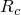
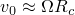
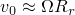
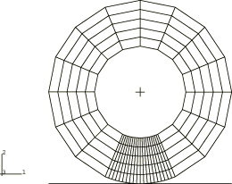
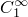
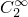
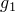

# 1.5.1 稳态传输分析

**产品：** Abaqus/Standard

本节包含的验证问题测试了 Abaqus 中的稳态传输分析能力。验证集中在摩擦效应、惯性效应和材料对流上。摩擦效应通过将 Abaqus 获得的结果与 Faria（1989）发表的结果进行比较来验证。惯性效应通过将稳态传输分析的特殊情况与使用分布载荷（载荷类型 CENT）施加离心载荷的 Abaqus 分析获得的结果进行比较来验证。材料对流通过与瞬态拉格朗日分析进行比较来验证。

### 摩擦效应

### 问题描述

在这一系列测试中，计算与平坦刚性表面接触的圆盘的自由滚动角速度 ，针对不同的盘几何形状、接触压力、摩擦系数、材料模型和单元类型。地面速度指定为直线平移速度  = 2.0 或转向角速度  = 0.02。通过指定大的转向半径  = 100.0，可恢复速度  = 2.0 的直线滚动。Abaqus 获得的结果与 Faria（1989）发表的数值结果进行比较。

模型由外半径  = 2.0 和可变内半径  的环组成。考虑三种不同的几何形状（ = 0.2、1.0、1.7）。模型在内侧完全固定，并沿轴向施加平面应变边界条件。

考虑两种材料模型：*E* = 800.0 和  = 0.3 的线性弹性材料，以及  = 80.0 和  = 20.0 的不可压缩超弹性材料。考虑的摩擦系数为  = 0.02 和  = 0.2。第一个分析步骤是静态分析，其中刚性表面位移距离  = 0.05 或  = 0.1 以建立接触压力。此步骤中的摩擦系数保持恒定为零。随后是稳态传输分析，其中施加地面行进速度和旋转角速度，并将摩擦系数斜升到其最终值。

问题使用不同类型的三维单元进行离散化。使用一阶单元离散的模型在圆周方向使用 34 个单元划分，在径向使用 5 个单元划分。二阶和圆柱单元模型在圆周方向使用 18 个单元，在径向使用 3 个单元。所有模型在轴向使用一个单元进行离散化。[图 1.5.1-1](ch01s05ach51.md#bmksstransport-mesh) 显示了  = 1.0 情况的一阶有限元网格。

### 结果与讨论

[表 1.5.1-1](ch01s05ach51.md#table-sstrans-allresults) 和[表 1.5.1-2](ch01s05ach51.md#table-sstrans-c3d8rh) 比较了从 Abaqus 模拟获得的自由滚动角速度  与参考解。[表 1.5.1-2](ch01s05ach51.md#table-sstrans-c3d8rh) 中给出的结果使用 C3D8RH 单元获得。

### 附加摩擦测试

进行了额外的验证测试，以验证旋转变形体与旋转刚体之间的接触。在所有这些测试中，变形体使用前面描述的属性和离散化。旋转刚体要么与变形体的内表面接触（如轮胎安装在刚性轮辋上的情况），要么与变形体的外表面接触（如轮胎与旋转滚筒接触的情况）。当刚体与变形体内表面接触时，没有可用的参考解。当刚性旋转滚筒与变形体外表面接触时，通过指定大的刚体半径可恢复直线滚动。我们选择刚体半径  = 1000.0 和角速度  = 0.002，这对应于速度  = 2.0 的直线滚动。

进行了另一项验证测试，以验证外半径为 8.5 的齿轮状厚圆柱与平坦刚性表面之间的接触。模型通过围绕对称轴旋转单个三维 15 度扇区生成。齿轮状圆柱以地面速度 2.7778 移动，角速度在 0.2 到 0.5 之间变化。结果与从瞬态拉格朗日分析获得的结果进行比较。

### 输入文件

[pstca4shhfa.inp](../eif/pstca4shhfa.inp)

使用 CAX4H 单元和超弹性材料的轴对称模型。

[pstc38shhfs.inp](../eif/pstc38shhfs.inp)

C3D8H 单元，超弹性材料， = 1.0， = 0.1， = 0.02，速度  = 2.0 的直线滚动（需要二维输入文件 pstca4shhfa.inp）。

[pstca4syhfa.inp](../eif/pstca4syhfa.inp)

使用 CAX4RH 单元和超弹性材料的轴对称模型。

[pstc38syhfs.inp](../eif/pstc38syhfs.inp)

C3D8RH 单元，超弹性材料， = 1.0， = 0.05， = 0.2，速度  = 2.0 的直线滚动（需要二维输入文件 pstca4syhfa.inp）。

[pstca8sfefa.inp](../eif/pstca8sfefa.inp)

使用 CAX8H 单元和弹性材料的轴对称模型。

[pstc3ksfefs.inp](../eif/pstc3ksfefs.inp)

C3D20 单元，弹性材料， = 0.2， = 0.10， = 0.02，速度  = 2.0 的直线滚动（需要二维输入文件 pstca8sfefa.inp）。

[pstca8srefa.inp](../eif/pstca8srefa.inp)

使用 CAX8R 单元和弹性材料的轴对称模型。

[pstc3ksrefs.inp](../eif/pstc3ksrefs.inp)

C3D20R 单元，弹性材料， = 1.7， = 0.05， = 0.02，速度  = 2.0 的直线滚动（需要二维输入文件 pstca8srefa.inp）。

[pstca4siefa.inp](../eif/pstca4siefa.inp)

使用 CAX4I 单元和弹性材料的轴对称模型。

[pstc38siefc.inp](../eif/pstc38siefc.inp)

C3D8I 单元，弹性材料， = 10.2， = 0.05， = 0.02，转向  = 0.02 和  = 100.0（需要二维输入文件 pstca4siefa.inp）。

[pstca3shhfa.inp](../eif/pstca3shhfa.inp)

使用 CAX3H 单元和超弹性材料的轴对称模型。

[pstc36shhfc.inp](../eif/pstc36shhfc.inp)

C3D6H 单元，超弹性材料， = 1.0， = 0.10， = 0.02，转向  = 0.02 和  = 100.0（需要二维输入文件 pstca3shhfa.inp）。

#### 附加摩擦测试：

[pstc38shhfd.inp](../eif/pstc38shhfd.inp)

刚性滚筒与变形体外表面的接触，C3D8H 单元；类似于 pstc38shhfs.inp（需要二维输入文件 pstca4shhfa.inp）。

[pstc38syhfd.inp](../eif/pstc38syhfd.inp)

刚性滚筒与变形体外表面的接触，C3D8RH 单元；类似于 pstc38syhfs.inp（需要二维输入文件 pstca4syhfa.inp）。

[pstca3shhfr.inp](../eif/pstca3shhfr.inp)

使用 CAX3H 单元和超弹性材料的轴对称模型。

[pstc36shhfr.inp](../eif/pstc36shhfr.inp)

刚性"轮辋"与变形体内表面的接触以及平坦刚性基础与变形体外表面的接触，C3D6H 单元；类似于 pstc36shhfc.inp（需要二维输入文件 pstca3shhfr.inp）。

[pstcc12shhfs.inp](../eif/pstcc12shhfs.inp)

CCL12H 单元，超弹性材料， = 1.0， = 0.1， = 0.02，速度  = 2.0 的直线滚动（需要二维输入文件 pstca4shhfa.inp）。

[sstransp_per_hyper_preload.inp](../eif/sstransp_per_hyper_preload.inp)

使用 C3D8H 单元和带粘性的超弹性材料的三维扇区模型。用内压预加载。

[sstransp_per_hyper_rolling.inp](../eif/sstransp_per_hyper_rolling.inp)

平坦刚性表面与齿轮状变形圆柱的接触（需要三维输入文件 sstransp_per_hyper_preload.inp）。

### 参考

Faria, L. O., *Tire Modeling by Finite Elements*, Ph.D. dissertation, The University of Texas at Austin, 1989.

### 表格

**表 1.5.1-1** 自由滚动角速度的 Abaqus 结果与参考解的比较。
| 输入文件 | 参考解 | Abaqus | 差异百分比 |
| --- | --- | --- | --- |
| pstc38shhfs.inp | 0.95009 | 0.94635 | 0.39 |
| pstc38syhfs.inp | 0.98006 | 0.98213 | 0.21 |
| pstc3ksfefs.inp | 1.02970 | 1.02726 | 0.24 |
| pstc3ksrefs.inp | 1.00297 | 1.00283 | 0.01 |
| pstc38siefc.inp | 1.02180 | 1.00674 | 1.47 |
| pstc36shhfc.inp | 0.95195 | 0.94568 | 0.66 |

**表 1.5.1-2** C3D8RH 结果。
| 材料类型 |  |  |  | 参考解 | Abaqus | 差异百分比 |
| --- | --- | --- | --- | --- | --- | --- |
| 超弹性 | 0.05 | 0.2 | 0.02 | 0.99349 | 0.99219 | 0.13 |
|  |  | 1.0 | 0.02 | 0.97977 | 0.98053 | 0.08 |
|  |  | 1.7 | 0.02 | 0.87183 | 0.84974 | 2.53 |
|  |  | 1.0 | 0.20 | 0.98066 | 0.98212 | 0.15 |
|  | 0.10 | 0.2 | 0.02 | 0.98558 | 0.98422 | 0.14 |
|  |  | 1.0 | 0.02 | 0.95009 | 0.95059 | 0.05 |
|  |  | 1.7 | 0.02 | 0.73057 | 0.65790 | 9.95 |
|  |  | 1.0 | 0.20 | 0.95195 | 0.95100 | 0.10 |
| 线性弹性 | 0.05 | 0.2 | 0.02 | 1.02180 | 1.02332 | 0.15 |
|  |  | 1.0 | 0.02 | 1.02415 | 1.02574 | 0.16 |
|  |  | 1.7 | 0.02 | 1.00297 | 1.00263 | 0.03 |
|  | 0.10 | 0.2 | 0.02 | 1.02970 | 1.03410 | 0.43 |
|  |  | 1.0 | 0.02 | 1.02810 | 1.02872 | 0.06 |
|  |  | 1.7 | 0.02 | 0.99156 | 0.99542 | 0.39 |

### 图表

**图 1.5.1-1**  = 1.0 的有限元网格。

### 惯性效应

### 问题描述

在这一系列测试中，针对不同的单元类型和角速度验证自由旋转和/或转向结构上惯性的影响。使用不可压缩超弹性材料， = 80.0， = 20.0，和  = 0.036。模型由外半径  = 2.0 和内半径  = 1.0 的环组成。每个输入文件包含两个几何形状相同的模型：一个模型使用分布式离心载荷（载荷类型 CENT）加载作为参考解；另一个模型的载荷由稳态滚动惯性效应引起。

问题使用不同类型的三维单元进行离散化。使用一阶单元离散的模型在圆周方向使用 24 个单元划分，在径向使用 2 个单元划分。二阶和圆柱单元模型在圆周方向使用 12 个单元，在径向使用 1 个单元。所有模型在轴向使用 1 个单元进行离散化。

模型在内侧完全固定。在第一步中沿轴向施加平面应变边界条件。由于材料不可压缩，载荷不会引起任何变形。

### 结果与讨论

对于直线滚动测试，结果与参考解一致。对于无自由旋转的转向测试，结果与参考解一致。对于带自由旋转的转向测试，结果与参考解不一致，因为稳态惯性载荷包括由于旋转参考系中旋转轮引起的科里奥利效应；这些效应在参考解中没有考虑。

### 输入文件

#### 直线滚动测试：

[pstca3shhia.inp](../eif/pstca3shhia.inp)

使用 CAX3H 单元和超弹性材料的轴对称模型。

[pstc36shhis.inp](../eif/pstc36shhis.inp)

C3D6H 单元；需要二维输入文件 pstca3shhia.inp。

[pstca4shhia.inp](../eif/pstca4shhia.inp)

使用 CAX4H 单元和超弹性材料的轴对称模型。

[pstc38shhis.inp](../eif/pstc38shhis.inp)

C3D8H 单元；需要二维输入文件 pstca4shhia.inp。

[pstca6shhia.inp](../eif/pstca6shhia.inp)

使用 CAX6H 单元和超弹性材料的轴对称模型。

[pstc3fshhis.inp](../eif/pstc3fshhis.inp)

C3D15H 单元；需要二维输入文件 pstca6shhia.inp。

[pstca8shhia.inp](../eif/pstca8shhia.inp)

使用 CAX8H 单元和超弹性材料的轴对称模型。

[pstc3kshhis.inp](../eif/pstc3kshhis.inp)

C3D20H 单元；需要二维输入文件 pstca8shhia.inp。

[pstma2srhia.inp](../eif/pstma2srhia.inp)

使用 CAX4H 单元、MAX1 单元和超弹性材料的轴对称模型。

[pstm34srhis.inp](../eif/pstm34srhis.inp)

M3D4R 单元；需要二维输入文件 pstma2srhia.inp。

[pstma3srhia.inp](../eif/pstma3srhia.inp)

使用 CAX8H 单元、MAX2 单元和超弹性材料的轴对称模型。

[pstm38srhis.inp](../eif/pstm38srhis.inp)

M3D8R 单元；需要二维输入文件 pstma3srhia.inp。

[pstsa2shhia.inp](../eif/pstsa2shhia.inp)

使用 CAX4H 单元、SAX1 单元和超弹性材料的轴对称模型。

[pstsf4shhis.inp](../eif/pstsf4shhis.inp)

S4R 单元；需要二维输入文件 pstsa2shhia.inp。

[pstsf4shhis_po.inp](../eif/pstsf4shhis_po.inp)

后处理分析。

[pstsa3sheia.inp](../eif/pstsa3sheia.inp)

使用 CAX8RH 单元、MAX2 单元和弹性材料的轴对称模型。

[psts68sheis.inp](../eif/psts68sheis.inp)

S8R 单元；需要二维输入文件 pstsa3sheia.inp。

[pstcc9shhis.inp](../eif/pstcc9shhis.inp)

CCL9H 单元；需要二维输入文件 pstca3shhia.inp。

[pstcc12shhis.inp](../eif/pstcc12shhis.inp)

CCL12H 单元；需要二维输入文件 pstca4shhia.inp。

[pstcc18shhis.inp](../eif/pstcc18shhis.inp)

CCL18H 单元；需要二维输入文件 pstca6shhia.inp。

[pstcc24shhis.inp](../eif/pstcc24shhis.inp)

CCL24RH 单元；需要二维输入文件 pstca8shhia.inp。

#### 转向测试：

[pstc36shhic.inp](../eif/pstc36shhic.inp)

C3D6H 单元；需要二维输入文件 pstca3shhia.inp。仅转向；无自由旋转。

[pstca4syhia.inp](../eif/pstca4syhia.inp)

使用 CAX4RH 单元和超弹性材料的轴对称模型。

[pstc38syhic.inp](../eif/pstc38syhic.inp)

C3D8RH 单元；需要二维输入文件 pstca4syhia.inp。仅转向；无自由旋转。

[pstc38shhic.inp](../eif/pstc38shhic.inp)

C3D8RH 单元；需要二维输入文件 pstca4shhia.inp。转向和自由旋转。

[pstc3kshhic.inp](../eif/pstc3kshhic.inp)

C3D20H 单元；需要二维输入文件 pstca8shhia.inp。转向和自由旋转。

[pstca8yhhia.inp](../eif/pstca8yhhia.inp)

使用 CAX8RH 单元和超弹性材料的轴对称模型。

[pstc3ksyhic.inp](../eif/pstc3ksyhic.inp)

C3D20RH 单元；需要二维输入文件 pstca8yhhia.inp。转向和自由旋转。

[pstm34srhic.inp](../eif/pstm34srhic.inp)

M3D4R 单元；需要二维输入文件 pstma2srhia.inp。转向和自由旋转。

[pstm38srhic.inp](../eif/pstm38srhic.inp)

M3D8R 单元；需要二维输入文件 pstma3srhia.inp。仅转向；无自由旋转。

[pstsf4shhic.inp](../eif/pstsf4shhic.inp)

S4R 单元；需要二维输入文件 pstsa2shhia.inp。仅转向；无自由旋转。

[psts68sheic.inp](../eif/psts68sheic.inp)

S8R 单元；需要二维输入文件 pstsa3sheia.inp。转向和自由旋转。

### 材料对流效应

### 问题描述

在这一系列测试中，针对不同的单元类型验证带粘弹性材料模型的材料对流效应。模型由外半径  = 2.0 和内半径  = 1.0 的环组成。模型在内侧完全固定，并沿轴向施加平面应变边界条件。

使用不可压缩超弹性材料，长期模量  = 80.0， = 20.0，剪切松弛系数  = 0.2，和松弛时间  = 0.1。

第一个分析步骤是静态步骤，其中请求长期响应，并且刚性表面位移距离  = 0.2 以建立接触压力。随后是稳态传输分析步骤，其中考虑粘弹性材料效应。不传递摩擦应力，因此圆盘沿基础旋转而不平移。

问题使用不同类型的三维单元进行离散化。使用一阶单元离散的模型在圆周方向使用 30 个单元划分，在径向使用 5 个单元划分。二阶和圆柱单元模型在圆周方向使用 20 个单元，在径向使用 3 个单元。所有模型在轴向使用一个单元进行离散化。

还进行了一些其他测试，以验证材料对流效应：当材料响应略微可压缩并允许压力应力松弛时；当粘弹性效应发生在平面应力单元中时；当使用带松弛的超泡沫材料时；当模型包含嵌入弹性或粘弹性材料中的粘弹性钢筋时；以及当使用两个项定义 Prony 系列的不可压缩超弹性材料时。

### 结果与讨论

将垂直于基础的支反力和围绕车轴的扭矩与使用准静态分析过程获得的瞬态拉格朗日分析结果进行比较，该过程运行至达到稳态条件。使用沿整个圆周细网格划分（C3D8RH 单元）的模型来获得此参考解。

[表 1.5.1-3](ch01s05ach51.md#table-sstrans-mattests) 比较了使用不同单元类型获得的解与参考解。

### 附加材料对流测试

进行了额外的测试，以验证带弹塑性或粘塑性材料模型的材料对流效应。使用了带运动硬化的 Mises 金属塑性模型和双层粘弹性-弹塑性模型，后者最适合模拟具有显著时间依赖性行为以及高温塑性的材料响应。模型由外半径 4.0 mm、内半径 1.0 mm 和厚度 3.0 mm 的圆盘组成。圆盘通过围绕对称轴旋转轴对称网格的横截面生成，或通过围绕对称轴旋转模型的单个三维重复扇区生成。圆盘的底面固定。顶面承受非均匀分布载荷或由于垫片施加到圆盘顶面而产生的非均匀接触压力和摩擦应力。对于每个测试，圆盘分别假定以 87.2 rad/sec 或 5 rad/sec 的角速度旋转。

每个模型都使用准稳态传输求解技术（通过逐次稳态传输分析技术）和直接搜索稳态求解技术进行分析。对于每个测试，环向应力和环向塑性应变与从瞬态拉格朗日分析获得的结果进行比较。

### 输入文件

[pstca3shhma.inp](../eif/pstca3shhma.inp)

使用 CAX3H 单元和带粘性的超弹性材料的轴对称模型。

[pstc36shhvs.inp](../eif/pstc36shhvs.inp)

C3D6H 单元；需要二维输入文件 pstca3shhma.inp。

[pstca4syhma.inp](../eif/pstca4syhma.inp)

使用 CAX4RH 单元和带粘性的超弹性材料的轴对称模型。

[pstc38syhvs.inp](../eif/pstc38syhvs.inp)

C3D8RH 单元；需要二维输入文件 pstca4syhma.inp。

[pstca4shhma.inp](../eif/pstca4shhma.inp)

使用 CAX4H 单元和带粘性的超弹性材料的轴对称模型。

[pstc38shhvs.inp](../eif/pstc38shhvs.inp)

C3D8H 单元；需要二维输入文件 pstca4shhma.inp。

[pstca4sjhma.inp](../eif/pstca4sjhma.inp)

使用 CAX4IH 单元和带粘性的超弹性材料的轴对称模型。

[pstc38sjhvs.inp](../eif/pstc38sjhvs.inp)

C3D8IH 单元；需要二维输入文件 pstca4sjhma.inp。

[pstca6shhma.inp](../eif/pstca6shhma.inp)

使用 CAX6H 单元和带粘性的超弹性材料的轴对称模型。

[pstc3fshhvs.inp](../eif/pstc3fshhvs.inp)

C3D15H 单元；需要二维输入文件 pstca6shhma.inp。

[pstca8srhma.inp](../eif/pstca8srhma.inp)

使用 CAX8RH 单元和带粘性的超弹性材料的轴对称模型。

[pstc3ksrhvs.inp](../eif/pstc3ksrhvs.inp)

C3D20RH 单元；需要二维输入文件 pstca8srhma.inp。

[pstca8sfhma.inp](../eif/pstca8sfhma.inp)

使用 CAX8H 单元和带粘性的超弹性材料的轴对称模型。

[pstc3ksfhvs.inp](../eif/pstc3ksfhvs.inp)

C3D20H 单元；需要二维输入文件 pstca8sfhma.inp。

[pstcc9shhvs.inp](../eif/pstcc9shhvs.inp)

CCL9H 单元；需要二维输入文件 pstca3shhma.inp。

[pstcc12shhvs.inp](../eif/pstcc12shhvs.inp)

CCL12H 单元；需要二维输入文件 pstca4shhma.inp。

[pstcc18shhvs.inp](../eif/pstcc18shhvs.inp)

CCL18H 单元；需要二维输入文件 pstca6shhma.inp。

[pstcc24shhvs.inp](../eif/pstcc24shhvs.inp)

CCL24H 单元；需要二维输入文件 pstca8sfhma.inp。

[pstma2srhma.inp](../eif/pstma2srhma.inp)

使用 CAX4RH 单元、MAX1 单元和带粘性的超弹性材料的轴对称模型。

[pstm34srhvs.inp](../eif/pstm34srhvs.inp)

M3D4R 单元；需要二维输入文件 pstma2srhma.inp。

[pstma3srhma.inp](../eif/pstma3srhma.inp)

使用 CAX8RH 单元、MAX2 单元和带粘性的超弹性材料的轴对称模型。

[pstm38srhvs.inp](../eif/pstm38srhvs.inp)

M3D8R 单元；需要二维输入文件 pstma3srhma.inp。

[pstma2rbema.inp](../eif/pstma2rbema.inp)

使用 CAX4RH 单元、MAX1 单元（带钢筋层）和带粘性的超弹性材料的轴对称模型。

[pstm34rbevs.inp](../eif/pstm34rbevs.inp)

带粘弹性钢筋的 M3D4R 单元；需要二维输入文件 pstma2rbema.inp。

[pstca8rbema.inp](../eif/pstca8rbema.inp)

使用 CAX8RH 单元（带钢筋层）、超弹性材料、粘性和钢筋的轴对称模型。

[pstc3krbevs.inp](../eif/pstc3krbevs.inp)

带粘弹性钢筋的 C3D20RH 单元；需要二维输入文件 pstca8rbema.inp。

[pstrebara.inp](../eif/pstrebara.inp)

使用 CAX4RH 单元（带钢筋层）、超弹性材料、粘性和钢筋的轴对称模型。

[pstrebar.inp](../eif/pstrebar.inp)

粘弹性连续体和粘弹性钢筋；需要二维输入文件 pstrebara.inp。

[pstpressa.inp](../eif/pstpressa.inp)

使用 RAX2 单元和带粘性的超弹性材料的 CAX4RH 单元的轴对称模型。

[pstpress.inp](../eif/pstpress.inp)

压力应力松弛；需要二维输入文件 pstpressa.inp。

[psthfoama.inp](../eif/psthfoama.inp)

使用 RAX2 单元和带粘性的超泡沫材料的 CAX4R 单元的轴对称模型。

[psthfoam.inp](../eif/psthfoam.inp)

超泡沫材料；需要二维输入文件 psthfoama.inp。

[pst2pronya.inp](../eif/pst2pronya.inp)

使用 RAX2 单元和带粘性的超弹性材料的 CAX4RH 单元的轴对称模型。

[pst2prony.inp](../eif/pst2prony.inp)

两项 Prony 系列；需要二维输入文件 pst2pronya.inp。

#### 附加材料对流测试：

[sstransp_axi_pls_preload.inp](../eif/sstransp_axi_pls_preload.inp)

使用 CAX4 单元和弹塑性材料的轴对称模型。

[sstransp_axi_pls_dload_dir.f](../eif/sstransp_axi_pls_dload_dir.f)

应用分布载荷的用户子程序。

[sstransp_axi_pls_dload_dir.inp](../eif/sstransp_axi_pls_dload_dir.inp)

承受非均匀分布载荷的线性运动硬化塑性模型的稳态传输分析；需要二维输入文件 sstransp_axi_pls_preload.inp 和用户子程序 sstransp_axi_pls_dload_dir.f。

[sstransp_axi_pls_dload_pbp.inp](../eif/sstransp_axi_pls_dload_pbp.inp)

承受非均匀分布载荷的线性运动硬化塑性模型的逐次稳态传输分析；需要二维输入文件 sstransp_axi_pls_preload.inp 和用户子程序 sstransp_axi_pls_dload_dir.f。

[sstransp_axi_pls_surf_dir.inp](../eif/sstransp_axi_pls_surf_dir.inp)

承受非均匀接触压力和摩擦应力的线性运动硬化塑性模型的稳态传输分析；需要二维输入文件 sstransp_axi_pls_preload.inp 和用户子程序 sstransp_axi_pls_dload_dir.f。

[sstransp_axi_pls_surf_pbp.inp](../eif/sstransp_axi_pls_surf_pbp.inp)

承受非均匀接触压力和摩擦应力的线性运动硬化塑性模型的逐次稳态传输分析；需要二维输入文件 sstransp_axi_pls_preload.inp 和用户子程序 sstransp_axi_pls_dload_dir.f。

[sstransp_axi_visp_preload.inp](../eif/sstransp_axi_visp_preload.inp)

使用 CAX4 单元和粘塑性材料的轴对称模型。

[sstransp_axi_visp_dload_dir.inp](../eif/sstransp_axi_visp_dload_dir.inp)

承受非均匀分布载荷的双层粘塑性模型的稳态传输分析；需要二维输入文件 sstransp_axi_visp_preload.inp 和用户子程序 sstransp_axi_pls_dload_dir.f。

[sstransp_axi_visp_dload_pbp.inp](../eif/sstransp_axi_visp_dload_pbp.inp)

承受非均匀分布载荷的双层粘塑性模型的逐次稳态传输分析；需要二维输入文件 sstransp_axi_visp_preload.inp 和用户子程序 sstransp_axi_pls_dload_dir.f。

[sstransp_axi_visp_surf_dir.inp](../eif/sstransp_axi_visp_surf_dir.inp)

承受非均匀接触压力和摩擦应力的双层粘塑性模型的稳态传输分析；需要二维输入文件 sstransp_axi_visp_preload.inp 和用户子程序 sstransp_axi_pls_dload_dir.f。

[sstransp_axi_visp_surf_pbp.inp](../eif/sstransp_axi_visp_surf_pbp.inp)

承受非均匀接触压力和摩擦应力的双层粘塑性模型的逐次稳态传输分析；需要二维输入文件 sstransp_axi_visp_preload.inp 和用户子程序 sstransp_axi_pls_dload_dir.f。

[sstransp_per_pls_preload.inp](../eif/sstransp_per_pls_preload.inp)

使用 C3D8H 单元和弹塑性材料的三维扇区模型。用内压预加载。

[sstransp_per_pls_dload_dir.inp](../eif/sstransp_per_pls_dload_dir.inp)

周期性圆盘承受非均匀分布载荷的线性运动硬化塑性模型的稳态传输分析；需要另一个三维输入文件 sstransp_per_pls_preload.inp 和用户子程序 sstransp_axi_pls_dload_dir.f。

[sstransp_per_pls_dload_pbp.inp](../eif/sstransp_per_pls_dload_pbp.inp)

周期性圆盘承受非均匀分布载荷的线性运动硬化塑性模型的逐次稳态传输分析；需要另一个三维输入文件 sstransp_per_pls_preload.inp 和用户子程序 sstransp_axi_pls_dload_dir.f。

[sstransp_per_pls_surf_dir.inp](../eif/sstransp_per_pls_surf_dir.inp)

周期性圆盘承受非均匀接触压力和摩擦应力的线性运动硬化塑性模型的稳态传输分析；需要另一个三维输入文件 sstransp_per_pls_preload.inp 和用户子程序 sstransp_axi_pls_dload_dir.f。

[sstransp_per_pls_surf_pbp.inp](../eif/sstransp_per_pls_surf_pbp.inp)

周期性圆盘承受非均匀接触压力和摩擦应力的线性运动硬化塑性模型的逐次稳态传输分析；需要另一个三维输入文件 sstransp_per_pls_preload.inp 和用户子程序 sstransp_axi_pls_dload_dir.f。

[sstransp_per_visp_preload.inp](../eif/sstransp_per_visp_preload.inp)

使用 C3D8 单元和粘塑性材料的三维扇区模型。用内压预加载。

[sstransp_per_visp_dload_dir.inp](../eif/sstransp_per_visp_dload_dir.inp)

周期性圆盘承受非均匀分布载荷的双层粘塑性模型的稳态传输分析；需要另一个三维输入文件 sstransp_per_visp_preload.inp 和用户子程序 sstransp_axi_pls_dload_dir.f。

[sstransp_per_visp_dload_pbp.inp](../eif/sstransp_per_visp_dload_pbp.inp)

周期性圆盘承受非均匀分布载荷的双层粘塑性模型的逐次稳态传输分析；需要另一个三维输入文件 sstransp_per_visp_preload.inp 和用户子程序 sstransp_axi_pls_dload_dir.f。

[sstransp_per_visp_surf_dir.inp](../eif/sstransp_per_visp_surf_dir.inp)

周期性圆盘承受非均匀接触压力和摩擦应力的双层粘塑性模型的稳态传输分析；需要另一个三维输入文件 sstransp_per_visp_preload.inp 和用户子程序 sstransp_axi_pls_dload_dir.f。

[sstransp_per_visp_surf_pbp.inp](../eif/sstransp_per_visp_surf_pbp.inp)

周期性圆盘承受非均匀接触压力和摩擦应力的双层粘塑性模型的逐次稳态传输分析；需要另一个三维输入文件 sstransp_per_visp_preload.inp 和用户子程序 sstransp_axi_pls_dload_dir.f。

### 表格

**表 1.5.1-3** 使用不同单元的分析的支反力和扭矩。
| 单元类型 | 力 | 扭矩 |
| --- | --- | --- |
| C3D6H | 373.12 | 9.55 |
| C3D8RH | 370.46 | 9.49 |
| C3D8H | 373.98 | 9.55 |
| C3D8IH | 376.92 | 9.62 |
| C3D15H | 372.74 | 9.66 |
| C3D20RH | 372.53 | 9.91 |
| C3D20H | 373.43 | 9.97 |
| CCL9H | 357.3 | --10.02 |
| CCL12H | 375.5 | --10.33 |
| CCL18H | 371.3 | --10.04 |
| CCL24H | 373.3 | --9.97 |
| 参考解 | 374.47 | 9.77 |
