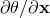
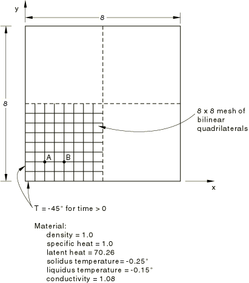
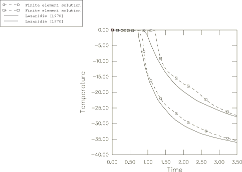
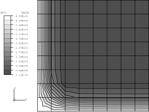
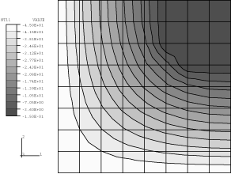
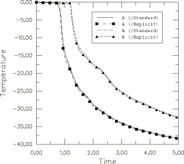

# 1.6.2 方形固体冻结：二维斯蒂芬问题

**产品：** Abaqus/Standard  Abaqus/Explicit

涉及潜热效应的热传导问题在实践中经常发生（例如金属铸造和永冻层融化），但并不容易解决。在某些情况下，相变发生的潜热效应很小，快速温度变化可以部分抑制变化，如非晶/结晶聚合物相变的情况。对于此类情况，Abaqus/Standard 提供了一个用户子程序 `HETVAL`，用户可以在其中编程相变的动力学以及以解相关状态变量表示的相应潜热交换。相反，液/固相变通常相当突然，并伴随有强烈的潜热效应。本示例就是考虑了这种情况。

该问题是二维斯蒂芬问题（[图 1.6.2-1](ch01s06ach54.md#sxm2dstefan-geom)）：一个方形材料块最初是液体，刚好高于冻结温度。其外周界的温度突然降低很大值，因此块体开始从外部向核心冻结。冻结有一个非常大的潜热效应与之相关，在解决方案中占主导地位。该问题没有精确解，但许多研究人员提供了近似解。其中最准确的可能是 Lazaridis（1970）的数值解，他将问题视为移动边界条件问题。Lazaridis 的解在此用作此类情况的 Abaqus 建模验证。

### 问题描述

块体是尺寸为 8×8 长度单位的正方形。由于对称性，我们只需要考虑一个八分圆，但为了简化网格生成，我们建模了四分之一。

严重的潜热效应涉及移动边界条件（冻结锋面），温度的空间梯度  在其上是不连续的。简单的有限单元（如 Abaqus 中使用的线性和二次单元）不允许单元内部的梯度间断，尽管它们允许在其侧面法线方向上单元之间的这种间断。由于实际问题涉及穿过网格移动的表面上的间断，对于简单单元的固定网格，我们能做的最好的就是使用最低阶单元的精细网格，从而提供大量的梯度间断表面。在 Abaqus/Standard 中，使用二维热传递单元（DS3 和 DS4）和一阶耦合温度-位移单元（CPE4T 和 CPEG4T）对板进行建模。使用的网格对于该问题来说较粗；但它们足以给出合理的解，从而验证该功能。在实际案例中，建议使用更精细的模型。在 Abaqus/Explicit 中，使用二维和三维、一阶耦合温度-位移单元（CPE4RT、C3D8RT 和 SC8RT）对板进行建模。

### 材料

材料属性（一致单位）为：

| 密度 | 1.0 |
| --- | --- |
| 比热容 | 1.0 |
| 冻结潜热 | 70.26 |
| 冻结温度 | 0 |
| 热导率 | 1.08 |

这组值包含的潜热效应比任何实际重要材料都更为严重。这个值是故意选择的，以对该算法的精度进行严格测试。

潜热必须在 Abaqus 中在温度范围内指定。为此，我们将固相线和液相线温度分别给出为 0.25 和 0.15。

在涉及 Abaqus/Explicit 的模拟中，使用虚拟机械属性来完成材料定义。

### 边界条件

对称线是绝热的；这是默认的表面边界条件，因此不需要指定。外表面必须在时间为零时降到 45。这个值可以直接指定；但是，我们将温度在 0.05 时间内斜坡下降到 45，以防止 Abaqus/Standard 中的自动时间增量方案在模拟开始时选择非常小的时间增量。

### 时间增量控制

选择自动时间增量，这是瞬态热传导问题的常用选项。在 Abaqus/Standard 中，允许每个时间增量最大温度变化为 4，以允许时间增量在后期随着解平滑化而增加到较大值。

### 结果和讨论

[图 1.6.2-1](ch01s06ach54.md#sxm2dstefan-geom) 中 A 点和 B 点的温度-时间图如[图 1.6.2-2](ch01s06ach54.md#sxm2dstefan-tempvtime)所示，其中与 Lazaridis（1970）的数值解进行了比较。该图中显示的数值结果基于使用 Abaqus/Standard 获得的解。考虑到所使用的网格的粗糙性以及本例中潜热效应的极端严重性，Abaus 结果相当准确。解在 Lazaridis 结果附近振荡，因为有限元网格仅在单元边界处允许温度梯度间断，因此融合锋面有效地在这些位置之间跳跃。这个效应也是温度下降开始延迟的原因。

[图 1.6.2-3](ch01s06ach54.md#sxm2dstefan-isotherms1)和[图 1.6.2-4](ch01s06ach54.md#sxm2dstefan-isotherms2)显示了在不同时刻的等温线轮廓图。从这些图中可以非常清楚地看到解的形式。

使用 Abaqus/Explicit 获得的结果与使用 Abaqus/Standard 获得的结果比较良好，如图 1.6.2-5](ch01s06ach54.md#sxm2dstefan-compare-xpl-std)所示。该图比较了 Abaqus/Explicit 对 A 点和 B 点温度历史获得的结果与使用 Abaqus/Standard 获得的相同结果。

### 输入文件

##### **Abaqus/Standard 输入文件**

[freezingofsolid_2d.inp](../eif/freezingofsolid_2d.inp)

二维问题的输入数据。

[freezingofsolid_3d.inp](../eif/freezingofsolid_3d.inp)

三维中的类似模型。

[freezingofsolid_postoutput.inp](../eif/freezingofsolid_postoutput.inp)

[*POST OUTPUT](../key/key-link.md#usb-kws-hpostoutput) 分析。

[freezingofsolid_2d_usr_umatht.inp](../eif/freezingofsolid_2d_usr_umatht.inp)

使用用户子程序 `UMATHT` 中定义的材料行为的二维模拟，以说明此子程序的编码。

[freezingofsolid_2d_usr_umatht.f](../eif/freezing ofsolid_2d_usr_umatht.f)

用于 freezingofsolid_2d_usr_umatht.inp 的用户子程序 `UMATHT`。

[freezingofsolid_ds3.inp](../eif/freezingofsolid_ds3.inp)

使用 DS3 单元的二维分析。

[freezingofsolid_ds4.inp](../eif/freezingofsolid_ds4.inp)

使用 DS4 单元的二维分析。

[freezingofsolid_deftorigid.inp](../eif/freezingofsolid_deftorigid.inp)

使用 CPE4T 单元声明为刚性的二维分析。

[freezingofsolid_cpeg4t.inp](../eif/freezingofsolid_cpeg4t.inp)

使用 CPEG4T 单元的二维分析。

##### **Abaqus/Explicit 输入文件**

[freezingofsolid_xpl_cpe4rt.inp](../eif/freezingofsolid_xpl_cpe4rt.inp)

使用 CPE4RT 单元的二维分析。

[freezingofsolid_xpl_c3d8rt.inp](../eif/freezingofsolid_xpl_c3d8rt.inp)

使用 C3D8RT 单元的三维分析。

[freezingofsolid_xpl_sc8rt.inp](../eif/freezingofsolid_xpl_sc8rt.inp)

使用 SC8RT 单元的三维分析。

### 参考文献

Lazaridis, A., "A Numerical Solution of the Multidimensional Solidification (or Melting) Problem," International Journal of Heat and Mass Transfer, vol. 13, 1970.

### 图形

**图 1.6.2-1** 方形板冻结示例。

**图 1.6.2-2** 方形板融合——[图 1.6.2-1](ch01s06ach54.md#sxm2dstefan-geom) 中 A 点和 B 点的温度与时间关系（Abaqus/Standard）。

**图 1.6.2-3** 方形板融合——0.450 时的等温线（Abaqus/Standard）。

**图 1.6.2-4** 方形板融合——5.0 时的等温线（Abaqus/Standard）。

**图 1.6.2-5** Abaqus/Explicit 和 Abaqus/Standard 获得结果的比较。

