# 1.6.6 轴对称单元腔体辐射视角因子计算

**产品：** Abaqus/Standard

为这些验证问题选择了相对简单的配置，以确保可以找到解析解或表格结果。在某些情况下，某些参数（如两个表面之间的距离或表面上单元的数量）被改变，以说明这些参数对 Abaqus 中视角因子计算的影响。要复制参数改变情况下的表格结果，用户可以修改随 Abaqus 版本提供的输入文件。

### 具有相同法向中心的平行圆盘

### 问题描述

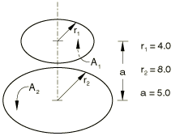

### 解析解

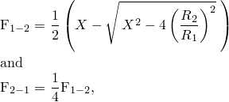

其中 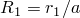、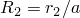 和 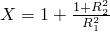。

### 结果与讨论

可以改变沿底面的单元数量以获得以下结果：

| 底面单元数量 | F | F |
| --- | --- | --- |
| Abaqus | 解析解 | Abaqus | 解析解 |
| 1 | 0.6853 | 0.6800 | 0.1713 | 0.1700 |
| 2 | 0.6836 | 0.6800 | 0.1709 | 0.1700 |
| 4 | 0.6820 | 0.6800 | 0.1705 | 0.1700 |

### 输入文件

[xrvda4n1.inp](../eif/xrvda4n1.inp)

使用 DCAX4 单元离散化腔体的表面；顶面一个单元，底面两个单元。

### 参考

Siegel, R., and J. R. Howell, *Thermal Radiation Heat Transfer*, Hemisphere Publishing Corporation, Washington, 3rd, 1992.

### 两个相同有限长度的同心圆柱

### 问题描述

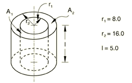

### 解析解

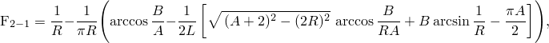

和

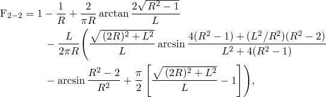

其中对于任意参数 、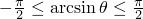 和 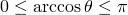；并且其中 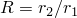、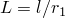、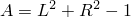 和 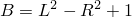。

### 结果与讨论

| F | F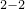 |
| --- | --- |
| Abaqus | 解析解 | Abaqus | 解析解 |
| 0.1790 | 0.1626 | 0.1042 | 0.0925 |

### 输入文件

[xrvda4n2.inp](../eif/xrvda4n2.inp)

使用一个 DCAX4 单元离散化腔体的每个表面。

### 参考

Siegel, R., and J. R. Howell, *Thermal Radiation Heat Transfer*, Hemisphere Publishing Corporation, Washington, 3rd, 1992.

### 无限长同心圆柱

### 问题描述

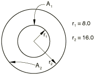

### 解析解

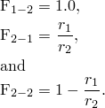

### 结果与讨论

可以增加每个面的单元数量以获得额外结果：

| 单元数量 | F | F | F |
| --- | --- | --- | --- |
| Abaqus | 解析解 | Abaqus | 解析解 | Abaqus | 解析解 |
| 4 | 0.9983 | 1.0000 | 0.4991 | 0.5000 | 0.4409 | 0.5000 |
| 8 | 0.9962 | 1.0000 | 0.4982 | 0.5000 | 0.4597 | 0.5000 |

### 输入文件

[xrvda4p3.inp](../eif/xrvda4p3.inp)

使用四个 DCAX4 单元离散化腔体的每个表面。腔体的无限延伸通过使用周期性对称（NR = 10）在 *z* 方向重复单元来建模。

### 参考

Siegel, R., and J. R. Howell, *Thermal Radiation Heat Transfer*, Hemisphere Publishing Corporation, Washington, 3rd, 1992.

### 不同半径的同轴直立圆圆柱，一个在另一个之上

### 问题描述

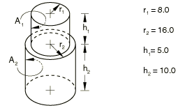

### 解析解

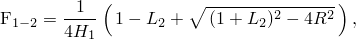

其中 、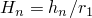 和 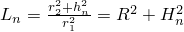。

如果对于 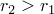 有 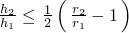，则  不接收来自圆柱 1 的辐射。

### 结果与讨论

| F |
| --- |
| Abaqus | 解析解 |
| 0.5099 | 0.4793 |

### 输入文件

[xrvda4n4.inp](../eif/xrvda4n4.inp)

使用 DCAX4 单元离散化腔体的表面；顶面一个单元，底面两个单元。

### 参考

Howell, J. R., *A Catalog of Radiation Configuration Factors*, McGraw-Hill Book Company, New York, 1982.
