# 1.6.7 三维单元腔体辐射视角因子计算

**产品：** Abaqus/Standard

为这些验证问题选择了相对简单的配置，以确保可以找到解析解或表格结果。在某些情况下，某些参数（如两个表面之间的距离或表面上单元的数量）被改变，以说明这些参数对 Abaqus 中视角因子计算的影响。要复制参数改变情况下的表格结果，用户可以修改随 Abaqus 版本提供的输入文件。

### 相同、直接相对的平行矩形

### 问题描述

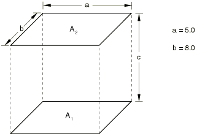

### 解析解

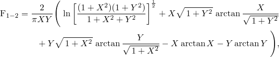

其中 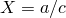 和 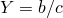。

### 结果与讨论

- 每个区域一个单元（[xrvd38n1.inp](../eif/xrvd38n1.inp)、[xrvd38m1.inp](../eif/xrvd38m1.inp)、[xrvds4n1.inp](../eif/xrvds4n1.inp) 和 [xrvds8n1.inp](../eif/xrvds8n1.inp)）；可以改变 *c* 以获得以下结果：
| *c* | F |
| --- | --- |
| Abaqus | 解析解 |
| 1 | 0.7370 | 0.7374 |
| 3 | 0.4236 | 0.4237 |
| 6 | 0.2090 | 0.2090 |
| 10 | 0.1001 | 0.1001 |
| 15 | 0.0502 | 0.0502 |
| 25 | 0.0195 | 0.0195 |
| 35 | 0.0102 | 0.0102 |
| 40 | 0.0078 | 0.0078 |

- 每个区域两个单元（[xrvd38n2.inp](../eif/xrvd38n2.inp)）；可以改变 *c* 以获得以下结果：
| *c* | F |
| --- | --- |
| Abaqus | 解析解 |
| 1 | 0.7370 | 0.7374 |
| 3 | 0.4236 | 0.4237 |
| 6 | 0.2090 | 0.2090 |
| 10 | 0.1011 | 0.1001 |
| 15 | 0.0502 | 0.0502 |
| 25 | 0.0197 | 0.0195 |
| 35 | 0.0102 | 0.0102 |
| 40 | 0.0078 | 0.0078 |

- 对于 *c* = 15，Abaqus 结果为 0.0502（[xrvds3n1.inp](../eif/xrvds3n1.inp) 和 [xrvds6n1.inp](../eif/xrvds6n1.inp)）。

### 输入文件

[xrvd38n1.inp](../eif/xrvd38n1.inp)

使用一个 DC3D8 单元离散化腔体的每个表面；*c* = 15。

[xrvd38m1.inp](../eif/xrvd38m1.inp)

使用一个 DC3D8 单元离散化腔体的每个表面；[*MOTION*](../key/key-link.md#usb-kws-hmotion) 选项用于改变矩形之间的距离。

[xrvd38m1.f](../eif/xrvd38m1.f)

在 xrvd38m1.inp 中使用的用户子程序 [`UMOTION`](../sub/sub-link.md#sub-xsl-umotion)。

[xrvd38n2.inp](../eif/xrvd38n2.inp)

使用两个 DC3D8 单元离散化腔体的每个表面；*c* = 6。

[xrvds3n1.inp](../eif/xrvds3n1.inp)

使用两个 DS3 单元离散化腔体的每个表面；*c* = 15。

[xrvds4n1.inp](../eif/xrvds4n1.inp)

使用一个 DS4 单元离散化腔体的每个表面；*c* = 15。

[xrvds6n1.inp](../eif/xrvds6n1.inp)

使用两个 DS6 单元离散化腔体的每个表面；*c* = 15。

[xrvds8n1.inp](../eif/xrvds8n1.inp)

使用一个 DS8 单元离散化腔体的每个表面；*c* = 15。

### 参考

Howell, J. R., *A Catalog of Radiation Configuration Factors*, McGraw-Hill Book Company, New York, 1982.

### 两个相同宽度、无限长、直接相对的平行板

### 问题描述

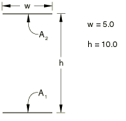

### 解析解

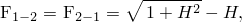

其中 。

### 结果与讨论

| F |
| --- |
| Abaqus | 解析解 |
| 0.2356 | 0.2361 |

### 输入文件

[xrvd38p3.inp](../eif/xrvd38p3.inp)

使用一个 DC3D8 单元离散化腔体的每个表面。腔体的无限延伸使用三维周期性对称建模（NR = 15）。

### 参考

Howell, J. R., *A Catalog of Radiation Configuration Factors*, McGraw-Hill Book Company, New York, 1982.

### 不同尺寸的同轴平行正方形

### 问题描述

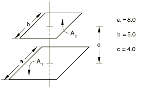

### 解析解

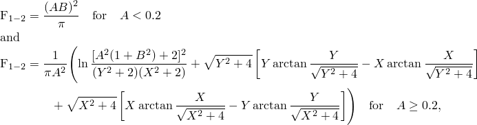

其中 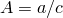、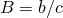、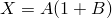 和 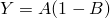。参考解：F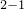 = 0.4974。

### 结果与讨论

F 的 Abaqus 结果：0.4974（[xrvd38n4.inp](../eif/xrvd38n4.inp)）；0.4974（[xrvds3n4.inp](../eif/xrvds3n4.inp)）。

### 输入文件

[xrvd38n4.inp](../eif/xrvd38n4.inp)

使用一个 DC3D8 单元离散化腔体的每个表面。

[xrvds3n4.inp](../eif/xrvds3n4.inp)

使用两个 DS3 单元离散化腔体的每个表面。

### 参考

Howell, J. R., *A Catalog of Radiation Configuration Factors*, McGraw-Hill Book Company, New York, 1982.

### 两个不同宽度的无限长平行板；每块板的中心线由板之间的垂直线连接

### 问题描述

### 解析解

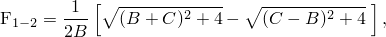

其中  和 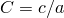。

### 结果与讨论

| F |
| --- |
| Abaqus | 解析解 |
| 0.4335 | 0.4337 |

### 输入文件

[xrvd38p5.inp](../eif/xrvd38p5.inp)

使用一个 DC3D8 单元离散化腔体的每个表面。腔体的无限延伸使用三维周期性对称建模（NR = 15）。

### 参考

Howell, J. R., *A Catalog of Radiation Configuration Factors*, McGraw-Hill Book Company, New York, 1982.

### 两个相同长度、有一条公共边且相互成 90° 角的有限矩形

### 问题描述

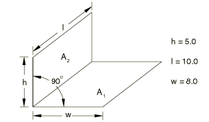

### 解析解

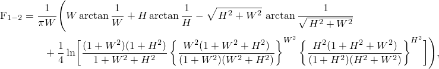

其中 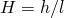 和 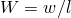。参考解：F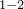 = 0.1746。

### 结果与讨论

F 的 Abaqus 结果：0.1746（[xrvd38n6.inp](../eif/xrvd38n6.inp)）；0.1746（[xrvds6n6.inp](../eif/xrvds6n6.inp)）。

### 输入文件

[xrvd38n6.inp](../eif/xrvd38n6.inp)

使用一个 DC3D8 单元离散化腔体的每个表面。

[xrvds6n6.inp](../eif/xrvds6n6.inp)

使用两个 DS6 单元离散化腔体的每个表面。

### 参考

Siegel, R., and J. R. Howell, *Thermal Radiation Heat Transfer*, Hemisphere Publishing Corporation, Washington, 3rd, 1992.

### 两个宽度不等 h 和 w、有一条公共边且相互成 90° 角的无限长板

### 问题描述

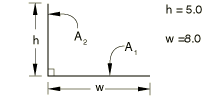

### 解析解

其中 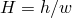。

### 结果与讨论

| F |
| --- |
| Abaqus | 解析解 |
| 0.2221 | 0.2229 |

### 输入文件

[xrvd38p7.inp](../eif/xrvd38p7.inp)

使用一个 DC3D8 单元离散化腔体的每个表面。腔体的无限延伸使用三维周期性对称建模（NR = 15）。

### 参考

Siegel, R., and J. R. Howell, *Thermal Radiation Heat Transfer*, Hemisphere Publishing Corporation, Washington, 3rd, 1992.

### 有一条公共边且夹角为 Φ 的两个矩形

### 问题描述

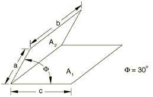

### 解析解

定义：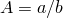；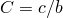。

| *C* | F |
| --- | --- |
| *A* = 0.6 | *A* = 1.0 | *A* = 2.0 |
| 0.1 | 0.894753 | 0.898003 | 0.899505 |
| 0.2 | 0.859340 | 0.868201 | 0.871800 |
| 0.4 | 0.777610 | 0.812110 | 0.822722 |
| 0.6 | 0.665734 | 0.754703 | 0.778772 |
| 1.0 | 0.452822 | 0.619028 | 0.700100 |
| 2.0 | 0.233632 | 0.350050 | 0.521308 |
| 4.0 | 0.117384 | 0.177461 | 0.286713 |
| 6.0 | 0.078311 | 0.118499 | 0.192535 |
| 10.0 | 0.047002 | 0.071148 | 0.115803 |
| 20.0 | 0.023504 | 0.035583 | 0.057945 |

### 结果与讨论

| F |
| --- |
| Abaqus | 解析解 |
| 0.6195 | 0.6190 |

### 输入文件

[xrvd38n8.inp](../eif/xrvd38n8.inp)

使用一个 DC3D8 单元离散化腔体的每个表面；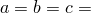 = 8.0。

[xrvds4n8.inp](../eif/xrvds4n8.inp)

使用一个 DS4 单元离散化腔体的每个表面； = 8.0。

### 参考

Howell, J. R., *A Catalog of Radiation Configuration Factors*, McGraw-Hill Book Company, New York, 1982.

### 具有公共边并形成任意角度的矩形；其中一个矩形无限长

### 问题描述

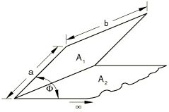

### 解析解

定义：。

| *A* | F |
| --- | --- |
| 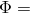 = 30 |  = 45 |  = 60 |
| 0.1 | 0.900022 | 0.804838 | 0.690483 |
| 0.2 | 0.872918 | 0.767740 | 0.648105 |
| 0.4 | 0.825360 | 0.706295 | 0.581494 |
| 0.6 | 0.783499 | 0.655351 | 0.529168 |
| 1.0 | 0.711717 | 0.573951 | 0.450407 |
| 2.0 | 0.579571 | 0.441004 | 0.332686 |
| 4.0 | 0.426592 | 0.307875 | 0.225049 |
| 6.0 | 0.341612 | 0.240643 | 0.173501 |
| 10.0 | 0.249219 | 0.171450 | 0.121970 |
| 20.0 | 0.154976 | 0.104189 | 0.073151 |

### 结果与讨论

| F |
| --- |
| Abaqus | 解析解 |
| 0.5732 | 0.5740 |

### 输入文件

[xrvd38n9.inp](../eif/xrvd38n9.inp)

使用 DC3D8 单元离散化腔体的表面；有限表面一个单元，无限表面九个边长为 8 个单位的单元；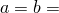 = 10.0； = 45。

### 参考

Howell, J. R., *A Catalog of Radiation Configuration Factors*, McGraw-Hill Book Company, New York, 1982.

### 两个具有相等有限宽度 w、有一条公共边且相互成 α 角的无限长板

### 问题描述

### 解析解

### 结果与讨论

对于此测试，可以改变三个参数：角度、反射次数和用于建模底板的单元数量。以下表中显示的所有变体都可以通过修改输入文件 [xrvd38p0.inp](../eif/xrvd38p0.inp) 来验证。
- 每块板一个单元， = 60：
| NR | F |
| --- | --- |
| Abaqus | 解析解 |
| 2 | 0.4969 | 0.5000 |
| 4 | 0.4900 | 0.5000 |
| 8 | 0.4993 | 0.5000 |
| 12 | 0.4994 | 0.5000 |
| 16 | 0.4994 | 0.5000 |
| 20 | 0.4994 | 0.5000 |

- 每块板一个单元，NR  = 12：
|  | F |
| --- | --- |
| Abaqus | 解析解 |
| 10 | 0.9123 | 0.9128 |
| 20 | 0.8258 | 0.8264 |
| 30 | 0.7406 | 0.7412 |
| 40 | 0.6574 | 0.6580 |
| 50 | 0.5768 | 0.5774 |
| 60 | 0.4994 | 0.5000 |
| 70 | 0.4258 | 0.4264 |
| 80 | 0.3566 | 0.3572 |
| 90 | 0.2923 | 0.2929 |

- NR  = 2， = 60：
| 底板单元数量 | F |
| --- | --- |
| Abaqus | 解析解 |
| 1 | 0.4969 | 0.5000 |
| 3 | 0.4969 | 0.5000 |
| 6 | 0.4969 | 0.5000 |
| 9 | 0.4969 | 0.5000 |
| 12 | 0.4969 | 0.5000 |
| 15 | 0.4969 | 0.5000 |

### 输入文件

[xrvd38p0.inp](../eif/xrvd38p0.inp)

使用一个 DC3D8 单元离散化腔体的每个表面。腔体的无限延伸使用三维周期性对称建模（NR = 12）； = 60。

### 参考

Siegel, R., and J. R. Howell, *Thermal Radiation Heat Transfer*, Hemisphere Publishing Corporation, Washington, 3rd, 1992.
