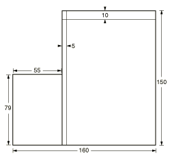
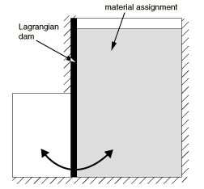
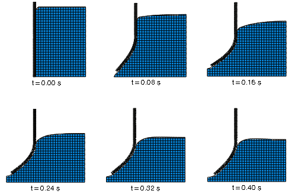
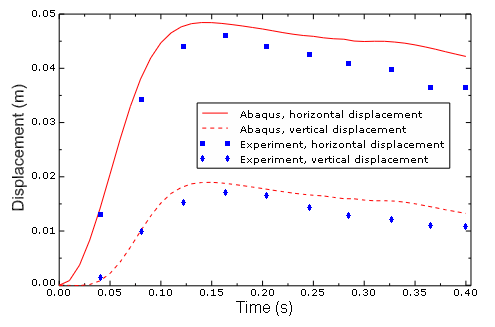

# 1.7.2 水压力作用下弹性坝的挠度

**产品：** Abaqus/Explicit  Abaqus/CAE

本问题研究了重力载荷下通过柔性坝门的流体响应。由于流体在模拟过程中经历极端变形，因此将其建模为欧拉流体。明显更硬的坝使用拉格朗日单元建模。耦合欧拉-拉格朗日（CEL）分析技术用于考虑流体和坝之间的相互作用。坝的响应与实验结果进行了比较。

### 问题描述

在模型的初始配置中，水位于矩形水库中。水库地板和右侧是固定的。在左侧，水被弹性坝壁容纳；坝的上半部分是固定的，但下半部分是无约束的。在重力载荷下，水推压坝，使坝的下半部分偏转，并自由地从水库流出。

模型在 Abaqus/CAE 中使用两个部件创建。欧拉部件表示水将流动的域。拉格朗日部件表示坝。问题本质上是二维的，具有水平（*X*方向）和垂直（*Z*方向）分量；但由于欧拉单元必须是三维的，所有部件都在 *Y* 方向上建模了与一个欧拉单元厚度等效的厚度。

欧拉部件如图 1.7.2-1](ch01s07ach62.md#bmk-anl-dambreak-geometry)所示。[图 1.7.2-2](ch01s07ach62.md#bmk-anl-dambreak-bcs-nls)显示了部件内材料的分布：右侧区域充满水，左侧区域是预期的流出区域，中间区域包含拉格朗日坝。垂直于欧拉部件地板和右侧的零速度边界条件被施加，以防止水从这些边界流出。坝左侧不施加边界条件；水可以自由地从部件此界面流出（导致模型总质量相应减少）。在坝的上半部分施加水平和垂直方向的零速度边界条件，但下半部分可以偏转（参见[图 1.7.2-2](ch01s07ach62.md#bmk-anl-dambreak-bcs-nls)）。另一组在 *Y* 方向上的零速度边界条件被施加到每个部件，以防止离开二维平面。摩擦一般接触定义强制水和坝之间的接触。

坝使用弹性材料建模，弹性模量为 1.2×10^7 N/m²，泊松比为 0.4，密度为 1100 kg/m³。水使用线性  Hugoniot 形式的 Mie-Grüneisen 状态方程定义，参数列在[表 1.7.2-1](ch01s07ach62.md#bmk-anl-dambreak-material)中。

重力载荷被施加到整个模型。此外，定义了初始地静应力以模拟水中的静水压力。由于无法在 Abaqus/CAE 中直接定义地静应力，因此使用**关键词编辑器**将它们添加到模型中。

欧拉部件使用 EC3D8R 单元进行网格划分，全局网格种子为 5 mm；此全局网格种子允许在整个部件中均匀分布立方体形状的单元，这大大提高了欧拉分析的精度。坝使用 C3D8R 单元在 75×4 的网格中进行网格划分；部件厚度方向有三个单元。坝宽度和厚度方向的多个单元对于确保其弯曲行为被充分捕捉是必要的。

### 结果和讨论

重力下水的压力使坝的下半部分偏转，允许水从水库流出。[图 1.7.2-3](ch01s07ach62.md#bmk-anl-dambreak-deformed)使用基于输出变量 EVF_WATER 的等值面视图切割来显示分析六个点上水的位置。坝右下角的水平和垂直位移可以与 Antoci 等人（2007）的实验结果进行比较，如图 1.7.2-4](ch01s07ach62.md#bmk-anl-dambreak-displot)所示。Abaqus 结果与实验结果非常一致。差异可能是由于坝材料模型中的理想化，使其比实验坝略软。Antoci 等人还注意到实验装置中的一些小缺陷，可能导致作用在坝上的水压力降低，这反过来会导致整体偏转变小。

### Python 脚本

### 输入文件

[dam_deflection_cel.inp](../eif/dam_deflection_cel.inp)

模型的输入文件。

### 参考文献

Antoci, C., M. Gallati, and S. Sibilla, "Numerical Simulation of Fluid-Structure Interaction by SPH," Computer and Structures, vol. 85, pp. 879–890, 2007.

### 表格

**表 1.7.2-1** 水的材料参数。
| 参数 | 值 |
| --- | --- |
| 密度 () | 1000 kg/m³ |
| 粘度 () | 0.001 N·s/m² |
|  | 1500 m/s |
| *s* | 0 |
|  | 0 |

### 图形

**图 1.7.2-1** 欧拉部件的几何。所有尺寸单位为毫米。

**图 1.7.2-2** 组装模型中的材料分配和边界条件。

**图 1.7.2-3** 水的流动和坝的 resulting 变形。

**图 1.7.2-4** 坝右下角的位移。

