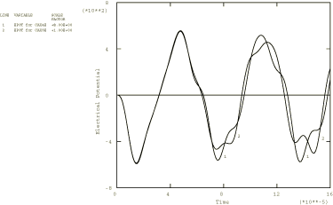

# 1.8.2 压电材料的模态动态分析

**产品：** Abaqus/Standard

### 问题描述

模型是["压电材料的静态分析"，《Abaqus 验证指南》第 3.7.1 节](../ver/ver-link.md#ver-prc-piezostatic)中描述的圆柱体。使用两个模型进行三个分析。一个模型有 16 个 CAX4E 单元，另一个有四个 CAX8E 单元。模态动态分析使用在["压电材料的频率提取分析"，《Abaqus 验证指南》第 3.7.2 节](../ver/ver-link.md#ver-prc-piezofreqextract)中生成的重新启动文件中的特征数据。前两个问题没有阻尼，旨在与 Mercer、Reddy 和 Eve（1987）的结果进行比较。对于这些问题，压力载荷以 100000 rad/sec（15.9 kHz）的频率正弦施加在顶面上。第三个问题为前一个问题引入 Rayleigh 模态阻尼项以说明阻尼的影响。

### 结果与讨论

[图 1.8.2-1](ch01s08ach64.md#bmkmodaldynpiezo-dispnodamp) 显示了两个无阻尼模型对于正弦施加压力载荷的顶面中心处的挠度。这些结果与 Mercer、Reddy 和 Eve（1987）给出的类似模型的归一化结果非常相似。[图 1.8.2-2](ch01s08ach64.md#bmkmodaldynpiezo-potential) 显示了此问题顶面中心的电势。在[图 1.8.2-3](ch01s08ach64.md#bmkmodaldynpiezo-disps) 中显示了具有 Rayleigh 模态阻尼的 CAX4E 模型在顶面中心处的挠度，以及无阻尼情况的结果。从图中可以明显看出响应的减小和相位偏移。输出了 CAX8E 模型约束底边上的总力；垂直方向的总力与边上反力的总和相匹配。

这些问题的稳态响应在["压电材料的稳态动态分析"第 1.8.3 节](ch01s08ach65.md)中说明。

### 输入文件

[ppzomod1.inp](../eif/ppzomod1.inp)

模态动态分析，CAX4E 单元，无阻尼。

[ppzomod2.inp](../eif/ppzomod2.inp)

模态动态分析，CAX8E 单元，无阻尼。

[ppzomod3.inp](../eif/ppzomod3.inp)

模态动态分析，CAX4E 单元，包含阻尼。

### 参考

Mercer, C. D., B. D. Reddy, and R. A. Eve, "Finite Element Method for Piezoelectric Media," UCT/CSIR Applied Mechanics Research Unit Technical Report No. 92, vol. April, 1987.

### 图表

**图 1.8.2-1** 无阻尼压力载荷圆柱顶面中心的垂直位移。

**图 1.8.2-2** 无阻尼压力载荷圆柱顶面的电势。

**图 1.8.2-3** 有阻尼和无阻尼圆柱顶面中心的垂直位移。

