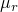
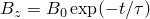
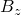
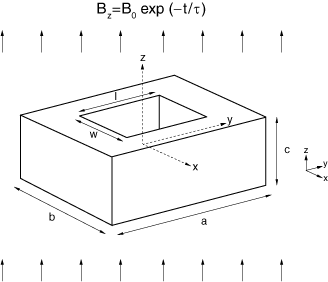
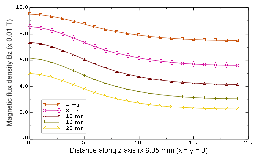
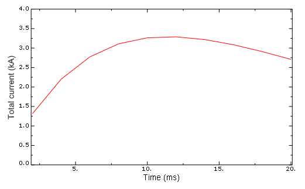

# 1.8.5 TEAM 4：衰减磁场中导电砖块的涡流模拟

**产品：** Abaqus/Standard

此基准问题是设计用于测试电磁分析方法（TEAM）的问题标准套件的一部分。要解决的问题是带有穿过中心的矩形孔的矩形砖块放置在随时间衰减的均匀磁场中的问题。目标是计算在砖块中感应的循环涡流以及由于随时间衰减的磁场而耗散的焦耳热。

### 问题描述

问题设置如图 1.8.5-1（[图 1.8.5-1](ch01s08ach67.md#bmk-em-team4-geom)）所示，它描述了带有矩形孔的导电矩形砖块放置在随时间衰减的均匀磁场中。砖块的尺寸为 *a* = 0.1524 m、*b* = 0.1016 m 和 *c* = 0.0508 m。砖块假定由电阻率为  = 3.94×10⁻⁸ Ω·m 且相对磁导率为  = 1.0 的铝合金制成。矩形孔位于砖块中心并穿透砖块。孔的尺寸假定为 *l* = 0.0889 m 和 *w* = 0.0381 m。均匀磁场的方向平行于孔的穿透方向，假定衰减为 ，其中  = 0.1 T 和  = 0.0119 s。围绕砖块的介质假定具有类似于真空的特性。

### 模型和边界条件

使用磁矢量势公式来解决此问题。由于问题的对称性，仅需建模问题域的第一象限。在对称平面 *x* = 0、*y* = 0 和 *z* = 0 上施加适当的边界条件。由于外部磁场相对于 *x* = 0 和 *y* = 0 平面对称，磁矢量势垂直于这些对称平面，这通过齐次 Dirichlet 边界条件来强制执行。类似地，由于外部磁场相对于 *z* = 0 平面的不对称性，磁通量密度垂直于对称平面，这通过齐次 Neumann 边界条件来强制执行。

导电砖块在时变磁场中的存在在砖块中产生涡流，这些涡流又在其附近产生自己的磁场。远离砖块的磁场与外部磁场相比没有因这些涡流而显著改变。由于外部磁场指向 *z* 方向，如果我们选择平行于 *x* = 0、*y* = 0 和 *z* = 0 平面的平面截断边界，则更容易指定远场边界条件。截断边界上的外部磁场被指定为表面电流密度载荷。

### 结果与讨论

[图 1.8.5-2](ch01s08ach67.md#bmk-em-team4-bz-line) 显示了磁通量密度的 *z* 分量 ，这是使用 Abaqus/Standard 低频瞬态电磁分析在 20 ms 期间执行的计算。磁场沿模型的正 *z* 轴从孔中心开始绘制。图中的曲线对应于不同分析时间的场值，如图例所示。轴被缩放以便与 Kameari（1988）发表的结果进行比较。横轴乘以 6.35 以将沿 *z* 轴的真实距离转换为毫米，纵轴乘以 0.01 以将磁通量密度转换为特斯拉。该图表明，远离导电砖块处的磁场与外部磁场相同，后者随时间衰减。然而，在砖块中心处，由于砖块中感应的涡流，磁场较大；这些电流试图补偿随时间减小的磁场。结果与 Kameari 发表的结果比较非常好。

[图 1.8.5-3](ch01s08ach67.md#bmk-em-team4-cd-line) 显示了流过导电砖块横截面的总感应电流与分析时间的关系。总电流通过跨横截面积分电流密度输出获得。结果与 Kameari 发表的结果比较非常好。

### 输入文件

[team4_emc3d8.inp](../eif/team4_emc3d8.inp)

带有孔的铝砖块在随时间衰减的均匀磁场中的低频瞬态涡流分析；使用 EMC3D8 单元和对称边界条件建模。

### 参考

Kameari, A., "Results for Benchmark Calculations of Problem 4 (the FELIX Brick)," COMPEL, vol. 7, pp. 65–80, 1988.

### 图表

**图 1.8.5-1** 放置在衰减磁场中带孔的矩形砖块的几何形状。

**图 1.8.5-2** 沿 *z* 轴的磁通量密度。

**图 1.8.5-3** 流过导电砖块横截面的总感应电流。

