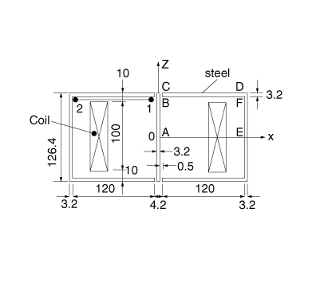
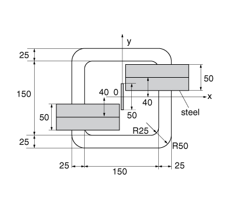
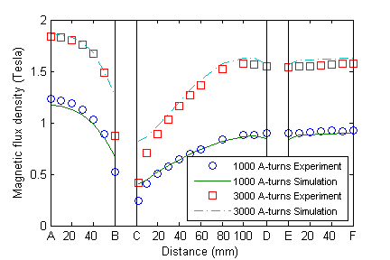
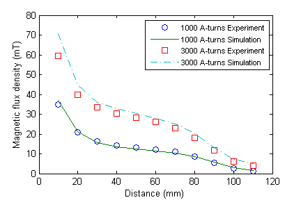

# 1.8.7 TEAM 13：三维非线性静磁分析

**产品：** Abaqus/Standard

此基准问题是设计用于测试电磁分析方法（TEAM）的问题标准套件的一部分。该问题由两个槽形钢和一块钢板组成，由携带直流电的线圈激励。目标是计算槽和板中的磁场，同时考虑钢的非线性磁性材料响应。

### 问题描述

问题设置的俯视图和顶视图分别如图 1.8.7-1（[图 1.8.7-1](ch01s08ach69.md#bmk-em-team13-geom1)）和图 1.8.7-2（[图 1.8.7-2](ch01s08ach69.md#bmk-em-team13-geom2)）所示。它们描述了两个 U 形槽和一块由携带直流电的线圈激励的平板。各部分的尺寸标注在图中。其余参数如下。槽和板都假定由钢制成。钢的非线性磁性特性指定为 B-H 曲线；数据取自[Team Problem 13: 3-D Non-Linear Magnetostatic Model](ch01s08ach69.md#bmk-ref-team13)的图 3。线圈中的电流假定为 1000 A-匝或 3000 A-匝。围绕砖块的介质假定具有类似于真空的特性。

### 模型和边界条件

使用磁矢量势公式进行静磁分析。由于问题的对称性，仅需建模问题域的一半。在对称平面  上施加齐次 Neumann 边界条件，因为由于对称性，该平面上的磁通量密度预期垂直于该平面。假定在外边界上施加齐次 Dirichlet 边界条件。

### 结果与讨论

[图 1.8.7-3](ch01s08ach69.md#bmk-em-team13-bsteel) 显示了沿路径 A–B、C–D 和 E–F（如图 1.8.7-1 所示）钢板和槽中的平均磁通量密度图。为简单起见，将三个不同的图合并为一个图，水平轴分为三段，每段代表从路径起点开始的路径 A–B、C–D 和 E–F 的距离。实验结果与使用 Abaqus/Standard 针对两种不同电流规格获得的模拟结果一起呈现；即 1000 A-匝和 3000 A-匝。图表表明，模拟和实验结果之间的吻合良好。[图 1.8.7-4](ch01s08ach69.md#bmk-em-team13-bair) 显示了针对两种不同电流规格，沿路径 1–2（如图 1.8.7-1 所示）空气中的磁通量密度图。同样，模拟结果与实验结果比较非常好。

### 输入文件

[team_13_half_d2_bias2.inp](../eif/team_13_half_d2_bias2.inp)

由携带 1000 A-匝直流电的线圈激励的钢板和两个槽形钢的非线性静磁分析。

[team_13_half_d2_bias2_3000.inp](../eif/team_13_half_d2_bias2_3000.inp)

由携带 3000 A-匝直流电的线圈激励的钢板和两个槽形钢的非线性静磁分析。

### 参考

Preis, K., et.al., "Different Finite Element Formulations for 3D Magnetostatic Fields," IEEE Transactions on Magnetics, vol. 28, pp. 1056–59, 1992.

"Team Problem 13: 3-D Non-Linear Magnetostatic Model," accessed December 19, 2012, http://www.compumag.org/jsite/images/stories/TEAM/problem13.pdf.

### 图表

**图 1.8.7-1** 问题设置的俯视图。

**图 1.8.7-2** 问题设置的顶视图。

**图 1.8.7-3** 板和槽中的磁通量密度。

**图 1.8.7-4** 空气中的磁通量密度。

