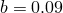
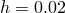
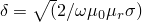
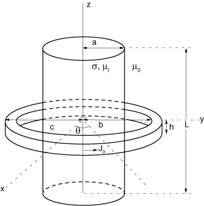
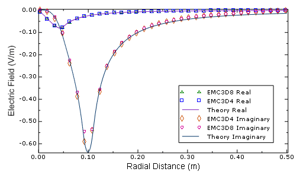
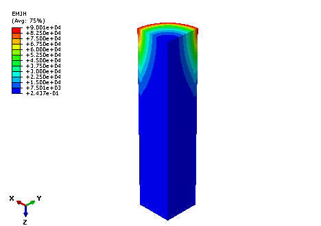

# 1.8.8 携带时间谐电流的环绕线圈对圆柱棒的感应加热

**产品：** Abaqus/Standard

此基准问题常见于感应加热应用。要解决的问题是计算由于循环时间谐电流在导电棒中感应的涡流。线圈中的循环时间谐电流产生时间谐磁场，进而在其附近的导体中感应涡流。导体对感应电流流动的阻力表现为热量，计算这种焦耳热是此基准问题的主要目标。

### 问题描述

问题设置如图 1.8.8-1（[图 1.8.8-1](ch01s08ach70.md#bmk-em-srcrod-geom)）所示。它描述了一根导电圆柱棒，棒长方向居中的矩形截面环绕载流线圈。导电圆柱棒的半径为  m，长度为  m。其电导率和相对磁导率假定为  = 1.0×10⁷ S/m 和  = 1.0。环绕线圈的内半径、外半径和厚度分别为  m、 m 和  m。线圈中的电流密度假定具有幅值  = 1.0×10⁷ A/m²，并以频率  = 50 Hz 振荡。假定电流在沿负 *z* 方向看时以顺时针方向沿方位角方向流动。围绕棒和线圈设置的介质假定具有类似于真空的特性。对于这些参数，导体的集肤深度约为  = 22.5 mm，小于导体半径 50 mm。

### 模型和边界条件

使用磁矢量势公式来解决此问题。由于问题的对称性，仅需建模问题域的第一象限。在对称平面 、 和  上施加适当的边界条件。由于电流相对于平面  和  不对称，磁矢量势垂直于这些对称平面，这通过齐次 Dirichlet 边界条件来强制执行。类似地，由于电流相对于平面  对称，磁通量密度垂直于对称平面，这通过齐次 Neumann 边界条件来强制执行。

由于问题域是无界的，必须以某种方式截断。Abaqus 不支持吸收边界条件；因此，截断边界应选择远离导体。选择外圆柱边界表面和平行于  平面的平面来截断域。磁矢量势从线圈向外衰减，可以近似认为在远离线圈处其幅值为零。因此，在所有外边界表面上施加齐次 Dirichlet 边界条件。

### 解析解

此问题的解析解已由多位作者研究，但特别值得关注的是 Bowler 和 Theodoulidis（2005）提出的研究。他们考虑了计算由可沿棒长任意位置定位的环绕电流回路在圆柱棒中感应的涡流的问题。各区域磁矢量势的表达式可在此参考论文中找到。

### 结果与讨论

[图 1.8.8-2](ch01s08ach70.md#bmk-em-rod-xyplote) 显示了使用 Abaqus/Standard 分析计算的沿 *x* 轴的电场周向分量的实部和虚部与解析解的比较。该图清楚地表明，分析结果与解析结果比较非常好，外边界表面距离足够远，截断引入的误差很小。对于时间谐分析，电场的幅值与按弧度频率缩放的磁矢量势幅值相同。

[图 1.8.8-3](ch01s08ach70.md#bmk-em-rod-contourjh) 显示了由于感应的涡流在导电棒中产生的焦耳热的等值线图。该图清楚地表明，由于集肤效应，在导体表面附近产生的焦耳热大于其内部。该图还表明，由于更接近电流线圈，在棒中心附近产生的焦耳热大于其两端。

### 输入文件

[src_rod_emc3d8.inp](../eif/src_rod_emc3d8.inp)

使用单元类型 EMC3D8 和对称边界条件对被携带时间谐电流的同轴线圈环绕的导电圆柱棒进行涡流分析。

[src_rod_emc3d4.inp](../eif/src_rod_emc3d4.inp)

使用单元类型 EMC3D4 和对称边界条件对被携带时间谐电流的同轴线圈环绕的导电圆柱棒进行涡流分析。

### 参考

Bowler, J. R., and T. P. Theodoulidis, "Eddy Current Induced in a Conducting Rod of Finite Length by a Coaxial Encircling Coil," Journal of Physics D: Applied Physics, vol. 38, pp. 2861–2868, 2005.

### 图表

**图 1.8.8-1** 圆形线圈加热圆柱棒的几何形状。

**图 1.8.8-2** *x* 轴上电场的周向分量。

**图 1.8.8-3** 棒中产生的焦耳热。

