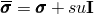
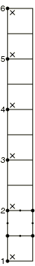
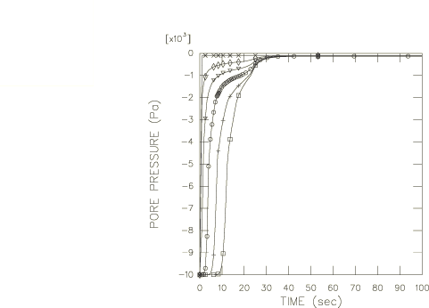
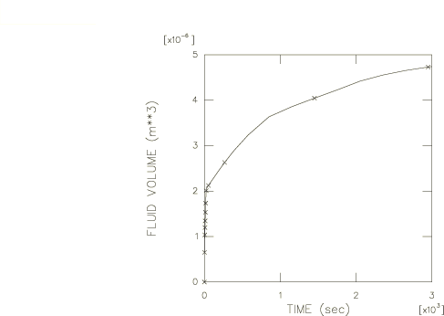
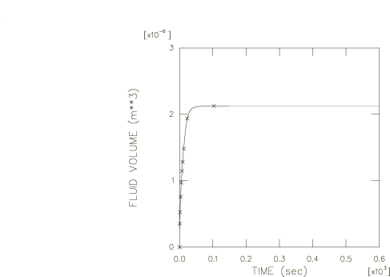
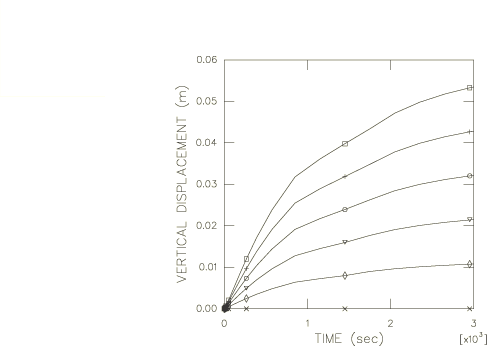
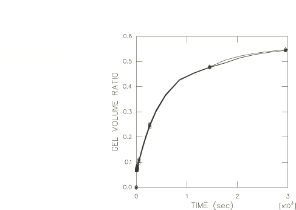
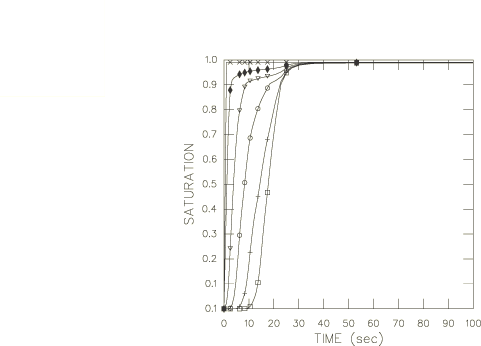
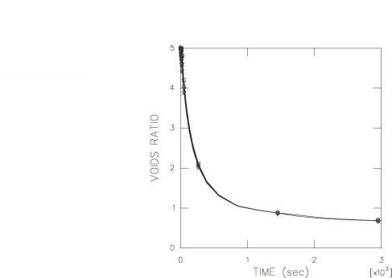

# 1.9.2 多孔介质的润湿性需求：耦合分析

**产品：** Abaqus/Standard

此例说明了 Abaqus 解决涉及多孔介质中应力平衡和部分饱和流动的耦合问题的能力。

我们考虑一个一维"润湿性需求"测试，其中流体在特定位置提供给材料，并允许材料吸收尽可能多的流体。在此例中，我们考虑一列材料，并允许它从底部吸收流体。该列在水平方向上受到运动学约束，因此所有变形都在垂直方向上；在这个意义上，问题是一维的。我们研究两种情况：一种情况是材料含有大量凝胶颗粒，凝胶颗粒截留流体，从而增强材料的流体保留能力；另一种情况是材料不含凝胶。提供了额外的测试来说明解映射以及凝胶颗粒建模的使用。

### 问题描述

材料柱高度为 50.8 mm。我们用 10 个 CPE8RP 平面应变单元对问题进行建模。此外，包含单元类型 CPE4PH、CAX4P、C3D4P、C3D6P、C3D8P 和 C3D8RP 的输入文件也包含在内用于验证。网格如图 1.9.2-1（[图 1.9.2-1](ch01s09ach72.md#sxmdemandwet-model)）所示。我们约束所有水平位移和柱底部的垂直位移。

### 材料

与材料的部分饱和流动行为相关的特性与["多孔介质中的部分饱和流动"第 1.9.1 节](ch01s09ach71.md)中使用的相同。对于力学特性，我们假定材料是弹性的，弹性模量为 10000 Pa，泊松比为 0.0。凝胶颗粒的力学特性假定与流体相似，因为它们主要由吸收的流体组成。因此，为凝胶指定了 2.0×10⁹ Pa 的体积模量。

孔隙压力和饱和度的初始条件假定为吸收曲线起点的条件，因此初始饱和度为 0.05，初始孔隙压力为 10000 Pa。

### 加载和控制

在分析的第一步中，我们在材料柱的原始构型中建立应力平衡。施加 500 Pa 的应力到网格上以平衡初始孔隙压力和饱和度条件。有效应力原理 （*s* 是饱和度，*u* 是孔隙压力）然后给出零有效应力，，对于未变形构型。

"加载"包括在柱底部指定基本为零的孔隙压力（对应于完全饱和）。这是基于这样的假设：在润湿性需求测试中，试样有尽可能多的流体来导致该点的饱和。该边界条件保持固定 3000 秒以模拟流体获取过程。

分析使用瞬态土壤固结过程并使用自动时间增量进行。控制自动增量的孔隙压力容差设置为较大值，因为我们期望材料的非线性会限制瞬态阶段时间增量的大小，我们不希望对时间积分的精度施加任何进一步的控制。

在这些瞬态部分饱和流动问题中，初始时间增量的选择对于某些单元类型很重要，以避免伪解振荡。这在["多孔介质中的部分饱和流动"第 1.9.1 节](ch01s09ach71.md)中讨论过。正如["耦合孔隙流体扩散和应力分析"《Abaqus 分析用户指南》第 6.8.1 节](../usb/usb-link.md#usb-anl-acoupdiffstress)中所讨论的，部分饱和条件下最小可用时间增量的标准是

其中  是润湿液体的比重， 是材料的初始孔隙率，*k* 是材料的完全饱和渗透率， 是渗透率-饱和度关系， 是吸收/解吸材料行为中定义的饱和度相对于孔隙压力的变化率（["吸附"《Abaqus 分析用户指南》第 26.6.4 节](../usb/usb-link.md#usb-mat-csorption)）， 是典型单元尺寸。对于我们的模型，我们有  = 5.08 mm（单元边的尺寸）， = 1.0×10⁴ N/m³， = 3.7×10⁻⁴ m/sec，，以及  = 5/6。在我们施加完全饱和边界条件的位置附近，单元将在瞬态早期跨越从初始饱和到完全饱和的区域。通过选择初始饱和度 0.05 找到最小时间增量的保守估计。由此，我们计算 、 和约为 70 sec 的  值。我们发现，在实践中，50 sec 的初始增量足以避免此问题中的振荡。对于其余的输入文件，初始时间增量选择如["多孔介质中的部分饱和流动"第 1.9.1 节](ch01s09ach71.md)中所讨论的，因为我们具有相同的材料特性和空间离散化。

在此分析中，介质中的主要孔隙压力接近材料骨架弹性模量的刚度。当在这种情况下使用减缩积分单元时，基于骨架材料本构参数缩放的沙漏刚度控制默认选择，在存在相对较大的孔隙压力场时可能不足以控制沙漏。在这些情况下，适当的沙漏控制设置应随单元上孔隙压力变化的预期幅度而缩放，并且必须由用户明确定义。

在分析中考虑几何非线性，因为我们期望由于凝胶颗粒的生长而产生大的变形。

### 结果与讨论

对于不含凝胶的试样，我们期望材料吸收流体直到完全饱和，体积没有显著变化。然而，对于含凝胶颗粒的试样，我们期望与凝胶颗粒在截留流体时膨胀相关的体积显著增加。[图 1.9.2-2](ch01s09ach72.md#sxmdemandwet-porepress) 显示了沿材料柱高度的六个节点的孔隙压力随时间的变化；这对于含凝胶和不含凝胶的试样是相同的。两个试样吸收的流体体积随时间的变化在[图 1.9.2-3](ch01s09ach72.md#sxmdemandwet-volume-gel)（对于含凝胶的材料）和[图 1.9.2-4](ch01s09ach72.md#sxmdemandwet-volume-nogel)（对于不含凝胶的材料）中显示：含凝胶的试样吸收大约两倍的流体（这与它在吸收过程中凝胶膨胀时体积大致翻倍的事实一致）。[图 1.9.2-5](ch01s09ach72.md#sxmdemandwet-disphist) 中显示了含凝胶材料垂直位移随时间的变化。不含凝胶的材料没有显示出显著的体积变化。[图 1.9.2-6](ch01s09ach72.md#sxmdemandwet-gelvol) 显示了含凝胶试样中凝胶颗粒的生长情况，其中我们绘制了试样中凝胶体积与试样总体积之比在孔隙压力历史曲线绘制的六个节点最近的六个积分点处随时间的变化。在[图 1.9.2-7](ch01s09ach72.md#sxmdemandwet-satura) 中，我们展示了自由流体饱和度随时间的变化。这些历史对于两个试样是相同的。不含凝胶的试样的孔隙比在整个测试过程中保持接近其初始值 5.0，而含凝胶的试样中孔隙比下降到低于 1.0 的值，如[图 1.9.2-8](ch01s09ach72.md#sxmdemandwet-voids) 的时间历史所示。这是由于凝胶颗粒膨胀时可供自由流体流动的空隙空间减少的结果。

为验证目的，在材料行为中添加了土壤骨架的湿胀。添加湿胀后，更多的流体体积被吸收到试样中，与没有湿胀的模型相比，试样变得更长，并且需要更多时间来饱和试样。这些观察结果与在湿气存在时土壤骨架的额外膨胀是一致的。

### 输入文件

[demandwetpormed_c3d4p_gel.inp](../eif/demandwetpormed_c3d4p_gel.inp)

单元类型 C3D4P。

[demandwetpormed_c3d6p_gel.inp](../eif/demandwetpormed_c3d6p_gel.inp)

单元类型 C3D6P。

[demandwetpormed_c3d8p_gel.inp](../eif/demandwetpormed_c3d8p_gel.inp)

单元类型 C3D8P。

[demandwetpormed_c3d8p_gel_post.inp](../eif/demandwetpormed_c3d8p_gel_post.inp)

[*POST OUTPUT](../key/key-link.md#usb-kws-hpostoutput) 分析。

[demandwetpormed_c3d8rp_gel.inp](../eif/demandwetpormed_c3d8rp_gel.inp)

单元类型 C3D8RP。

[demandwetpormed_cax4p_gel.inp](../eif/demandwetpormed_cax4p_gel.inp)

单元类型 CAX4P。

[demandwetpormed_cpe4ph_gel.inp](../eif/demandwetpormed_cpe4ph_gel.inp)

单元类型 CPE4PH。

[demandwetpormed_cpe4ph_gel_post.inp](../eif/demandwetpormed_cpe4ph_gel_post.inp)

[*POST OUTPUT](../key/key-link.md#usb-kws-hpostoutput) 分析。

[demandwetpormed_cpe8rp_gel.inp](../eif/demandwetpormed_cpe8rp_gel.inp)

含凝胶颗粒的试样（单元类型 CPE8RP）。

[demandwetpormed_cpe8rp_swell.inp](../eif/demandwetpormed_cpe8rp_swell.inp)

在 demandwetpormed_cpe8rp_gel.inp 的材料行为中添加湿胀。

[demandwetpormed_cpe8rp_nogel.inp](../eif/demandwetpormed_cpe8rp_nogel.inp)

与 demandwetpormed_cpe8rp_gel.inp 相同，只是移除了 [*GEL](../key/key-link.md#usb-kws-mgel)。

[demandwetpormed_cpe8rp_gel_anc.inp](../eif/demandwetpormed_cpe8rp_gel_anc.inp)

[*MAP SOLUTION](../key/key-link.md#usb-kws-mmapsolution) 祖先分析。

[demandwetpormed_cpe8rp_gel_des.inp](../eif/demandwetpormed_cpe8rp_gel_des.inp)

[*MAP SOLUTION](../key/key-link.md#usb-kws-mmapsolution) 子分析。

### 图表

**图 1.9.2-1** 耦合润湿性需求例题的有限元模型。

**图 1.9.2-2** 两个试样的孔隙压力历史（含凝胶和不含凝胶）。

**图 1.9.2-3** 含凝胶试样在节点 1 吸收的流体体积历史。

**图 1.9.2-4** 不含凝胶试样在节点 1 吸收的流体体积历史。

**图 1.9.2-5** 含凝胶试样的垂直位移历史。

**图 1.9.2-6** 含凝胶试样的凝胶体积比历史。

**图 1.9.2-7** 两个试样的饱和度历史（含凝胶和不含凝胶）。

**图 1.9.2-8** 含凝胶试样的孔隙比历史。

