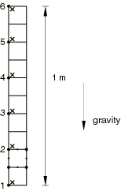
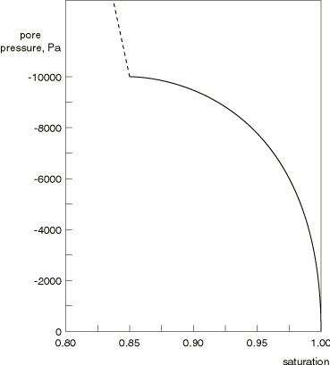
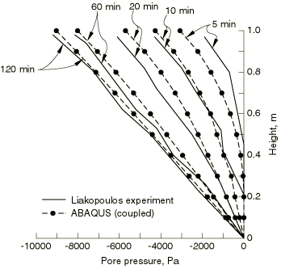
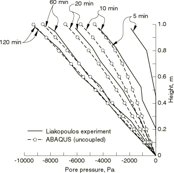
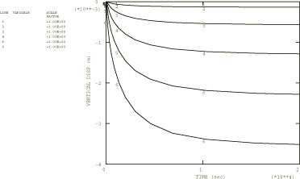
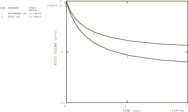
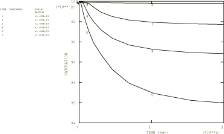
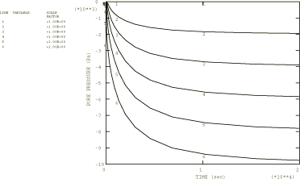

# 1.9.4 多孔材料柱中的排水

**产品：** Abaqus/Standard

此例的目的是验证 Abaqus 解决重力效应重要的部分饱和多孔介质中耦合流体流动问题的能力。为此，我们将 Abaqus 结果与 Liakopoulos（1965）的实验工作进行比较。大多数此类实验用于检查水力参数；因此，必须在数值模型中对力学行为做出一些假设。Schrefler 和 Simoni（1988）为 Liakopoulos 实验提供了数值解，此例遵循他们关于力学行为的假设。

Liakopoulos 实验包括从垂直砂柱中排水。一个 1 m 高的有机玻璃柱充满 Del Monte 砂，并装有仪器以测量沿柱高度不同点的水分压力。在实验开始前，水不断添加到柱顶部，并允许在柱底部自由排水。调节流动直到整个柱获得零孔隙压力读数。此时停止流动，实验开始：柱顶部变得不透水，水在重力作用下允许从柱中流出。在排水瞬态期间测量柱中的孔隙压力分布。

我们研究两种情况：一种是不允许柱变形（解耦流动问题），另一种是我们考虑砂的变形（耦合问题）。后者预计更接近于物理实验。

### 问题描述

材料柱高 1 m，宽 0.1 m。我们用 10 个 CPE8RP 平面应变单元对问题进行建模。此外，包含单元类型 CPE4P、CPE4RP、CPE6MPH、CAX4PH、CAX6MP、C3D4P、C3D6P、C3D8P 和 C3D10MP 的输入文件也包含在内用于验证。网格如图 1.9.4-1（[图 1.9.4-1](ch01s09ach74.md#sxmdesat-model)）所示。我们约束所有水平位移（流动问题是一维的）。在变形柱问题中，我们约束柱底部的垂直位移，而在刚性柱问题中，我们约束所有垂直位移。

### 材料

此例中使用的与材料部分饱和流动行为相关的特性取自 Liakopoulos（1965），并按 Schrefler 和 Simoni（1988）使用的方式：孔隙压力/饱和度关系如图 1.9.4-2（[图 1.9.4-2](ch01s09ach74.md#sxmdesat-curve)）所示，完全饱和材料的渗透率为 4.5×10⁻⁶ m/sec。部分饱和渗透率从该值线性下降到饱和度为 0.85 时的 3.0×10⁻⁶ m/sec，并在以下情况下保持恒定。水使用 2 GPa 的体积模量。Liakopoulos 没有给出砂的力学特性。按照 Schrefler 和 Simoni（1988），我们假定材料是弹性的，弹性模量为 1.3 MPa，泊松比为 0。我们还假定干材料的质量密度为 1500 kg/m³，这是砂的典型值。

材料的初始孔隙比为 0.4235。孔隙压力和饱和度的初始条件对应于实验开始时砂的完全饱和状态：初始饱和度为 1.0，初始孔隙压力为 0.0。在这些初始条件下存在一些稳态流动，因为孔隙压力中的零梯度不能平衡流体的比重。

在变形柱情况下，有效应力的初始条件使用平衡考虑和有效应力原理从干材料和流体的密度、初始饱和度和孔隙比以及初始孔隙压力计算。使用的过程在["地静应力状态"《Abaqus 分析用户指南》第 6.8.2 节](../usb/usb-link.md#usb-anl-ageostatstress)中详细说明。为这种类型的问题指定正确的初始条件很重要；否则，系统可能在初始时远离平衡，以至于可能无法启动，因为找不到收敛解。

### 加载和控制

重量通过重力加载施加。在变形柱的情况下，执行地静分析的初始步骤以建立初始平衡状态；柱中的初始条件精确平衡流体和干材料的重量，使得不发生变形，而零孔隙压力边界条件强制执行初始稳态流体流动。然后，在瞬态土壤固结步骤中，通过在这些节点指定零孔隙压力来允许流体通过柱底部排出。流体将排出，直到压力梯度等于流体重量，此时建立平衡。

瞬态分析使用自动时间增量进行。控制自动增量的孔隙压力容差设置为较大值，因为我们期望材料的非线性会限制瞬态阶段时间增量的大小，我们不希望对时间积分的精度施加任何进一步的控制。

在这些瞬态部分饱和流动问题中，初始时间步长的选择很重要。这在["多孔介质中的部分饱和流动"第 1.9.1 节](ch01s09ach71.md)中讨论过。对于此问题的参数，初始时间增量选择为 20 秒。

### 结果与讨论

在排水过程中不同时间获得的耦合分析（变形柱情况）的孔隙压力分布与实验结果在[图 1.9.4-3](ch01s09ach74.md#sxmdesat-porepress-deform) 中进行比较。[图 1.9.4-4](ch01s09ach74.md#sxmdesat-porepress-rigid) 显示了耦合分析（刚性柱）的相应比较。耦合分析的结果比解耦分析更接近实验；特别是，解耦分析往往高估瞬态早期阶段的孔隙压力。随着瞬态继续，材料变形减慢（参见[图 1.9.4-5](ch01s09ach74.md#sxmdesat-disphist) 中沿柱高度六个点的位移历史），因此，刚性柱假设变得更接近现实；随着接近稳态，两种数值解都与实验良好一致。在稳态下，孔隙压力梯度等于流体的重量密度，如达西定律所要求。变形柱和刚性柱通过柱底部流失的流体体积随时间的变化在[图 1.9.4-6](ch01s09ach74.md#sxmdesat-volume) 中显示：正如预期的，在变形柱情况下更多的流体流失。[图 1.9.4-7](ch01s09ach74.md#sxmdesat-satura) 和[图 1.9.4-8](ch01s09ach74.md#sxmdesat-porepresshist) 显示了沿柱高度六个点的流体饱和度和孔隙压力随时间的变化。

### 输入文件

[desaturation_c3d4p_deform.inp](../eif/desaturation_c3d4p_deform.inp)

单元类型 C3D4P（变形柱）。

[desaturation_c3d6p_deform.inp](../eif/desaturation_c3d6p_deform.inp)

单元类型 C3D6P（变形柱）。

[desaturation_c3d8p_deform.inp](../eif/desaturation_c3d8p_deform.inp)

单元类型 C3D8P（变形柱）。

[desaturation_c3d8p_deform_po.inp](../eif/desaturation_c3d8p_deform_po.inp)

[*POST OUTPUT](../key/key-link.md#usb-kws-hpostoutput) 分析。

[desaturation_c3d10mp_deform.inp](../eif/desaturation_c3d10mp_deform.inp)

单元类型 C3D10MP（变形柱）。

[desaturation_cax4ph_deform.inp](../eif/desaturation_cax4ph_deform.inp)

单元类型 CAX4PH（变形柱）。

[desaturation_cax6mp_deform.inp](../eif/desaturation_cax6mp_deform.inp)

单元类型 CAX6MP（变形柱）。

[desaturation_cpe4p_deform.inp](../eif/desaturation_cpe4p_deform.inp)

单元类型 CPE4P（变形柱）。

[desaturation_cpe4rp_rigid.inp](../eif/desaturation_cpe4rp_rigid.inp)

刚性柱（单元类型 CPE4RP）。

[desaturation_cpe6mph_rigid.inp](../eif/desaturation_cpe6mph_rigid.inp)

刚性柱（单元类型 CPE6MPH）。

[desaturation_cpe8rp_deform.inp](../eif/desaturation_cpe8rp_deform.inp)

变形柱（单元类型 CPE8RP）。

[desaturation_cpe8rp_rigid.inp](../eif/desaturation_cpe8rp_rigid.inp)

刚性柱（单元类型 CPE8RP）。

[desaturation_cpe8rp_deftorigid.inp](../eif/desaturation_cpe8rp_deftorigid.inp)

通过声明 CPE8RP 单元为刚性来模拟的刚性柱。

### 参考

Liakopoulos, A. C., *Transient Flow Through Unsaturated Porous Media, *D. Eng. dissertation, University of California, Berkeley, 1965.

Schrefler, B. A., and L. Simoni, "A Unified Approach to the Analysis of Saturated-Unsaturated Elastoplastic Porous Media," Numerical Methods in Geomechanics, vol. 1, pp. 205–212, 1988.

### 图表

**图 1.9.4-1** 排水例题的有限元模型。

**图 1.9.4-2** 多孔材料的吸收/解吸曲线。

**图 1.9.4-3** 孔隙压力瞬态分布（变形柱）。

**图 1.9.4-4** 孔隙压力瞬态分布（刚性柱）。

**图 1.9.4-5** 垂直位移历史。

**图 1.9.4-6** 柱底部流失的流体体积历史（变形柱和刚性柱）。

**图 1.9.4-7** 饱和度历史。

**图 1.9.4-8** 孔隙压力历史。

