# 1.11.4 无限声学介质中的声-结构相互作用

**产品：** Abaqus/Standard  Abaqus/Explicit

本示例旨在说明和验证在耦合外部声-结构系统中使用简单吸收边界和声学无限单元的方法。使用吸收边界条件和无限单元解决的涉及无限声学区域的问题与收敛解进行了比较。

### 问题描述

本基准问题是外部声学中一个典型问题的简化版本：浸没在流体中的薄壳结构。由于这里的目的只是测试边界条件的有效性，结构在本模型中的目的是在声学网格中引入非平凡动力学。特别地，入射到辐射边界上的场应包括显著的空间变化，以便测试有意义。

为三维应用设计的吸收边界条件在轴对称网格中进行了测试。二维椭圆和圆形类型辐射条件也适用于具有右椭圆或右圆柱形辐射边界的三维分析。

[图 1.11.4-1](ch01s11ach79.md#mesh) 显示了用于圆形和球形边界条件测试的测试网格。在网格的内半径处有一个半径为 4 个单位的圆形结构，在轴对称情况下由壳单元组成，在二维情况下由梁单元组成。壳体通过绑定约束连接到声学域。结构有加强筋以打破解的对称性，并在入射到吸收边界的压力场中产生非平凡的空间变化。围绕结构的是使用声学单元建模的流体，在外边缘处由吸收边界条件终止。所示网格使用 8 个单位的外半径；对于椭圆和长球形边界条件测试，沿 *Y* 轴拉伸因子为 1.2。

在轴对称和二维情况下也运行了更大尺寸的网格，半径为 28 个单位。这些网格的结果提供了参考解，用于与测试网格的结果进行比较。考虑了稳态和瞬态动态条件。瞬态分析也在 Abaqus/Explicit 中进行。

对于声学无限单元的测试，声学无限单元使用绑定约束直接耦合到结构模型。壳的中心用作声学无限单元的参考点（参见["声学、冲击和耦合声-结构分析"，《Abaqus 分析用户指南》第 6.10.1 节](../usb/usb-link.md#usb-anl-aacoustic)）。虽然在本例中声学无限单元直接耦合到结构模型，但另一种建模策略是在结构和声学无限单元之间定义包含声学单元的中间区域。在某些情况下，第二种方法可能导致更高的精度。

声学介质的体积模量为 2.25E9 Pa，密度为 1000（水的特性）。对于稳态分析，声学材料没有体积阻力。对于瞬态分析，引入了体积阻力参数，其数值约为声速的 10%。从推导该边界条件时所做的近似来看，这个值不是可以忽略的（参见["耦合声-结构介质分析"，《Abaqus 理论指南》第 2.9.1 节](../stm/stm-link.md#stm-anl-acouststruct)）；因此，这个案例是对公式的一个很好的测试。

### 载荷

在所有情况下，结构都受到集中载荷的激励，集中载荷施加在壳体加强筋自由端（最内端）节点的自由度 2 上。

吸收边界测试使用非反射边界条件在吸收边界处自动生成必要的数据。对于二维圆形情况和参考解以及球形（轴对称）情况和参考解，只需指定终止圆或球的半径即可施加相应的非反射边界条件。对于二维椭圆情况和三维长球形情况，需要包含额外的数据来指定椭圆或球体的大小和方向。

对于使用无限单元的 Abaqus/Standard 稳态分析，当与结构单元耦合时，无限单元模拟辐射阻尼以及附加质量效应。

### 结果和讨论

稳态分析使用直接求解稳态动态过程进行。分析针对两个频率进行：对应于 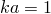 的频率用于测试辐射边界条件的有效性，以及对应于 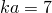（二维）或 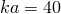（三维）的频率用于测试声学网格离散的极限（对边界条件要求较低的频率）。使用两步。在第一步中施加阻抗边界条件（对于两个频率）。在第二步中，这些阻抗被移除，并施加相同值的表面阻抗。两种选项的结果相同。

每个分析都显示参考解与使用较小测试网格上的吸收边界条件或声学无限单元的解之间具有良好的一致性。较低频率对边界条件是更困难的测试，特别是在二维情况下，因为边界条件只是渐近的。[图 1.11.4-2](ch01s11ach79.md#low2d) 到[图 1.11.4-5](ch01s11ach79.md#hi3d) 显示了壳表面上的压力振幅随角位置的变化。角度从 *Y* 轴测量，如图 1.11.4-1](ch01s11ach79.md#mesh) 所示。每个图显示三条曲线；当可见差异时，圆形和椭圆条件解覆盖参考解，而球形和长球形条件偏差较小。声学无限单元的结果类似。

瞬态分析使用 100 Hz 的激励频率进行，使用两步和 2.5×10⁻⁵ 单位的固定时间增量，约为波速的 1/200。分析在第一步运行 0.003 个时间单位，此时施加阻抗边界条件。这个时间段足够长以使波到达测试网格的边界。在第二步中，模拟再运行 0.003 个单位，这次使用表面阻抗施加边界条件。总模拟时间 0.006 个单位不足以使从结构发出的波前到达参考网格的边界，因此那里的阻抗条件在模拟中不起作用。[图 1.11.4-6](ch01s11ach79.md#transcr) 到[图 1.11.4-9](ch01s11ach79.md#transpr) 显示了选定时刻声学域中的压力振幅。在每种情况下，参考解在左侧。在所有情况下都获得了非常好的一致性；三维边界条件表现稍好，原因在["耦合声-结构介质分析"，《Abaqus 理论指南》第 2.9.1 节](../stm/stm-link.md#stm-anl-acouststruct) 中讨论。

使用声学无限单元进行的 Abaqus/Explicit 瞬态分析与使用非反射边界条件进行的 Abaqus/Explicit 瞬态分析给出非常相似的结果。使用二维声学无限单元的测试与使用圆形辐射条件的测试给出非常相似的结果，而使用轴对称声学无限单元的测试与使用球形辐射条件的测试给出非常相似的结果。[图 1.11.4-10](ch01s11ach79.md#xplinf) 显示了二维分析中垂直方向 90 度角处壳表面的压力振幅（为便于比较，也包含了 Abaqus/Standard 瞬态分析结果）。压力紧密匹配。使用声学无限单元的测试没有包含任何声学单元来建模围绕结构的流体。然而，由于声学无限单元带来的额外计算成本抵消了不包含声学单元所节省的成本。对于这个例子，发现声学无限单元分析比相应的没有声学无限单元的分析贵约 12%；即，使用声学单元和非反射边界条件的分析。

### 输入文件

##### **Abaqus/Standard 输入文件**

[acoustic_bc_2dref.inp](../eif/acoustic_bc_2dref.inp)

圆形边界条件，二维参考解，稳态。

[acoustic_bc_acin2d2.inp](../eif/acoustic_bc_acin2d2.inp)

线性，二维声学无限单元，稳态。

[acoustic_bc_acin2d3.inp](../eif/acoustic_bc_acin2d3.inp)

二次，二维声学无限单元，稳态。

[acoustic_bc_acinax2.inp](../eif/acoustic_bc_acinax2.inp)

线性，轴对称声学无限单元，稳态。

[acoustic_bc_acinax3.inp](../eif/acoustic_bc_acinax3.inp)

二次，轴对称声学无限单元，稳态。

[acoustic_bc_circular.inp](../eif/acoustic_bc_circular.inp)

圆形边界条件，测试网格，稳态。

[acoustic_bc_circular_ams.inp](../eif/acoustic_bc_circular_ams.inp)

圆形边界条件，测试网格，在非耦合 AMS 特征解之后的稳态动态分析。

[acoustic_bc_circular_ams_restart.inp](../eif/acoustic_bc_circular_ams_restart.inp)

从非耦合 AMS 特征解重新开始的稳态动态分析。

[acoustic_bc_ellipse.inp](../eif/acoustic_bc_ellipse.inp)

椭圆边界条件，测试网格，稳态。

[acoustic_bc_3dref.inp](../eif/acoustic_bc_3dref.inp)

球形边界条件，三维参考解，稳态。

[acoustic_bc_spherical.inp](../eif/acoustic_bc_spherical.inp)

球形边界条件，测试网格，稳态。

[acoustic_bc_prolate.inp](../eif/acoustic_bc_prolate.inp)

长球形边界条件，测试网格，稳态。

[acoustic_bc_2dref_trans.inp](../eif/acoustic_bc_2dref_trans.inp)

圆形边界条件，二维参考解，瞬态。

[acoustic_bc_circular_trans.inp](../eif/acoustic_bc_circular_trans.inp)

圆形边界条件，测试网格，瞬态。

[acoustic_bc_ellipse_trans.inp](../eif/acoustic_bc_ellipse_trans.inp)

椭圆边界条件，测试网格，瞬态。

[acoustic_bc_3dref_trans.inp](../eif/acoustic_bc_3dref_trans.inp)

球形边界条件，三维参考解，瞬态。

[acoustic_bc_spherical_trans.inp](../eif/acoustic_bc_spherical_trans.inp)

球形边界条件，测试网格，瞬态。

[acoustic_bc_prolate_trans.inp](../eif/acoustic_bc_prolate_trans.inp)

长球形边界条件，测试网格，瞬态。

##### **Abaqus/Explicit 输入文件**

[acoustic_bc_circular_xpl.inp](../eif/acoustic_bc_circular_xpl.inp)

圆形边界条件，测试网格。

[acoustic_bc_circular_xpl_subcyc.inp](../eif/acoustic_bc_circular_xpl_subcyc.inp)

圆形边界条件，测试网格，仅用于测试子循环性能。

[acoustic_bc_ellipse_xpl.inp](../eif/acoustic_bc_ellipse_xpl.inp)

椭圆边界条件，测试网格。

[acoustic_bc_spherical_xpl.inp](../eif/acoustic_bc_spherical_xpl.inp)

球形边界条件，测试网格。

[acoustic_bc_prolate_xpl.inp](../eif/acoustic_bc_prolate_xpl.inp)

长球形边界条件，测试网格。

[acoustic_bc_acin2d2_xpl.inp](../eif/acoustic_bc_acin2d2_xpl.inp)

二维声学无限单元，测试网格。

[acoustic_bc_acinax2_xpl.inp](../eif/acoustic_bc_acinax2_xpl.inp)

轴对称声学无限单元，测试网格。

### 图形

**图 1.11.4-1** 网格配置。

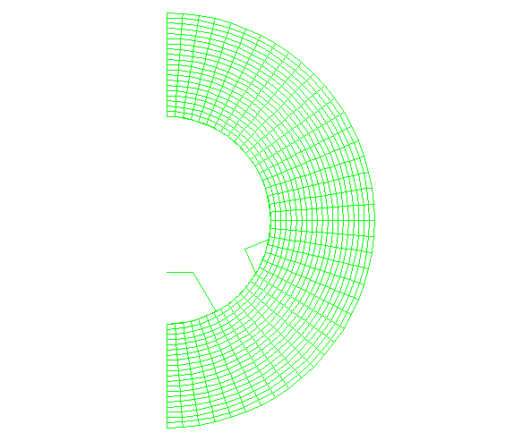

**图 1.11.4-2** 压力振幅比较于 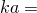 1，二维。

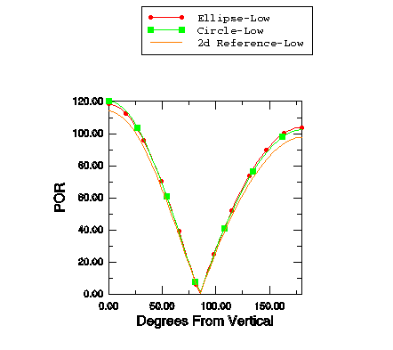

**图 1.11.4-3** 压力振幅比较于  7，二维。

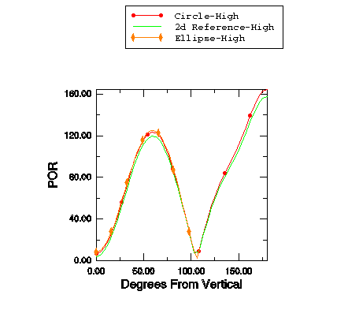

**图 1.11.4-4** 压力振幅比较于  1，三维。

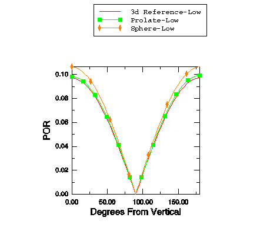

**图 1.11.4-5** 压力振幅比较于  40，三维。

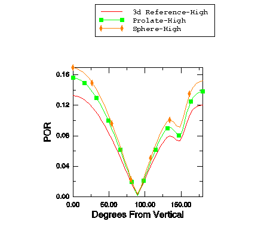

**图 1.11.4-6** 压力振幅比较于  0.003，二维，圆形边界与参考解比较。

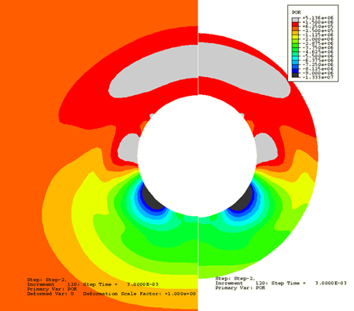

**图 1.11.4-7** 压力振幅比较于  0.003，二维，椭圆边界与参考解比较。

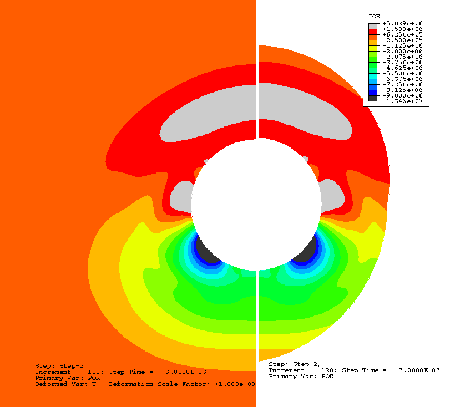

**图 1.11.4-8** 压力振幅比较于  0.003，三维，球形边界与参考解比较。

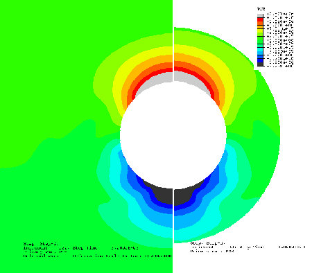

**图 1.11.4-9** 压力振幅比较于  0.003，三维，长球形边界与参考解比较。

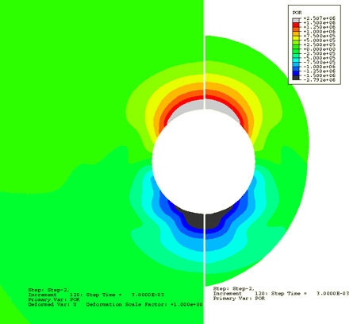

**图 1.11.4-10** 瞬态分析的压力振幅比较，二维。

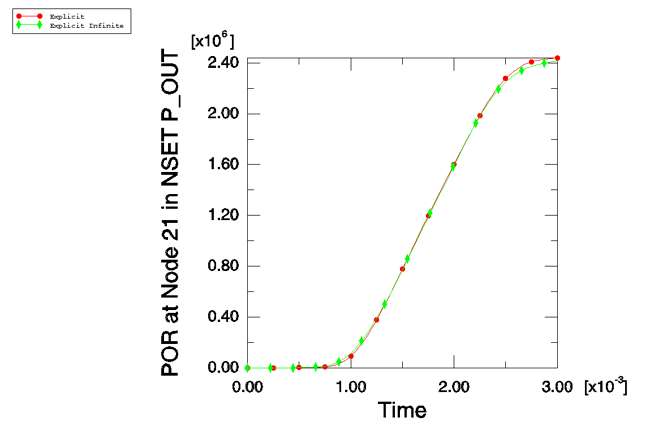
