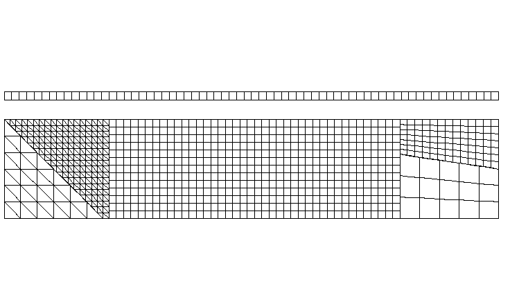
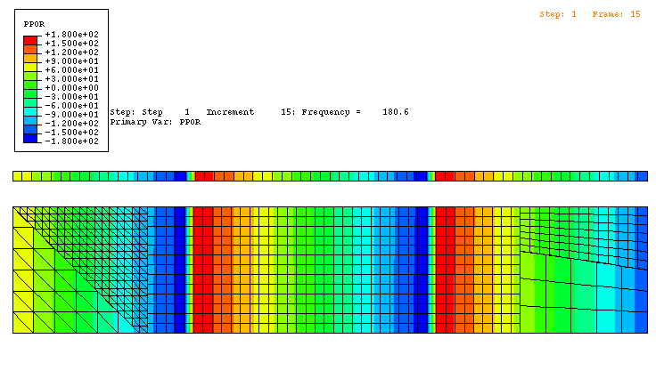
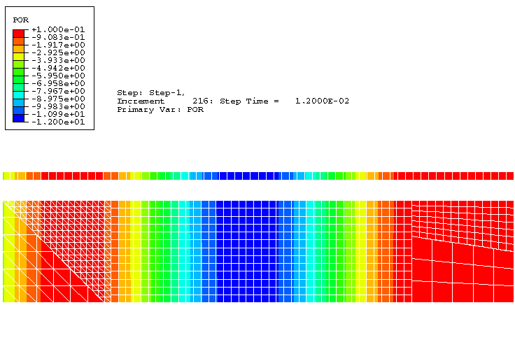

# 1.11.5 二维声学-声学绑定约束

**产品：** Abaqus/Standard  Abaqus/Explicit

本示例旨在说明和验证在简单声学系统中使用绑定约束的方法，使用几种不同的过程。

### 问题描述

本问题考虑矩形管道中的稳态和瞬态波传播。[图 1.11.5-1](ch01s11ach80.md#tie2dmesh) 显示了二维测试网格。有两个未连接的区域：下区域有绑定约束，简单的上区域用于比较。

下区域由五个子区域组成，总长 5000 mm，宽 1000 mm。在 Abaqus/Standard 中，第一（最左）子区域由 AC2D6 单元组成，第二由 AC2D3 单元组成，第三由 AC2D4 单元组成，第四（最右，上）由 AC2D4 单元组成，最后由 AC2D8 单元组成。相交表面上的节点不重合。上参考域长 5000 mm，宽 80 mm，由 AC2D4 单元组成。在 Abaqus/Explicit 中，上述定义的 AC2D4 和 AC2D8 单元被替换为 AC2D4R 单元，AC2D6 单元被替换为 AC2D3 单元。两个域都由体积模量为 0.142 MPa、密度为 1.21 kg/m³ 的声学材料制成。下域的子区域通过绑定约束连接。在每个绑定约束对中，较精细的表面被定义为从属表面。

### 载荷

对于稳态动态模拟，两个网格都通过在模型左边缘的节点上对自由度 8 施加均匀体积加速度来激励。施加了一致的节点载荷。

对于瞬态动力学问题，相同的集中载荷分布施加到相同的边缘，但具有正弦振幅曲线。

在所有情况下，平面波吸收阻抗条件施加在两个域的最右边缘。

### 结果和讨论

稳态分析使用直接求解和基于子空间的稳态动态过程进行，使用在频率步骤中提取的模式。分析在 30 到 343 Hz 的选定频率下进行。

在动力学问题中，Abaqus/Standard 分析使用 0.0004 秒的固定时间步长，并运行总模拟时间 0.012 秒。

每个分析都显示参考域与使用绑定约束的域之间具有良好的一致性。频率分析的共振频率和模态也非常好，尽管在更宽、更低域的感兴趣频带中存在更多模态。[图 1.11.5-2](ch01s11ach80.md#tie2dssdyn) 显示了稳态响应中 180.6 Hz 时声压（变量 PPOR）的相位角。由于 PPOR 是复值解的相位角，定义从 -180 到 180 度，在等值线图颜色中在负大值处出现尖锐差异。虽然场是连续的，但这些尖锐的颜色线可以被认为是定义了解中的波前。等值线图中的波前在参考网格和绑定网格的相同位置出现，绑定约束不会扭曲波。[图 1.11.5-3](ch01s11ach80.md#tie2dtrans) 和[图 1.11.5-4](ch01s11ach80.md#tie2dtransxpl) 显示了瞬态情况下 0.012 秒时的声压大小（变量 POR），此时波尚未到达网格的末端。同样，波前对于绑定和参考网格重合，约束不会扭曲解。

### 输入文件

##### **Abaqus/Standard 输入文件**

[acoustic_tie_2d_ssdyn.inp](../eif/acoustic_tie_2d_ssdyn.inp)

稳态问题。

[acoustic_tie_2d_trans.inp](../eif/acoustic_tie_2d_trans.inp)

瞬态问题。

##### **Abaqus/Explicit 输入文件**

[acoustic_tie_2d_trans_xpl.inp](../eif/acoustic_tie_2d_trans_xpl.inp)

瞬态分析。

### 图形

**图 1.11.5-1** 网格配置。

**图 1.11.5-2** 使用直接求解稳态动态过程在 180.6 Hz 时的压力相位。

**图 1.11.5-3** 使用动态过程在 0.012 秒时的压力大小。

**图 1.11.5-4** 使用显式动态过程在 0.012 秒时的压力大小。

