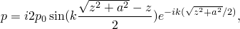
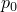
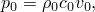
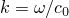
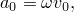
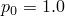
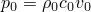
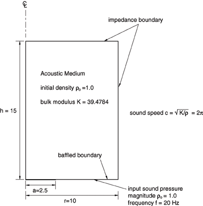
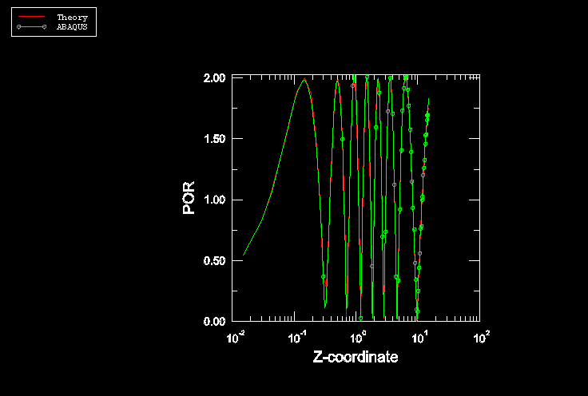

# 1.11.7 简单的稳态动态声学分析

**产品：** Abaqus/Standard

在此问题中，使用直接解稳态动态过程分析了挡板平面活塞的声学行为。此问题也存在解析解，并提供以与获得的数值结果进行比较。

### 问题描述

模型如图 1.11.7-1（[图 1.11.7-1](ch01s11ach82.md#sxmacoustssdd-model)）所示。此例不使用特定单位制：假定所有使用的单位是一致的。声学模型是半径 *r* = 10、高度 *h* = 15 的圆柱体。密度和体积模量分别假定为 1.0 和 39.4784，这对应于 2 的声速。在圆柱体的顶部和侧面施加默认的非反射边界条件。挡板条件通过在平面挡板上完全不指定载荷或边界条件来施加。活塞和声学介质之间的相互作用通过在界面上施加均匀的体积加速度来模拟。由于模型的响应是轴对称的，采用 ACAX8 单元来建模声学介质。沿轴对称轴的声压解析解由以下方程给出：

其中  定义为

其中  是材料的质量密度， 是材料的声速， 是波数， 是粒子速度， 是挡板平面活塞的半径，*z* 是沿对称轴的 *z* 坐标。

### 结果与讨论

通过执行直接解稳态动态分析步骤来获得响应。分析频率选择为  = 20 Hz，体积加速度的幅值由以下方程确定：

其中粒子速度通过设置  从  计算。沿对称轴的声压变化如图 1.11.7-2（[图 1.11.7-2](ch01s11ach82.md#sxmacoustssdd-pressure)）所示。解析和数值数据均绘制在图中。如所见，数值结果与解析解良好一致。[图 1.11.7-2](ch01s11ach82.md#sxmacoustssdd-pressure) 中的数值数据是在 Abaqus/CAE 的可视化模块中通过沿预定义路径创建 *X–Y* 数据获得的，而解析数据从 ASCII 文件读入 Abaqus/CAE。解析数据文件随同此模型的输入文件一起提供。

### 输入文件

[acousticssdd.inp](../eif/acousticssdd.inp)

直接解稳态动态分析。

[acousticssdd_theory.inp](../eif/acousticssdd_theory.inp)

解析结果。

### 参考

Kamakura, T., "Fundamentals of Nonlinear Acoustics," in Japanese, 1996.

### 图表

**图 1.11.7-1** 挡板刚性活塞模型。

**图 1.11.7-2** 系统的稳态响应。

