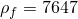
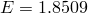

# 1.11.10 耦合外部声学特征分析

**产品：** Abaqus/Standard

在此问题中，使用声学无限单元分析了浸入无限范围声学流体中的弹性球壳的对称声学共振。寻求一组实值和复值解。提供了此问题的解析解以与获得的数值结果进行比较。

### 问题描述

模型由线性轴对称声学单元层组成，内半径为 1，外半径为 1.3。在层的内表面，厚度为 0.01 的线性轴对称壳单元耦合到水层。在水层的外表面上，使用线性轴对称声学无限单元。使用的单位与水（ 和  = 10⁹）和钢（、 = 10¹¹ 和 ）一致。感兴趣的频率范围是每秒 36 到 3000 个周期，其中包含系统上下分支中的共振（参见 Junger 和 Feit，1972，第 10.3 章）。

使用了两种 Abaqus 特征分析过程：常规特征值提取和复特征值提取。在前一种情况中，分析考虑了由声学有限元和无限元质量矩阵和刚度矩阵引起的声学贡献，但不考虑辐射阻尼。此外，无限元刚度矩阵被渲染为对称以与实值特征求解器兼容。因此，这些模态是实值的，对应于仅使用声学惯性附聚计算的解析解。在复特征值提取过程中，使用实值模态作为基，并将整个有限元和无限元矩阵贡献投影到这个基上。因此，辐射阻尼项被包括在分析中。无论壳是否耦合到流体，壳的共振模态形状都是相同的，这允许通过检查将数值计算的模态与解析解识别出来。

使用上述材料特性计算特征频率的解析结果。

### 结果与讨论

如[表 1.11.10-1](ch01s11ach85.md#table-eigen-results)所示，解析和计算结果在两个分支中都良好一致。模态形状也与解析解对应。复特征值提取结果更准确，因为包含了非对称声学无限元刚度矩阵和重要的辐射阻尼项。

**表 1.11.10-1** 耦合外部声学特征分析的解析和计算结果。
| 分支 | 模态 | 解析外部 | Abaqus 外部，实数 | Abaqus 外部，复数 |
| --- | --- | --- | --- | --- |
| 1 | 2 | 261 | 294 | 281 |
| 1 | 3 | 322 | 348 | 348 |
| 1 | 4 | 378 | 394 | 390 |
| 1 | 5 | 428 | 424 | 422 |
| 1 | 6 | 460 | 450 | 448 |
| 1 | 7 | 480 | 472 | 472 |
| 1 | 8 | 496 | 494 | 493 |
| 1 | 9 | 510 | 515 | 515 |
| 2 | 0 | 1000 | 1254 | 1018 |
| 2 | 1 | 1494 | 1507 | 1359 |
| 2 | 2 | 2232 | 2059 | 2023 |

### 输入文件

[exteig_cpld_ax4_inf.inp](../eif/exteig_cpld_ax4_inf.inp)

使用声学无限单元的解。

### 参考

Junger, M., and D. Feit, *Sound, Structures, and Their Interaction, *Massachusetts Institute of Technology, 1972.
