# 1.11.11 刚性球体的声散射

**产品：** Abaqus/Standard

在此例中，我们计算当平面波入射时从球体散射的声近场。此例说明了简单吸收边界条件与声学连续单元结合使用的效果。结果与经典解进行了比较。

### 问题描述

在无限声学介质中半径为 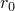 = 0.1 m 的刚性球形障碍物受到入射平面波的作用。声散射压力的解析解形式为

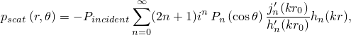

其中  是散射声压，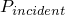 是入射平面波的系数，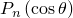 是勒让德多项式，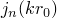 是第一类球贝塞尔函数，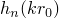 是第一类球汉克尔函数，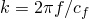 是声波数，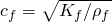 是声速， 是频率。方向如图 1.11.11-1（[图 1.11.11-1](ch01s11ach86.md#bmkacousticrigidscattering1)）所示；入射场定义为在位于球心的原点处具有零相位。解析解在 Junger 和 Feit 中推导，但为了与 Abaqus 对时间谐问题的时间符号约定一致，使用其复共轭进行比较。

[图 1.11.11-2](ch01s11ach86.md#bmkacousticrigidscattering2) 显示了使用七层 AC3D15 单元（共 252 个）的有限元网格，外半径为  = 0.4 m，圆周角为 10°。由于问题是轴对称的，这足以解析该场。单位参考幅值的平面入射波载荷施加到内表面， standoff 点定义为球心，源点定义为沿正 *x* 轴的一点。以这种方式指定载荷意味着 Abaqus 将在对应于在 standoff 点处值为 1 + 0*i* 的入射压力场的表面上施加载荷。在外表面上施加球形辐射条件。此问题的声学特性选择如下： = 2.0736 GPa， = 1000 kg/m³，使得声波速度为  = 1440 m/s。使用直接解稳态动态过程在 30 到 9000 赫兹范围内进行分析。

### 结果与讨论

在  处近场的散射压力的有限元结果如图 1.11.11-3（[图 1.11.11-3](ch01s11ach86.md#bmkacousticrigidscattering3)）所示，其中与解析值进行了比较。解的实部和虚部显示出良好的一致性。

### 输入文件

[acoustic_scat_sph.inp](../eif/acoustic_scat_sph.inp)

使用 AC3D15 单元和 Bayliss 等人边界条件的模型。

### 参考

Bayliss, A., M. Gunzberger, and E. Turkel, "Boundary Conditions for the Numerical Solution of Elliptic Equations in Exterior Regions," SIAM Journal of Applied Mathematics, vol. 42, no.2, pp. 430–451, 1982.

Junger, M., and D. Feit, *Sound, Structures, and Their Interaction, *The MIT Press, 1972.

### 图表

**图 1.11.11-1** 入射波相对于球体的方向。

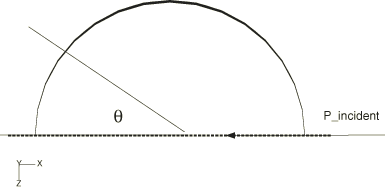

**图 1.11.11-2** 使用 AC3D15 单元的 Abaqus 网格。

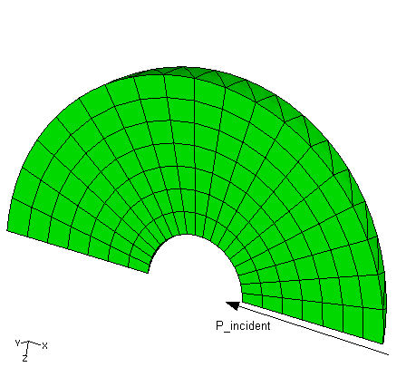

**图 1.11.11-3** 压力（POR）随频率变化——实部和虚部。

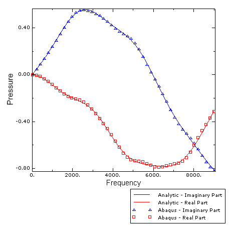
