# 1.11.12 弹性球壳的声散射

**产品：** Abaqus/Standard

在此例中，我们计算当平面波入射时从弹性球壳散射的声近场。此例说明了简单吸收边界条件、声学连续单元、声学无限单元、绑定约束和入射波相互作用的使用。结果与经典解进行了比较。

### 问题描述

在无限声学介质中半径为  = 0.1 m、厚度 *h* = 0.001 m 的薄球壳受到入射平面波的作用。声散射压力的解析解形式为

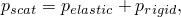

其中

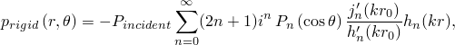

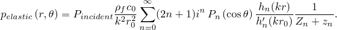

弹性压力项使用壳的真空模态阻抗，

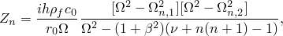

和特定声学模态阻抗，

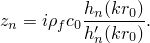

上述表达式中术语的定义见[表 1.11.12-1](ch01s11ach87.md#bmkacousticelasticvariables)。入射波相对于球体的方向如图 1.11.12-1（[图 1.11.12-1](ch01s11ach87.md#bmkacousticelasticscattering1)）所示；入射场定义为在位于球心的原点处具有零相位。解析解在 Junger 和 Feit 中推导，但为了与 Abaqus 对时间谐问题的时间符号约定一致，使用其复共轭进行比较。

有限元网格使用 AC3D20 单元来模拟流体，外半径为  = 0.25 m，圆周角为 10°。由于问题是轴对称的，这足以解析该场。壳用 S8R 单元网格划分，此网格使用绑定约束耦合到声学网格。单位参考幅值的平面入射波载荷施加到内声学表面和外壳表面，standoff 点定义为球心，源点定义为沿正 *x* 轴的一点。以这种方式指定载荷意味着 Abaqus 将在对应于在 standoff 点处值为 1 + 0*i* 的入射压力场的表面上施加载荷。创建了两个 Abaqus 模型：在一个模型中，在外表面施加球形非反射条件；在另一个模型中，创建声学无限单元并使用绑定约束耦合到声学有限单元。此问题中使用的材料特性见[表 1.11.12-2](ch01s11ach87.md#bmkacousticelasticparameters)。使用直接解稳态动态过程在 1500 到 5000 赫兹范围内进行分析。

### 结果与讨论

在 1500 Hz 频率下近场散射压力的有限元结果如图 1.11.12-2（[图 1.11.12-2](ch01s11ach87.md#bmkacousticelasticscattering3)）所示，其中与解析值进行了比较。该图在上环形区域显示解析近场，在下环形区域显示有限元解。解的实部显示出非常好的一致性。解析解不是使用 Abaqus/CAE绘制的，颜色标度略有不同。

### 输入文件

[aco_elas_scat_inf.inp](../eif/aco_elas_scat_inf.inp)

使用 AC3D20 单元和声学无限单元的模型。

[aco_elas_scat_nri.inp](../eif/aco_elas_scat_nri.inp)

使用 AC3D20 单元和 Bayliss 等人边界条件的模型。

### 参考

Bayliss, A., M. Gunzberger, and E. Turkel, "Boundary Conditions for the Numerical Solution of Elliptic Equations in Exterior Regions," SIAM Journal of Applied Mathematics, vol. 42, no.2, pp. 430–451, 1982.

Junger, M., and D. Feit, *Sound, Structures, and Their Interaction, *The MIT Press, 1972.

### 表格

**表 1.11.12-1** 变量定义。
| 变量 | 定义 |
| --- | --- |
| 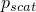 | 散射声压 |
|  | 散射压力的弹性贡献 |
| 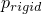 | 散射压力的刚性贡献 |
|  | 入射平面波系数 |
| 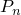 | 勒让德多项式 |
|  | 第一类球贝塞尔函数 |
|  | 第一类球汉克尔函数 |
|  | 声波数 |
|  | 声速 |
|  | 频率 |
|  | 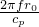 |
| 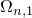 | 壳体第 *n* 个共振频率，真空，第一分支 |
| 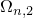 | 壳体第 *n* 个共振频率，真空，第二分支 |
| 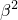 | 薄壳截面参数，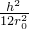 |
|  | 板波速度，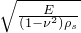 |

**表 1.11.12-2** 材料特性。
| 参数 | 值 |
| --- | --- |
|  | 2.0736 GPa |
|  | 1000 kg/m³ |
| 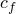 | 1440 m/s |
| *E* | 180.3 MPa |
|  | 0.3 |
|  | 7670 kg/m³ |

### 图表

**图 1.11.12-1** 入射波相对于球体的方向。

**图 1.11.12-2** 1500 Hz 时的压力（POR）——实部。

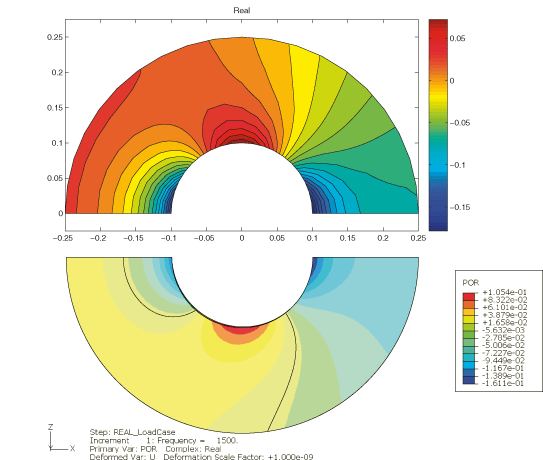
