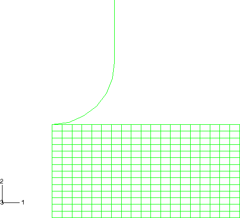
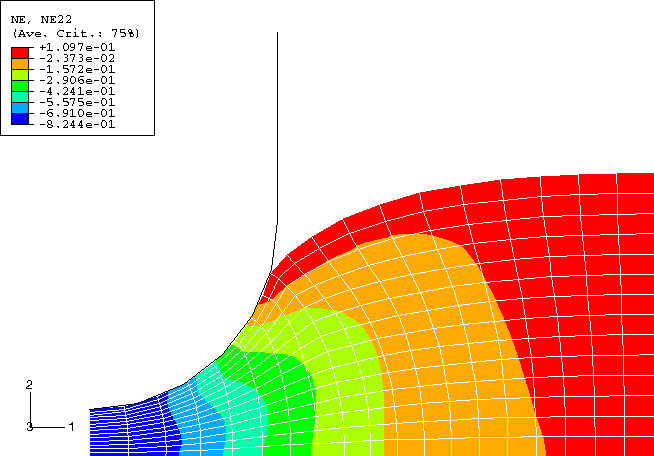
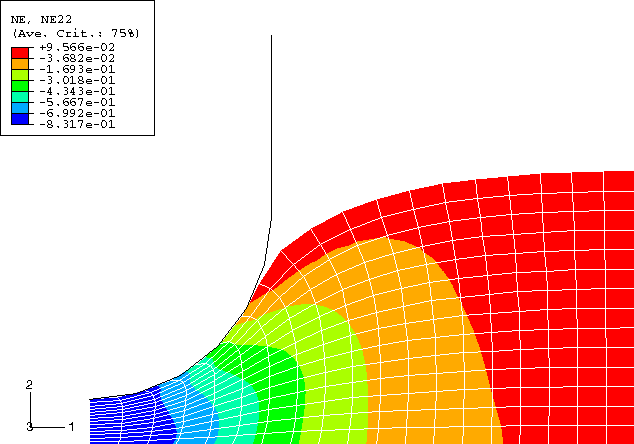

# 1.12.1 不同材料的压痕

**产品：** Abaqus/Explicit

### 问题描述

问题的有限元模型是轴对称的，如图 1.12.1-1（[图 1.12.1-1](ch01s12ach88.md#exxalematindent-initconfig)）所示。模型由刚性冲头和可变形坯料组成。坯料用 CAX4R 单元网格划分，半径为 600 mm，高度为 300 mm。冲头建模为解析刚性表面。在冲头和坯料之间用摩擦系数为 0.1 的库仑摩擦建模。坯料在 *r* = 0 处定义对称边界条件。坯料底部也完全约束。

使用以下材料模型对坯料进行多次分析：超弹性、带粘弹性的超弹性、超泡沫、Hill 塑性、Mises 塑性、率相关 Mises 塑性、Drucker-Prager 塑性、Drucker-Prager 盖塑性、可压碎泡沫塑性和多孔金属塑性。每个材料模型使用的参数和常数可以在 Abaqus 版本附带的输入文件中找到。冲头完全约束，仅在垂直方向上规定运动，最大压痕深度为 250 mm。当用率相关材料（带粘弹性的超弹性或率相关 Mises 塑性）建模时，坯料被动态压印。规定斜坡速度轮廓，使最大速度为 2000 mm/sec。当用其余（率独立）材料模型建模时，坯料被准静态压印。使用平滑步幅值曲线来指定冲头的位移并促进准静态求解。

### 自适应网格划分

使用包含整个坯料的单一自适应网格域。对称边界条件定义为拉格朗日边界区域（默认），接触表面定义为滑动边界区域（默认）。对于某些材料，在冲头下方立即发生大量局部变形；因此，使用非默认值来指定自适应网格划分的频率以及在每个自适应网格增量中执行的网格扫描次数。选择这些值是为了经济地解决问题，同时在整个模拟过程中保持良好的网格。

### 结果与讨论

除了超泡沫材料外，无法使用纯拉格朗日模拟来模拟这种深度的压痕。可压碎泡沫材料可以使用纯拉格朗日方法压印大部分此深度。对于每种材料，连续自适应网格划分在整个分析过程中保持网格质量，关键变量的等值线看起来是合理的。对于超泡沫材料，可以比较自适应网格模拟和纯拉格朗日模拟的结果。[图 1.12.1-2](ch01s12ach88.md#exxalematindent-ystrain-adapt) 和[图 1.12.1-3](ch01s12ach88.md#exxalematindent-ystrain-lg) 分别显示了使用自适应网格和纯拉格朗日方法冲压后坯料中名义应变 *y* 分量的等值线。结果良好一致。

### 输入文件

[ale_matverif_indentmises.inp](../eif/ale_matverif_indentmises.inp)

Mises 塑性。

[ale_matverif_indenthyper.inp](../eif/ale_matverif_indenthyper.inp)

超弹性。

[ale_matverif_indentvishyper.inp](../eif/ale_matverif_indentvishyper.inp)

带粘弹性的超弹性。

[ale_matverif_indenthyperfoam.inp](../eif/ale_matverif_indenthyperfoam.inp)

超泡沫。

[ale_matverif_indentplfoam.inp](../eif/ale_matverif_indentplfoam.inp)

带体积硬化的可压碎泡沫塑性。

[ale_matverif_indentcrushfoam.inp](../eif/ale_matverif_indentcrushfoam.inp)

带等向硬化的可压碎泡沫塑性。

[ale_matverif_indentporous.inp](../eif/ale_matverif_indentporous.inp)

多孔塑性。

[ale_matverif_indenthill.inp](../eif/ale_matverif_indenthill.inp)

Hill 塑性。

[ale_matverif_indentdrucker.inp](../eif/ale_matverif_indentdrucker.inp)

Drucker-Prager 塑性。

[ale_matverif_indentcap.inp](../eif/ale_matverif_indentcap.inp)

Drucker-Prager 盖塑性。

[ale_matverif_indentratedep.inp](../eif/ale_matverif_indentratedep.inp)

带率相关性的 Mises 塑性。

[lag_matverif_indenthyperfoam.inp](../eif/lag_matverif_indenthyperfoam.inp)

超泡沫模型的纯拉格朗日分析。

### 图表

**图 1.12.1-1** 初始配置。

**图 1.12.1-2** 使用自适应网格划分的超泡沫模型在 *y* 方向的名义应变。

**图 1.12.1-3** 使用纯拉格朗日方法的超泡沫模型在 *y* 方向的名义应变。

