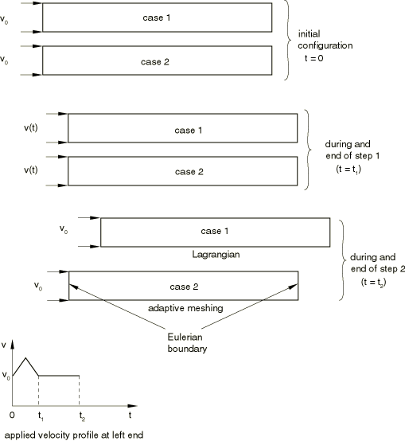
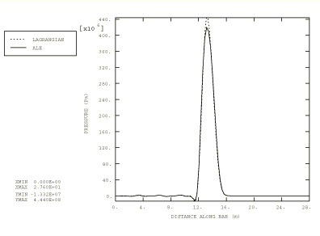
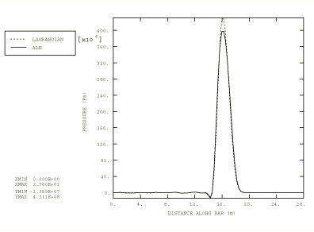
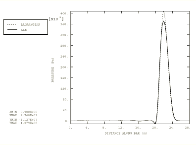
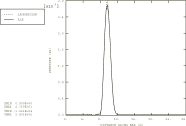
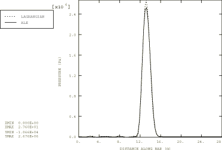
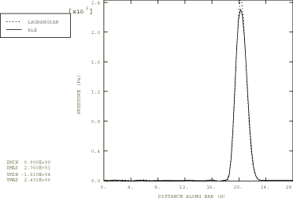

# 1.12.2 不同材料的波传播

**产品：** Abaqus/Explicit

### 问题描述

模型由一根杆组成，一维波通过它传播。杆在正 *x* 方向获得 57.14 m/sec 的初始刚体速度。分析分两步进行。在第一步中，在杆左端定义帽形速度脉冲，并产生波形。在第二步中，杆左端的速度保持在 57.14 m/sec，波通过杆传播。选择脉冲的波长相对较短（约 10 个单元以上）是为了对应用于波传播的对流算法进行更严格的测试。波长跨越大量单元的问题不那么困难，因为整体扩散和色散效应不太明显。

使用两种不同的技术来解决问题，如图 1.12.2-1（[图 1.12.2-1](ch01s12ach89.md#exxalewaveprop-problemdescr)）所示。

1. 两个步骤都作为纯拉格朗日分析运行。
2. 第一步作为纯拉格朗日分析运行以产生波形。第二步通过定义包含杆的自适应网格域以欧拉方式运行。在杆的两端定义欧拉边界。自适应网格约束用于在流入和流出边界处保持网格到位。网格通过使用自适应网格控制（欧拉自适应网格域的默认行为）在前一个自适应网格增量结束时定位节点来保持在域内部的静止。网格被拉回到上一个自适应网格增量之后的位置，这具有对于没有边界变形的均匀网格保持网格静止的效果。默认动量对流方法（单元中心投影）更改为半索引移位方法，因为对于这样的波传播问题，更准确的动量对流技术是理想的。尽管两种方法的差异对于这个问题非常轻微，但半索引移位预计比单元中心投影具有更好的色散特性。

对于两种情况，分析了三个不同的几何模型，每个模型有三种不同的材料行为。在二维平面应变模型中，杆长度为 27.6 m，宽度为 0.575 m。在轴对称模型中，杆轴向（长度方向）长度为 27.6 m，径向为 0.575 m。在三维模型中，杆长度为 27.6 m，宽度为 0.575 m，深度为 5 m。对于所有模型，波通过杆的长度方向传播。

每个分析中使用的材料模型包括具有水特性的状态方程、具有橡胶特性的 Mooney-Rivlin 超弹性材料和具有钢特性的 von Mises 弹塑性材料。每个材料模型使用的参数和常数可以在 Abaqus 版本附带的输入文件中找到。波脉冲在水、橡胶和钢中的最大速度分别为 492、28 和 250 m/sec（马赫 0.3、0.12 和 0.035）。这些速度是通过每种材料传播的冲击波的典型速度。

### 结果与讨论

在三个等效时间点（ <  < ）沿杆长度的压力路径图在[图 1.12.2-2](ch01s12ach89.md#exxalewaveprop-press-45-eos)、[图 1.12.2-3](ch01s12ach89.md#exxalewaveprop-press-67-eos) 和[图 1.12.2-4](ch01s12ach89.md#exxalewaveprop-press-90-eos) 中使用状态方程模型比较两种情况。结果良好一致，考虑到波是强冲击波（Mach = 0.3）。自适应网格求解预测略小的峰值；然而，脉冲的宽度与拉格朗日求解完全匹配，没有引入错误的相位偏移。[图 1.12.2-5](ch01s12ach89.md#exxalewaveprop-press-44-mr)、[图 1.12.2-6](ch01s12ach89.md#exxalewaveprop-press-58-mr) 和[图 1.12.2-7](ch01s12ach89.md#exxalewaveprop-press-86-mr) 显示了 Mooney-Rivlin 超弹性材料在三个不同时间的压力路径图。在这种情况下，波的马赫数为 0.12。同样，纯拉格朗日和解和自适应网格结果良好一致。由于冲击波较弱，自适应网格技术预测的该材料峰值与纯拉格朗日求解更接近。强冲击对材料传输过程中引入的任何通量限制极其敏感；虽然使用的算法旨在防止显著扩散，但一些不准确性是预期的。

### 输入文件

[ale_wave_eos3d.inp](../eif/ale_wave_eos3d.inp)

三维模型，EOS 材料。

[ale_wave_mises3d.inp](../eif/ale_wave_mises3d.inp)

三维模型，Mises 塑性。

[ale_wave_hyper3d.inp](../eif/ale_wave_hyper3d.inp)

三维模型，超弹性。

[ale_wave_eosgpe.inp](../eif/ale_wave_eosgpe.inp)

平面应变模型，EOS 材料。

[ale_wave_misesgpe.inp](../eif/ale_wave_misesgpe.inp)

平面应变模型，Mises 塑性。

[ale_wave_hypergpe.inp](../eif/ale_wave_hypergpe.inp)

平面应变模型，超弹性。

[ale_wave_eosaxi.inp](../eif/ale_wave_eosaxi.inp)

轴对称模型，EOS 材料。

[ale_wave_misesaxi.inp](../eif/ale_wave_misesaxi.inp)

轴对称模型，Mises 塑性。

[ale_wave_hyperaxi.inp](../eif/ale_wave_hyperaxi.inp)

轴对称模型，超弹性。

### 图表

**图 1.12.2-1** 两种分析技术的问题描述。

**图 1.12.2-2** 情况 1 和 2 在总行程时间 45% 时的压力路径图（EOS 材料）。

**图 1.12.2-3** 情况 1 和 2 在总行程时间 67% 时的压力路径图（EOS 材料）。

**图 1.12.2-4** 情况 1 和 2 在总行程时间 90% 时的压力路径图（EOS 材料）。

**图 1.12.2-5** 情况 1 和 2 在总行程时间 44% 时的压力路径图（Mooney-Rivlin）。

**图 1.12.2-6** 情况 1 和 2 在总行程时间 58% 时的压力路径图（Mooney-Rivlin）。

**图 1.12.2-7** 情况 1 和 2 在总行程时间 86% 时的压力路径图（Mooney-Rivlin）。

