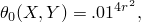
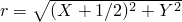
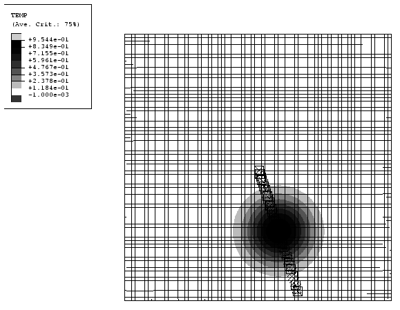
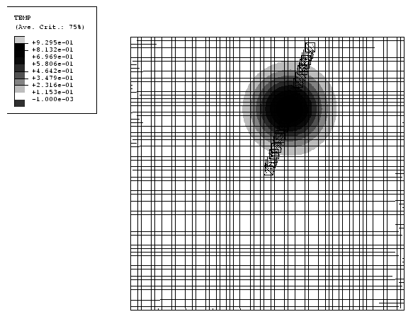
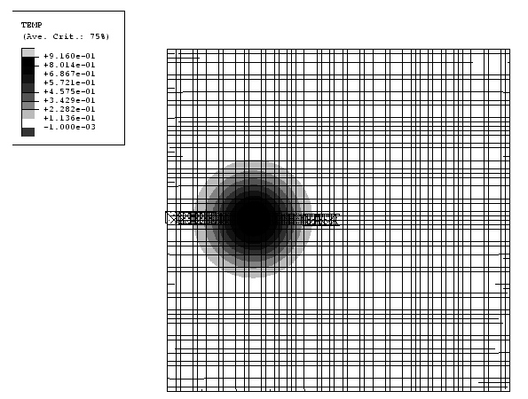
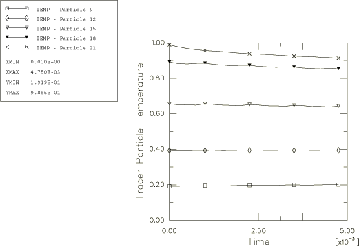
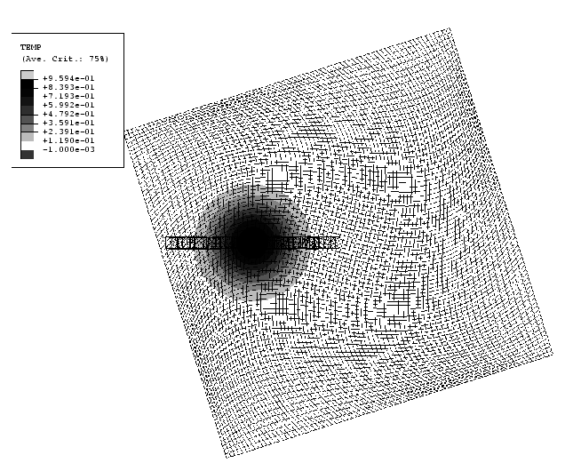
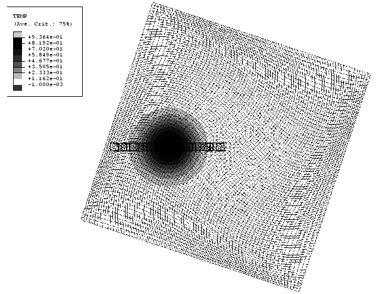
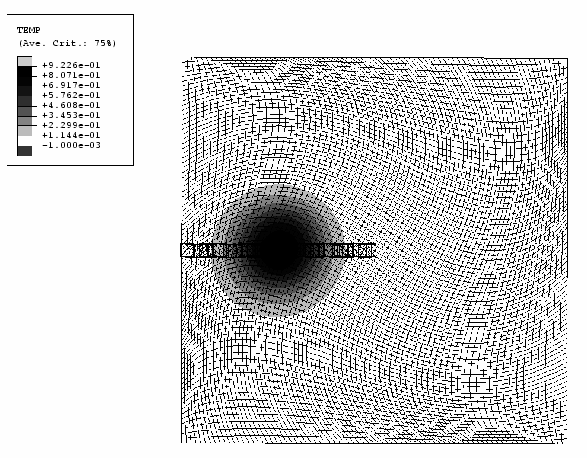
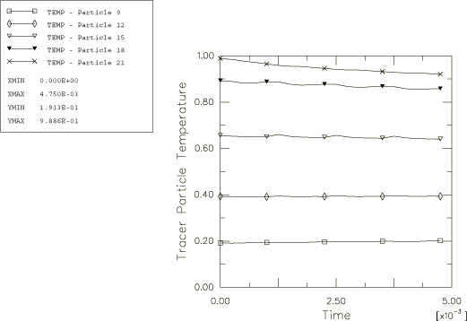

# 1.12.6 旋转坐标系中的平流

**产品：** Abaqus/Explicit

### 问题描述

此问题通过研究旋转流场中单一标量变量——绝热温度的平流来测试自适应网格划分中使用的平流算法的准确性。绝热温度是此类测试的方便标量变量，因为它的空间分布可以在一个步骤中保持恒定，并在使用自适应网格划分时重新映射。旋转流场通过固定网格同时旋转材料或固定材料同时旋转网格来生成。

有限元模型由尺寸为 2.0×2.0 的二维域组成，用 CPS4R 单元网格划分。网格密度为 80×80，原点位于方形域的中心。初始配置如图 1.12.6-1（[图 1.12.6-1](ch01s12ach93.md#exxalerotframe-initconfig1-2)）所示，初始温度等值线在网格上。初始温度分布  是坐标的函数，给定为

其中 。

如图所示，温度分布在 *x* 轴上  = 0.5 处达到峰值 1.0。温度随着与峰值距离的增加趋于零。模型第一和第四象限以及所有边缘的温度小于 0.01。定义示踪粒子以在整个分析过程中监测材料运动和温度。如图 1.12.6-1（[图 1.12.6-1](ch01s12ach93.md#exxalerotframe-initconfig1-2)）所示，示踪粒子最初位于负 *x* 轴上。

使用绝热过程，材料建模为 von Mises 弹塑性。选择弹性模量和屈服强度使得材料经历非常小的变形并保持在弹性状态；因此，温度场保持与其初始条件不变。

使用以下两种技术之一生成旋转流场：

1. 网格保持固定，材料获得关于原点的旋转。假定材料延伸到有限元网格的边界之外。所有单元都包含在单一自适应网格域中，沿整个模型周边定义欧拉边界。通过在沿欧拉边界的节点上施加自适应网格约束，并通过基于上一个自适应网格增量结束时节点位置执行自适应网格划分来保持网格空间固定，这具有对于没有整体变形的均匀网格保持网格静止的效果。为所有节点规定关于原点的初始旋转速度 1256.64 rad/sec，使得材料在 0.05 s 内完整旋转 360°。几何和问题定义应该导致角动量守恒，即使材料通过欧拉边界流入和流出域。系统的旋转惯性仅基于模型边界内的质量分布（不是欧拉边界外的材料），这在整个分析过程中保持恒定。因此，通过适当的平流，角速度也应该在整个分析过程中保持恒定。
2. 材料固定，网格获得关于原点的旋转。与情况 1 一样，假定材料延伸到网格的边界之外。所有单元都包含在单一自适应网格域中，沿整个模型周边定义欧拉边界。对于这种情况，网格域通过在沿欧拉边界的节点上施加自适应网格约束来旋转。沿边界的每个节点的运动通过定义单独的幅值曲线来规定。每 10 个增量执行一次自适应网格划分，每个增量的网格扫描次数为 5。使用这些设置，网格内部的节点仅近似地跟随旋转，稍微滞后。可以通过增加网格扫描次数或降低频率值来最小化网格的滞后。然而，这里有意允许滞后作为几何复杂网格图案的平流算法的验证。

### 结果与讨论

[图 1.12.6-2](ch01s12ach93.md#exxalerotframe-t015-1) 到[图 1.12.6-4](ch01s12ach93.md#exxalerotframe-end-1) 显示了情况 1 在  = 0.015 s、 = 0.035 s 和最终时间  = 0.05 s 时的网格配置和温度分布。虽然网格不移动，但绝热温度等值线和示踪粒子清楚地表明了材料关于域中心的旋转。等值线的形状和水平表明绝热温度分布在整个旋转运动中以最小误差进行平流。最初直线排列的示踪粒子固定在材料点上，在整个旋转过程中保持直线。这些结果也验证了动量平流算法，因为材料必须在 0.05 s 内完整旋转一周以保持角动量守恒。[图 1.12.6-5](ch01s12ach93.md#exxalerotframe-temphist-1) 显示了四个代表一系列温度的所选示踪粒子的绝热温度时间历史。对于完美的平流，这些粒子处的温度应保持恒定。对于 360° 旋转，峰值温度降低了 7%。远离峰值的位置处的温度保持几乎恒定。

[图 1.12.6-6](ch01s12ach93.md#exxalerotframe-t015-2) 到[图 1.12.6-8](ch01s12ach93.md#exxalerotframe-end-2) 显示了情况 2 在  = 0.015 s、 = 0.035 s 和最终时间  = 0.05 s 时的网格配置和温度分布。虽然材料不移动，但从图中可以明显看出网格运动。等值线分布和示踪粒子保持静止，因为材料不移动。然而，这种情况确实验证了示踪粒子追踪算法和绝热温度平流算法的准确性（网格相对于材料移动）。[图 1.12.6-9](ch01s12ach93.md#exxalerotframe-temphist-2) 显示了四个所选示踪粒子的绝热温度时间历史。正如预期，这种情况显示了与情况 1 几乎相同的准确度水平。

### 输入文件

[ale_rotmat_81x81.inp](../eif/ale_rotmat_81x81.inp)

情况 1。

[ale_rotmesh_81x81.inp](../eif/ale_rotmesh_81x81.inp)

情况 2。

[ale_rottemp_81x81.inp](../eif/ale_rottemp_81x81.inp)

包含节点温度的数据文件，被上述两个文件读取。

[ale_rotmat_41x41.inp](../eif/ale_rotmat_41x41.inp)

较小网格的情况 1。

[ale_rotmesh_41x41.inp](../eif/ale_rotmesh_41x41.inp)

较小网格的情况 2。

[ale_rottemp_41x41.inp](../eif/ale_rottemp_41x41.inp)

包含节点温度的数据文件，被上述两个文件读取。

### 图表

**图 1.12.6-1** 情况 1 和 2 的初始配置和绝热温度分布。

**图 1.12.6-2** 情况 1 在  = 0.015 s 时的配置和绝热温度分布。

**图 1.12.6-3** 情况 1 在  = 0.035 s 时的配置和绝热温度分布。

**图 1.12.6-4** 情况 1 在模拟结束时的配置和绝热温度分布。

**图 1.12.6-5** 情况 1 所选示踪粒子的绝热温度时间历史。

**图 1.12.6-6** 情况 2 在  = 0.015 s 时的配置和绝热温度分布。

**图 1.12.6-7** 情况 2 在  = 0.035 s 时的配置和绝热温度分布。

**图 1.12.6-8** 情况 2 在模拟结束时的配置和绝热温度分布。

**图 1.12.6-9** 情况 2 所选示踪粒子的绝热温度时间历史。

